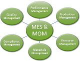

Лектор: Олександр Пупена

# [АВТОМАТИЗОВАНІ СИСТЕМИ УПРАВЛІННЯ ВИРОБНИЦТВОМ (MES рівень)](https://pupenasan.github.io/MOMdisc/)        

Дане сховище вміщує матеріали курсу "АВТОМАТИЗОВАНІ СИСТЕМИ УПРАВЛІННЯ ВИРОБНИЦТВОМ (MES рівень)", який читається:

- в [НУХТ](http://www.iasu-nuft.pp.ua/) на кафедрі АКТСУ магістрам
- в КПІ магістрам

## Матеріали курсу

- [Лекції](лекції/README.md)
- [Лабораторний практикум](лабораторні/README.md)

- [План 2023](план2023.md)

## Корисні посилання

[Веб-сторінка курсу на GitHub](https://pupenasan.github.io/MOMdisc/)

[Репозиторій](https://github.com/pupenasan/MOM)

---

