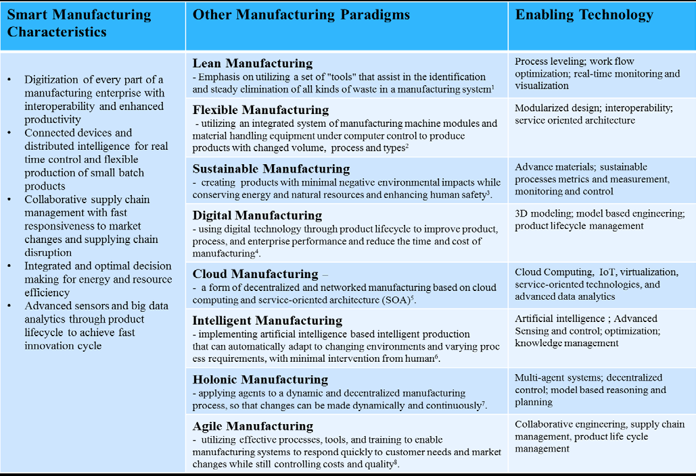

# 1 INTRODUCTION 

A manufacturer’s sustainable competitiveness depends on its capabilities with respect to cost, delivery, flexibility, and quality \[1] Smart Manufacturing Systems (SMS) attempt to maximize those capabilities by using advanced technologies that promote rapid flow and widespread use of digital information within and between manufacturing system \[2]\[3]\[4]. SMS are driving unprecedented gains in production agility, quality, and efficiency across U.S. manufacturers, improving long-term competitiveness. Specifically, SMS use information and communication technologies along with intelligent software applications to

Стійка конкурентоспроможність виробника залежить від його можливостей щодо вартості, доставки, гнучкості та якості \[1] Системи інтелектуального виробництва (SMS) намагаються максимізувати ці можливості за допомогою передових технологій, які сприяють швидкому потоку та широкому використанню цифрової інформації всередині та між системою виробництва \[2]\[3]\[4]. SMS забезпечує безпрецедентні переваги у швидкості виробництва, якості та ефективності серед виробників у США, покращуючи довгострокову конкурентоспроможність. Зокрема, SMS використовує інформаційні та комунікаційні технології разом із інтелектуальними програмними додатками для

1. Optimize the use of labor, material, and energy to produce customized, high-quality products for on-time delivery.
2. Quickly respond to changes in market demands and supply chains.

1. Оптимізації використання робочої сили, матеріалів і енергії для виробництва індивідуальних високоякісних продуктів для своєчасної доставки.
2. Швидкого реагування на зміни ринкових вимог і ланцюжків поставок.

Smart manufacturing, different from other technology-based manufacturing paradigms, defines a vision of next-generation manufacturing with enhanced capabilities. It is built on emerging information and communication technologies and enabled by combining features of earlier manufacturing paradigms. Table 1 shows the relationship between SMS and previous manufacturing paradigms.

Розумне виробництво, яке відрізняється від інших технологічних парадигм виробництва, визначає бачення виробництва наступного покоління з розширеними можливостями. Він побудований на нових інформаційних і комунікаційних технологіях і реалізований завдяки поєднанню рис попередніх виробничих парадигм. Таблиця 1 показує зв'язок між SMS і попередніми парадигмами виробництва.

Table 1: Smart Manufacturing and other manufacturing paradigms 

1 Strategos-International. Toyota Production System and Lean Manufacturing, http://www.strategosinc.com/toyota_production.htm
2 Flexible and reconfigurable manufacturing systems paradigms, Int J Flex Manuf Syst (2006) 17:261–276 DOI 10.1007/s10696-006-9028-7 3 Glossary of Sustainable Manufacturing Terms, EPA, http://archive.epa.gov/sustainablemanufacturing/web/html/glossary.html
4 DOE-FOA-0001263 Manufacturing innovation institute for smart manufacturing: advanced sensors, controls, platforms, and modeling for manufacturing. 5 Cloud-Based Manufacturing: Old Wine in New Bottles? , Proceedings of the 47th CIRP Conference on Manufacturing Systems
6 http://www.astri.org/technologies/initiatives/intelligent-manufaturing/

In 2014 in the United States, the President's Council of Advisors on Science and Technology (PCAST) issued a report that identified three top-priority transformative manufacturing technologies: Advanced Sensing, Control, and Platforms for Manufacturing; Visualization, Informatics and Digital Manufacturing Technologies; and Advanced Materials Manufacturing [[5\]. ](#_page_159_0)The first two of the technologies enhance the manufacturer’s ability to respond to information quickly and efficiently. They, in turn, rely on the effective information flow and system responsiveness that only standards can provide. The PCAST further noted that standards “spur the adoption of new technologies, products and manufacturing methods. Standards allow a more dynamic and competitive marketplace, without hampering the opportunity to differentiate. Development and adoption of standards reduce the risks for enterprises developing solutions and for those implementing them, accelerating adoption of new manufactured products and manufacturing methods.”

У 2014 році в Сполучених Штатах Рада консультантів президента з питань науки і технологій (PCAST) опублікувала звіт, у якому визначено три найпріоритетніші трансформаційні виробничі технології: Advanced Sensing, Control і Platforms for Manufacturing; Візуалізація, інформатика та цифрові технології виробництва; та Advanced Materials Manufacturing \[5]. Перші дві технології покращують здатність виробника швидко й ефективно реагувати на інформацію. Вони, у свою чергу, покладаються на ефективний потік інформації та оперативність системи, які можуть забезпечити лише стандарти. Крім того, PCAST зазначив, що стандарти «стимулюють впровадження нових технологій, продуктів і методів виробництва. Стандарти створюють більш динамічний і конкурентоспроможний ринок, не перешкоджаючи диференціації. Розробка та впровадження стандартів знижує ризики для підприємств, що розробляють рішення, і для тих, хто їх впроваджує, прискорюючи впровадження нових продуктів і методів виробництва».

Standards are the building blocks that provide for repeatable processes and the composition of different technological solutions to achieve a robust end result. Standards come in many varieties and forms. Standards.gov [[6\] ](#_page_159_0)and OMB Circular A-119 [[46\] ](#_page_162_0)describe, in some detail, the variety of forms standards can take. The standards that we will discuss are primarily “voluntary consensus standards.” This means they are set by a standards organization based on the consensus of the partners who will be using them. In addition, these types of standards are enforced by voluntary compliance. Such standards are designed to open new market opportunities to their users. The standards supporting SMS range from those for information technology and communication through those that govern enterprises and supply chains.

Стандарти є будівельними блоками, які забезпечують повторювані процеси та композицію різних технологічних рішень для досягнення надійного кінцевого результату. Стандарти бувають багатьох різновидів і форм. Standards.gov [[6\] ](#_page_159_0) і OMB Circular A-119 [[46\] ](#_page_162_0) досить детально описують різноманіття форм, які можуть приймати стандарти. Стандарти, які ми обговорюватимемо, є насамперед «добровільними консенсусними стандартами». Це означає, що вони встановлюються організацією зі стандартизації на основі консенсусу партнерів, які їх використовуватимуть. Крім того, ці типи стандартів забезпечуються добровільним виконанням. Такі стандарти розроблені, щоб відкрити нові ринкові можливості для своїх користувачів. Стандарти, що підтримують SMS, варіюються від тих, що стосуються інформаційних технологій і зв’язку, до стандартів, які регулюють підприємства та ланцюги поставок.

This paper presents an SMS standards’ landscape based on a definition of a smart-manufacturing ecosystem that encompasses three dimensions – product, production systems, and enterprise (business) systems. The landscape associates standards with the lifecycle phases in each dimension. Section 2 presents key capabilities and the manufacturing ecosystem as the convergence of the three different lifecycle perspectives in operational manufacturing systems. It also identifies areas where the integration of functions within and across these dimensions will result in systems that are more effective. Section 3 describes the landscape in terms of key standards’ organizations working in the area, types of standards in each of the three dimensions, and the manufacturing pyramid where the dimensions intersect. Finally, we discuss areas of opportunity for future standards in terms of the smart manufacturing capabilities.

У цьому документі представлено ландшафт стандартів SMS на основі визначення екосистеми інтелектуального виробництва, яка охоплює три виміри – продукт, виробничі системи та корпоративні (бізнес-системи). Ландшафт пов’язує стандарти з фазами життєвого циклу в кожному вимірі. У розділі 2 представлені ключові можливості та виробнича екосистема як конвергенція трьох різних перспектив життєвого циклу в операційних виробничих системах. Він також визначає області, де інтеграція функцій у цих вимірах і між ними призведе до більш ефективних систем. Розділ 3 описує ландшафт з точки зору ключових організацій зі стандартизації, які працюють у регіоні, типів стандартів у кожному з трьох вимірів та виробничої піраміди, де ці виміри перетинаються. Нарешті, ми обговорюємо можливості для майбутніх стандартів з точки зору можливостей інтелектуального виробництва.