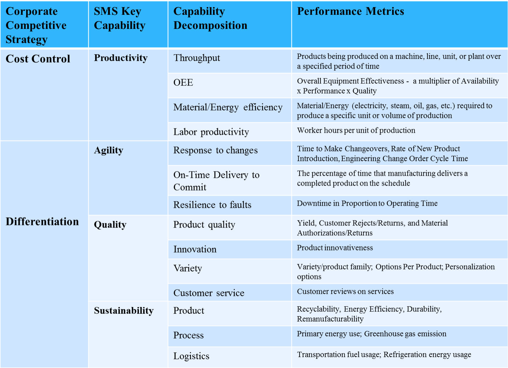
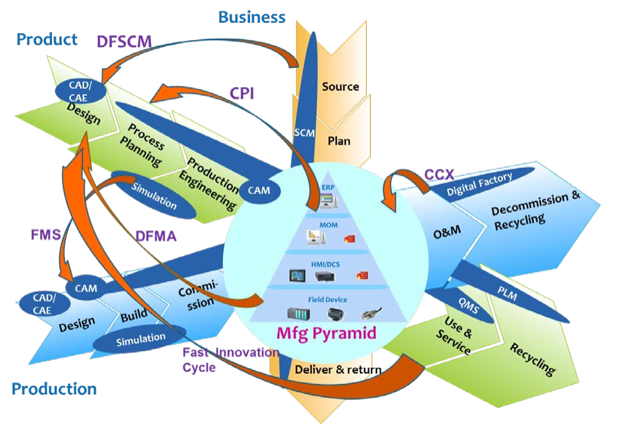
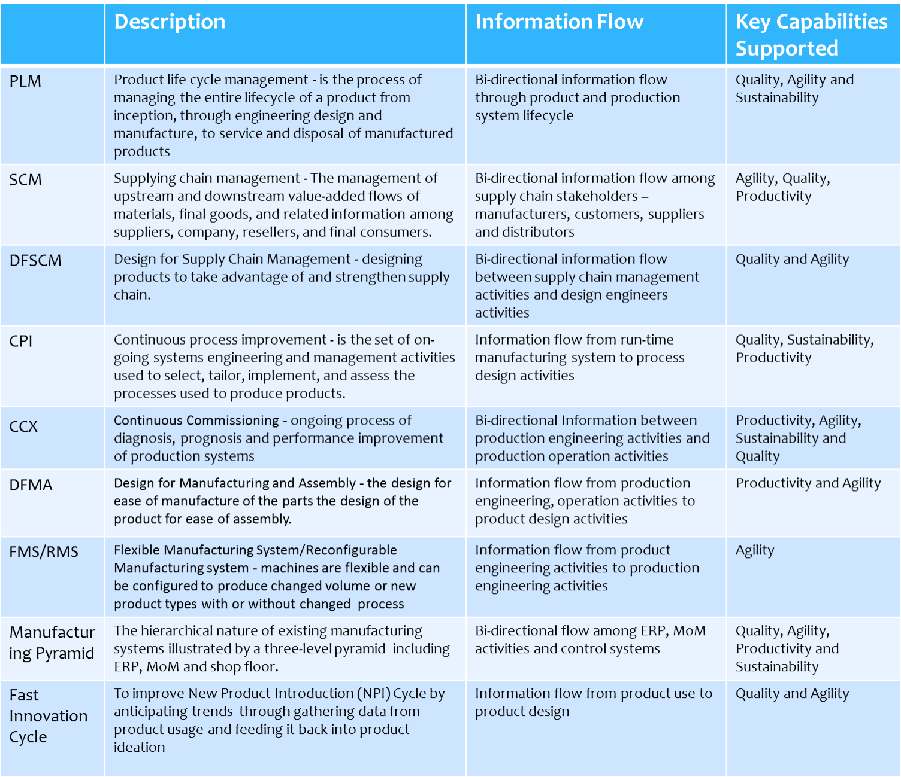

# 2 SMART MANUFACTURING ECOSYSTEM

Standards are fundamental for enabling SMS. Different standards contribute in different ways to enabling the capabilities of smart manufacturing systems. To generate an SMS landscape, we identify the standards as within scope based on whether a standard contributes to a capability, and analyze where, when, and for what purpose the standard is used. This section defines the key capabilities and presents a visualization of a smart manufacturing ecosystem. The following section presents the standards landscape for the ecosystem.

Стандарти є фундаментальними для включення SMS. Різні стандарти по-різному сприяють реалізації можливостей інтелектуальних виробничих систем. Щоб створити ландшафт SMS, ми визначаємо стандарти як такі, що входять до сфери застосування, залежно від того, чи сприяють стандарти можливостям, і аналізуємо, де, коли та з якою метою стандарт використовується. У цьому розділі визначено ключові можливості та представлено візуалізацію екосистеми інтелектуального виробництва. У наступному розділі представлено ландшафт стандартів для екосистеми.

## 2.1 SMART MANUFACTURING CAPABILITIES

Significant and positive relationships exist between manufacturing strategies and corporate competitive strategies [[47\]. ](#_page_162_0)To achieve corporate competitive goals, manufacturing systems should be developed with capabilities aligned to a firm’s competitive strategy, which usually consists of cost control and differentiation strategies of quality, delivery, innovation, service, and environmentally sustainable production. We classify key SMS-enabling capabilities into four categories including productivity, agility, quality, and sustainability (These characteristics are discussed in more detail in [[14\].](#_page_159_0)) Table 2 shows a mapping of SMS capabilities to corporate competitive strategies.

Між виробничими стратегіями та корпоративними конкурентними стратегіями існують значні та позитивні зв’язки [[47\]. ](#_page_162_0)Для досягнення корпоративних конкурентоспроможних цілей виробничі системи повинні бути розроблені з можливостями, узгодженими з конкурентною стратегією фірми, яка зазвичай складається з контролю над витратами та стратегій диференціації якості, доставки, інновацій, послуг і екологічно безпечного виробництва. Ми класифікуємо ключові можливості підтримки SMS за чотирма категоріями, включаючи продуктивність, гнучкість, якість і сталість (ці характеристики обговорюються більш детально в [[14\].](#_page_159_0)) Таблиця 2 показує відображення можливостей SMS для корпоративних конкурентні стратегії.

To analyze the role of existing manufacturing standards, we summarize the key SMS capabilities as follows:

Щоб проаналізувати роль існуючих виробничих стандартів, ми підсумовуємо ключові можливості SMS таким чином:

Productivity: Manufacturing productivity is defined as the ratio of production output to inputs used in the production process [[89\]. ](#_page_168_0)Productivity can be broken down further to labor productivity and material and energy efficiency. As production sizes increase, typically productivity increases; however, for SMS for which customization is a hallmark, productivity measures may need to be adjusted to be more inclusive of responsiveness to customer demand.

Продуктивність: продуктивність виробництва визначається як відношення обсягу виробництва до ресурсів, що використовуються у виробничому процесі [[89\]. ](#_page_168_0) Продуктивність можна розбити на продуктивність праці та ефективність використання матеріалів та енергії. У міру збільшення розмірів виробництва продуктивність зазвичай зростає; однак для SMS, для яких налаштування є відмітною ознакою, показники продуктивності, можливо, доведеться скоригувати, щоб вони більше включали реагування на попит клієнтів.

Agility: Agility is defined as “the capability of surviving and prospering in a competitive environment of continuous and unpredictable change by reacting quickly and effectively to changing markets, driven by customer-designed products and services” [[7\]. ](#_page_159_0)Critical to the success of agile manufacturing are enabling technologies such as model-based engineering, supply chain integration, and flexible production systems with distributed intelligence. Traditional metrics to measure agility include On Time Delivery to Commit, Time to Make Changeovers, Engineering Change Order Cycle Time, and Rate of New Product Introduction [[8\]. ](#_page_159_0)New measures could include Delay Due to Supply Chain Change.

Гнучкість: гнучкість визначається як «здатність виживати та процвітати в конкурентному середовищі безперервних і непередбачуваних змін, швидко й ефективно реагуючи на мінливі ринки, керуючись продуктами та послугами, розробленими клієнтами» [[7\]. ](#_page_159_0)Вирішально важливими для успіху гнучкого виробництва є такі сприятливі технології, як розробка на основі моделей, інтеграція ланцюжків поставок і гнучкі виробничі системи з розподіленим інтелектом. Традиційні показники для вимірювання гнучкості включають своєчасну доставку до зобов’язання, час для здійснення змін, тривалість циклу замовлення на технічні зміни та швидкість впровадження нового продукту [[8\]. ](#_page_159_0)Нові заходи можуть включати затримку через зміну ланцюга постачання.

Table 2: Key Capabilities for Smart Manufacturing System

Quality: Traditional quality measures reflect how well finished products meet design specifications. In addition, for SMS, quality also includes measures of product innovation and customization. Traditional quality metrics include Yield, Customer Rejects/Returns, and Material Authorizations/Returns [[8\]. ](#_page_159_0)New quality measurement indicators for innovativeness and variety/product family and options/product to measure personalization degree are needed.

Якість. Традиційні показники якості відображають, наскільки готова продукція відповідає специфікаціям проекту. Крім того, для SMS якість також включає показники інноваційності продукту та налаштування. Традиційні показники якості включають Врожайність, Відхилення/Повернення Клієнтом і Дозволи/Повернення Матеріалів [[8\]. ](#_page_159_0)Потрібні нові показники вимірювання якості для інноваційності та різноманітності/сімейства продуктів і варіантів/продуктів для вимірювання ступеня персоналізації.

 Sustainability: While time and cost as measures of productivity have been the traditional drivers for manufacturing, sustainability has taken on more importance. Measurement science for manufacturing sustainability is not as mature as for time and cost and is an active area of research [[18\] ](#_page_162_0)[[19\]. ](#_page_162_0)As productivity and agility of manufacturing systems increases, the necessity for better understanding and controlling the sustainability-related impacts of those systems increases. Manufacturing sustainability is defined in terms of environmental impact (such as energy and natural resources), safety and well-being of employees, and economic viability [[9\].](#_page_159_0)

Екологічність. У той час як час і вартість як показники продуктивності були традиційними рушійними силами виробництва, стійкість набула більшого значення. Наука про вимірювання сталого розвитку виробництва ще не настільки зріла, як про час і вартість, і є активною сферою досліджень [[18\] ](#_page_162_0)[[19\]. ](#_page_162_0)Зі зростанням продуктивності та гнучкості виробничих систем зростає потреба в кращому розумінні та контролі впливу цих систем на сталість. Стійкість виробництва визначається з точки зору впливу на навколишнє середовище (наприклад, енергії та природних ресурсів), безпеки та добробуту працівників, а також економічної життєздатності [[9\].](#_page_159_0)

## 2.2 SMART MANUFACTURING ECOSYSTEM 

The Smart Manufacturing Ecosystem encompasses a broad scope of systems in the manufacturing business including production, management, design, and engineering functions. Figure 1 illustrates three dimensions of concern that are manifest in SMS. Each dimension—product (green), production system (blue), and business (orange)—is shown within its own lifecycle. The product lifecycle is concerned with the information flows and controls beginning at the early product design stage and continuing through to the end-of-life of the product. The production system lifecycle focuses on the design, deployment, operation and decommissioning of an entire production facility including its systems. The business cycle addresses the functions of supplier and customer interactions. Each of these dimensions comes into play in the vertical integration of machines, plants, and enterprise systems in what we call the Manufacturing Pyramid (Figure 5). The integration of manufacturing software applications along each dimension helps to enable advanced controls at the shop floor and optimal decision-making at the plant and enterprise. The combination of these perspectives and the systems that support them make up the ecosystem for manufacturing software systems. Details of the lifecycle of the three dimensions, as well as the Manufacturing Pyramid, will be described in Section 3.

Екосистема Smart Manufacturing охоплює широкий спектр систем у виробничому бізнесі, включаючи функції виробництва, управління, проектування та інжинірингу. Рисунок 1 ілюструє три виміри інтересів, які проявляються в SMS. Кожен вимір — продукт (зелений), виробнича система (синій) і бізнес (помаранчевий) — показано в межах власного життєвого циклу. Життєвий цикл продукту пов’язаний з інформаційними потоками та елементами керування, що починаються на ранній стадії проектування продукту й тривають до кінця життєвого циклу продукту. Життєвий цикл виробничої системи зосереджується на проектуванні, розгортанні, експлуатації та виведенні з експлуатації всього виробничого об’єкта, включаючи його системи. Бізнес-цикл стосується функцій взаємодії постачальників і клієнтів. Кожен із цих вимірів бере участь у вертикальній інтеграції машин, заводів і корпоративних систем у те, що ми називаємо виробничою пірамідою (рис. 5). Інтеграція виробничих програмних додатків за кожним виміром допомагає увімкнути розширений контроль у цеху та прийняти оптимальні рішення на заводі та підприємстві. Поєднання цих перспектив і систем, які їх підтримують, складають екосистему для виробництва систем програмного забезпечення. Подробиці життєвого циклу трьох вимірів, а також виробничої піраміди будуть описані в Розділі 3.

Figure 1. Smart Manufacturing Ecosystem 

Historically, these dimensions have been dealt with as silos of concern. Indeed, integration along even one of these dimensions is a non-trivial challenge and is being actively worked on. We have observed that organizations that were formed to integrate single dimensions of this ecosystem are expanding in scope to address the digital thread across the dimensions (orange arrows in Figure 1). Paradigms such as continuous process improvement (CPI), flexible manufacturing (FMS), and design for manufacturing and assembly (DFMA) rely on information exchange between the dimensions as indicated in Figure 1. Tighter integration within and across the three dimensions will result in faster product-innovation cycles, more efficient supply chains, and more flexibility in production systems. The combination of these allows for optimal control of the automation and decision-making needed to make high quality, highly customized goods in tight synchronization with the demand for these goods [[10\].](#_page_159_0)

Історично ці виміри вважалися проблемними. Дійсно, інтеграція навіть за одним із цих вимірів є нетривіальним викликом, над яким активно працюють. Ми помітили, що організації, які були створені для інтеграції окремих вимірів цієї екосистеми, розширюють сферу діяльності, щоб охопити цифровий потік у вимірах (помаранчеві стрілки на малюнку 1). Такі парадигми, як безперервне вдосконалення процесу (CPI), гнучке виробництво (FMS) і проектування для виробництва та складання (DFMA), покладаються на обмін інформацією між вимірами, як показано на малюнку 1. Тісніша інтеграція всередині та між трьома вимірами призведе до швидшого цикли продукту-інновації, більш ефективні ланцюжки поставок і більша гнучкість виробничих систем. Поєднання цього дозволяє оптимально контролювати автоматизацію та прийняття рішень, необхідних для виробництва високоякісних товарів, що відповідають вимогам індивідуальних потреб, у тісній синхронізації з попитом на ці товари [[10\].](#_page_159_0)

Essentially, it is the seamless integrations within and across SMS dimensions and the manufacturing pyramid that lead to SMS capabilities. Table 3 shows the integration technologies highlighted in Figure 1 and the SMS capabilities supported by them.

По суті, саме бездоганна інтеграція всередині та між вимірами SMS та виробничою пірамідою призводить до можливостей SMS. У таблиці 3 показано технології інтеграції, виділені на малюнку 1, і підтримувані ними можливості SMS.

Table 3: SMS Ecosystem and Capability Mapping

## 2.3 IMPACTS OF STANDARDS

Standards are fundamental and valuable tools that can enable the adoption of technologies and innovations by business owners. Accordingly, they contribute to one or more SMS key capabilities. For example, on the product dimension, PLM standards contribute to both agility (by streamlining processes) and quality (by enabling the integration of different activities along the product and production system lifecycles). In the production system area, continuous commissioning (CCX) standards can improve machine performance and systems reliability to improve productivity, quality, and sustainability (through improved energy performance). Standards for electronic commerce such as the Open Applications Group Integration Specification (OAGIS) help streamline business processes between partners in the supply chain.

Стандарти є основними та цінними інструментами, які можуть уможливити впровадження технологій та інновацій власниками бізнесу. Відповідно, вони сприяють одній або декільком можливостям ключа SMS. Наприклад, щодо виміру продукту стандарти PLM сприяють як гнучкості (впорядковуючи процеси), так і якості (забезпечуючи інтеграцію різних видів діяльності впродовж життєвих циклів продукту та виробничої системи). У сфері виробничих систем стандарти безперервного введення в експлуатацію (CCX) можуть покращити продуктивність машин і надійність систем для підвищення продуктивності, якості та сталості (за рахунок покращення енергоефективності). Стандарти для електронної комерції, такі як Open Applications Group Integration Specification (OAGIS), допомагають оптимізувати бізнес-процеси між партнерами в ланцюжку постачання.

The next section presents a landscape of manufacturing standards on top of the SMS ecosystem where we see clearly existing manufacturing standards and how they can enhance SMS capabilities, if adopted.

У наступному розділі представлено ландшафт виробничих стандартів на екосистемі SMS, де ми бачимо чітко існуючі виробничі стандарти та те, як вони можуть покращити можливості SMS, якщо їх прийняти.