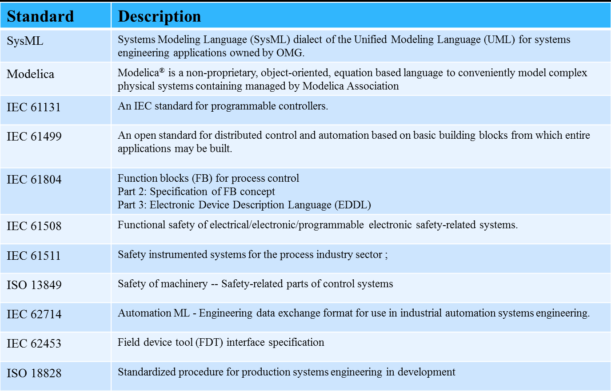

# 3 MANUFACTURING STANDARDS LANDSCAPE

Existing manufacturing standards provide “how-to” instructions for designers, engineers, builders, operators, and decision makers to conduct disciplined activities within their domains. They also facilitate communication between stakeholders across domain borders, borders of the manufacturing system hierarchy, and between lifecycle phases. Today, numerous national, regional, and international standards development organizations (SDOs) set manufacturing industry standards. This section provides a review of the types of standards for each of the three lifecycle dimensions with a focus on those standards that specifically address manufacturing information content. While some national or regional standards are considered, more emphasis is placed on international standards. In many cases, local SDOs may have direct liaisons with international SDOs. First, we provide an overview of the standards development organizations and then we position the standards within the ecosystem.\[7]

Існуючі виробничі стандарти надають інструкції «як робити» для проектувальників, інженерів, будівельників, операторів і осіб, які приймають рішення, щодо проведення дисциплінованої діяльності в межах своїх доменів. Вони також сприяють спілкуванню між зацікавленими сторонами через кордони домену, кордони ієрархії виробничої системи та між фазами життєвого циклу. Сьогодні численні національні, регіональні та міжнародні організації з розробки стандартів (SDO) встановлюють стандарти промисловості. У цьому розділі представлено огляд типів стандартів для кожного з трьох вимірів життєвого циклу з акцентом на тих стандартах, які конкретно стосуються вмісту інформації про виробництво. У той час як розглядаються деякі національні або регіональні стандарти, більше уваги приділяється міжнародним стандартам. У багатьох випадках місцеві SDO можуть мати прямі зв’язки з міжнародними SDO. Спочатку ми надаємо огляд організацій, що розробляють стандарти, а потім позиціонуємо стандарти в екосистемі.\[7]

## 3.1 STANDARD ORGANIZATIONS

A completed standard is typically the result of one of several development processes. The more traditional of these is via a formally sanctioned SDO. These organizations facilitate consensus building and ensure that standards are openly available to organizations that wish to use them. In this category are both international standards bodies, such as ISO [[20\] ](https://docs.google.com/document/d/15kgSrM1Z_KNLrK0LTvAyzVzxpOlqI8dR/edit#heading=h.1hmsyys)IEC [[30\], ](https://docs.google.com/document/d/15kgSrM1Z_KNLrK0LTvAyzVzxpOlqI8dR/edit#heading=h.1hmsyys)ASME [[21\], ](https://docs.google.com/document/d/15kgSrM1Z_KNLrK0LTvAyzVzxpOlqI8dR/edit#heading=h.1hmsyys)and ASTM [22]; and national bodies including professional organizations, which define best practices for their practitioners. In the United States, ANSI [[23\]](https://docs.google.com/document/d/15kgSrM1Z_KNLrK0LTvAyzVzxpOlqI8dR/edit#heading=h.1hmsyys) certifies professional organizations to create standards in areas of specialization.

Завершений стандарт зазвичай є результатом одного з кількох процесів розробки. Більш традиційний з них – через офіційно санкціонований SDO. Ці організації сприяють досягненню консенсусу та забезпечують відкритий доступ до стандартів для організацій, які бажають їх використовувати. До цієї категорії входять міжнародні органи стандартизації, такі як ISO [[20\] ](https://docs.google.com/document/d/15kgSrM1Z_KNLrK0LTvAyzVzxpOlqI8dR/edit#heading=h.1hmsyys)IEC [[30\], ](https://docs.google.com/document/d/15kgSrM1Z_KNLrK0LTvAyzVzxpOlqI8dR/edit#heading=h.1hmsyys)ASME [[21\], ](https://docs.google.com/document/d/15kgSrM1Z_KNLrK0LTvAyzVzxpOlqI8d Р /edit#heading=h.1hmsyys) і ASTM [22]; і національні органи, включаючи професійні організації, які визначають найкращі практики для своїх практиків. У Сполучених Штатах ANSI [[23\]](https://docs.google.com/document/d/15kgSrM1Z_KNLrK0LTvAyzVzxpOlqI8dR/edit#heading=h.1hmsyys) сертифікує професійні організації для створення стандартів у галузях спеціалізації.

The traditional consensus-building process used by SDOs can be quite time-consuming; as a result, other processes have emerged, including open source [[24\]. ](https://docs.google.com/document/d/15kgSrM1Z_KNLrK0LTvAyzVzxpOlqI8dR/edit#heading=h.1hmsyys)In the open-source process, a standard can come in the form of a specification describing the standard, a reference implementation of the standard, or both. These standards are often developed within a consortium, maintained collaboratively, and widely available to the public at large. Ownership of these standards remains a public trust of various sorts and they are open to interested participants. The licensing and governance models for the intellectual property contained in these standards vary greatly between projects. Open-source standards sometimes proceed to a more formal sanction by an SDO. An independent organization usually manages the open source process. Some vendor-driven standardization communities have taken another approach whereby a vendor implementation of a proposed standard is selected to define the standard. The chosen implementation becomes the reference to which other vendors implement.

Традиційний процес досягнення консенсусу, який використовують SDO, може зайняти досить багато часу; в результаті з'явилися інші процеси, в тому числі з відкритим кодом [[24\]. ](https://docs.google.com/document/d/15kgSrM1Z_KNLrK0LTvAyzVzxpOlqI8dR/edit#heading=h.1hmsyys)У процесі відкритого коду стандарт може бути у формі специфікації, що описує стандарт, еталонну реалізацію стандарту або обидва. Ці стандарти часто розробляються в рамках консорціуму, підтримуються спільно та широко доступні для широкої громадськості. Право власності на ці стандарти залишається громадським фондом різного роду, і вони відкриті для зацікавлених учасників. Моделі ліцензування та управління інтелектуальною власністю, які містяться в цих стандартах, значно відрізняються між проектами. Стандарти з відкритим кодом іноді переходять до більш офіційної санкції SDO. Процесом відкритого коду зазвичай керує незалежна організація. Деякі спільноти стандартизації, керовані постачальниками, застосували інший підхід, згідно з яким для визначення стандарту вибирається реалізація запропонованого стандарту від постачальника. Вибрана реалізація стає посиланням, яку впроваджують інші постачальники.

Multiple standards intended to work together are often defined as suites. Examples of this in the Information Technology (IT) world include the collection of standards from groups like WC3 [[25\] ](https://docs.google.com/document/d/15kgSrM1Z_KNLrK0LTvAyzVzxpOlqI8dR/edit#heading=h.1hmsyys)and IETF [[26\] ](https://docs.google.com/document/d/15kgSrM1Z_KNLrK0LTvAyzVzxpOlqI8dR/edit#heading=h.1hmsyys)that have aided the digital revolution. In the world of manufacturing, we find the ISO 10303 suite of standards (commonly known as STEP) for product data [[27\], ](https://docs.google.com/document/d/15kgSrM1Z_KNLrK0LTvAyzVzxpOlqI8dR/edit#heading=h.1hmsyys)the Quality Information Framework(QIF[)[32\] ](https://docs.google.com/document/d/15kgSrM1Z_KNLrK0LTvAyzVzxpOlqI8dR/edit#heading=h.1hmsyys)for streamlining quality testing capabilities, and the standards emerging from consortia such as the Open Application Group, Inc. (OAGi) for enterprise level applications [[28\]. ](https://docs.google.com/document/d/15kgSrM1Z_KNLrK0LTvAyzVzxpOlqI8dR/edit#heading=h.1hmsyys)These standards incorporate other, more fundamental, standards, e.g., the EXtensible Markup Language (XML) from W3C, and offer engineering and manufacturing content representation and interpretation. The Object Management Group (OMG) [[38\] ](https://docs.google.com/document/d/15kgSrM1Z_KNLrK0LTvAyzVzxpOlqI8dR/edit#heading=h.1hmsyys)also defines suites of standards that, for the most part, address underlying technologies rather than those specific to manufacturing. Some of these standards have become particularly useful for manufacturing application and are discussed later.

Кілька стандартів, призначених для спільної роботи, часто визначаються як комплекти. Приклади цього у світі інформаційних технологій (ІТ) включають збірку стандартів таких груп, як WC3 [[25\] ](https://docs.google.com/document/d/15kgSrM1Z_KNLrK0LTvAyzVzxpOlqI8dR/edit#heading=h.1hmsyys )та IETF [[26\] ](https://docs.google.com/document/d/15kgSrM1Z_KNLrK0LTvAyzVzxpOlqI8dR/edit#heading=h.1hmsyys), які допомогли цифровій революції. У світі виробництва ми знаходимо набір стандартів ISO 10303 (широко відомий як STEP) для даних про продукт [[27\], ](https://docs.google.com/document/d/15kgSrM1Z_KNLrK0LTvAyzVzxpOlqI8dR/edit#heading =h.1hmsyys)Інформаційна структура якості (QIF[)[32\] ](https://docs.google.com/document/d/15kgSrM1Z_KNLrK0LTvAyzVzxpOlqI8dR/edit#heading=h.1hmsyys) для оптимізації можливостей тестування якості та стандарти, створені такими консорціумами, як Open Application Group, Inc. (OAGi) для програм корпоративного рівня [[28\]. ](https://docs.google.com/document/d/15kgSrM1Z_KNLrK0LTvAyzVzxpOlqI8dR/edit#heading=h.1hmsyys) Ці стандарти включають інші, більш фундаментальні стандарти, наприклад, розширювану мову розмітки (XML) від W3C, і пропонують представлення та інтерпретація змісту інжинірингу та виробництва. Група керування об’єктами (OMG) [[38\] ](https://docs.google.com/document/d/15kgSrM1Z_KNLrK0LTvAyzVzxpOlqI8dR/edit#heading=h.1hmsyys) також визначає набори стандартів, які, здебільшого, звертатися до базових технологій, а не до тих, що стосуються виробництва. Деякі з цих стандартів стали особливо корисними для застосування у виробництві та обговорюються пізніше.

ISO and IEC are working on standards of significant importance to smart manufacturing. Within ISO, the technical committee on automation systems and integration (TC184) has two subcommittees (SC) that are of particular interest in our landscape: SC4 and SC5. SC4 focuses on industrial data standards – primarily those related to product data including ISO 10303. SC5 focuses on interoperability, integration, and architectures for automation applications. Both subcommittees have new standards for smart manufacturing in development.

ISO та IEC працюють над стандартами, які мають велике значення для інтелектуального виробництва. В рамках ISO технічний комітет із систем автоматизації та інтеграції (TC184) має два підкомітети (SC), які представляють особливий інтерес для нашого середовища: SC4 і SC5. SC4 зосереджується на стандартах промислових даних – насамперед тих, що стосуються даних про продукцію, включаючи ISO 10303. SC5 зосереджується на сумісності, інтеграції та архітектурах для програм автоматизації. Обидва підкомітети розробляють нові стандарти інтелектуального виробництва.

IEC, which historically has served the electronics industry, has developed standards that have broader applicability beyond the electronics industry. For example, IEC TC 65 focuses on standards for industrial process control and automation and is active in addressing integration between product data and production processes. ISO/IEC Joint Technical Committee (JTC) 1 on information technology deals with a large number of standardization topics in IT for manufacturing systems including sensor and device networks and user interfaces. Consequently, these types of standards are also included in our landscape.

IEC, який історично обслуговував електронну промисловість, розробив стандарти, які мають ширше застосування за межі електронної промисловості. Наприклад, IEC TC 65 зосереджується на стандартах для управління та автоматизації промислових процесів і активно займається питаннями інтеграції між даними про продукт і виробничими процесами. Об’єднаний технічний комітет ISO/IEC (JTC) 1 з інформаційних технологій займається великою кількістю питань стандартизації в ІТ для виробничих систем, включаючи мережі датчиків і пристроїв, а також інтерфейси користувача. Отже, ці типи стандартів також включені в наш ландшафт.

A number of consortia are developing standards and best practices in the SMS area including OAGi, MTConnect [[29\], ](https://docs.google.com/document/d/15kgSrM1Z_KNLrK0LTvAyzVzxpOlqI8dR/edit#heading=h.1hmsyys)ProSTEP iViP [[81\], ](https://docs.google.com/document/d/15kgSrM1Z_KNLrK0LTvAyzVzxpOlqI8dR/edit#heading=h.2grqrue)OPC Foundation [[31\], ](https://docs.google.com/document/d/15kgSrM1Z_KNLrK0LTvAyzVzxpOlqI8dR/edit#heading=h.1hmsyys)DMSC [[32\], ](https://docs.google.com/document/d/15kgSrM1Z_KNLrK0LTvAyzVzxpOlqI8dR/edit#heading=h.1hmsyys)and MESA [[33\]. ](https://docs.google.com/document/d/15kgSrM1Z_KNLrK0LTvAyzVzxpOlqI8dR/edit#heading=h.1hmsyys)Standards and best practices from these organizations are sometimes proposed in ISO and IEC to facilitate broader dissemination and adoption. OAGi and MTConnect make standards freely available as open source for downloading to the public. PDES Inc., for example, is an industrial consortium that undertakes projects related to product data exchange for design. Their projects are driven by its members’ specific needs for data integration standards. Results are fed into the ISO 10303 standards for product definition and others as appropriate. The work often addresses resolving issues surrounding the implementation of those standards. The OPC Foundation originally developed standards that allowed device providers to integrate their products into a Microsoft-based platform. OPC Foundation has since evolved into an independent standards organization with its own certification and testing program. Dimensional Metrology Standards Consortium (DMSC) [[32\] ](https://docs.google.com/document/d/15kgSrM1Z_KNLrK0LTvAyzVzxpOlqI8dR/edit#heading=h.1hmsyys)sets standards including QIF, which is fundamental for assuring that the entire quality-measurement process—consisting of product measurement design, planning, rules, resources, programming, results, and summary statistics—is fully integrated and traceable.

Низка консорціумів розробляє стандарти та найкращі практики у сфері SMS, зокрема OAGi, MTConnect [[29\], ](https://docs.google.com/document/d/15kgSrM1Z_KNLrK0LTvAyzVzxpOlqI8dR/edit#heading=h.1hmsyys) ProSTEP iViP [[81\], ](https://docs.google.com/document/d/15kgSrM1Z_KNLrK0LTvAyzVzxpOlqI8dR/edit#heading=h.2grqrue)OPC Foundation [[31\], ](https://docs. google.com/document/d/15kgSrM1Z_KNLrK0LTvAyzVzxpOlqI8dR/edit#heading=h.1hmsyys)DMSC [[32\], ](https://docs.google.com/document/d/15kgSrM1Z_KNLrK0LTvAyzVzxpOlqI8dR/edit#heading= h.1hmsyys )і MESA [[33\]. ](https://docs.google.com/document/d/15kgSrM1Z_KNLrK0LTvAyzVzxpOlqI8dR/edit#heading=h.1hmsyys) Стандарти та найкращі практики цих організацій іноді пропонуються в ISO та IEC для сприяння ширшому поширенню та прийняттю. OAGi та MTConnect надають стандарти у вільний доступ у вигляді відкритого коду для загального завантаження. Наприклад, PDES Inc. є промисловим консорціумом, який займається проектами, пов’язаними з обміном даними про продукт для проектування. Їхні проекти керуються особливими потребами членів щодо стандартів інтеграції даних. Результати вносяться до стандартів ISO 10303 для визначення продукції та інших, якщо це необхідно. Робота часто стосується вирішення проблем, пов’язаних із впровадженням цих стандартів. Фонд OPC спочатку розробив стандарти, які дозволили постачальникам пристроїв інтегрувати свої продукти в платформу на базі Microsoft. Відтоді OPC Foundation перетворилася на незалежну організацію стандартів із власною програмою сертифікації та тестування. Консорціум стандартів розмірної метрології (DMSC) [[32\] ](https://docs.google.com/document/d/15kgSrM1Z_KNLrK0LTvAyzVzxpOlqI8dR/edit#heading=h.1hmsyys) встановлює стандарти, включаючи QIF, який є основоположним для забезпечення того, що Весь процес вимірювання якості, що складається з дизайну вимірювання продукції, планування, правил, ресурсів, програмування, результатів і підсумкової статистики, повністю інтегрований і простежується.

APICS [[35\], ](https://docs.google.com/document/d/15kgSrM1Z_KNLrK0LTvAyzVzxpOlqI8dR/edit#heading=h.1hmsyys)ASTM, MESA, IPC [[79\], ](https://docs.google.com/document/d/15kgSrM1Z_KNLrK0LTvAyzVzxpOlqI8dR/edit#heading=h.2grqrue)and ISA [[34\] ](https://docs.google.com/document/d/15kgSrM1Z_KNLrK0LTvAyzVzxpOlqI8dR/edit#heading=h.1hmsyys)are industrial professional societies or trade associations working to advance the state-of-the-art in their fields. Their work includes standards, as well as educational and other activities. The APICS scope is supply chain and operations management. A part of APICS, known as the Supply Chain Council, produced a series of reference documents to provide guides on best practices for the supply chain industry. This rich set of information includes definitions for a wide range of performance metrics for manufacturing operations, many of which can be applied outside of the supply chain context. ASTM addresses manufacturing and materials, products and processes, systems, and services. MESA is concerned with the production level of Manufacturing Operations Management (MOM) or Manufacturing Executions Systems (MES) and the integration of information systems from the enterprise level into the manufacturing operation. IPC originated with the electronics industry, specifically focusing on printed circuit boards, but, as with many of the other organizations, its scope has expanded to address service and supply chain topics as well. ISA focuses on automation, specifically as applied to “engineering and technology to improve the management, safety, and cybersecurity of modern automation and control systems used across industry and critical infrastructure.[”[34\]](https://docs.google.com/document/d/15kgSrM1Z_KNLrK0LTvAyzVzxpOlqI8dR/edit#heading=h.1hmsyys) While each of these organizations brings a different perspective, their scopes intersect in our focus areas -product, production system, and business information flows.

APICS [[35\], ](https://docs.google.com/document/d/15kgSrM1Z_KNLrK0LTvAyzVzxpOlqI8dR/edit#heading=h.1hmsyys)ASTM, MESA, IPC [[79\], ](https:// docs.google.com/document/d/15kgSrM1Z_KNLrK0LTvAyzVzxpOlqI8dR/edit#heading=h.2grqrue)та ISA [[34\] ](https://docs.google.com/document/d/15kgSrM1Z_KNLrK0LTvAyzVzxpOlqI8dR/edit# заголовок=h .1hmsyys) є промисловими професійними товариствами або торговельними асоціаціями, які працюють над просуванням сучасного у своїх галузях. Їх робота включає стандарти, а також навчальну та іншу діяльність. Сфера діяльності APICS – це управління ланцюгом поставок і операціями. Частина APICS, відома як Supply Chain Council, випустила низку довідкових документів, які містять посібники щодо найкращих практик для галузі ланцюгів поставок. Цей багатий набір інформації містить визначення для широкого діапазону показників продуктивності для виробничих операцій, багато з яких можна застосовувати поза контекстом ланцюга постачання. ASTM стосується виробництва та матеріалів, продуктів і процесів, систем і послуг. MESA займається виробничим рівнем Manufacturing Operations Management (MOM) або Manufacturing Execution Systems (MES) та інтеграцією інформаційних систем з рівня підприємства у виробничу операцію. IPC виникла в електронній промисловості, особливо зосередившись на друкованих платах, але, як і в багатьох інших організаціях, її сфера діяльності розширилася, щоб охопити також питання обслуговування та ланцюга поставок. ISA зосереджується на автоматизації, зокрема у застосуванні до «техніки та технологій для покращення управління, безпеки та кібербезпеки сучасних систем автоматизації та контролю, які використовуються в промисловості та критичній інфраструктурі.[34] Хоча кожна з цих організацій пропонує різну точку зору, їхні сфери перетинаються в наших сферах діяльності — продукція, виробнича система та потоки бізнес-інформації.

Other noteworthy standards come from more academically oriented professional societies, which typically are ANSI accredited. These include the standards from IEEE [[37\] ](https://docs.google.com/document/d/15kgSrM1Z_KNLrK0LTvAyzVzxpOlqI8dR/edit#heading=h.1hmsyys)and ASME.

Інші варті уваги стандарти походять від більш академічно орієнтованих професійних товариств, які зазвичай мають акредитацію ANSI. До них належать стандарти IEEE [[37\] ](https://docs.google.com/document/d/15kgSrM1Z_KNLrK0LTvAyzVzxpOlqI8dR/edit#heading=h.1hmsyys)та ASME.

## 3.2 PRODUCT DEVELOPMENT LIFECYCLE STANDARDS

Figure 2. Standards along the Product Lifecycle

The product lifecycle in the context of the smart manufacturing ecosystem includes 6 phases as shown in Figure 2: Design, Process Planning, Production Engineering, Manufacturing, Use and Service, and End-of-Life and Recycling. The existing standards, particularly in the areas of Computer Aided Design (CAD), Computer Aided Manufacturing (CAM), and Computer Aided Technology (CAx) generally have greatly improved engineering efficiency [[11\]. ](https://docs.google.com/document/d/15kgSrM1Z_KNLrK0LTvAyzVzxpOlqI8dR/edit#heading=h.32hioqz)In addition, these standards enhance modeling accuracy and reduce product innovation cycles, thus contributing directly to manufacturing system agility and product quality. Advancements in this area have resulted in a new product development paradigm known as model-based engineering or enterprise, or MBE [[51\].](https://docs.google.com/document/d/15kgSrM1Z_KNLrK0LTvAyzVzxpOlqI8dR/edit#heading=h.41mghml)

Життєвий цикл продукту в контексті екосистеми інтелектуального виробництва включає 6 фаз, як показано на малюнку 2: проектування, планування процесу, технологія виробництва, виробництво, використання та обслуговування, а також завершення терміну експлуатації та переробка. Існуючі стандарти, зокрема в сферах автоматизованого проектування (CAD), автоматизованого виробництва (CAM) і автоматизованих технологій (CAx), загалом значно підвищили ефективність проектування [[11\]. ](https://docs.google.com/document/d/15kgSrM1Z_KNLrK0LTvAyzVzxpOlqI8dR/edit#heading=h.32hioqz)Крім того, ці стандарти підвищують точність моделювання та скорочують цикли інноваційних продуктів, таким чином безпосередньо сприяючи гнучкості виробничої системи та якості продукції . Удосконалення в цій галузі призвело до появи нової парадигми розробки продукту, відомої як інженерія на основі моделі або підприємство, або MBE [[51\].](https://docs.google.com/document/d/15kgSrM1Z_KNLrK0LTvAyzVzxpOlqI8dR/edit#heading =h.41mghml)

Figure 2 also shows a set of select standards related to the product lifecycle phases. These standards are classified into five categories: Modeling Practice, Product Model and Data Exchange, Manufacturing Model Data, Product Category Data, and Product Lifecycle Data Management.

На рисунку 2 також показано набір вибраних стандартів, пов’язаних із фазами життєвого циклу продукту. Ці стандарти поділяються на п’ять категорій: практика моделювання, модель продукту та обмін даними, дані моделі виробництва, дані категорії продукту та керування даними життєвого циклу продукту.

Modeling practice standards define digital product-definition data practices for both two-dimensional (2D) drawings and three-dimensional (3D) models. There are several standards available worldwide that define symbols and rules for dimensioning and tolerancing. The predominant standards are ASME (American Society of Mechanical Engineers) Y14.5 GD&T (Geometric Dimensioning and Tolerancing) and International Organization for Standardization, ISO/TC 213 GPS (Geometrical Product Specification) with ISO/TC 10 Technical Product Documentation. The ISO (GPS) standards are typically address a single topic. The ASME Y14.5 standard combines a set of topics for GD&T in one standards document. In addition to GD&T, ASME Y14.36M and ISO 1302 are established standards for communicating surface texture control requirements and defining surface texture properties. The joint IEC/ISO standard 81714 defines graphical symbols for use in technical documentation of products. Table 4 lists selected modeling practice standards from ASME and ISO. There are also standards for specific manufacturing domains such as electronics product modeling practice including IPC-D-325 for printed boards, assemblies, and supporting drawings.

Практичні стандарти моделювання визначають практики визначення цифрових даних як для двовимірних (2D) креслень, так і для тривимірних (3D) моделей. У всьому світі існує кілька стандартів, які визначають символи та правила для визначення розмірів і допусків. Переважними стандартами є ASME (Американське товариство інженерів-механіків) Y14.5 GD&T (геометричні розміри та визначення допусків) і Міжнародна організація стандартизації ISO/TC 213 GPS (геометрична специфікація продукту) з технічною документацією на продукт ISO/TC 10. Стандарти ISO (GPS) зазвичай стосуються однієї теми. Стандарт ASME Y14.5 поєднує набір тем для GD&T в одному документі стандартів. На додаток до GD&T, ASME Y14.36M та ISO 1302 є встановленими стандартами для передачі вимог контролю текстури поверхні та визначення властивостей текстури поверхні. Спільний стандарт IEC/ISO 81714 визначає графічні символи для використання в технічній документації продуктів. У таблиці 4 наведено вибрані стандарти практики моделювання від ASME та ISO. Існують також стандарти для конкретних виробничих областей, таких як практика моделювання електронних виробів, включаючи IPC-D-325 для друкованих плат, вузлів і допоміжних креслень.

Table 4: Modeling Practice Standards

Product model and data exchange standards include ISO standards and de facto standards, as shown in Table 5. These standards capture the representation of product and engineering information to enable data exchange between CAD software from different vendors. STEP is unique in that it addresses a broader range of information than is needed for CAD representations. The STEP architecture includes underlying methods for the definition and exchange of data and an architecture for integrating the data definitions into implementable units, called Application Protocols (AP), where CAD information is connected to product structure, as well as a wide array of other engineering and lifecycle information elements. The most commonly implemented and used APs are 203 for aerospace, defense and AP 214 for automotive [[52\]. ](https://docs.google.com/document/d/15kgSrM1Z_KNLrK0LTvAyzVzxpOlqI8dR/edit#heading=h.41mghml)The most recent part of STEP to be released is AP 242 edition 2, titled “Managed Model Based 3D Engineering” [[48\][52]. ](https://docs.google.com/document/d/15kgSrM1Z_KNLrK0LTvAyzVzxpOlqI8dR/edit#heading=h.1hmsyys)This standard merges AP 203 and AP 214 and incorporates requirements for data exchange in the areas of model-based development, product data management (PDM), product and manufacturing information (PMI), and long-term archiving of digital data. AP 242 is complementary to other visualization exchange formats such as JT (ISO 14306) and PRC (ISO 14739). Another set of standards for product modeling is used in additive manufacturing areas. The Stereo Lithography (STL) file format is widely used for rapid prototyping, 3D printing and additive manufacturing. ISO 52915, Additive Manufacturing File Format (AMF), is an open standard proposed to describe color, materials, lattices, and constellations of a 3D object that allows more complex descriptions of products, beyond basic geometry.

Стандарти моделі продукту та обміну даними включають стандарти ISO та фактичні стандарти, як показано в таблиці 5. Ці стандарти охоплюють представлення інформації про продукт та технічну інформацію, щоб забезпечити обмін даними між програмним забезпеченням САПР від різних постачальників. STEP унікальний тим, що він охоплює ширший спектр інформації, ніж це необхідно для представлень CAD. Архітектура STEP включає базові методи для визначення й обміну даними, а також архітектуру для інтеграції визначень даних у реалізовані блоки, які називаються протоколами додатків (AP), де інформація CAD пов’язана зі структурою продукту, а також широкий спектр інших інженерних засобів. та елементи інформації життєвого циклу. Найпоширенішими реалізованими та використовуваними AP є 203 для аерокосмічної промисловості, оборони та AP 214 для автомобільної [[52\]. ](https://docs.google.com/document/d/15kgSrM1Z_KNLrK0LTvAyzVzxpOlqI8dR/edit#heading=h.41mghml)Останньою частиною STEP, яка буде випущена, є AP 242 видання 2 під назвою «3D-проектування на основі керованої моделі» [ [48\][52]. ](https://docs.google.com/document/d/15kgSrM1Z_KNLrK0LTvAyzVzxpOlqI8dR/edit#heading=h.1hmsyys)Цей стандарт об’єднує AP 203 і AP 214 і містить вимоги до обміну даними в сферах розробки на основі моделі, продукту керування даними (PDM), інформацію про продукт і виробництво (PMI), а також довгострокове архівування цифрових даних. AP 242 є доповненням до інших форматів обміну візуалізації, таких як JT (ISO 14306) і PRC (ISO 14739). Інший набір стандартів для моделювання продукту використовується в сферах адитивного виробництва. Формат файлу Stereo Lithography (STL) широко використовується для швидкого створення прототипів, 3D-друку та адитивного виробництва. ISO 52915, Additive Manufacturing File Format (AMF), — це відкритий стандарт, запропонований для опису кольору, матеріалів, решіток і сузір’їв 3D-об’єкта, який дозволяє більш складні описи продуктів, окрім основної геометрії.

Table 5: Product Model and Data Exchange Standards

Manufacturing model data standards, in contrast to the product model standards that focus on product design, define the data needed to manufacture a product from a design (Table 6). ISO 6983, or G-Code, is the most widely used Numerical Control (NC) programming language. ISO 14649 was developed to overcome the problems of ISO 6983 by defining a data model to enable a link between manufacturing operations and the original CAD geometry data. STEP AP 238 is designed to extend ISO 14649 in order to integrate more tightly with product design definitions. It can exchange explicit toolpath descriptions along with part, stock, fixture geometry, tool descriptions, GD&T, and PDM information.

Стандарти даних моделі виробництва, на відміну від стандартів моделі продукту, які зосереджені на дизайні продукту, визначають дані, необхідні для виготовлення продукту з дизайну (табл. 6). ISO 6983, або G-Code, є найбільш широко використовуваною мовою програмування з числовим керуванням (NC). ISO 14649 було розроблено, щоб подолати проблеми ISO 6983, визначивши модель даних для забезпечення зв’язку між виробничими операціями та оригінальними даними геометрії САПР. STEP AP 238 розроблено для розширення ISO 14649 з метою більш тісної інтеграції з визначеннями дизайну продукту. Він може обмінюватися явними описами траєкторії інструменту, а також інформацією про деталі, заготовки, пристосування, описи інструментів, GD&T і PDM.

Table 6: Manufacturing Model Data Standards

Product catalog data standards support the description of particular instances of products or parts in a uniform, vendor-neutral way. Examples of product catalog data standards include ISO 13584, 15926-Part 4 and 22745. The first two of these focus on methods for catalog definition. ISO 13854 specifies the principles to be used for defining characterization classes of parts and properties of parts independent from any particular supplier-defined identification. ISO 22745 provides guidelines for the development of terminology for open technical dictionaries and inventory and catalog systems. In contrast, 15926 Part 4 represents a specific domain and defines the engineering terms required to design, build, and operate an oil and gas production facility.

Product lifecycle data management focuses on the needs of long-term retention and access to data consistently throughout the product lifecycle. The best-known product lifecycle data management standard is ISO 10303 AP239, also known as Product Life Cycle Support (PLCS). AP 239 is designed for the exchange of complex-product for life-long support, i.e., the information needed and created during the use and maintenance of products. PLM XML is an emerging open format from Siemens for facilitating PLM. PLM XML is designed as a lightweight, extensible, and flexible format for sharing product design and function data in a collaborative environment [[53\]. ](https://docs.google.com/document/d/15kgSrM1Z_KNLrK0LTvAyzVzxpOlqI8dR/edit#heading=h.41mghml)The related LOTAR (LOng Term Archiving and Retrieval) International Project has an even broader scope. The LOTAR focus is long-term access to digital product and technical information through the development of standards-based archival and retrieval mechanisms. The results of that effort are recommended practices on how standards can be applied to long-term archiving of products and associated design information.

## 3.3 PRODUCTION SYSTEM LIFECYCLE STANDARDS

“Production systems” here refers to collections of machines, equipment, and auxiliary systems organized to create goods and services from various resources[.[49\] ](https://docs.google.com/document/d/15kgSrM1Z_KNLrK0LTvAyzVzxpOlqI8dR/edit#heading=h.1hmsyys)Most product-model and modeling-practice standards are applicable to production system development as well. However, as one of the most complex product systems that is intended to manufacture goods, production systems have a number of unique standards that are fundamental to achieving SMS. Production systems usually have a much longer lifecycle than the goods that they produce. Additionally, they need to be frequently reconfigured, and thus have unique needs with respect to their design. The unique SMS capabilities discussed here are made possible by automation standards for system control and maintenance. In this subsection, we focus on standards supporting complex system modeling, automation engineering, and operation and maintenance (O&M) perspectives of production systems.

Typical lifecycle phases for a production system as shown in Figure 3 include Design, Build, Commission, O&M, and Decommission. Production systems and facilities are typically designed to manufacture a family of products. The degree of manufacturing flexibility—how adaptive a production system is in responding to market and supply chain changes—is a key design decision that not only impacts cost but also influences the length of the production system lifecycle. The commissioning phase involves testing the entire production system, including equipment, plant and facility, and handing off the system for operation. The system is verified to function according to the design objectives and specifications. After commissioning, the production system enters O&M– a steady state of tactical operations and strategic maintenance activities. When radical internal or external changes are introduced, for example, if the main subsystems crash or the targeted product group is phased out of the market, the life of the product system comes to an end. At this point, production permanently ceases or the system is recycled. The steady-state O&M stage is typically the longest phase of a production system’s lifecycle. During this period, production systems are managed to best transform material, energy, and labor into products. In this phase, adaptation planning, re-commissioning, and continuous commissioning are conducted to maintain and improve system performance and search for ways to reconfigure the system to adapt to changes in the market and supply chain.

Areas of standards that support production lifecycle activities include Production System Model Data and Practice, Production System Engineering, O&M, and Production Lifecycle Management. Since the O&M stage is the longest phase, the standards for O&M and lifecycle management merit special attention. Specifically, standards supporting manufacturing operations are discussed in detail in the Manufacturing Pyramid subsection.

Figure 3. Standards for Production System Lifecycle

Production system model data and practice standards provide information models for factory and production system design. They enhance information exchange among stakeholders, and enable virtual commissioning, which can improve manufacturing agility and reduce manufacturing cost. Besides CAx standards, several international standards specific to production system modeling and data exchange exist. The standards in this area can be classified into two domains as shown in Table 7: manufacturing resource and process, and building/facility modeling. ISO 10303 AP 214 has been shown to be able to represent different aspects of a manufacturing system in development [[53\]. ](https://docs.google.com/document/d/15kgSrM1Z_KNLrK0LTvAyzVzxpOlqI8dR/edit#heading=h.41mghml)ISO 10303 AP 221 defines functional data for, and schematic representation of, process plants. ISA 95 defines an equipment hierarchy model and models manufacturing processes [[34\]. ](https://docs.google.com/document/d/15kgSrM1Z_KNLrK0LTvAyzVzxpOlqI8dR/edit#heading=h.1hmsyys)ISO 18629 defines a Process Specification Language (PSL) aimed at identifying and formally defining and structuring the semantic concepts intrinsic to the capture and exchange of process information related to discrete manufacturing. IEC 62832(Digital Factory) defines a comprehensive network of digital models, methods, and tools to represent the basic elements and automation assets, as well as the behavior and relationships between these elements/assets. The digital factory concept includes five views of information: Construction (C), Function (F), Performance (P), Location (L) and Business (B). ISO 17506 defines an open standard for exchanging digital assets among various graphics software applications for plant geometry representation and kinetics simulation. The Core Manufacturing Simulation Data (CMSD) Information Model was developed by NIST and standardized by the Simulation Interoperability Standards Organization (SISO) to define a data-interface specification for efficient exchange of manufacturing lifecycle data in a simulation environment. PLC Open XML provides standards to represent programmable logic control (PLC) including sequences of actions, internal behavior of objects, and Input/Output (IO) connections. IEC 62337 defines specific phases and milestones in the commissioning of electrical, instrumentation, and control systems in the process industry. IEC 61987 defines a standard to facilitate understanding of process measurement and control equipment descriptions when transferred from one party to another.

Table 7: Production System Modeling and Practice Standards

Production system engineering standards can interconnect engineering tools from different disciplines, e.g., system engineering, mechanical plant engineering, electrical design, process engineering, process control engineering, Human Machine Interface (HMI) development, PLC programming, and robotic programming. In the production system engineering category, there are several important standards playing critical roles in improving production system engineering efficiency, as shown in Table 8. While most of these standards serve very specific functions, two of them are fundamental methods, which underpin much of the work in production system engineering. The Systems Modeling Language (SysML) [[38\] ](https://docs.google.com/document/d/15kgSrM1Z_KNLrK0LTvAyzVzxpOlqI8dR/edit#heading=h.1hmsyys)from OMG is a general-purpose modeling language for systems engineering applications. It supports the specification, analysis, design, verification, and validation of a broad range of systems and systems-of-systems, and is particularly useful for large-scale projects such as production systems. Modelica [[92\] ](https://docs.google.com/document/d/15kgSrM1Z_KNLrK0LTvAyzVzxpOlqI8dR/edit#heading=h.2grqrue)is an object-oriented, declarative, multi-domain modeling language. Modelica is widely used in applications that model complex physical systems and particularly to model the mechanical,	electrical,	electronic,	hydraulic,	thermal,	control,	electric	power,	or	process-oriented subcomponents of production systems.

In the production system automation engineering area, IEC 61131 is a widely adopted standard for programmable controllers, including equipment requirements and tests, communication, functional safety, programming languages, and their implementation guidelines. Specifically, IEC 61131-3 is the most widely adopted standard defining the programming languages for PLCs, embedded controls, and industrial personal computers (PCs). IEC 61499 is an open standard for distributed control and automation, upon which entire applications can be built from Function Blocks (FB) with event triggers. This standard has not been accepted by industry, even though it is highly promoted by the academic community, because it does not provide a solid framework for the next generation of industrial automation systems [[54\]. ](https://docs.google.com/document/d/15kgSrM1Z_KNLrK0LTvAyzVzxpOlqI8dR/edit#heading=h.41mghml)IEC 61804 defines FB for process control. IEC 62714, AutomationML, interconnects engineering tools from different disciplines, e.g., mechanical plant engineering, electrical design, process engineering, process control engineering, HMI development, PLC programming, and robotic programming, etc. [[12\]. ](https://docs.google.com/document/d/15kgSrM1Z_KNLrK0LTvAyzVzxpOlqI8dR/edit#heading=h.32hioqz)AutomationML incorporates different standards through strongly typed links across the formats including CAEX (IEC 62424) for properties and relations of objects in their hierarchical structure, COLLADA for Graphical attributes, and Kinematics and PLCopen XML for logic items. IEC also has a set of standards to model and configure production equipment, such as IEC 62453-2 for field device tool interface specification, and IEC 61804-3 specifying Electronic Device Description Language (EDDL). ISO 18828 is under development by ISO TC184/SC4 for standardized procedures for production systems engineering.

For production engineering practice, IEC 61508 is the international standard for electrical, electronic, and programmable electronic safety-related systems. It specifies requirements for ensuring that systems are designed, implemented, operated, and maintained to standards for safety integrity levels (SIL). IEC 61511 is a technical standard that specifies practices in the engineering of systems that ensure the safety of an industrial process through the use of instrumentation. This standard is process-industry specific within the framework of IEC 61508. ISO 13849 provides safety requirements and guidance on the principles for the design and integration of safety-related parts of control systems, including the design of software.

Table 8: Production System Engineering standards

Production lifecycle data management standards define general models of data integration, sharing, exchange, and hand-over for lifecycle support of production facilities. A selected set of important production lifecycle data management standards are shown in Table 9. A study of information modeling [[53\] ](https://docs.google.com/document/d/15kgSrM1Z_KNLrK0LTvAyzVzxpOlqI8dR/edit#heading=h.41mghml)found that ISO 10303 AP 239 (PLCS) has the most potential to model a manufacturing system for its lifecycle. However, guidance is needed regarding how to use PLCS for representing domain-specific objects such as machining centers [[90\]. ](https://docs.google.com/document/d/15kgSrM1Z_KNLrK0LTvAyzVzxpOlqI8dR/edit#heading=h.2grqrue)ISO 15926 is the most widely used production lifecycle data management standard in the process industry. ISO 15926 -1 defines a class structure of various phenomena or occurrences that exist in time and space in that industry.

Table 9: Production lifecycle data management standards

Due to the generic character of the PLCS data model in 15926, the 15926 standard defines a reference data model in Part 4 providing more useful entities for representing process plants. ISO 16739 defines a common data model for building lifecycle support that can be applied to manufacturing facilities. The emerging IEC 62890 defines standards for lifecycle management for systems and products used in industrial process measurement, control and automation.

O&M standards define data processing, communication, and presentation standards for condition monitoring and diagnostics of machines, for maintaining the adequate performance of the system, and for searching ways to improve performance. Table 10 shows a selected set of O&M standards. Standards supporting production O&M include MIMOSA Open Systems Architecture for Enterprise Application Integration (OSA-EAI) specifications and condition-based maintenance (CBM) specifications, which are widely used in the Oil and Gas industry. ISO 13374 also defines data processing, communication, and presentation standards for condition monitoring and diagnostics of machines. The upcoming ASME B5.59-2 will address performance and capabilities of machine tools at any time in their lifecycles, e.g., during specification, after acceptance testing, or during operation. ASME B5.59-2 addresses only information related to the machine tool itself and does not include process-related information [[53\].](https://docs.google.com/document/d/15kgSrM1Z_KNLrK0LTvAyzVzxpOlqI8dR/edit#heading=h.41mghml)

Table 10: Production System O&M Standards

## 3.4 BUSINESS CYCLE FOR SUPPLY CHAIN MANAGEMENT

Electronic commerce is critical today to enable any type of business, or commercial transaction, and always involves information exchange between stakeholders. Figure 4 shows the Plan-Source-Make-Deliver-Return cycle for managing the manufacturing supply chain. Standards for interactions among manufacturers, suppliers, customers, partners, and even competitors include general business modeling standards (shown in Table 11), and manufacturing specific modeling standards and corresponding message protocols. These standards are the key to enhancing supply chain efficiency and manufacturing agility. Here, we highlight three sets of manufacturing-specific standards critical for integration: APICS Supply Chain Operations Reference (SCOR), Open Applications Group Integration Specification (OAGIS), and MESA’s B2MML.

Figure 4: Standards through the supply chain cycle

Table 11: General standards employed for modeling and executing business processes

SCOR is a process reference model from the Supply Chain Council (SCC) (now part of APICS) and is a de facto standard that identifies and promotes best practices in the management and operation of supply chain activities across many industries [[13\]. ](https://docs.google.com/document/d/15kgSrM1Z_KNLrK0LTvAyzVzxpOlqI8dR/edit#heading=h.32hioqz)SCOR is a management tool spanning the supply chain from the supplier's suppliers to the customer's customers. The model describes the business activities associated with all phases of satisfying a customer's demands. The model uses an approach based on three pillars: process modeling and re-engineering, performance measurements, and best practices. The SCOR model is text-based and, therefore, not directly usable for automation.

OAGIS includes a suite of engineering and business message specifications called Business Object Documents (BODs), which define common content models and messages for communication between business applications. OAGIS also defines guides for implementation. OAGIS content spans many industries and functions, including electronic commerce, manufacturing, logistics, Customer Relationship Management, and Enterprise Resource Planning (ERP.) It includes not only specific formats for common types of messages used in manufacturing domains, but also mechanisms for extending and tailoring the standards for specific needs. The standard can serve as building blocks for customized data exchanges. MESA B2MML is a well-adopted implementation of the ISA 95 data models. It facilitates the integration of ERP and supply chain management systems with manufacturing systems such as control systems and MES.

## 3.5 MANUFACTURING PYRAMID

The Manufacturing Pyramid is the core of the SM Ecosystem and is where the product lifecycle, production lifecycle, and business cycle converge and interact. In a smart operation, autonomous and intelligent machine behaviors—including self-awareness, reasoning and planning, and self-correction—are key, but information resulting from these behaviors must flow up and down the Pyramid. This integration from machine to plant to enterprise systems is vital and critically depends upon standards. Standards-enabled SM integration allows 1) access to field and plant data for making quick decisions and optimizing production throughput and quality, 2) accurate measures of energy and material use, and 3) improved shop floor safety and enhanced manufacturing sustainability.

In Figure 5, we divide integration standards based on the ISA 9[5[34\] ](https://docs.google.com/document/d/15kgSrM1Z_KNLrK0LTvAyzVzxpOlqI8dR/edit#heading=h.1hmsyys)hierarchy, which has also been included within ISO/IEC 62264 [30]. ISA 95 is a commonly used reference model for developing automated interfaces between enterprise and control systems. This standard was developed for global manufacturers and designed for applicability to all industries and for batch, discrete, and continuous processes alike.

Figure 5: Standards aligned to the ISA95 model

Table 12: Enterprise level standards

Enterprise level: Table 12 shows important enterprise-level manufacturing standards. ISO 15704 defines requirements for enterprise reference architectures and methodologies. The ISO standards 19439 and 19440 listed in Figure 5 define the framework and specify characteristics of the core constructs needed for enterprise-level activities. ISO 20140 establishes an overview and general principles of a method for assessment of environmental influence of manufacturing systems. OMG’s Business Process Model Notation (BPMN) is a graphical representation often used for specifying processes in a manufacturing business process model. The Predictive Model Markup Language (PMML) developed by the Data Mining Group (DMG) [[93\] ](https://docs.google.com/document/d/15kgSrM1Z_KNLrK0LTvAyzVzxpOlqI8dR/edit#heading=h.2grqrue)is a format to define statistical and data mining models. PMML can be adopted at the MOM level as well. The Decision Model and Notation (DMN) standard is being developed by OMG to close the gap between business decision design and decision implementation. OAGIS defines a common content model for enterprise application integration.

MOM level: Manufacturing operations management, or MOM, refers to applications that control plant level operations. Table 13 shows some important MOM level standards. IEC 62264 is an international standard for enterprise control system integration and is based upon ISA 95. IEC 62264 defines activity models, function models, and object models in the MOM domain. Business to Manufacturing Markup Language (B2MML), published by the MESA, is an implementation of IEC 62264 to link ERP and Supply Chain Management (SCM) systems with manufacturing systems such as Manufacturing Execution Systems (MES). ISO 22400 defines key performance indicators (KPIs) used in manufacturing operations management. QIF is a suite of standards enabling the flow of information within computer-aided quality measurement systems. PMML from DMG could be applied at this level to support MOM functions.

Table 13: MOM level standards

SCADA and Device level: SCADA-level (Supervisory Control And Data Acquisition) and device-level standards in Figure 5 are considered shop floor standards. While these levels were once more distinct, the distinction of interest now is between time and safety critical activities and non-time-critical activities. At shop floor level, there is usually an organized hierarchy of control systems consisting of HMI, PLC, and field components such as sensors and actuators. PLCs are usually connected to HMI via a non-time-critical communications system such as Ethernet/IP, DeviceNet, ControlNet, PROFINET, and EtherCAT. A fieldbus, such as PROFIBUS, CAN bus, HART and Modbus, links the PLCs to the field components. A serial communications protocol, Modbus is also often used to connect a supervisory computer with a remote terminal unit (RTU) in SCADA) systems. While communication profiles of real-time Ethernet-based protocols like EtherCAT, PROFINET and Ethernet/IP are captured by IEC 61874, fieldbuses such as Foundation Fieldbus and PROFIBUS are specified in IEC 61158.

In addition to the communication protocols discussed above, there are several important integration standards linking shop floor control to MES and enterprise level systems, such as OPC and OPC UA (Unified Architecture), MTConnect, PackML and BatchML. OPC UA is an industrial machine-to-machine communication protocol based on Service-Oriented Architecture (SOA). Furthermore, OPC UA provides a flexible information model framework for creating and exposing customized information in a standard way, in those cases where users of OPC UA have agreed on the customizations. Some of these customizations are contained in companion standards for different application areas—for example OPC UA for ISA 95, OPC UA for Field Device Integration (FDI), OPC UA for Analyzer Devices (ADI), and OPC UA for PLCOpen (IEC 61131-3). MTConnect is used to access real-time data from shop floor manufacturing equipment such as machine tools. ISA 88 is a standard for the batch processing industry, and defines the physical model, procedures, and recipes. It was adopted by the IEC in IEC 61512. PackML is a packaging standard used in the batch processing industry as part of ISA 88 standards. BatchML is an implementation of ISA 88 for linking batch control systems to MES. The standards supporting shop floor level manufacturing systems are shown in Table 14.

Table 14: SCADA and device level standards

Cross-levels: As shown on the right side of Figure 5, several standards cross all the levels and define manufacturing system security, quality management processes, energy management, and environmental management. Table 15 lists several cross-level manufacturing standards. ISA/IEC-62443, formerly ISA 99, is a series of standards, technical reports, and related information that defines procedures for implementing electronically secure industrial automation and control systems. The concept of manufacturing and control systems electronic security is applied in the broadest possible sense, encompassing all types of plants, facilities, and systems in all industries. The ISO 9000 family of quality management systems standards is designed to help manufacturers ensure that they meet the needs of customers and other stakeholders while meeting statutory and regulatory requirements related to a product. ISO 50001 specifies the requirements for establishing, implementing, maintaining and improving energy management systems for a manufacturing business. ISO 14000 is a series of environmental management standards containing guidance on how to systematize and improve environmental management efforts.

Table 15: Cross-level standards

## 3.6 STANDARDS ADOPTION AND THE RELATED ISSUES

Standards play a big role in economic growth globally. Roughly, 80% of global merchandise trade is affected by standards and by regulations that embody standards [[84\]. ](https://docs.google.com/document/d/15kgSrM1Z_KNLrK0LTvAyzVzxpOlqI8dR/edit#heading=h.2grqrue)In the United States, the economic impact of standards is not tracked [[85\]. ](https://docs.google.com/document/d/15kgSrM1Z_KNLrK0LTvAyzVzxpOlqI8dR/edit#heading=h.2grqrue)Based on a UK study published in 2005, the Empirical Economics of Standards, standards make an annual contribution of 2.5 billion to the UK economy and 13% of the growth in labor productivity is attributed to the role of standards [[86\]. ](https://docs.google.com/document/d/15kgSrM1Z_KNLrK0LTvAyzVzxpOlqI8dR/edit#heading=h.2grqrue)A study of the economic benefits of standardization undertaken by the German Institute for Standardization (DIN) and the German Federal Ministry of Economic Affairs and Technology from 1997-2000 based on 700 companies found the benefit of standards to the national economy is greater than $15 billion per year [[87\]. ](https://docs.google.com/document/d/15kgSrM1Z_KNLrK0LTvAyzVzxpOlqI8dR/edit#heading=h.2grqrue)They also found that companies that participate in standards development have a head start on their competitors in adapting market demands and new technologies.

Standards are key enablers for manufacturing. They provide a basis on which to bring together specialized expertise to create highly efficient manufacturing systems. The sum total of standardization efforts in the manufacturing field is immense. Standards provide data definitions, detailed models of the information relationships, and interface protocols for all three of the lifecycles we describe. They support product designs and management, production system design and operations, and integration into business value chains. These are the foundations on which information can flow throughout the levels of manufacturing control and between partners in the manufacturing enterprise including the various software vendors and device providers that participate by providing their expertise to these systems in the form of commercial products. Standards allow for a clear separation of concerns among the participants, effectively bringing down costs while increasing reliability and efficiency.

Across some of the lifecycles and in some industry sectors standards are more mature than in others. In discrete manufacturing, which is characterized by individual parts that are assembled into final products, standards along the product lifecycle are fairly well positioned to support Smart Manufacturing. In the world of continuous manufacturing, however, standards are not as well established for process product data management. Production systems engineering standards are more diversified and can typically be applied in both categories of manufacturing. Within the manufacturing pyramid, communication standards are well established but interoperability among systems is somewhat limited, meaning that manufacturers typically are locked into a single vendor solution. Along the business lifecycle, several well-established standards exist however; the level to which information is able to interconnect with the production systems is quite limited. Other gaps in the ability of standards to address smart manufacturing needs exist and are discussed in detail in next section.

Beyond the standards gaps two other barriers to standards adoption inhibit the growth of SMS.

1) Lack of tracking of standards and standards adoption. The huge number of standards can be misleading, as many standards are never used. The number of standards that are actively being sold constitute a small part of those offered for sale, meaning many standards out there are not being used. In 1996, a NIST report identified 25-30% of the US standards as obsolete [[83\] ](https://docs.google.com/document/d/15kgSrM1Z_KNLrK0LTvAyzVzxpOlqI8dR/edit#heading=h.2grqrue)and certainly, this number has grown. SDOs rarely inactivate standards once they have been published. The result is that manufacturers and their support network, in the form of software and device providers, are left trying to navigate the standards without a compass to help them find their way.
2) Overlap and redundancy between standards. Three practices cause overlap and redundancy. First standards from national, regional, international standards systems are sometimes identical, equivalent or in some other way related resulting in confusion as to the most authoritative source. Secondly, standards in the same technical areas but in different application sectors are defined independently. For example, material-testing methods defined for different industry sectors sometimes are not consistent. For the US, the third redundancy comes from the pluralistic standards system. In a pluralistic standards system, no one body is sanctioned to provide standards. The system reflects cultural individualization and an in-grained belief in a market-driven economy. In US, there are 600 SDOs maintaining ongoing standardization programs. As the number of standards produced expands, more opportunity for overlap and redundancy results. Standards organizations are not only competing with one another to write standards, they are sometimes writing conflicting standards, thus defeating the purpose. In the words of an old programmer, “Are we creating spaghetti code in our standards?”

To tackle the issues of untracked and overlapping standards, harmonization and collaboration among SDOs are necessary. Harmonized standards as defined by ISO are “equivalent standards on the same subject approved by different standardization bodies that establish interchangeability of products, processes and services, mutual understanding of test results or information provided according to these standards" [[94\].](https://docs.google.com/document/d/15kgSrM1Z_KNLrK0LTvAyzVzxpOlqI8dR/edit#heading=h.2grqrue)

Historically, there have been several attempts at standards harmonization. The first international harmonization occurred when ISO was formed in 1947. Before the World War II, standards throughout the world were national in scope, often set by government-funded national standards bodies. Standards were developed to serve a country's particular needs and to benefit the domestic supplier. However, standards for similar products approved by different national standards bodies create difficulties for global companies. Trade barriers result in that products designed for one market may be blocked out of other markets based on the different national requirements. ISO was created to facilitate trade by opening up the markets globally [[91\]. ](https://docs.google.com/document/d/15kgSrM1Z_KNLrK0LTvAyzVzxpOlqI8dR/edit#heading=h.2grqrue)We now see a trend for many SDOs to be global. Many of the organizations we have mentioned have evolved into international organizations from their national origins, often dropping the original meanings of their acronymized names at the same time. In the US government policy shifted away from government specific standards (known as Federal Information Processing Standards or FIPS and United States Military Standards or MILSPECS) to adopting publically developed standards from SDOs. A decade ago, 80% of all standardization activities of the European standards bodies focused on national work, with the remainder related to international development efforts. Today, this ratio is reversed: 80% of standards work is international [[88\]. ](https://docs.google.com/document/d/15kgSrM1Z_KNLrK0LTvAyzVzxpOlqI8dR/edit#heading=h.2grqrue)Where overlap exists between standards organizations, it is typical to have at least a liaison that is responsible for mediating differences. SDOs will often establish joint working groups as well.

To summarize, in this age of smart manufacturing demands for further standards harmonization and a proactive way to develop and implement ubiquitous standards are greater than ever before. For manufacturers to embrace emerging information and communication technology, serve global markets and innovative business models, and provide rapid evolutions of product designs and new technology, strong standards underpinnings that are clear and unambiguous are needed. The standards landscape presented here identifies areas of technical interaction between the different standards efforts.