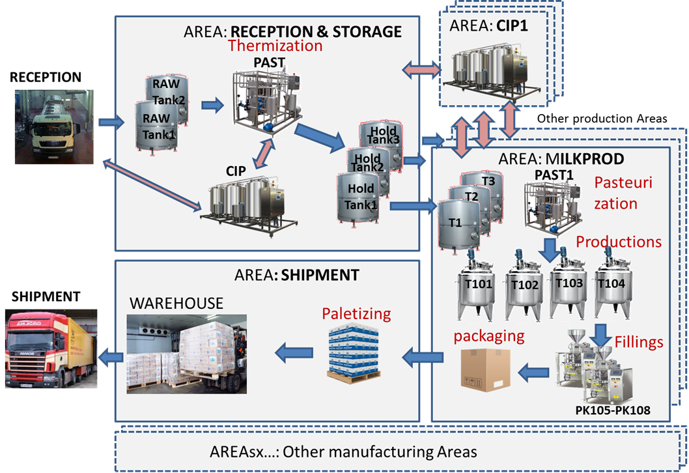

чернетка v0.1-16.11.20

# Приклад виконання розділів курсового проекту

## 1.Загальний опис виробничого майданчику

Завод «Happy Milk» виробляє різну молочну продукцію. Виробнича частина підприємства складається з різних виробничих і обслуговуючих виробництво цехів (див. Рис.1). Пунктиром виділені ті цеху підприємства, які не стосуються проекту. Бордовим кольором виділені назва процесів, що проробляються з матеріалами, чорним - використовуване обладнання. Нижче наведений перелік цехів та їх короткий опис.

### RECEPTION 

Сировина (сире молоко з ферм) надходить на підприємство в молоковозах. Перед відвантаженням сировина перевіряється в лабораторіях, після чого надходить на пост відвантаження в танки сирого молока RAW Tank1 і RAW Tank2.   

                                

рис.1. Спрощена схема матеріальних потоків виробничих потужностей  “Happy Milk”.

### Area: RECEPTION & STORAGE 

Молоко як сировина використовується для різних типів молочної продукції. Попередньо його потрібно очистити, термізувати, нормалізувати і обробити для тимчасового зберігання в танках. Оброблене молоко різної жирності зберігається в танках зберігання (holding tanks) звідки подається в інші цехи заводу. Цех включає в себе станцію CIP для мийки обладнання цеху а також молоковозів. Мийка обладнання - один з важливих процесів в будь-якому харчовому виробництві. Система керування виробництвом для Happy Milk включає тільки частину операцій для цеху RECEPTION & STORAGE.

### Area: MILKPROD

Цей цех призначений для виробництва продуктів з незбираного молока: молока і йогуртів різної жирності. Продукція розфасовується в різні види упаковок, після чого укладається в коробки, які передаються на склад. 

Оброблене і термізованое молоко певної жирності і складу надходить з цеху приймання в танки зберігання SU_T1..SU_T3, що знаходяться в зоні зберігання SZ_NOPAST1. При необхідності в молоко можуть додавати додаткові інгредієнти і вершки в залежності від вимог до сировини для конкретного продукту. Далі ця молочна суміш проходить через пастеризації установку WC_PAST1, де проходить процес пастеризації при заданих технологічних параметрах, визначених у рецепті продукту. Пастеризоване молоко (суміш) надходить в один або кілька танків для приготування WC_T101 ... WC_T104. У танках відбувається його охолодження, введення, при необхідності, визначеного в рецепті кількості мікроорганізмів (закваски), сквашування і, в деяких випадках, додаткова термічна обробка. Приготований продукт вивантажується з танків через охолоджувачі на розливні машини, в залежності від необхідної тари. Процес пастеризації відбувається одночасно із завантаженням, процес вивантаження одночасно з розливом. Розлита в тару продукція упаковується в коробки або поліетиленові блоки і подається транспортером на склад готової продукції.

рис.2. Спрощена схема матеріальних потоків цеху MilkProd

Крім цього цеху на підприємстві є й інші виробничі цехи, зокрема з виробництва сиру, масла, сухого молока. У проекті управління цим цехами не передбачається.

### Areas: CIPx 

Цей а також інші цехи CIP (Clean-in-place) призначені для приготування миючих розчинів, їх подачі під тиском на обладнання інших цехів, які потребують мийки і не мають власного робочого центру для підготовки мийних розчинів. Наявність декількох виробничих контурів дає можливість паралельного обслуговування декількох одиниць обладнання. У проекті не передбачається реалізація цього цеху.

### Area: SHIPMENT 

Це зона зберігання (склад) в якому упакована продукція вантажиться на палети і зберігається до моменту відвантаження.

### SHIPMENT 

Продукція зі складу відвантажується для перевезення.

### Інші цехи

Крім виробничих цехів, завод включає в себе обслуговуючі підрозділи, такі як цех КВП, цех механіків, цех електриків, лабораторія тощо. 

## 2. Технічна структура системи

У процесі розробки.

## 3. Процеси

Таблиця 1. Процеси

| Назва               | Тип          | Опис                                                         | Параметри                                                    |
| ------------------- | ------------ | ------------------------------------------------------------ | ------------------------------------------------------------ |
| Thermization        | Process      | Термізація. Для первинної обробки молока для попереднього збереження, включає в себе: термічну обробку за заданими параметрами, нормалізацію (доведення до необхідної жирності), гомогенізацію | задана температура, задана жирність                          |
| Milk  Production    | BatchProcess | Приготування молока. Включає в себе: охолодження молока, зберігання під час фасування. Приготування йде відповідно до рецептури. |                                                              |
| Yogurt Production   | BatchProcess | Приготування йогурту. Включає в себе: охолодження, сквашування, перемішування, зберігання під час фасування. Приготування йде відповідно до рецептури. | температура охолодження, час сквашування                     |
| Filling_bottle      | Process      | Наповнення в пляшки.                                         |                                                              |
| Filling_can         | Process      | Наповнення в банки.                                          |                                                              |
| Filling_tetrapack   | Process      | Наповнення в упаковки "тетрапак".                            |                                                              |
| Pasterization Milk1 | Process      | Пастеризація молока. Для термічної обробки молока для заданого типу продукту. | задана температура,  час витримки, задана температура охолодження |
| Paletizing          | Process      | Завантаження палет.                                          |                                                              |

## 4.Устатковання

Перелік цехів в межах виробничого майданчика наведений а п.1.

### 4.1.Робочі центри 

Таблиця 2. Робочі центри

| Цех                 | Робочий центр | Тип             | Од. вим. | Перелік процесів                    | Опис                                  | Продуктивність |
| ------------------- | ------------- | --------------- | -------- | ----------------------------------- | ------------------------------------- | -------------- |
| RECEPTION & STORAGE | WC_PAST       | Production Unit | літр     | Thermization                        | пастеризатор                          | 20000 л/год    |
| MilkProd            | WC_PAST1      | Production Unit | літр     | Pasterization Milk1                 | пастеризатор                          | 5000 л/год     |
| MilkProd            | WC_PK105      | Production Line | шт       | Filling_bottle                      | машина  фасування в пляшку            | 50 шт/хв       |
| MilkProd            | WC_PK106      | Production Line | шт       | Filling_tetrapack                   | машина  фасування в паперову упаковку | 70 шт/хв       |
| MilkProd            | WC_PK107      | Production Line | шт       | Filling_can                         | машина  фасування в банку             | 80 шт/хв       |
| MilkProd            | WC_PK108      | Production Line | шт       | Filling_bottle                      | машина  фасування в пляшку            | 50 шт/хв       |
| MilkProd            | WC_T101       | Process Cell    | літр     | MilkProduction    Yogurt Production | танк                                  | 1000 л/год     |
| MilkProd            | WC_T102       | Process Cell    | літр     | MilkProduction    Yogurt Production | танк                                  | 2000 л/год     |
| MilkProd            | WC_T103       | Process Cell    | літр     | MilkProduction    Yogurt Production | танк                                  | 2000 л/год     |
| MilkProd            | WC_T104       | Process Cell    | літр     | MilkProduction    Yogurt Production | танк                                  | 1500 л/год     |
| Shipment            | WC_PL109      | Production Line | шт       | Paletizing                          | складання в палети                    | 30 шт/год      |
| Shipment            | WC_PL110      | Production Line | шт       | Paletizing                          | складання в палети                    | 30 шт/год      |

### 4.2.Зони та вузли зберігання  

Таблиця 3. Вузли та зони зберігання

| Цех                 | Зона             | Вузол            | Тип                          | Од. вим | Опис                       | Місткість | Правило |
| ------------------- | ---------------- | ---------------- | ---------------------------- | ------- | -------------------------- | --------- | ------- |
| RECEPTION & STORAGE | Raw Tanks        | RAW Tank1        | Tank Storage Unit            | літр    | танки сирого молока        | 20000     | Пропорц |
| RECEPTION & STORAGE | Raw Tanks        | RAW Tank2        | Tank Storage Unit            | літр    | танки сирого молока        | 20000     | Пропорц |
| RECEPTION & STORAGE | Holding Tanks    | Holding Tank1    | Tank Storage Unit            | літр    | танки термізованого молока | 20000     | FIFO    |
| RECEPTION & STORAGE | Holding Tanks    | Holding Tank2    | Tank Storage Unit            | літр    | танки термізованого молока | 20000     | FIFO    |
| MilkProd            | Conv             | Conv1            | Simple Conveyer Storage Unit | шт      | конвеєр продукції          | 3000      | FIFO    |
| MilkProd            | SZ_NOPAST1       | SU_T1            | Tank Storage Unit            | літр    | танки сумішей              | 10000     | FIFO    |
| MilkProd            | SZ_NOPAST1       | SU_T2            | Tank Storage Unit            | літр    | танки сумішей              | 9000      | FIFO    |
| MilkProd            | SZ_NOPAST1       | SU_T3            | Tank Storage Unit            | літр    | танки сумішей              | 10000     | FIFO    |
| Shipment            | SZ_FinishedGoods | SU_FinishedGoods | BufferStorageUnit            | шт      | буфер зберігання продукції |           |         |

### 4.3.Звязок з системою керування АСКТП

#### 4.3.1. Загальний перелік Equipment

Таблиця 4. Перелік Equipment

| **Equipment** | Робочий центр | Опис | Вузол АСКТП |
| ------------- | ------------- | ---- | ----------- |
| EQ_PAST1      | WC_PAST1      |      |             |
| EQ_T101       | WC_T101       |      |             |
| EQ_T102       | WC_T102       |      |             |
| EQ_T103       | WC_T103       |      |             |
| EQ_T104       | WC_T104       |      |             |
| EQ_PK105      | WC_PK105      |      |             |
| EQ_PK106      | WC_PK106      |      |             |
| EQ_PK107      | WC_PK107      |      |             |
| EQ_PK108      | WC_PK108      |      |             |

#### 4.3.2.EQ_PAST1

##### 4.3.2.1. Зв'язок з АСКТП

Необхідні у функціях Momentum дані надходять від ПЛК, а значення параметрів процесу, команди диспетчерського управління, вибір рецепта від Momentum до ПЛК. Рішення за місцем щодо запуску в даному випадку приймає оператор установки з використанням операторської панелі HMI.

Принцип обміну показаний на прикладі EQ_PAST1 для пастеризаційної установки (рис.3). Зв'язок з обладнанням пастеризаційної установки здійснюється з використанням OPC UA. 

 

рис.3. Схема з'єднання з ПЛК 

##### 4.3.2.2. Перелік параметрів

| Назва  | Тип    | Опис                             | Призначення                                       | Тригер               |
| ------ | ------ | -------------------------------- | ------------------------------------------------- | -------------------- |
| STA    | uint32 | стан пастеризатора               | синхронізація з станом операції                   | -                    |
| ALM    | uint32 | набір бітів загальних тривог     | запис в базу, відображення                        | -                    |
| CMD    | uint32 | команда керування пастеризатором | керування запуском/зупинкою                       | старт/зупин операції |
| STEP   | uint32 | крок програми                    | запис в базу, відображення                        | -                    |
| RECIPE | uint32 | номер виконуваного рецепту       | керування, запис в базу, відображення             | старт операції       |
| FIQ1   | double | кількість на виході              | запис в базу, відображення, KPI                   | -                    |
| TT1    | double | температура на виході            | запис в базу, відображення, KPI, керування якістю | -                    |

##### 4.3.2.3. Опис параметрів стану та команд

Для керування та контролю за EQ_PAST1 використовується автомат стану ISA-88 (IEC-61512). На рисунку показаний це автомат станів. 

0 - ініціалізація (при старті ПЛК): це стан свідчить про зупинку ПЛК або його ініціалізацію.

1 - Idle: що операція не виконується.

13 - Starting: операція запускається (виконуються стартові кроки).

2 - Running: нормальне виконання операції.

14- Completing: виконується програма завершення операції.

8 - Complete (завершено): кінцевий стан нормального завершення. Після команди reset (наприклад від оператора) переходить в Idle.

3 - Pausing: перехід в паузу;

4 - Paused: знаходиться в паузі;

5 - Holding: перехід в утримання;

6 - Hold: стан свідчить про виконання програми тимчасового утримання виконання операції в зв\'язку з нештатною ситуацією (наприклад, відсутністю можливості вивантаження продукту);

7 - Restarting: перехід з утримання в нормальний режим роботи;

9 - Stopping: зупинка за запитом;

10 - Stopped (зупинено): зупинений на вимогу;

11 - Aborting (переривається): переривання виконання;

12 - Aborted (перерваний): швидке нештатне переривання виконання операції.

Таким чином значення: 8, 10, 12 свідчать про закінчення операції в обладнанні, що призводить до необхідності автоматичної реєстрації зупинки операції і в робочому центрі. 

Слово команди `CMD` слугує для відправки команд в систему керування пастеризатором: 1- команда запуску операції, 2 - команда зупинки.

##  5.Сегменти продукту

| Тип              | Назва                         | Код   | Од. вим | Опис | Перетв | Процес | Рецепт |
| ---------------- | ----------------------------- | ----- | ------- | ---- | ------ | ------ | ------ |
| Raw material     | unpasteurized milk            | RM101 |         |      |        |        |        |
| Intermediate     | thermized milk 3.2%           | IP124 |         |      |        |        |        |
| Intermediate     | thermized milk 2,5%           | IP113 |         |      |        |        |        |
| Intermediate     | thermized milk 1%             | IP103 |         |      |        |        |        |
| Raw material     | Sugar                         | RM126 |         |      |        |        |        |
| Raw material     | Ferment                       | RM125 |         |      |        |        |        |
| Packing material | bottle 1l                     | PM101 |         |      |        |        |        |
| Packing material | bottle 2l                     | PM102 |         |      |        |        |        |
| Packing material | tetra pack 1l                 | PM103 |         |      |        |        |        |
| Packing material | can 0,5l                      | PM104 |         |      |        |        |        |
| Intermediate     | Yogurt 3,2%                   | IP123 |         |      |        |        |        |
| Intermediate     | cooled milk 3,2%              | IP122 |         |      |        |        |        |
| Intermediate     | cooled milk 2,5%              | IP112 |         |      |        |        |        |
| Intermediate     | pasteurized milk  3,2%        | IP121 |         |      |        |        |        |
| Intermediate     | pasteurized milk  2,5%        | IP111 |         |      |        |        |        |
| Intermediate     | thermized milk 3.2%           | IP124 |         |      |        |        |        |
| Intermediate     | thermized milk 2,5%           | IP113 |         |      |        |        |        |
| Intermediate     | thermized milk 1%             | IP103 |         |      |        |        |        |
| Intermediate     | cooled milk 1%                | IP102 |         |      |        |        |        |
| Intermediate     | pasteurized milk 1%           | IP101 |         |      |        |        |        |
| Consumer unit    | packed yogurt 3,2%  C0,5L     | CU126 |         |      |        |        |        |
| Consumer unit    | packed yogurt 3,2%  TP1L      | CU125 |         |      |        |        |        |
| Consumer unit    | packed milk 3,2%  TP1L        | CU123 |         |      |        |        |        |
| Consumer unit    | packed milk 3,2%  B1L         | CU121 |         |      |        |        |        |
| Consumer unit    | packed milk 3,2%  B2L         | CU122 |         |      |        |        |        |
| Consumer unit    | packed milk 1% B2L            | CU102 |         |      |        |        |        |
| Consumer unit    | packed milk 1% TP1L           | CU103 |         |      |        |        |        |
| Consumer unit    | packed milk 2,5%  TP1L        | CU113 |         |      |        |        |        |
| Consumer unit    | packed milk 2,5%  B2L         | CU112 |         |      |        |        |        |
| Consumer unit    | packed milk 2,5%  B1L         | CU111 |         |      |        |        |        |
| Consumer unit    | packed milk 1% B1L            | CU101 |         |      |        |        |        |
| Packing material | Carton Box                    | PM105 |         |      |        |        |        |
| Sales unit       | Carton Box with  milk TP1L 1% | SU100 |         |      |        |        |        |

 