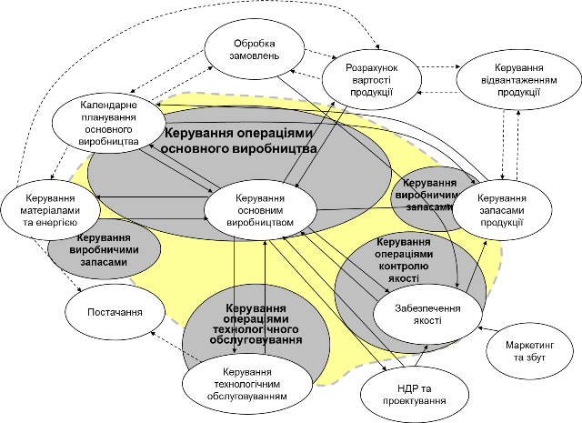
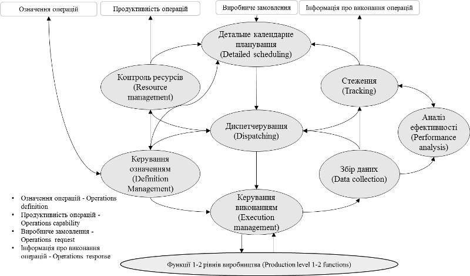
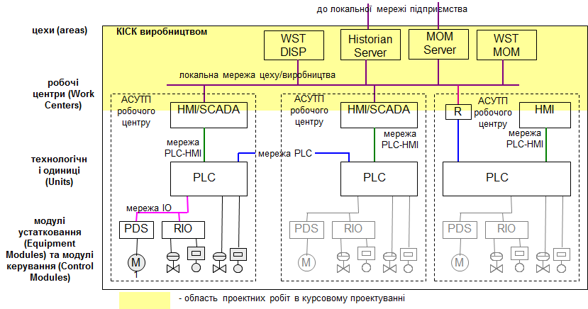
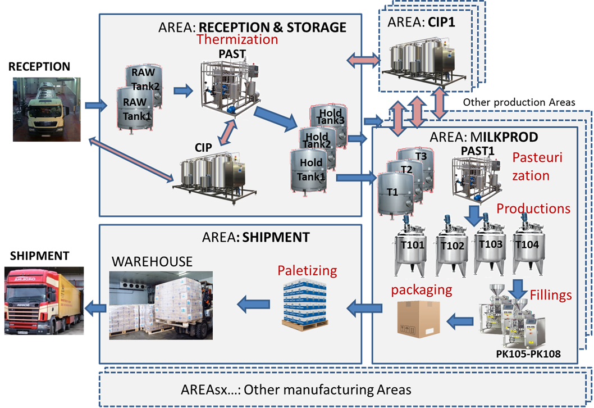
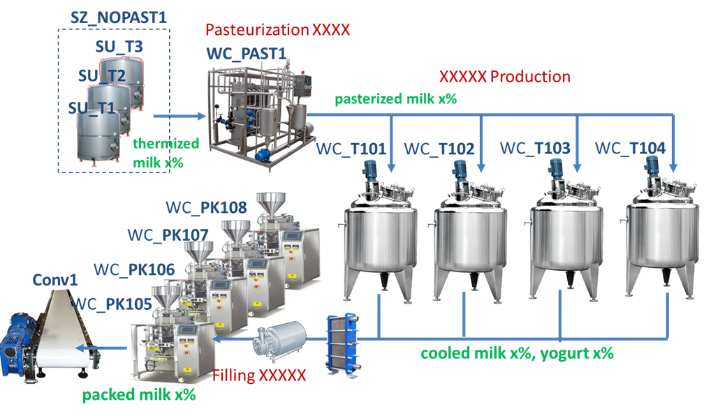
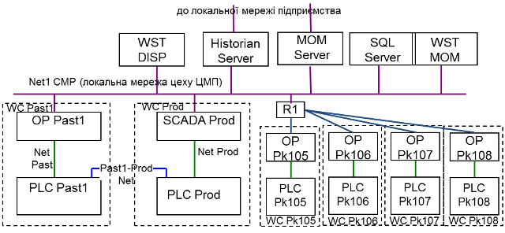
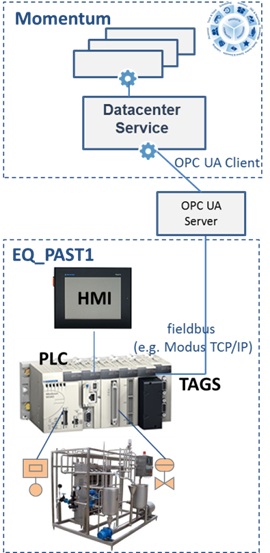
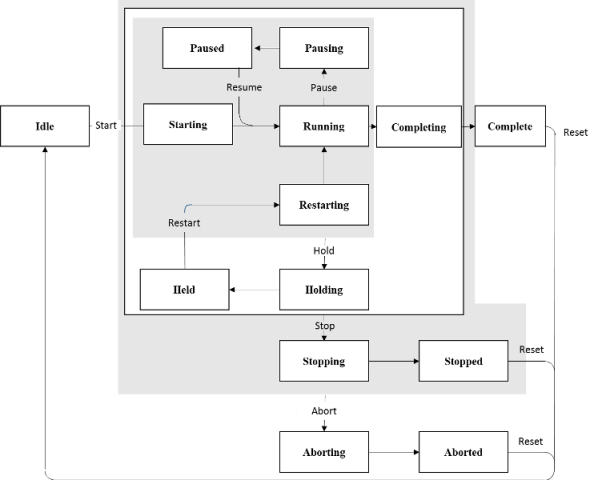
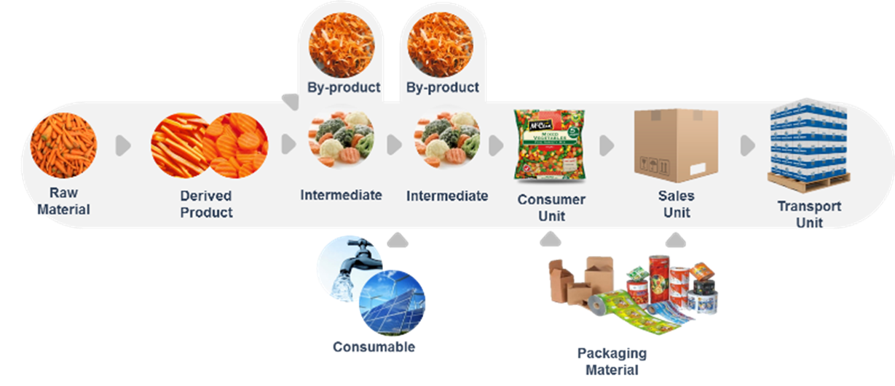

# Методичні вказівки до виконання курсової роботи

Укладачі: Олександр Пупена, Олег Клименко 

## Вступ

Метою дисципліни Автоматизація промислових виробництв є засвоєння принципів побудови інтегрованих автоматизованих систем керування виробництвом, вивчення та опрацювання стандартів IEC 62264 та сучасних підходів побудови MES/MOM-систем. Предметом дисципліни є принципи та методи побудови автоматизованих систем керування виробництвом, принципи розробки прикладного програмного забезпечення для засобів промислової автоматизації та MES/MOM для реалізації функцій керування виробництвом. 

Для здобуття компетентностей по розробці систем MOM здобувачі повинні прийняти участь в різноманітних процесах передпроектних, проектних та розроблювальних стадій життєвого циклу цих систем. Компетентності по розробленню систем MOM здобувачі отримують, виконуючи лабораторні роботи в програмному середовищі одного з постачальників. Паралельно з опануванням матеріалів лекційного курсу це дає можливість зрозуміти призначення та можливості реалізацій основних функцій MOM у керуванню виробничими операціями (див. виділено жовтим кольором на рис.1):

- ***виготовлення продукції*** (Production), яке також називається ***основне виробництво***
- ***технічному обслуговуванню устатковання*** (Maintenance), зокрема ремонти, діагностування і т.п.;
- ***керуванню якістю*** (Quality), зокрема проведення аналізів матеріалів, перевірка відповідності стандартам і т.п.;
- ***керуванню запасами*** (Inventory), зокрема постачання сировини, логістика і т.п.;

 

рис.1. Області діяльності MOM

У той же час курсова робота дає можливість зосередитися на проектній діяльності. 

Таким чином ***метою курсової роботи*** є закріплення студентами знань про зміст і послідовність та набуття вмінь створення технічного проекту для автоматизованої системи керування виробничими операціями.  Оволодіння технікою проектування виробничими операціями є одним із основних завдань вивчення дисципліни "Автоматизація промислових виробництв". Успішне виконання курсової роботи сприятиме закріпленню та поглибленню знань, отриманих у процесі вивчення дисципліни, набуттю навичок виконання підготовчих робіт для розробки проекту для програмних засобів класу MES/MOM.

Згідно стандарту IEC 62264 для кожної, з категорій виробничих операцій, означена модель діяльностей (функцій). Це означає, що керування кожною з операцій зводиться до виконання наступних взаємопов’язаних діяльностей (рис.2):

- керування означенням проведення операції;
- контроль ресурсів; 
- детальне календарне планування;
- диспетчерування;
- керування виконанням операції;
- збір даних про операцію;
- стеження за виконанням операції; 
- аналіз ефективності операції.

Лінії зі стрілками на рис.2 вказують на інформаційні потоки між діяльностями. 

                               

 Рис.2 Загальна модель діяльностей керування виробничими операціями

Узагальнена модель керування операціями використовується як шаблон для означення аналогічної моделі для ***керування основним виробництвом*** (Production), ***технічним обслуговуванням*** (Maintenance), ***контролем якості*** (Quality) та ***виробничими запасами*** (Inventory). Цикл керування операцією відбувається у наступній послідовності:

- формування інформації про доступні ресурси для виконання операцій за запитом з 4-го рівня (згідно стандарту);
- отримання з 4-го рівня виробничого замовлення;
- проведення детального планування відповідно до виробничого замовлення, означення операції та доступних ресурсів;
- диспетчерування робіт відповідно до детального календарного плану (видача завдань, підготовка робочих центрів);   
- керування виконанням робіт;
- збір даних про виконання робіт;
- формування звітності про виконання операції.

Передбачається, що у курсовій роботі здобувач приділить увагу проектним роботам для створення вимог та необхідних проектних артефактів по зазначеним діяльностям в межах однієї або кількох категорій операцій.       

## 1. Тематика курсових робіт та порядок видачі завдання

***Завдання до курсової роботи*** формується за такими шаблонами: 

- Розробка проекту автоматизованої системи керування операціями виготовлення продукції *вказується виробництво*
- Розробка проекту автоматизованої системи керування операціями обслуговування ус*вказується виробництво*
- Розробка проекту автоматизованої системи керування операціями контролю якості *вказується виробництво*

Приклади: 

- Розробка проекту автоматизованої системи керування виготовленням цільномолочної продукції молочного виробництва
- Розробка проекту автоматизованої системи керування операціями обслуговування устаткованняцементного виробництва.
- Розробка проекту автоматизованої системи керування операціями контролю якості виробництва комбікорму.  

Надалі в даних методичних рекомендаціях розглядаються тільки проектні роботи для курсової роботи за першим типом шаблону. Для інших типів шаблону структура та вимоги розглядаються індивідуально. 

При формуванні теми здобувач може вибрати виробництво за одним із наступних критеріїв:

- яке йому найбільш знайоме
- до якого є доступ і можна познайомитися
- яке цікавить з точки зору майбутнього впровадження

При цьому, вибране основне виробництво повинно включати як мінімум один цех з повним виробничими циклом від сировини до готової продукції.

## 2. Зміст курсової роботи та послідовність виконання

На рис.3 показана типова структура комп'ютерно-інтегрованої системи керування (КІСК) виробництвом, на якій жовтим кольором виділена область діяльності в курсовій роботі. Процеси проектування та розроблення АСУТП розглядалися в дисциплінах бакалаврського рівня, тому курсова робота передбачає наявність у здобувачів відповідних для цього компетентностей. У курсовій роботі проектна діяльність зосереджена на рівні керування виробничими операціями (КІСК виробництвом), а саме в області діяльності робочих центрів, та цехів.    




Рис.3. Область проектних робіт в курсовому проектуванні в контексті типової структури КІСУ виробництвом

Основна діяльність в курсовій роботі що вибрана за шаблоном керування основного виробництва (виготовлення продукції) зосереджується на рівні одного виробничого підрозділу рівня цеху, якщо інше не оговорено в завданні. В межах цього підрозділу необхідно описати моделі усіх ресурсів та зв'язки між ними. 

Структура курсової роботи за шаблоном керування основного виробництва (виготовлення продукції) включає такі розділи:

```
Вступ.
1.Загальний опис виробничого майданчику 
2.Технічна структура системи 
3.Сегменти процесів
4.Устатковання
	4.1.Робочі центри 
	4.2.Зони та вузли зберігання
	4.3.Нижні рівні Equipment
5.Сегменти продукту
6.Ключові показники ефективності 
```

У таблиці 1 наведений орієнтовний календарний графік виконання курсової роботи.

Таблиця 1. Календарний графік виконання курсової роботи

| Опис робіт                                                   | Терміни виконання (тижні семестру) | Примітки |
| ------------------------------------------------------------ | ---------------------------------- | -------- |
| Вибір об'єкта. Формування теми роботи.                       | 1,2                                |          |
| Визначення виробничої структури виробничого майданчика, номенклатури продукції, робочих центрів, технологічних процесів, матеріальних потоків. Розділ "Загальний опис виробничого майданчику." | 3,4                                |          |
| Визначення варіанту інтеграції та технічної структури. Розділ  "Технічна структура". Уточнення процесів. Розділ "Сегменти процесів" | 5,6                                |          |
| Деталізація робочих центрів, зон та вузлів зберігання. Визначення параметрів для устатковання інших рівнів. Опис обміну даними. Формування автомату станів для устатковання. Розділ "Устатковання". | 7,8                                |          |
| Означення структури продуктів, сегментів продуктів. Розділ "Сегменти продукту". | 9,10                               |          |
| Вибір та означення ключових показників ефективності. Розділ "Ключові показники ефективності". | 11,12                              |          |
| Доробка проекту. Передзахист.                                | 13 -16                             |          |
| Захист проекту.                                              | 17, 18                             |          |

Після вибору варіанту, здобувач повинен детально ознайомитися з виробничими операціями, які відбуваються на виробничому підприємстві. Зокрема необхідно визначитися з:

- виробничою структурою виробничого майданчика, тобто поділ на виробничі підрозділи
- номенклатурою продукції які випускає виробничий структурний підрозділ, наприклад цех
- кількістю і типом робочих місць та устаткованнядля виконання виробничих операцій в межах вибраного цеху, тобто робочих центрів
- перелік та типи технологічних процесів (неперервний, порційний, дискретний) , що можуть виконуватися на кожному з робочих центрів, параметри процесів (температури, тривалість і т.п.) 
- слідуванням матеріальних потоків, що використовуються в межах цеху та поза ними:
  - спосіб переміщення матеріалів
  - процеси що використовуються для створення продукту/напівпродукту
  - кількісна оцінка матеріалів
  - рецептура створення продукту/напівпродукту (пропорції різних матеріалів) 
- способом, місцем приймання і зберігання сировини
- способом, місцем вивантаження і зберігання готового продукту
- способом, місцем зберігання напівпродуктів

Далі відповідно до таблиці 1 ідуть робити над кожним розділом проекту. Враховуючи ітераційність робіт, в таблиці вказано тільки розробку першого варіанту відповідного розділу. 

## 3. Вказівки до виконання окремих розділів роботи

### 3.1. Вступна частина та список використаних джерел

У вступі необхідно коротко описати про виробничий об'єкт та цілі створення системи керування виробничими операціями. Зокрема треба описати призначення системи та функції, які планується автоматизувати. Також у вступній частині необхідно вказати можливе ПЗ для реалізації системи.

У списку використаних джерел необхідно вказати:

- навчальну літературу, яка використовувалася при вивченні дисципліни
- перелік джерел з яких бралася інформація про об'єкт автоматизації
- перелік додаткових джерел. що використовувалися при написанні курсової роботи
- перелік стандартів, які передбачається використовувати у новоствореній системі та на які є посилання в роботі

### 3.2. Загальний опис виробничого майданчику 

У загальному описі виробничого майданчику необхідно описати виробничий майданчик з точки зору:

- переліку продукції, що виготовляється
- виробничої структури у вигляді ієрархії устатковання (Equipment) відповідно до стандартів ISA-95/IEC-62264:
  - перелік виробничих підрозділів типу цех (Area)
  - перелік робочих центрів (Work Centers) в межах виробничих підрозділів, на яких зосереджується курсова робота
  - перелік зон зберігання (Storage Units) межах виробничих підрозділів, на яких зосереджується курсова робота
- укрупнені виробничі потоки в межах виробничого майданчику (міжцехові) від приймання сировини до вивантаження готової продукції з описом задіяних процесів
- деталізовані виробничі потоки в межах виробничих підрозділів, на яких зосереджується курсова робота
- перелік процесів в межах кожного робочого центру  

Опис повинен супроводжуватися схемами на яких зображені матеріальні потоки та виробничі підрозділи. Приклад виконання показаний нижче.  

#### Приклад 

Завод «Happy Milk» виробляє різну молочну продукцію. Виробнича частина підприємства складається з різних виробничих і обслуговуючих виробництво цехів (див. Рис.4). Пунктиром виділені ті цехи підприємства, які не стосуються проекту. Бордовим кольором виділені назва процесів, що проробляються з матеріалами, чорним - використовуване устатковання. Нижче наведений перелік цехів та їх короткий опис.

**RECEPTION** 

Сировина (сире молоко з ферм) надходить на підприємство в молоковозах. Перед відвантаженням сировина перевіряється в лабораторіях, після чого надходить на пост відвантаження в танки сирого молока RAW Tank1 і RAW Tank2.   

                                

рис.4. Спрощена схема матеріальних потоків виробничих потужностей  “Happy Milk”.

**Area: RECEPTION & STORAGE** 

Молоко як сировина використовується для різних типів молочної продукції. Попередньо його потрібно очистити, термізувати, нормалізувати і обробити для тимчасового зберігання в танках. Оброблене молоко різної жирності зберігається в танках зберігання (holding tanks) звідки подається в інші цехи заводу. Цех включає в себе станцію CIP для мийки устатковання цеху а також молоковозів. Мийка устатковання - один з важливих процесів в будь-якому харчовому виробництві. Система керування виробництвом для Happy Milk включає тільки частину операцій для цеху RECEPTION & STORAGE.

**Area: MILKPROD**

Цей цех призначений для виробництва продуктів з незбираного молока: молока і йогуртів різної жирності. Продукція розфасовується в різні види упаковок, після чого укладається в коробки, які передаються на склад. 

Оброблене і термізованое молоко певної жирності і складу надходить з цеху приймання в танки зберігання SU_T1..SU_T3, що знаходяться в зоні зберігання SZ_NOPAST1. При необхідності в молоко можуть додавати додаткові інгредієнти і вершки в залежності від вимог до сировини для конкретного продукту. Далі ця молочна суміш проходить через пастеризації установку WC_PAST1, де проходить процес пастеризації при заданих технологічних параметрах, визначених у рецепті продукту. Пастеризоване молоко (суміш) надходить в один або кілька танків для приготування WC_T101 ... WC_T104. У танках відбувається його охолодження, введення, при необхідності, визначеного в рецепті кількості мікроорганізмів (закваски), сквашування і, в деяких випадках, додаткова термічна обробка. Приготований продукт вивантажується з танків через охолоджувачі на розливні машини, в залежності від необхідної тари. Процес пастеризації відбувається одночасно із завантаженням, процес вивантаження одночасно з розливом. Розлита в тару продукція упаковується в коробки або поліетиленові блоки і подається транспортером на склад готової продукції.



рис.5. Спрощена схема матеріальних потоків цеху MilkProd

Крім цього цеху на підприємстві є й інші виробничі цехи, зокрема з виробництва сиру, масла, сухого молока. У проекті управління цим цехами не передбачається.

**Areas: CIPx** 

Цей а також інші цехи CIP (Clean-in-place) призначені для приготування миючих розчинів, їх подачі під тиском на устатковання інших цехів, які потребують мийки і не мають власного робочого центру для підготовки мийних розчинів. Наявність декількох виробничих контурів дає можливість паралельного обслуговування декількох одиниць устатковання. У проекті не передбачається реалізація цього цеху.

**Area: SHIPMENT** 

Це зона зберігання (склад) в якому упакована продукція вантажиться на палети і зберігається до моменту відвантаження.

**SHIPMENT** 

Продукція зі складу відвантажується для перевезення.

**Інші цехи**

Крім виробничих цехів, завод включає в себе обслуговуючі підрозділи, такі як цех КВП, цех механіків, цех електриків, лабораторія тощо. 

### 3.3. Технічна структура системи

Розробка технічної структури (також відома як структура комплексу технічних засобів КТС) передбачає:

- вибір промислових та комп’ютерних мереж, на базі яких проводиться технічна інтеграція засобів;
- створення мережної структури, в якій технічні засоби є вузлами мережі;
- вибір мережного устатковання (комунікаційні модулі, карти) для всіх мережних вузлів;
- вибір мережних складових з функціями перетворення: репітерів, концентраторів, комутаторів, маршрутизаторів та шлюзів.   

На рівні MES/MOM класичними вузлами є комп'ютери та комунікаційне устатковання. Комп'ютери використовуються як для виконання серверних застосунків і для робочих станцій. У даній курсовій роботі увага приділяється саме ПЗ рівня MES/MOM, тому комп'ютери для виконання інших завдань в структурі КТС можуть не показуватися.     

Процес створення структури КТС може мати ітераційний характер. Спочатку проводиться аналіз функціональної структури, характер і напрямки інформаційних потоків між вузлами, оцінюється інформаційне навантаження. У випадку побудови MES/MOM інтегрування з нижнім рівнем (АСУТП) може проводитися за різними стратегіями, зокрема (але не виключено):

- пряме підключення серверів MES/MOM до пристроїв збору даних рівня АСУТП, зкорема ПЛК або SCADA/HMI
- з використанням проміжних серверів збору, обробки та зберігання виробничих даних, так званих Historian
- з використанням різноманітних мережних шлюзів та шлюзів IIoT 

**Пряме підключення до АСУТП.** Цей варіант можливий у випадку, якщо MOM-сервери і ПЛК чи SCADA/HMI сумісні по інтерфейсам. Наприклад:

- MOM підтримує OPC-DA клієнтський інтерфейс, через який можна підключитися до OPC-серверів з відповідними драйверами
- MOM підтримує OPC-UA або OPC-DA клієнтський інтерфейс, який також реалізує SCADA/HMI
- MOM підтримує OPC-UA клієнтський інтерфейс, який також реалізує ПЛК 

**Інтеграція через Historian.** Інтегрування АСКТП з рівнем MOM значно полегшує наявність єдиної інформаційної платформи виробництва, що базується на єдиному сховищі даних (централізованому або розподіленому). Засоби MOM можуть постачатися такими сховищами, але часто вони мають обмежене застосування для глибокого аналізу даних. Крім того, велика кількість даних із пристроїв не збирається засобами SCADA/HMI і навіть ПЛК, оскільки не потребуються в завданнях АСКТП, але потрібні в завданнях MOM та глибокому аналізі даних. Наприклад, у перетворювачах частоти є велика кількість даних про плинний стан двигуна, статистиці тривог і т. п. Для ПЛК та SCADA/HMI ця інформація надлишкова, бо не використовується через необхідність статистичного аналізу, який на цьому рівні відсутній. Але ці дані могли б бути використані в інших типах застосунків для аналізу ефективності устатковання та предиктивного обслуговування. Спеціалізовані системи керування базами даних, які, з одного боку, поєднують функції серверів введення/виведення, трендів та тривог, а з іншого – надають стандартизовані інтерфейси для інших застосунків (клієнтів) від різних виробників прийнято називати Historian (також відомий як Data Historian, Plant Historian, Process Historian). Це система архівування даних, призначена для збирання, зберігання, оброблення та надання часово-базисної інформації з різних джерел даних великого обсягу та з високою швидкістю. У випадку використання Historian, інтеграція MOM з ним може також відбуватися через OPC UA або HTTP API.   

**Інтеграція через шлюзи.** Інтеграція через OPC-сервери наведена вище може бути реалізована аналогічно через програмно-апаратні шлюзи. У цьому випадку система збору даних може бути розподіленою, і передбачати наявність кількох шлюзів, які з одного боку підключаються до пристроїв через пропрієтарні або відкриті протоколи промислових мереж, а з іншого через доступні в MOM-сервері протоколи.  

У курсовій роботі можна використовувати один з наведених вище способів реалізації або комбінувати їх. Необхідно навести технічну структуру у вигляді схеми КТС та описати її. У описі вказати:

- технічні характеристики кожного вузла (комп'ютера, шлюза, тощо)
- основне спеціалізоване ПЗ, яке виконується на кожному вузлі, наприклад: MOM Server, MS SQL Setver, Historian, MOM Web Client і т.п.
- спосіб інтеграції:
  - протоколи та апаратні засоби промислових мереж
  - проміжне ПЗ, призначене для інтегрування, наприклад OPC Server з описом
  - драйвери  

Мережна структура відображається графічно на структурній схемі КТС. До схеми у вигляді окремого документу додається перелік елементів ТЗА (мережних вузлів). Структурну схему КТС рекомендується зображати зі збереженням функціональної ієрархічності рівнів управління відповідно до схеми функціональної структури. Схема повинна містити інформацію про засоби (комунікаційні карти, модулі) та порти, через які кожен вузол підключається до загальної мережі а також додаткові перетворювачі. Приклад структурної схеми показаний на рис.6, фрагмент прикладу переліку елементів ТЗА наведений в таб. 2. 

Таблиця 2. Відомість мережних технічних засобів (фрагмент.

| Позначення | Найменування                                                 | Примітка                     |
| ---------- | ------------------------------------------------------------ | ---------------------------- |
| OP Past1   | Операторська панель пастеризаційно-охолоджувальної установки (ПОУ) Siemens SIMATIC HMI TP900 COMFORT | має вбудований OPC UA Server |
| PLC Past1  | ПЛК ПОУ Simatic S7-1500                                      | має вбудований OPC UA Server |
| ...        |                                                              |                              |



Рис.6.Структурна схема КТС 

### 3.4. Сегменти процесів

У даному розділі необхідно навести переліки сегментів процесів та їх опис. У описі необхідно вказати назви сегментів процесів, їх опис та перелік параметрів. Приклад сегментів процесів наведений в таблиці 3.

Таблиця 3. Приклад сегментів процесів

| Назва               | Тип          | Опис                                                         | Параметри                                                    |
| ------------------- | ------------ | ------------------------------------------------------------ | ------------------------------------------------------------ |
| Thermization        | Process      | Термізація. Для первинної обробки молока для попереднього збереження, включає в себе: термічну обробку за заданими параметрами, нормалізацію (доведення до необхідної жирності), гомогенізацію | задана температура, задана жирність                          |
| Milk  Production    | BatchProcess | Приготування молока. Включає в себе: охолодження молока, зберігання під час фасування. Приготування йде відповідно до рецептури. |                                                              |
| Yogurt Production   | BatchProcess | Приготування йогурту. Включає в себе: охолодження, сквашування, перемішування, зберігання під час фасування. Приготування йде відповідно до рецептури. | температура охолодження, час сквашування                     |
| Filling_bottle      | Process      | Наповнення в пляшки.                                         |                                                              |
| Filling_can         | Process      | Наповнення в банки.                                          |                                                              |
| Filling_tetrapack   | Process      | Наповнення в упаковки "тетрапак".                            |                                                              |
| Pasterization Milk1 | Process      | Пастеризація молока. Для термічної обробки молока для заданого типу продукту. | задана температура,  час витримки, задана температура охолодження |
| Paletizing          | Process      | Завантаження палет.                                          |                                                              |

### 3.5. Устатковання

У цьому розділі наводиться перелік устатковання (Equipment) та його опис. Оскільки загальна структура виробничого майданчику наведена у іншому підрозділі (див. 3.2) тут приводяться уже конкретні властивості устатковання, які потрібні для моделювання відповідних ресурсів. Устатковання варто описувати в окремих підпунктах, згрупованих за рівнем та за призначенням. Зокрема, можна виділити кілька підпунктів:

- виробничі робочі центри (Work Center): вказується розташування (цех), тип процесу, одиниці вимірювання, перелік сегментів процесів які реалізує, продуктивність, кількість операторів на зміну;  
- технологічні вузли (Work Unit) в межах кожного робочого центра, якщо планується їх виділяти в межах MOM: вказується розташування (робочий центр), можливі технологічні операції, продуктивність/ємність, клас (якщо існує);    
- зони зберігання (Storage zone) та вузли зберігання (Strogae Unit):розміщення, ємність, додаткові характеристи;
- нижні рівні устатковання (Equipment), якщо планується їх означення в MOM: вимірювальні параметри, спосіб інтеграції з вказівкою джерела даних, опис автоматів станів  

Нижче наведений приклад опису устатковання з використанням ПЗ Momentum.

#### Приклад 

**Робочі центри** 

Таблиця 4. Робочі центри

| Цех                 | Робочий центр | Тип             | Од. вим. | Перелік процесів                    | Опис                                  | Продуктивність |
| ------------------- | ------------- | --------------- | -------- | ----------------------------------- | ------------------------------------- | -------------- |
| RECEPTION & STORAGE | WC_PAST       | Production Unit | літр     | Thermization                        | пастеризатор                          | 20000 л/год    |
| MilkProd            | WC_PAST1      | Production Unit | літр     | Pasterization Milk1                 | пастеризатор                          | 5000 л/год     |
| MilkProd            | WC_PK105      | Production Line | шт       | Filling_bottle                      | машина  фасування в пляшку            | 50 шт/хв       |
| MilkProd            | WC_PK106      | Production Line | шт       | Filling_tetrapack                   | машина  фасування в паперову упаковку | 70 шт/хв       |
| MilkProd            | WC_PK107      | Production Line | шт       | Filling_can                         | машина  фасування в банку             | 80 шт/хв       |
| MilkProd            | WC_PK108      | Production Line | шт       | Filling_bottle                      | машина  фасування в пляшку            | 50 шт/хв       |
| MilkProd            | WC_T101       | Process Cell    | літр     | MilkProduction    Yogurt Production | танк                                  | 1000 л/год     |
| MilkProd            | WC_T102       | Process Cell    | літр     | MilkProduction    Yogurt Production | танк                                  | 2000 л/год     |
| MilkProd            | WC_T103       | Process Cell    | літр     | MilkProduction    Yogurt Production | танк                                  | 2000 л/год     |
| MilkProd            | WC_T104       | Process Cell    | літр     | MilkProduction    Yogurt Production | танк                                  | 1500 л/год     |
| Shipment            | WC_PL109      | Production Line | шт       | Paletizing                          | складання в палети                    | 30 шт/год      |
| Shipment            | WC_PL110      | Production Line | шт       | Paletizing                          | складання в палети                    | 30 шт/год      |

**Зони та вузли зберігання**  

Таблиця 5. Вузли та зони зберігання

| Цех                 | Зона             | Вузол            | Тип                          | Од. вим | Опис                       | Місткість | Правило |
| ------------------- | ---------------- | ---------------- | ---------------------------- | ------- | -------------------------- | --------- | ------- |
| RECEPTION & STORAGE | Raw Tanks        | RAW Tank1        | Tank Storage Unit            | літр    | танки сирого молока        | 20000     | Пропорц |
| RECEPTION & STORAGE | Raw Tanks        | RAW Tank2        | Tank Storage Unit            | літр    | танки сирого молока        | 20000     | Пропорц |
| RECEPTION & STORAGE | Holding Tanks    | Holding Tank1    | Tank Storage Unit            | літр    | танки термізованого молока | 20000     | FIFO    |
| RECEPTION & STORAGE | Holding Tanks    | Holding Tank2    | Tank Storage Unit            | літр    | танки термізованого молока | 20000     | FIFO    |
| MilkProd            | Conv             | Conv1            | Simple Conveyer Storage Unit | шт      | конвеєр продукції          | 3000      | FIFO    |
| MilkProd            | SZ_NOPAST1       | SU_T1            | Tank Storage Unit            | літр    | танки сумішей              | 10000     | FIFO    |
| MilkProd            | SZ_NOPAST1       | SU_T2            | Tank Storage Unit            | літр    | танки сумішей              | 9000      | FIFO    |
| MilkProd            | SZ_NOPAST1       | SU_T3            | Tank Storage Unit            | літр    | танки сумішей              | 10000     | FIFO    |
| Shipment            | SZ_FinishedGoods | SU_FinishedGoods | BufferStorageUnit            | шт      | буфер зберігання продукції |           |         |

**Нижні рівні устатковання**

Таблиця 6. Перелік Equipment

| **Equipment** | Робочий центр | Опис                   | Вузол АСКТП |
| ------------- | ------------- | ---------------------- | ----------- |
| EQ_PAST1      | WC_PAST1      | Unit неперервного типу | PLC Past1   |
| EQ_T101       | WC_T101       | Batch Unit             | PLC Prod    |
| EQ_T102       | WC_T102       | Batch Unit             | PLC Prod    |
| EQ_T103       | WC_T103       | Batch Unit             | PLC Prod    |
| EQ_T104       | WC_T104       | Batch Unit             | PLC Prod    |
| EQ_PK105      | WC_PK105      | Machine                | PLC PK105   |
| EQ_PK106      | WC_PK106      | Machine                | PLC PK106   |
| EQ_PK107      | WC_PK107      | Machine                | PLC PK107   |
| EQ_PK108      | WC_PK108      | Machine                | PLC PK108   |

**Обмін даними для EQ_PAST1**

Необхідні у функціях Momentum дані надходять від ПЛК, а значення параметрів процесу, команди диспетчерського управління, вибір рецепта від Momentum до ПЛК. Рішення за місцем щодо запуску в даному випадку приймає оператор установки з використанням операторської панелі HMI.

Принцип обміну показаний на прикладі EQ_PAST1 для пастеризаційної установки (рис.7). Зв'язок з устаткованням пастеризаційної установки здійснюється з використанням OPC UA. 

 

рис.7. Схема з'єднання з ПЛК 

Таблиця 7. Перелік параметрів для EQ_PAST1

| Назва  | Тип    | Опис                             | Призначення                                       | Тригер               |
| ------ | ------ | -------------------------------- | ------------------------------------------------- | -------------------- |
| STA    | uint32 | стан пастеризатора               | синхронізація з станом операції                   | -                    |
| ALM    | uint32 | набір бітів загальних тривог     | запис в базу, відображення                        | -                    |
| CMD    | uint32 | команда керування пастеризатором | керування запуском/зупинкою                       | старт/зупин операції |
| STEP   | uint32 | крок програми                    | запис в базу, відображення                        | -                    |
| RECIPE | uint32 | номер виконуваного рецепту       | керування, запис в базу, відображення             | старт операції       |
| FIQ1   | double | кількість на виході              | запис в базу, відображення, KPI                   | -                    |
| TT1    | double | температура на виході            | запис в базу, відображення, KPI, керування якістю | -                    |

**Опис параметрів стану та команд для EQ_PAST1**

Для керування та контролю за EQ_PAST1 використовується автомат стану ISA-88 (IEC-61512). На рис.8 показаний автомат станів. 



рис.8. Автомат станів для операції EQ_PAST1. 

0 - ініціалізація (при старті ПЛК): це стан свідчить про зупинку ПЛК або його ініціалізацію.

1 - Idle: що операція не виконується.

13 - Starting: операція запускається (виконуються стартові кроки).

2 - Running: нормальне виконання операції.

14- Completing: виконується програма завершення операції.

8 - Complete (завершено): кінцевий стан нормального завершення. Після команди reset (наприклад від оператора) переходить в Idle.

3 - Pausing: перехід в паузу;

4 - Paused: знаходиться в паузі;

5 - Holding: перехід в утримання;

6 - Hold: стан свідчить про виконання програми тимчасового утримання виконання операції в зв\'язку з нештатною ситуацією (наприклад, відсутністю можливості вивантаження продукту);

7 - Restarting: перехід з утримання в нормальний режим роботи;

9 - Stopping: зупинка за запитом;

10 - Stopped (зупинено): зупинений на вимогу;

11 - Aborting (переривається): переривання виконання;

12 - Aborted (перерваний): швидке нештатне переривання виконання операції.

Таким чином значення: 8, 10, 12 свідчать про закінчення операції в обладнанні, що призводить до необхідності автоматичної реєстрації зупинки операції і в робочому центрі. 

Слово команди `CMD` слугує для відправки команд в систему керування пастеризатором: 1- команда запуску операції, 2 - команда зупинки.  

### 3.6. Сегменти продукту

У даному розділі необхідно навести перелік сегментів продукту з їх описом. Також варто навести структуру очікуваних продуктів у вигляді схеми, наприклад так, як показано на рис.9. При цьому треба вказувати конкретні назви сегментів продуктів.



рис.9. Орієнтовна схема для відображення діаграми структури продуктів. 

У таблиці 8 наведений приклад опису сегментів продуктів.

Таблиця 8. Опис сегментів продуктів

| **Тип**          | **Назва**                    | **Код** | **Од.  вим** | **Перетв**              | **Процес**          | **Рецепт**          | **Упаковка** |
| ---------------- | ---------------------------- | ------- | ------------ | ----------------------- | ------------------- | ------------------- | ------------ |
| Raw material     | unpasteurized milk           | RM101   | Volume       |                         |                     |                     |              |
| Raw material     | Sugar                        | RM126   | Volume       | Mass/Volume  kg/l       |                     |                     |              |
| Raw material     | Ferment                      | RM125   | Volume       | Mass/Volume  kg/l       |                     |                     |              |
| Intermediate     | thermized milk 1%            | IP101   | Volume       |                         | Thermization        | RM101               |              |
| Intermediate     | thermized milk 2,5%          | IP102   | Volume       |                         | Thermization        | RM101               |              |
| Intermediate     | thermized milk 3,2%          | IP103   | Volume       |                         | Thermization        | RM101               |              |
| Intermediate     | pasteurized milk 1%          | IP111   | Volume       |                         | Pasteurization milk | IP101               |              |
| Intermediate     | pasteurized milk 2,5%        | IP112   | Volume       |                         | Pasteurization milk | IP102               |              |
| Intermediate     | pasteurized milk 3,2%        | IP113   | Volume       |                         | Pasteurization milk | IP103               |              |
| Intermediate     | cooled milk 1%               | IP121   | Volume       | Volume/Count  1 l/piece | Milk production     | IP111               |              |
| Intermediate     | cooled milk 2,5%             | IP122   | Volume       | Volume/Count  1 l/piece | Milk production     | IP112               |              |
| Intermediate     | cooled milk 3,2%             | IP123   | Volume       | Volume/Count  1 l/piece | Milk production     | IP113               |              |
| Intermediate     | Yogurt 3,2%                  | IP124   | Volume       | Volume/Count  1 l/piece | Yogurt Production   | IP113  RM126  RM125 |              |
| Consumer unit    | packed milk 1% B1L           | CU101   | Count        |                         | Filling_bottle      | IP111               | PM101        |
| Consumer unit    | packed milk 1% B2L           | CU102   | Count        |                         | Filling_bottle      | IP111               | PM102        |
| Consumer unit    | packed milk 1% TP1L          | CU103   | Count        |                         | Filling_tetrapack   | IP111               | PM103        |
| Consumer unit    | packed milk 2,5% B1L         | CU111   | Count        |                         | Filling_bottle      | IP112               | PM101        |
| Consumer unit    | packed milk 2,5% B2L         | CU112   | Count        |                         | Filling_bottle      | IP112               | PM102        |
| Consumer unit    | packed milk 2,5% TP1L        | CU113   | Count        |                         | Filling_tetrapack   | IP112               | PM103        |
| Consumer unit    | packed milk 3,2% B1L         | CU121   | Count        |                         | Filling_bottle      | IP113               | PM101        |
| Consumer unit    | packed milk 3,2% B2L         | CU122   | Count        |                         | Filling_bottle      | IP113               | PM102        |
| Consumer unit    | packed milk 3,2% TP1L        | CU123   | Count        |                         | Filling_tetrapack   | IP113               | PM103        |
| Consumer unit    | packed yogurt 3,2% TP1L      | CU125   | Count        |                         | Filling_bottle      | IP124               | PM101        |
| Consumer unit    | packed yogurt 3,2% C0,5L     | CU126   | Count        |                         | Filling_can         | IP124               | PM102        |
| Sales unit       | Carton Box with milk TP1L 1% | SU100   | Count        |                         | Paletizing          | CU103               | PM105        |
| Packing material | bottle 1l                    | PM101   | Count        |                         |                     |                     |              |
| Packing material | bottle 2l                    | PM102   | Count        |                         |                     |                     |              |
| Packing material | tetra pack 1l                | PM103   | Count        |                         |                     |                     |              |
| Packing material | can 0,5l                     | PM104   | Count        |                         |                     |                     |              |
| Packing material | Carton Box                   | PM105   | Count        |                         |                     |                     |              |

### 3.7. Ключові показники ефективності 

У даному розділі необхідно вибрати зі стандарту ключові показники ефективності (KPI) для 3-х одиниць устатковання та показати їх принципи розрахунку. Також необхідно вказати вимоги щодо періодичності запису конкретних технологічних параметрів для можливості розрахунку. Перелік типів KPI необхідно узгодити з керівником в процесі роботи над проектом.   

## 4. Вимоги до оформлення розрахунково-пояснювальної записки і графічної частини роботи

Титульна сторінка з обов’язковим зазначенням теми і прізвища виконавця оформлюється згідно діючих вимог на момент виконання.

Пояснювальна записка має містити наступні розділи:

1. Загальний опис виробничого майданчику, включаючи reception, storage, production і shipment.

2. Опис технічної структури системи

3. Опис сегментів процесів

4. Опис устаткування, включно з робочими центрами, зонами та вузлами зберігання.

5. Опис зв’язку з системою керування АСУТП із наведенням загального переліку Equipment, описом  параметрів стану та команд

6. Опис сегментів продукту.

## 5. Порядок захисту курсової роботи

Після здачі проекту на перевірку, назначається час передзахисту. До передзахисті здобувач пояснює кожен розділ курсової роботи. У випадку некоректності або недопрацювання частини роботи, викладач відправляє роботу на доопрацювання до захисту. Якщо робота правильно оформлена і здобувач зміг пояснити усі виконані розділи то робота відправляється до захисту. Захист відбувається в двох площинах - по проекту та по переліку додаткових теоретичних питань. Орієнтовий перелік питань наведено нижче:

1. Розкажіть про цех, який використовується в курсовій роботі та призначення робочих центрів в ньому.
2. Які типи робочих центрів відповідно до технологічних процесів Ви знаєте? Які використовуються в Вашій курсовій роботі? Розкажіть особливість проходження технологічних процесів в них. 
3. Розкажіть про властивості, які Ви задали для робочих центрів? Поясніть за що вони відповідають для робочого центру кожного типу.
4. Розкажіть про призначення сегменту процесу. Що таке параметри процесу? Які сегменти процесу і для чого спроектовані в вашій роботі?
5. Поясніть що таке сегменти продукту? Які сегменти продукту і якого типу використовувалися в курсовій роботі? Чим відрізняються типи сегментів?
6. Які основні властивості і навіщо вказуються в означенні сегментів продукту?
7. Прокоментуйте автомат станів, що використовується в роботі для опису стану устатковання або операції в обладнанні. 
8. Для чого використовуються зони зберігання? Розкажіть про призначення зони зберігання та вузлів зберігання у Вашому проекті.
9. Розкажіть про призначення властивостей в зоні та вузлах зберігання. Що значить FIFO, LIFO та Proportional.
10. Які матеріали окрім тих які входять в рецептуру можуть бути означені в сегменті продукту? Покажіть це на діаграмі одного з продуктів, означених в курсовій роботі.
11. Які KPI були обрані для устатковання? Поясніть вибір саме цих KPI та принципи їх розрахунку.

​     

## 6. Рекомендована література

1. Пупена О.М., Ельперін І.В., Луцька Н.М., Ладанюк А.П. Промислові мережі та інтеграційні технології в автоматизованих системах: Навчальний посібник. – К.: Вид-во "Ліра-К", 2011. – 552 с.

2. Пупена О.М. Розроблення людино-машинних інтерфейсів та систем збирання даних з використанням програмних засобів SCADA/HMI.: Навч. посіб. Київ : Видавництво Ліра-К, 2020. — 594 с.

3. Автоматизовані системи управління виробництвом (MES-рівень) [Текст] : конспект лекцій для студ. освітнього ступеня "магістр" спец. 151 "Автоматизація та комп'ютерно-інтегровані технології" спеціаліз. "Інтегровані автоматизовані системи управління" денної та заочної форм навч. / О. М. Пупена, Р. М. Міркевич ; Нац. ун-т харч. технол. — К. : НУХТ, 2016. — 135 с. — каф. інтегрованих автоматизованих систем управління.

4. Автоматизовані системи керування виробництвом (MES-рівень) [Електронний  ресурс] [Текст] : лабораторний практикум для здобувачів освіт. ступ.  "Магістр" спец. 151 "Автоматизація та комп'ютерно-інтегровані  технології" освіт.-проф. програми "Комп'ютерні технології та  програмування в автоматизованих системах управління" ден. форми навч.  / уклад. : О. М. Пупена, Р. М. Міркевич ; Нац. ун-т харч. технол. —  Київ : НУХТ, 2020. — 114 с
