# 3.  Функциональное описание предприятия заказчика

Проект по внедрению Momentum Operations начнется с Тульского овощеперерабатывающего завода компании МИРАТОРГ.

## 3.1 Описание завода

Овощеперерабатывающий завод в Туле имеет следующую иерархию:

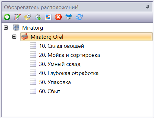                               

Обобщенный процесс производства может быть представлен следующей диаграммой:

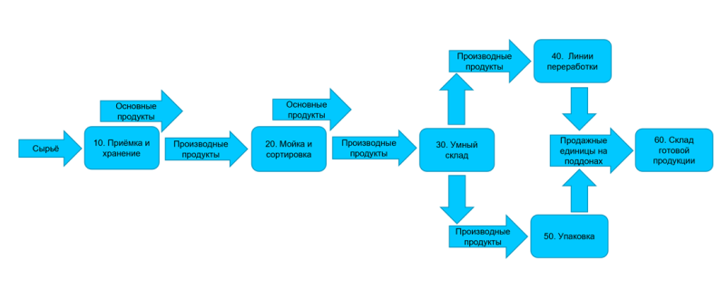 

## 3.2 Требования заказчика, которые должны быть реализованы для рабочих процессов в рамках проекта

### 3.2.1    Исходная конфигурация приемки.

#### 3.2.1.1 Конфигурация зоны приемки

Чтобы осуществлять приемку, мы должны создать зоны приемки на плане завода.

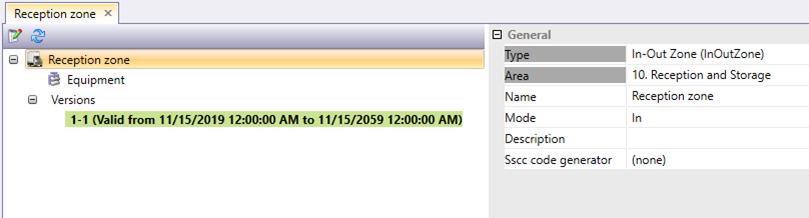  

#### 3.2.1.2 Конфигурация основных данных приемки

Для подготовки Momentum operations к успешному процессу приемки, необходимы исходные данные для следующих объектов:

\-     Сезон должен быть запущен:

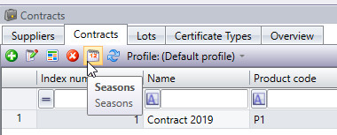  

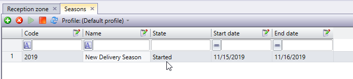  

\-     Поставщики (Продавцы и Фермеры)

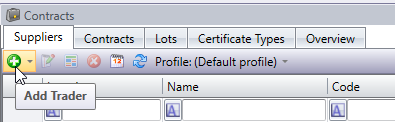 

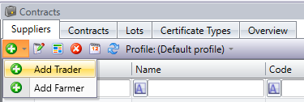 

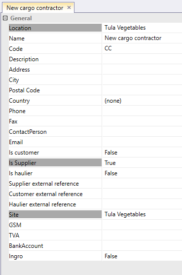 

\-     Контракты

 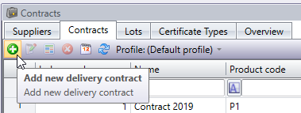

 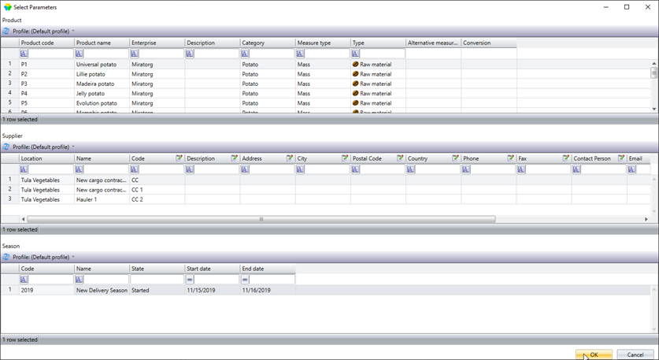

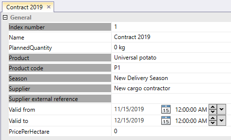         

\-     Партии поставки

 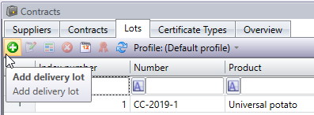

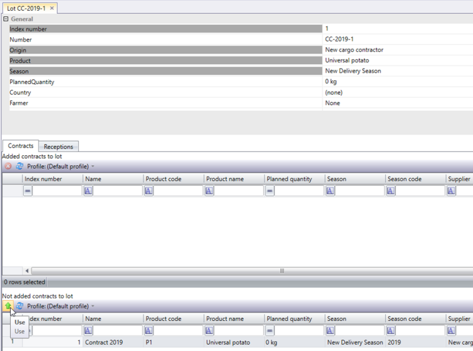 

\-     Перевозчики

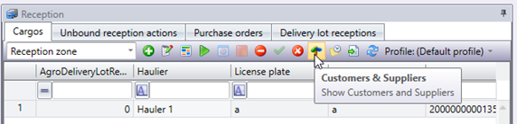 

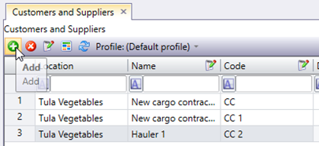 

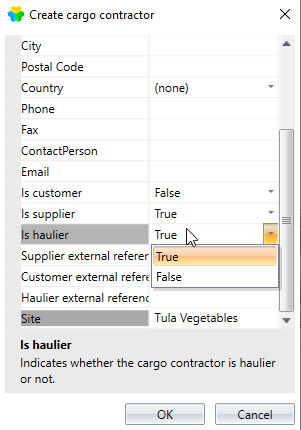  

#### 3.2.1.3 Сырье

Для картофеля изначально определены следующие записи:

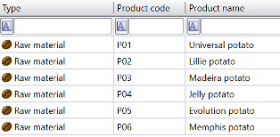 

Это начальный список - другие сорта картофеля могут быть добавлены во время производства.

Для других видов овощей сырье может быть добавлено изначально:

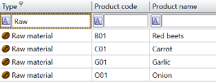 

### 3.2.2    Процедура приемки груза

Процедура приемки начинается с регистрации груза:

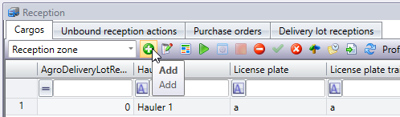 

 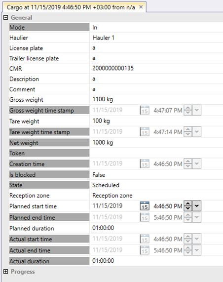

Груз может содержать одну или несколько загрузок (грузовых партий). Несколько загрузок в одном грузе используются, когда, например, продукт, транспортная единица, заказ на покупку и т. д. отличаются. В таких случаях принято создавать не новый груз, а новую загрузку. Поэтому мы опишем, как спланировать и получить одну загрузку для одного груза.

В нижнем окне выберите вкладку окна (`loads the cargo`) . Здесь вы можете добавить запланированную загрузку, количество контейнеров, продукт:

Нажать  `add`:   

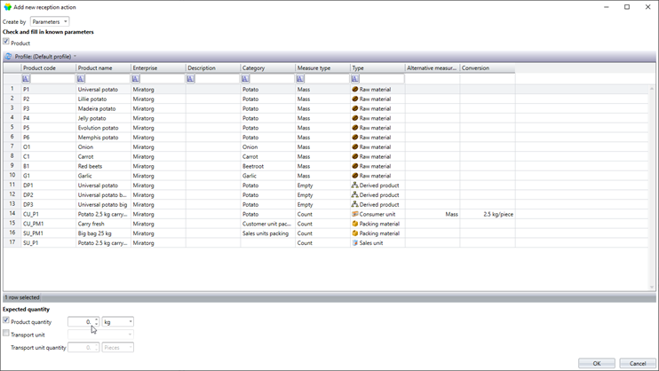 

### 3.2.3    Тест качества для грузовика

#### 3.2.3.1 Определение теста качества для грузовика

Для каждого грузовика с сырьем во время приемки проводится тест качества. На самом деле нужно взять несколько образцов, каждый с определенной тележке.

##### 3.2.3.1.1    Стандарт качества 

Так как этот тест не проводится на линии, нет необходимости настраивать все свойства для этого стандартный 

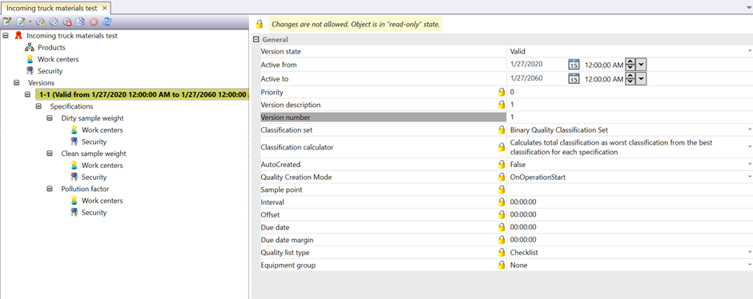 

Мы будем использовать двоичную классификацию с оценками «Допустимо» и «Недопустимо» для этого теста.

##### 3.2.3.1.2    Спецификации качества

Будут созданы три спецификации для теста качества для грузовика:

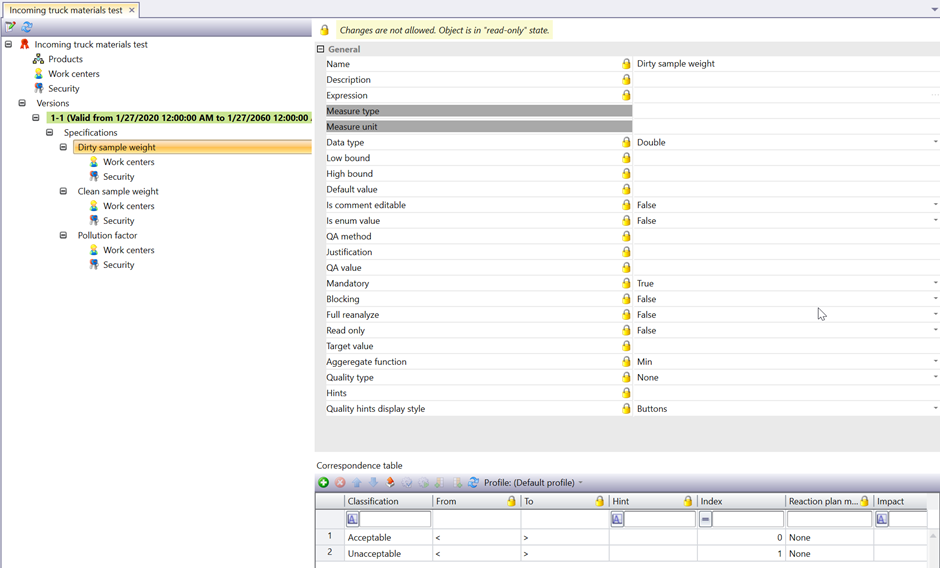 

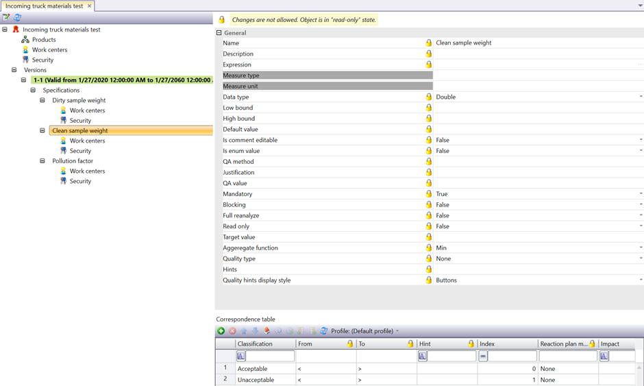

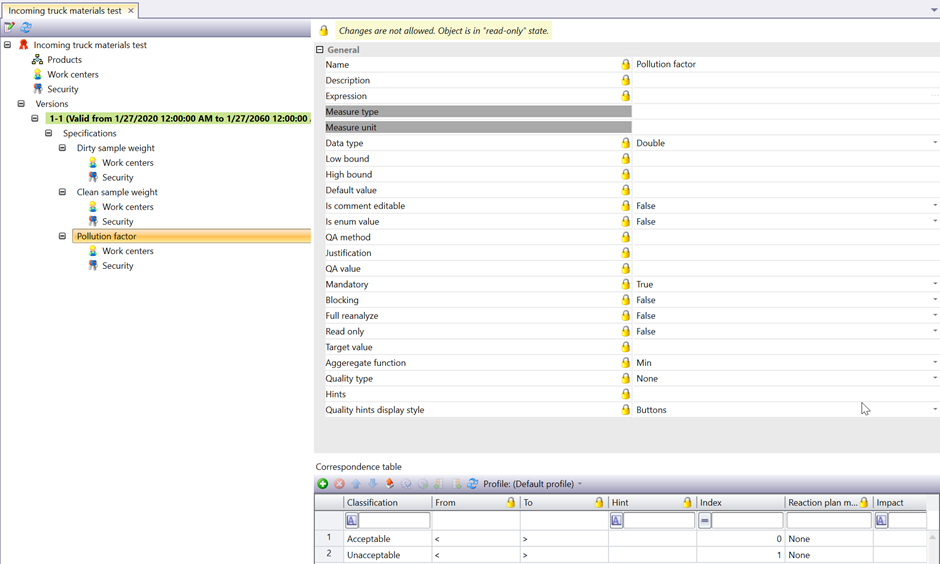

Например, для картофеля по ГОСТ 26832-86 допустимый предел загрязнения составляет 1%. Это зависит от конкретных контрактов Мираторг.

#### 3.2.3.2 Регистрация теста качества

Для картофеля по ГОСТ 7194-81 - для каждого грузовика отбирается 15 образцов (при весе до 20 тонн). Образцы должны быть взяты из разных слоев загрузки. Учитываем, что правила могут привести к регистрации дополнительных спецификаций.

#### 3.2.3.3 Отчет о тесте качества

Отчет для печати с образцами проб из грузовика показан ниже:

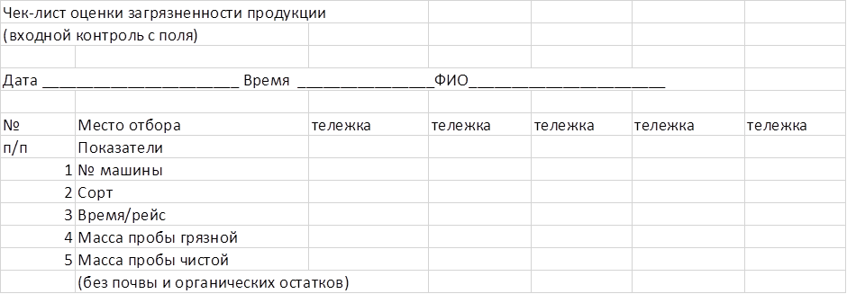 

### 3.2.4    Процедура отправки грузовика с пустыми ящиками для моркови

Процедура не предусмотрена в техническом задании

### 3.2.5    Предварительная сортировка при приемке

#### 3.2.5.1 Предварительная сортировка при приемке, рабочие центры и процессы

Предварительная сортировка на приемных линиях находится в цехе «10. Прием и хранение на «Овощеперерабатывающем заводе в Туле».

##### 3.2.5.1.1    Список, название и свойства рабочих центров

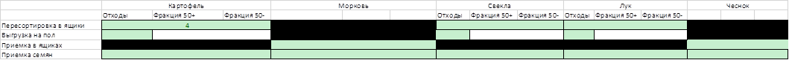 

##### 3.2.5.1.2    Список, адреса и свойства зон хранения 

К линии присоединена зона хранения типа буфер. Она используется, чтобы регистрировать, что определенный грузовик разгрузил товар на линию. 

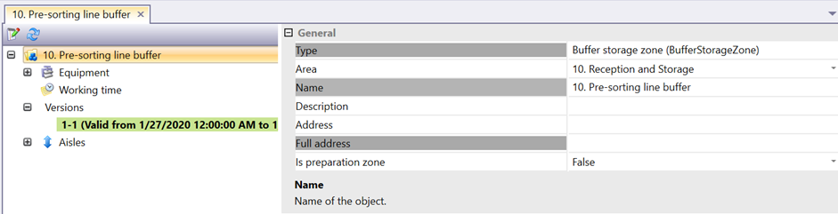 

Зона хранения имеет единицу хранения типа буфер:

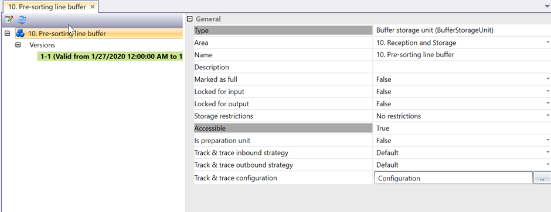 

 

##### 3.2.5.1.3    Оборудование линии и его параметры

На линии не установлены принтеры этикеток. Этикетки для деревянных ящиков создаются вручную. В будущем планируется оборудовать деревянные ящики RFID-метками, поэтому не нужно будет наносить дополнительные этикетки на деревянные ящики.

##### 3.2.5.1.4    Линия на плане завода

Рассматривая данную линию с точки зрения плана завода, мы можем представить ее следующим образом:

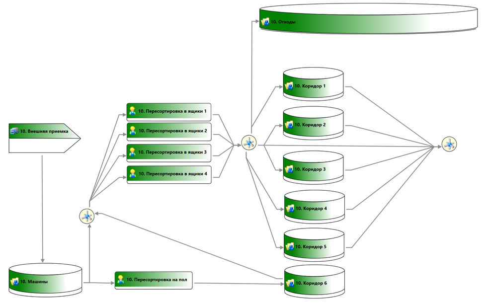 

#### 3.2.5.2 Продукты на линии

##### 3.2.5.2.1    Продукты, определенные для линии

Для каждого сырья мы создаем базовый продукт и определяем для него конфигурацию производных продуктов:

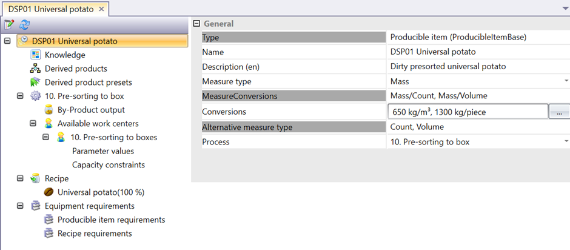 

Максимальная загрузка для деревянного ящика составляет 1300 кг, таким образом мы можем определить соответствующий коэффициент преобразования. Объем деревянного ящика близок к 2 м³. Это позволяет нам оценить максимально допустимое преобразование в объем как 650 кг / м³.

Мы регистрируем отбракованный картофель как производный продукт, а не как побочный продукт, потому что он требует измельчения, прежде чем выбрасывать.

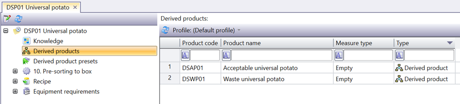 

Сор и трава должны быть взвешены для баланса материала и определения показателя качества в KPI (ключевой индикатор производительности), а затем выброшены - поэтому мы регистрируем их как побочный продукт.

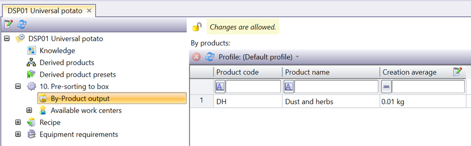  

##### 3.2.5.2.2    Рецепт для данных продуктов

Мы создаем рецепт с соотношением 1:1, предполагая, что нет сора. Позже мы можем определить коэффициент потерь.

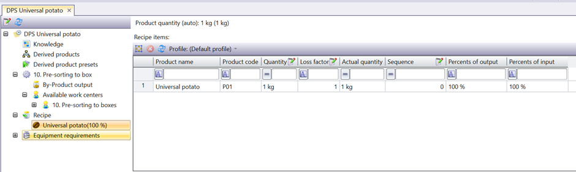 

#### 3.2.5.3 Правила выполнения операций на линии.

##### 3.2.5.3.1    Процедура запуска операции на рабочем центре

Все идентификаторы контейнеров должны быть введены до запуска операции в соответствии с выходами рабочего центра.

Принцип хранения – плановый коридор (зона хранения), помещение (единица хранения) и позиция в штабеле (место хранения) должен быть определен до начала производства.

##### 3.2.5.3.2    Правила регистрации количества на рабочем центре

Количество производных продуктов регистрируется путем взвешивания в пункте приемки оператора.

##### 3.2.5.3.3    Правила регистрации количества отклоненного (забракованного) продукта на рабочем центре

Количество отсортированных производных продуктов и фактическая масса сора регистрируется путем взвешивания в пункте приемки оператора.

##### 3.2.5.3.4    Правила подсчета отходов на рабочем центре

Все контейнеры с отходами должны быть тарированы перед использованием на линии, а также перед запуском операции. Они также должны быть взвешены после их заполнения, при перемещении, или при завершении операции. Как только партии создаются на основе принципа «для каждого грузовика», сор и отходы должны учитываться строго на основе принципа «для каждой партии».

##### 3.2.5.3.5    Правила использования партий и контейнеров на рабочем центре

Партии должны отслеживаться с момента получения груза. Партии не создаются при сортировке. Все производные и побочные продукты сохраняют один и тот же идентификационный номер партии.

##### 3.2.5.3.6    Процедура завершения операции на рабочем центре

#### 3.2.5.4 Правила выгрузки на линию

Обработка нескольких грузовиков (партий) в одной отдельной операции запрещена на линии.

Перемещение и разделение также не используются на таких линиях.

Остановки регистрируются в ручном режиме.

Если операция отложена из-за перерыва в работе между сменами, она должна быть перепланирована для следующей смены и все контейнеры должны быть взвешены для регистрации текущих результатов за смену. Это необходимо для правильного подсчета производительности.

#### 3.2.5.5 Контроль качества на линии

На линии не производятся контрольные измерения качества во время производства. Все образцы и измерения для продуктов на линии берутся в нерабочем режиме и описаны в других требованиях заказчика.

### 3.2.6    Тест качества при предварительной сортировке

#### 3.2.6.1 Определение теста качества для предварительной

Для каждой категории овощей регистрируется специальный стандарт качества.

##### 3.2.6.1.1    Стандарты качества для предварительной сортировки картофеля

Это тест производится не на линии и нет необходимости в конфигурации специальных свойств для данного стандарта.

Для данного теста будет двоичная классификация с оценками «Допустимо» и «Недопустимо».

##### 3.2.6.1.2    Спецификации качества для предварительной сортировки картофеля

Будет создано 18 спецификаций для стандартов качества предварительной сортировки картофеля. А также 8 спецификаций в соответствии с классами калибровки. Эта информации представлена в виде отчете.

##### 3.2.6.1.3    Стандарты качества для предварительной сортировки моркови

Это тест производится не на линии и нет необходимости в конфигурации специальных свойств для данного стандарта.

Для данного теста будет двоичная классификация с оценками «Допустимо» и «Недопустимо».

##### 3.2.6.1.4    Спецификации качества для предварительной сортировки моркови

Будет создано 16 спецификаций для стандартов качества предварительной сортировки моркови. А также 4 спецификации в соответствии с классами толщины и 4 спецификации в соответствии с классами длины. Эта информации представлена в виде отчете.

##### 3.2.6.1.5    Стандарты качества для предварительной сортировки свеклы

Это тест производится не на линии и нет необходимости в конфигурации специальных свойств для данного стандарта.

Для данного теста будет двоичная классификация с оценками «Допустимо» и «Недопустимо».

##### 3.2.6.1.6    Спецификации качества для предварительной сортировки свеклы

Будет создано 17 спецификаций для стандартов качества предварительной сортировки свеклы. А также 12 спецификаций в соответствии с классами калибровки. Эта информации представлена в виде отчета.

##### 3.2.6.1.7    Стандарты качества для предварительной сортировки лука

Это тест производится не на линии и нет необходимости в конфигурации специальных свойств для данного стандарта.

Для данного теста будет двоичная классификация с оценками «Допустимо» и «Недопустимо».

##### 3.2.6.1.8    Спецификации качества для предварительной сортировки лука

Будет создано 17 спецификаций для стандартов качества предварительной сортировки лука. А также 8 спецификаций в соответствии с классами калибровки. Эта информации представлена в виде отчета.

##### 3.2.6.1.9    Стандарты качества для предварительной сортировки чеснока

Это тест производится не на линии и нет необходимости в конфигурации специальных свойств для данного стандарта.

Для данного теста будет двоичная классификация с оценками «Допустимо» и «Недопустимо».

##### 3.2.6.1.10  Спецификации качества для предварительной сортировки чеснока

Будет создано 11 спецификаций для стандартов качества предварительной сортировки чеснока. А также 7 спецификаций в соответствии с классами калибровки. И специальная классификация «головка без зубков» для которой необходимы дополнительные пояснения. Эта информации представлена в виде отчета.

#### 3.2.6.2 Регистрация стандарта качества для предварительной сортировки

Образцы для данного теста качества отбираются с партии во время операции предварительной сортировки в ящики. Нет информации о количестве и технологии отбора.

#### 3.2.6.3 Отчет для печати по тесту качества для предварительной сортировки

##### 3.2.6.3.1    Отчет по тесту качества для предварительной сортировки картофеля

 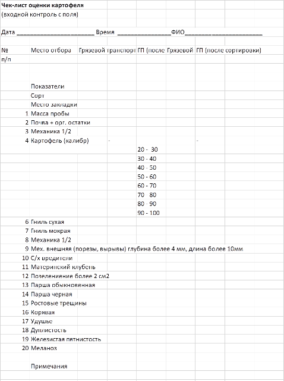

##### 3.2.6.3.2    Отчет по тесту качества для предварительной сортировки моркови

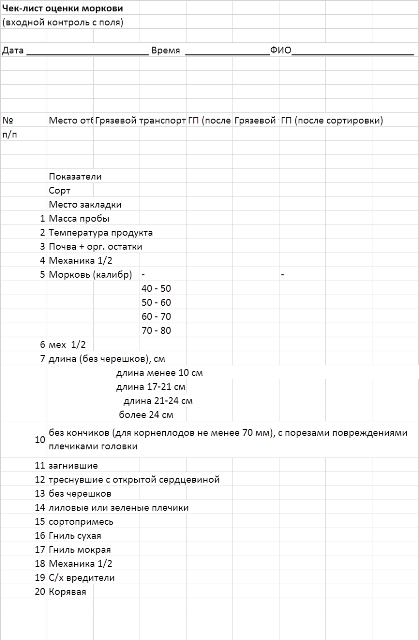 

##### 3.2.6.3.3    Отчет по тесту качества для предварительной сортировки свеклы

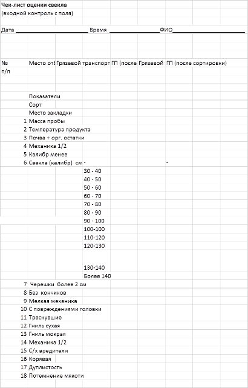 

##### 3.2.6.3.4    Отчет по тесту качества для предварительной сортировки лука

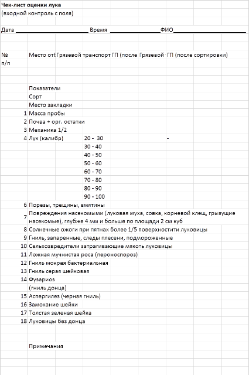 

##### 3.2.6.3.5    Отчет по тесту качества для предварительной сортировки чеснока

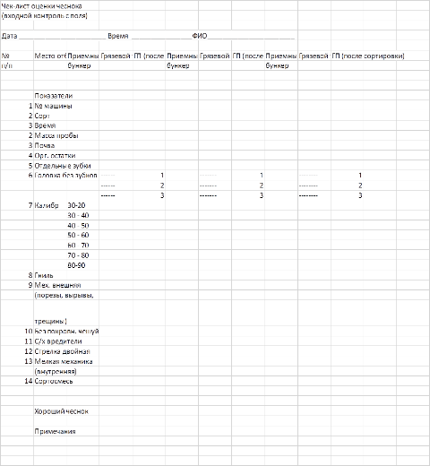 

### 3.2.7       Склад овощей

#### 3.2.7.1 Зоны и единицы хранения для приёмки

Для приемки определены шесть основных зон хранения. Каждая зона разделена на единицы хранения - помещения типа DriveInRoom. В каждом помещении созданы места хранения штабелей, с вместимостью 6 деревянных ящиков. “10. Коридор 6” зона хранения является зоной хранения навалом и будет использоваться как буферная зона

Приоритет загрузки склада сырья в навальные камеры

Приоритетная последовательность загрузки навальных комнат: корпус №6 – навальные камеры по порядку заполнения: 76, 75, 74, 77, 78, 73, 72, 79, 80, 71; корпус№5 – навальные камеры по порядку заполнения: 63, 64, 65, 62, 61, 66, 67, 60, 68, 69, 70, 57, 58, 59

Не допускается смешивание сорта в навальных камерах

Приоритет загрузки ящиков в склад сырья: корпус №3, №6, №5, №4, №2, №1

Последовательность загрузки камер – контейнерные камеры по порядку заполнения:

·     Чеснок: 30, 31, 32, 33, 34, 35

·     Картофель: 46, 47, 48, 49, 50, 51

·     Лук: 41, 42, 43, 44, 45, 52, 53, 54, 55, 56

·     Морковь: 25, 26, 27, 38, 39, 40, 1, 2, 3, 4, 5, 6, 7, 8, 9, 10, 11, 12, 13, 14, 15, 16, 17, 18, 19, 20, 21, 22, 23, 24

·     Свекла: 28, 29, 36, 37

Общие правила для всех камер хранения:

·     Допускается загрузка только одного вида овощей в одну камеру хранения

·     Допускается смешивание разных полей в одной камере хранения

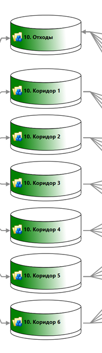

#### 3.2.7.2 Регистрация и идентификация контейнеров

Контейнеры будут оснащены меткой RFID, а на всех вилочных погрузчиках будут установлены считывающие устройства для RFID. Следовательно, два поля RFID-тега должны быть сохранены для каждого контейнера. Это можно сделать как поля знаний для этих контейнеров. Для биг-бегов можно сгенерировать, распечатать QR-коды и прикрепить их. В зоне приемки должно быть организовано рабочее место специально для идентификации и регистрации контейнеров.

Каждый погрузчик должен быть оснащён считывателем RFID/QR.

#### 3.2.7.3 Маршруты вилочного погрузчика и правила хранения

Фактически все правила и маршруты будут настроены путем выбора соответствующих «Стратегий использования хранилища» для зон и единиц хранения на приемке. Если контейнер после предварительной сортировки все еще будет иметь неоднозначное целевое место хранения, эту проблему следует решить, выделив единицы и зоны для конкретных продуктов. 

#### 3.2.7.4 Создание задач комплектации и планирование

Существует два варианта запуска задачи комплектации при получении товара. Если рабочие центры для предварительной сортировки будут соединены и автоматизированы - создание и планирование задач комплектации будут автоматизированы. Должен быть также ручной способ инициировать задачу комплектации с планшета начальника смены или руководителя группы в конкретном месте

​        Два ключевых пункта должны быть учтены в автоматическом режиме во время рабочего процесса планирования задач комплектации:

·     Для определения целевого места хранения - следует производить расчет с помощью «Стратегий использования хранилища». 

·     Для определения погрузчика для задачи - следует также реализовать на основе «стратегического» подхода с правилами оценки «приоритетов и / или затрат». Для определения вилочного погрузчика может быть несколько стратегий: «Ближайший», «Наименее загруженный», «Выделенный для маршрута или рабочего центра», «Доступный» и «Наиболее / наименее загруженный». Каждая из них будет иметь свой собственный приоритет для погрузчика и некоторую оценку «стоимости использования». Окончательное решение может быть принято методом «пропорционального взвешивания стратегии». В качестве альтернативы может быть «доска» с запланированными задачами комплектации, а водители погрузчиков могут «забронировать» задачу у себя

#### 3.2.7.5 Рабочие процессы для стадий задач комплектации

Каждый водитель вилочного погрузчика работает с задачей комплектации на следующих этапах: «новая», «запланированная», «принятая», «запущенная», «выполненная», «сброшенная», «отмененная».

Каждый погрузчик должен быть оснащён планшетом для работы с задачами комплектации.

 «Запланированные» задачи видны водителю на планшете погрузчика. Это список задач, которые должен выполнить этот конкретный водитель. Когда он начинает перемещаться в исходное место хранения или на выход рабочего центра, он должен переместить задачу комплектации на стадию «выбранная». Когда он загружает ящик, считывающее устройство идентифицирует его и переводит задачу в стадию «запущенная». Когда он помещает ящик в целевое место хранения - он помечает задачу как «выполненная».

#### 3.2.7.6 Диспетчеризация задач комплектации

«Сброшенная» означает, что по некоторым причинам нет возможности выполнить задачу в соответствии с графиком. В этом случае водитель должен указать фактическое местоположение и причину выгрузки ящика. Для этого ящика должно быть начато перепланирование следующей задачи комплектации с причиной обработка и изменение.

 «Сброшенная» может быть применена только к «запущенной» задаче комплектации. Если по какой-либо причине водитель не может добраться до ящика, он переводит «принятые» или «запланированные» задачи комплектации в состояние «отменённая». Он должен указать причину этого случая. Для этого ящика должно быть начато перепланирование следующей задачи комплектации с причиной обработка и изменение.

### 3.2.8    Упаковка на складе овощей

Процедура не предусмотрена в техническом задании

### 3.2.9    Линия мойки и сортировки картофеля

*1.2.9.1*  *Рабочие центры и процессы линии по обработке картофеля*

Линия по обработке картофеля находится в цеху «20. Мойка и сортировка» завода «Тульский овощеперерабатывающий завод» 

 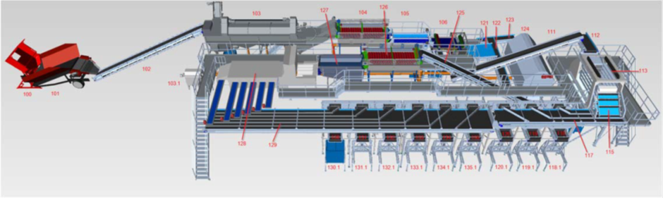

1.2.9.1.1    Список, названия и свойства рабочих центров

1.2.9.1.2    Список, адреса и свойства зон хранения 

Нет зон хранения, связанных с линией. Картофель в пластиковых контейнерах вывозится рабочим центром умного склада. Контейнеры с отходами и отсортированным картофелем забираются вилочными погрузчиками в зону хранения на приемке.

Принтеры этикеток не установлены на линии.

1.2.9.1.3    Линия на плане завода

Рассматривая данную линию с точки зрения плана завода мы можем ее представить в следующем виде:

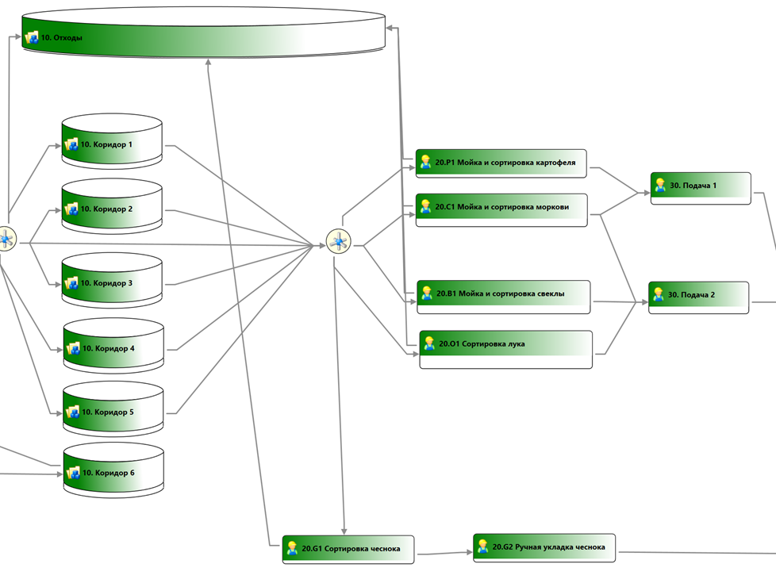 

*1.2.9.2* *Продукты на линии*

1.2.9.2.1    Продукты, определенные на линии

Как только у нас на линии появится треугольник процессов сортировки - мы создадим три конфигурации базовых и производных продуктов.

Давайте начнем с начальной предварительной сортировки и определим базовый продукт следующим образом:

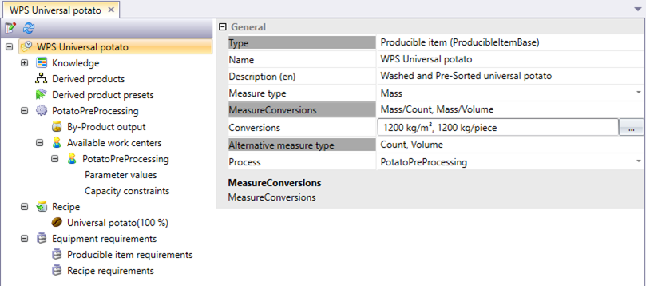

Для данного конкретного базового продукта мы определим два возможных производных продукта и два побочных продукта:

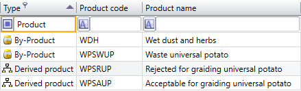 

Будет одна предустановка для начальной сортировки:

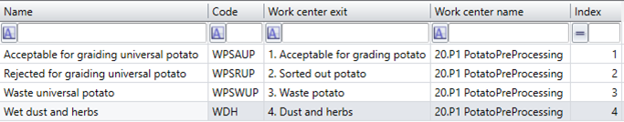 

Для следующей стадии сортировки – калибровка допустимого картофеля – мы определим следующий базовый продукт:

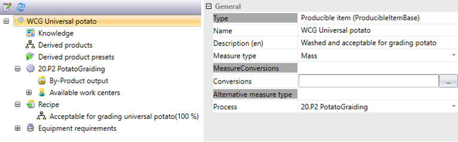 

Для этого базового продукта нет отходов или брака, и сортировщик может разделить поток картофеля на шесть сортов разных размеров. Мы должны создать соответствующие производные продукты для каждого калибра на основе примера:

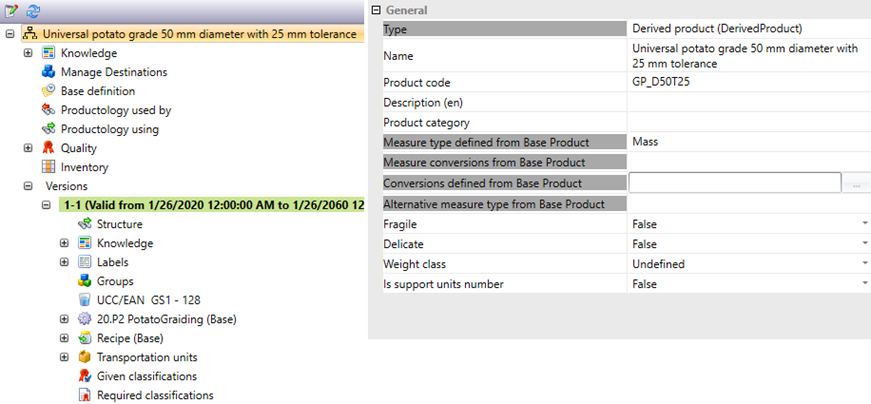 

### 3.2.10  Линия по обработке моркови 

#### 3.2.10.1   Рабочие центры и процессы на линии

Линия по обработке моркови расположена в цеху 20. Мойка и сортировка на заводе «Тульский овощеперерабатывающий завод».

##### 3.2.10.1.1  Список, названия и свойства рабочих центров

Линия представляет собой один рабочий центр:

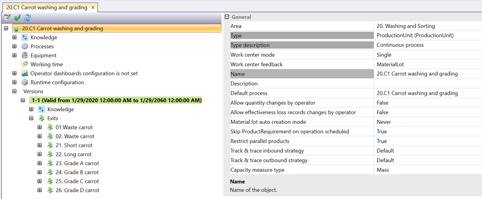   

##### 3.2.10.1.2  Список, адреса и свойства зон хранения 

Нет зон хранения, связанных с линией. Морковь в пластиковых контейнерах вывозится рабочими центрами умного склада «Прием 1» (“Intake 1”) и «Прием 2» (“Intake 2”). Контейнеры с отходами и отсортированной морковью забираются вилочными погрузчиками в зону хранения на приемке.

##### 3.2.10.1.3  Оборудование на линии и его параметры

Принтеры этикеток не установлены на линии.

##### 3.2.10.1.4  Линия на плане завода

Рассматривая данную линию с точки зрения плана завода, мы можем представить ее следующим образом:

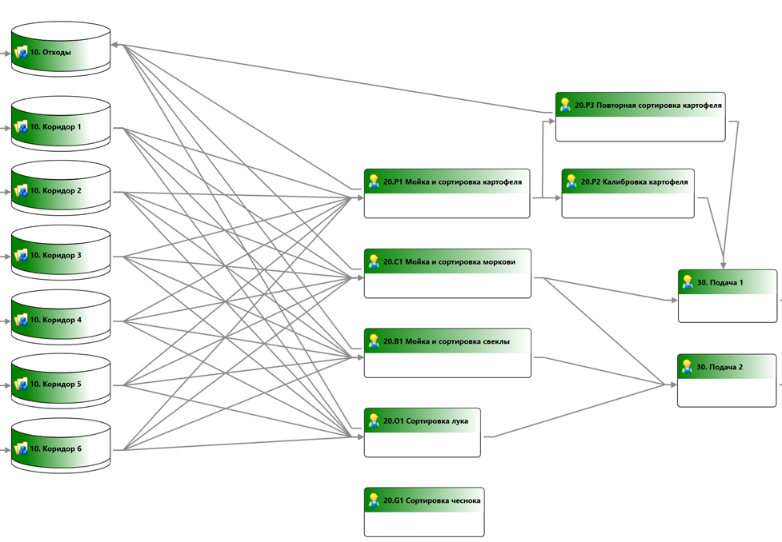 

##### 3.2.10.1.5  Процессы на линии

Для линии определен один процесс сортировки моркови:

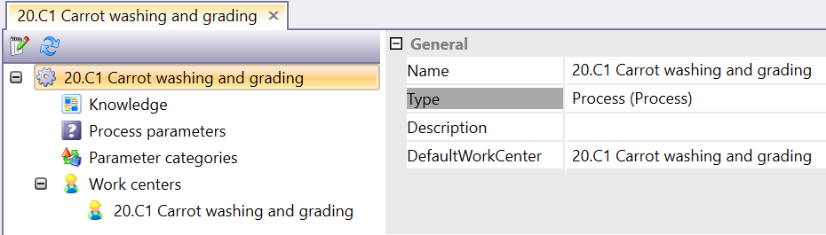 

#### 3.2.10.2  Продукты на линии

##### 3.2.10.2.1  Продукты, определенные для линии

Продукты и правила определяются аналогично сортировке картофеля на уровне сортировки.

### 3.2.11  Линии обработки свеклы, лука и чеснока

*1.2.11.1*   *Рабочие центры и процессы*

Нет зон хранения, связанных с линиями. Овощи в пластиковых контейнерах вывозятся рабочими центрами умного склада. Контейнеры с отходами и отсортированным продуктом забираются вилочными погрузчиками в зону хранения на приемке.

Рассматривая данную линию с точки зрения плана завода, мы можем представить ее следующим образом:

 

### 3.2.12  Реализация стеллажного хранения FIFO

#### 3.2.12.1      Модель стеллажного хранения FIFO

Рассматривая умный склад с точки зрения планировки завода, мы можем упростить его следующим образом

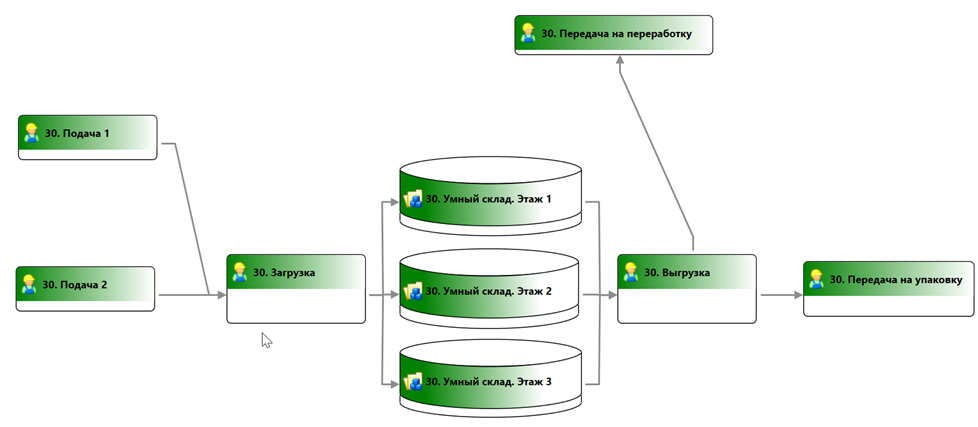 

В соответствии с данным планом заказы (задания) вносятся в систему Cassioli и в систему JHLI. Детальное описание заданий приведено в приложении 1 к данному документу (MiratorgScope Annex 1 2020.03.09_RU.docx)

Внутренняя структура умного склада может быть представлена следующим образом:

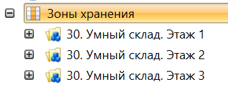 

Мы рекомендуем использовать единицу хранения типа стеллаж FIFO для реализации возможностей FIFO для каждого ряда. Пример конфигурации ряда:

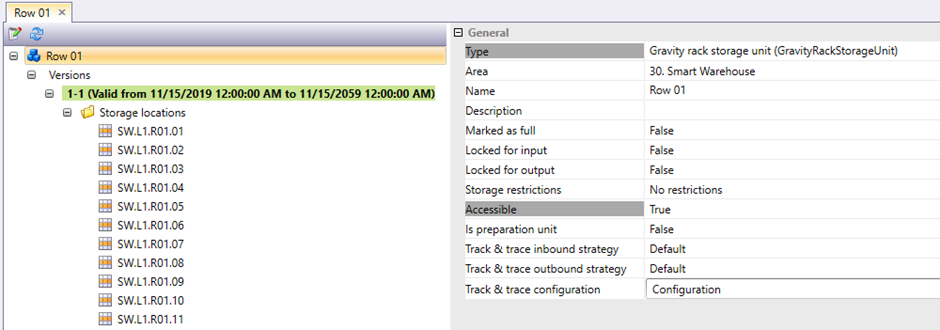 

Каждый уровень или зона хранения содержит 23 ряда или единиц хранения, каждая единица хранения содержит 11 позиций или мест хранения.

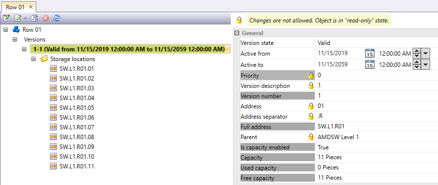  

Общая пропускная способность уровня равна 253 контейнерам, что соответствует более чем 4 часам работы при условии суммарной производительности погрузки 60 контейнеров в час. Три уровня склада могут содержать до 12 часов работы для следующих линий.

#### 3.2.12.2      Редактор пользовательского интерфейса стеллажа FIFO

Редактор пользовательского интерфейса стеллажа FIFO аналогичен гравитационному стеллажу. Единственная разница в логике приема и выгрузки на склад.

#### 3.2.12.3      Служба данных стеллажа FIFO

Разница между гравитационным стеллажом и стеллажом FIFO, используемом в Мираторге, заключается в подходе к подсчету вместимости. В общих чертах, есть два свойства - «Используемая емкость» и «Фактическое количество», хранящиеся в единице хранения. Они не равны. Потому что, если мы возьмем ящик из места хранения 01 - другие ящики не сдвигаются вперед, поэтому используемая емкость остается прежней.

#### 3.2.12.4     Реализация графического изображения стеллажа FIFO

Визуализация умного склада может быть настроена по-разному. По умолчанию может выглядеть следующим образом: 

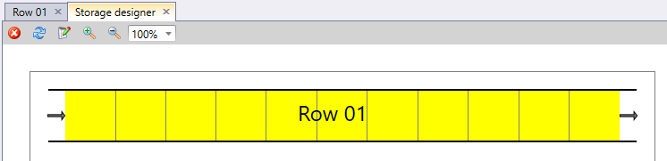 

#### 3.2.12.5     Планирование стеллажа FIFO, другие тесты и наладка

Есть идея реализовать стратегию резервирования «место для грузовика», когда мы планируем операции приемки-отгрузки со склада. Это означает, что мы резервируем три линии для каждого грузовика, планируемого к отправке, и всегда работаем с «партией» до 33 пластиковых ящиков. При достижении количества заказа остатки партии переадресовываются на заказы «на склад» 

### 3.2.13  Прием в умный склад

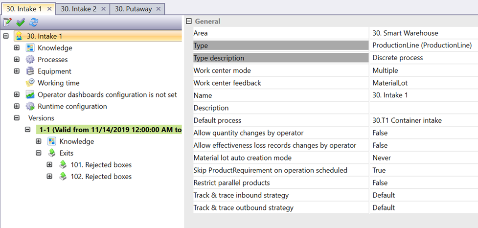 

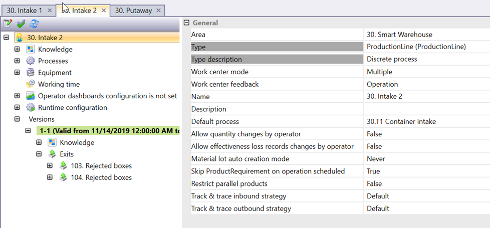  

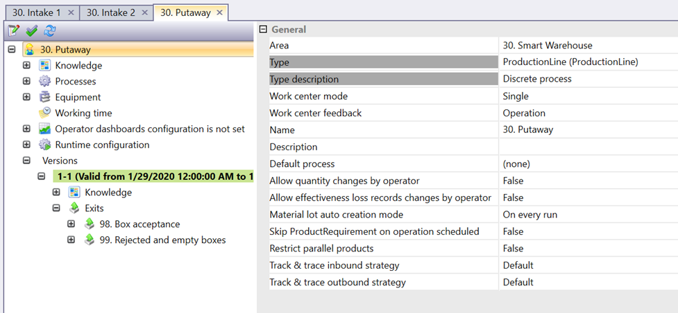   

### 3.2.14  Выгрузка из умного склада 

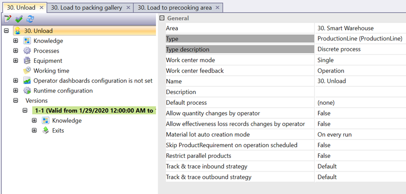 

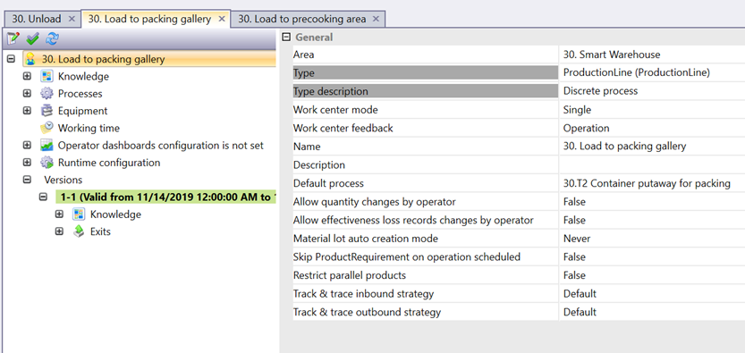 

 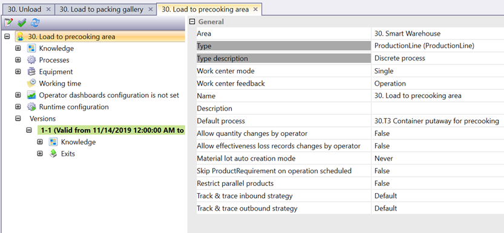

### 3.2.15  Упаковочные линии

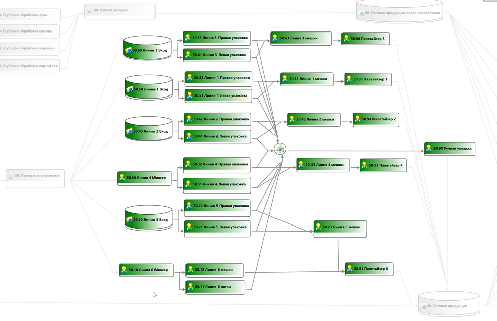 

В случае необходимости может быть выполнена выгрузка остатка овощей из приёмочных бункеров упаковочных линий в пустой чистый пластиковый контейнер посредством использования отсортировочного конвейера, расположенного под сортировочными столами упаковочных линий. В один момент времени возможна выгрузка только из одного приёмочного бункера. В момент выгрузки запрещается сортировка на сортировочных постах других линий упаковки.

Далее контейнер с продуктом должен быть транспортирован погрузчиком на позиции загрузки в умный склад 101 или 103 (приложение 1, пункт 2). При поступлении контейнера на позицию загрузки, оператор линии должен указать в WMS какой именно продукт находится в коробе. Транспортировка и взвешивание контейнера выполняется согласно алгоритмам, описанным в приложении 1 (MiratorgScope Annex 1 2020.03.09_RU.docx).

### 3.2.16  Линии глубокой обработки

 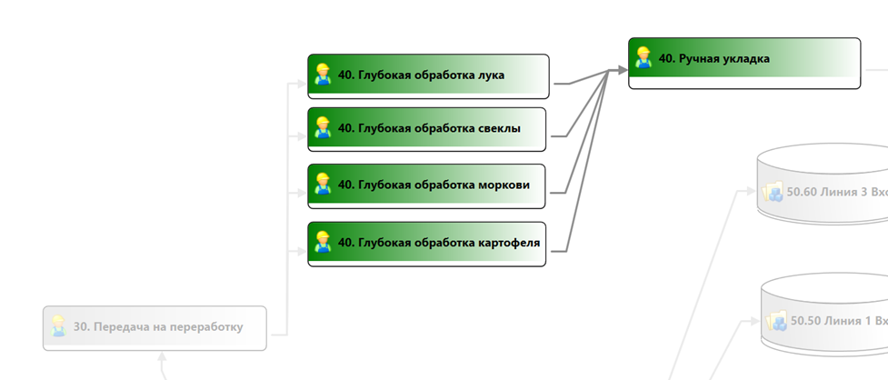

Очищенный/нарезанный продукт упаковывается в вакуум или флуопак.

Пакеты укладываются в короб. Предварительно 10 вложений в короб.

На каждый короб вручную клеится этикетка. Этикетка печатается на термотрансферном принтере.

Короба укладываются на паллет. На паллет печатается этикетка и клеится вручную. 

На пакет нужно предусмотреть печать на пленке и наклейка самоклеящегося стикера. Короб и паллет – самоклеящийся стикер.

Паллет взвешивается на напольных весах в зоне упаковки. 

### 3.2.17  Исходная конфигурация отгрузки

Мы должны определить зоны отгрузки:

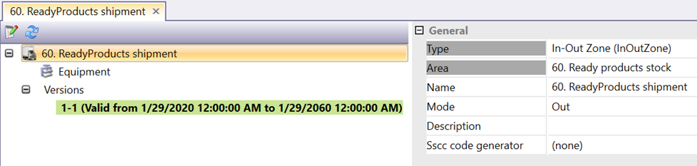 

Рассматривая данную линию с точки зрения плана завода, мы можем представить ее следующим образом:

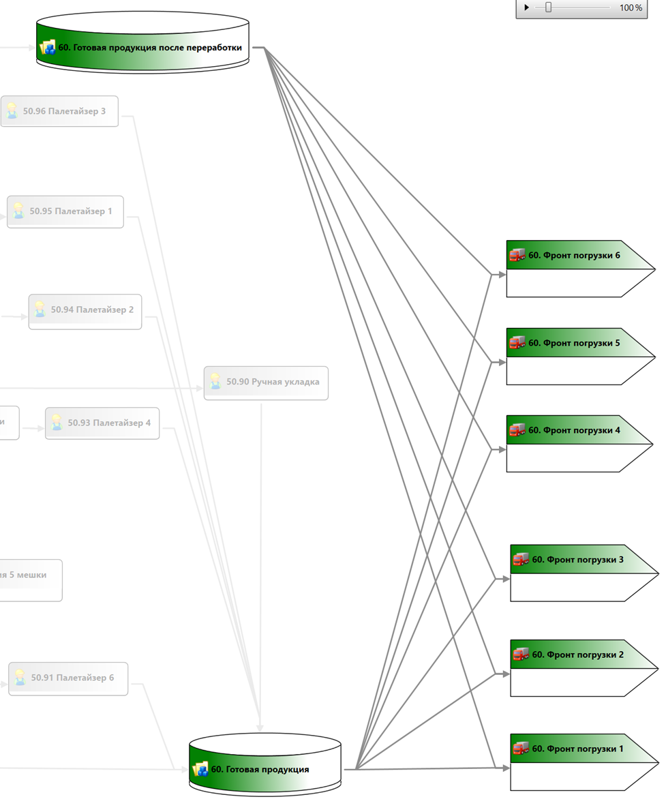 

### 3.2.18  Процедура отгрузки

Для регистрации груза нам необходимо создать Заказчиков в системе:

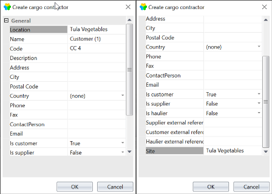   

Также нам необходимо задать пункт получения данного заказчика:

 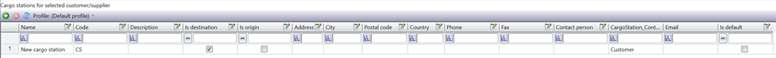

Теперь мы можем зарегистрировать груз для заказа

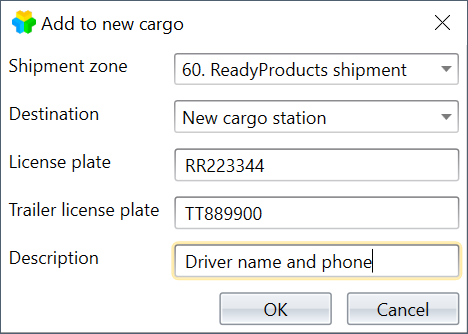 

Затем мы можем заполнить все свойства груза:

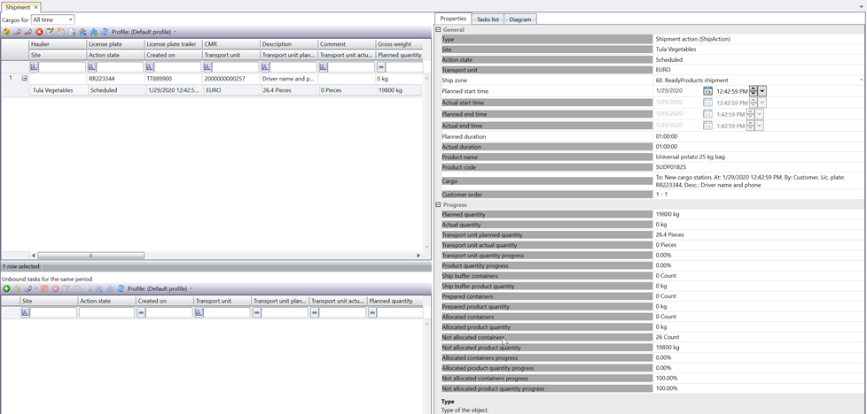 

### 3.2.19  Задачи комплектации для отгрузки

Для отгрузки мы также можем создать задачи комплектации и показать их на диаграмме:

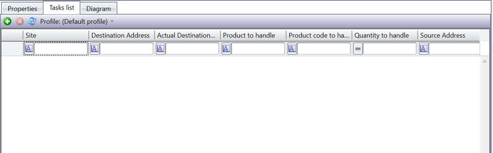 

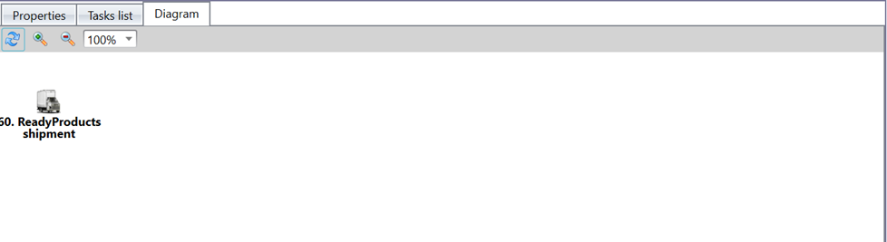

После создания задачи должны быть выполнены.

Для идентификации паллеты по SSCC в зоне отгрузки используется планшет без дополнительного промышленного считывателя. Подтверждением завершения задачи комплектации является считывание SSCC загруженной в автомобиль паллеты.

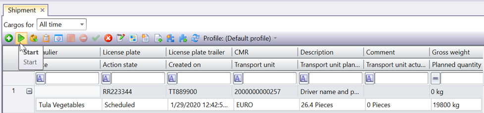  

### 3.2.20  Акт соответствия заказа на отгрузку

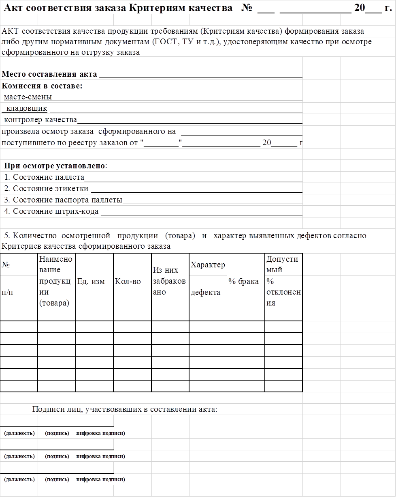   

### 3.2.21  Тест качества на изменение температуры при отгрузке 

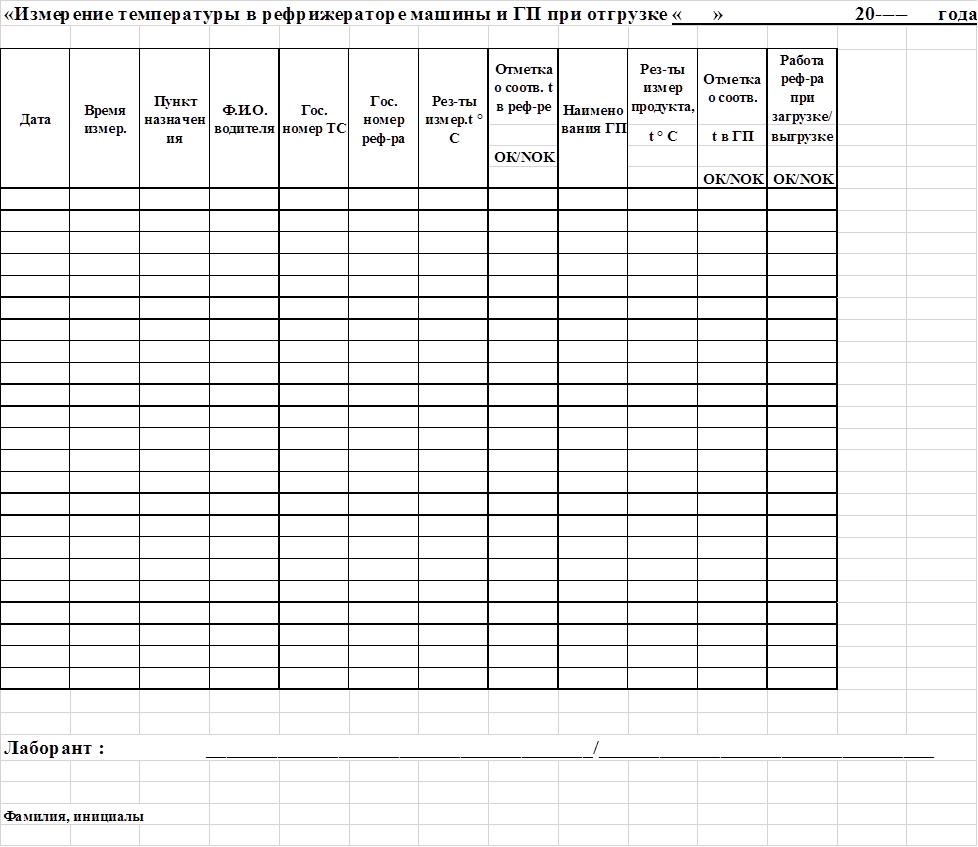 

 