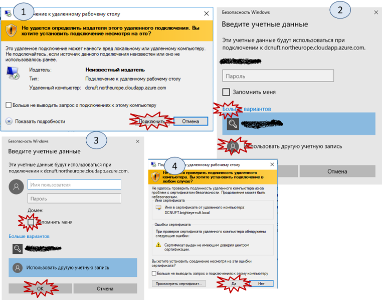
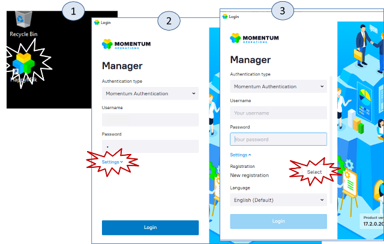
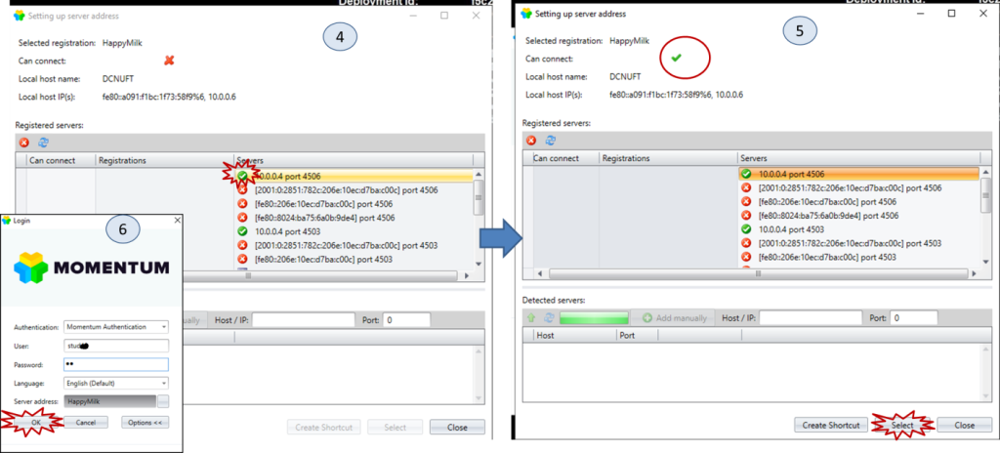
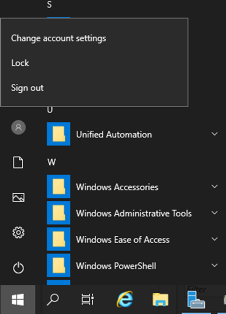

## 1. Підключення до віртуальної машини.

рис.1. Використання файлу RDP для входу в систему.

Лабораторні роботи проводяться на віртуальній машині, що запускається в хмарному середовищі Microsoft Azure. Одна віртуальна машина слугує в якості серверу MOM-системи Momentum (попередня назва MES Control), інша – в якості клієнту. Обидві віртуальні машини на момент виконання лабораторної роботи повинні бути запущені. Запуск проводиться викладачем в заздалегідь домовлені години, слідкуйте за графіком.

 На клієнтській віртуальній машині розгорнуте спеціалізоване ПЗ – термінальний сервер, який дозволяє одночасне віддалене підключення кільком користувачам. Для віддаленого входу необхідно мати файл налаштувань RDP та знати ім’я користувача та пароль.

\1. Завантажте файл RDP за [цим посиланням](https://drive.google.com/open?id=1hqPjIDJ8sP4t9MASMD63e1HQFyA_IvYo).

\2. Запустіть файл RDP на виконання. Використовуючи покрокові інструкції з рис.1 та дані облікового запису для свого варіанту зайдіть на віддалений робочий стіл віртуальної машини.   

 

## 2. Налаштування запуску Shell.

рис.2. Запуск Momentum Shell

1. Використовуючи ярлик на робочому столі на віртуальній машині запустіть Momentum Shell (рис.2.1).

2. Перший раз у вікні налаштувань необхідно вказати вірні адреси. Для цього виберіть пункт “Options” (рис.2.2), зайдіть в налаштування адрес серверів (рис.2.3).

3. У вікні виберіть одну із адрес, що підсвічені зеленим ( рис.3.4). 

4. Дочекайтеся, коли опція «Can connect» стане зеленою (рис.3.5), після чого натисніть «select».

5. У вікні вводу паролю введіть ім’я користувача і пароль відповідно до варіанту (рис.3.6).

6. Дочекайтеся завантаження Momentum і починайте виконувати лабораторну роботу №1. Наступного разу запуск Shell можна пробувати одразу з п.5 (рис.3.6).  

 

рис.3. Налаштування доступу до адрес серверів Momentum Shell

 

## 3.Завершення роботи.

Після завершення роботи сеанс треба правильно закривати, через `Sign out`.

