| [<- до лаборних робіт](README.md)                       | [на основну сторінку курсу](../README.md)               |
| ------------------------------------------------------- | ------------------------------------------------------- |
| [<- 0. Підключення до віртуальної машини](0_prepare.md) | [Лр2. Основи роботи з сегментами продукту->](2_prod.md) |

# Лабораторна робота №1 

## Тема. Основи роботи з робочими центрами, операціями та устаткованням

**Тривалість**: 8 акад. години (4 пари).

**Мета:** ознайомлення з базовими можливостями робочих центрів та роботи з операціями  

**Завдання для виконання роботи**

**Цілі.** 

1. Виділити та означити робочі центри.

2. Навчитися керувати діями та операціями робочих центрів.
3. Створити устатковання для взаємодії MOM з АСКТП.
4. Навчитися контролювати та керувати теги та відповідні параметри устатковання в MOM.   

## Порядок виконання роботи 

### 1. Означення цеху згідно варіанту

1.Отримайте у викладача номер варіанту. Зайдіть в Shell під

login: **stud*xx***
password: **xx**
де **xx** -- номер варіанту

**Увага! XX далі по тексту лабораторної роботи замість XX завжди ставте номер варіанту!**

2.В location browser знайдіть власний цех відповідно до Вашого варіанту AreaXX. 

**Увага! Нові цеха (Area) створювати не потрібно! У вже має бути створений робочий центр до початку виконання!**

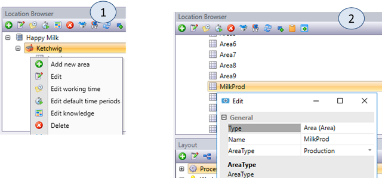{ width=100% }

---

### 2. Виділення робочих центрів в цеху

- Ознайомтеся з постановкою завдання:

Цех MilkProd призначений для приготування молочних продуктів з незбираного молока (молоко різної жирності, кефір, сметана, йогурти) і їх розфасовку в різну тару. Оброблене молоко з цеху приймання певної жирності і складу надходить в танки зберігання SU\_T1..SU\_T3, що знаходяться в зоні зберігання SZ\_NOPAST1. При необхідності в молоко додають додаткові інгредієнти і вершки в залежності від вимог до сировини для конкретного продукту. Далі ця молочна суміш проходить через пастеризаційну установку WC\_XX_PAST1, де проходить процес пастеризації при заданих технологічних параметрах, визначених у рецепті продукту. Пастеризоване молоко (суміш) надходить в один або кілька танків для приготування WC\_T101 \... WC\_T102. У танках відбувається його охолодження, введення, при необхідності, визначеного в рецепті кількості мікроорганізмів (закваски), сквашування і, в деяких випадках, додаткова термічна обробка. Приготований продукт вивантажується з танків через охолоджувачі на машини розливу, в залежності від необхідної тари. Процес пастеризації відбувається одночасно із завантаженням, процес вивантаження одночасно з розливом. Розлита в тару продукція упаковується в коробки або поліетиленові блоки і подається транспортером на склад готової продукції.

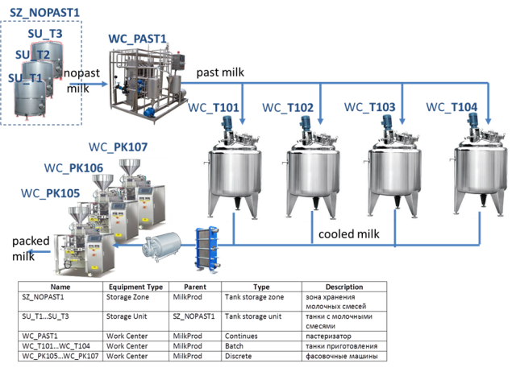{ width=640px }

Таким чином виділимо наступні робочі центри та зони зберігання, де XX - номер варіанта:

| **Name**                | **Equipment Type** | **Owner**  | **Type**          | **Description**                   |
| ----------------------- | ------------------ | ---------- | ----------------- | --------------------------------- |
| SZ_XX_NOPAST1           | Storage Zone       | MilkProd   | Tank storage zone | Зона зберігання молочних  сумішей |
| SU_XX_T1…SU_XX_T3       | Storage Unit       | SZ_NOPAST1 | Tank storage unit | танки з молочними  сумішами       |
| WC_XX_PAST1             | Work Center        | MilkProd   | Continues         | пастеризатор                      |
| WC_XX_T101…WC_XX_T104   | Work Center        | MilkProd   | Batch             | танки приготування                |
| WC_XX_PK105…WC_XX_PK107 | Work Center        | MilkProd   | Discrete          | фасувальні машини                 |

---

### 3. Створення робочого центру WC\_XX\_PAST1

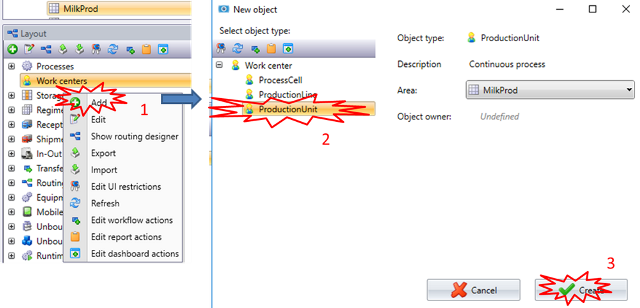{.center}

1.  В Location Browser виділіть свій цех відповідно до варіанту. Відкрийте модуль `Layout` і через контекстне меню розділу `Work centers` виберіть створення нового робочого центру.
2.  Виберіть тип `ProductionUnit` (після створення робочого центру його тип змінити неможливо).
3.  Натисніть кнопку `Create`.

---

### 4. Встановлення властивостей робочого центру WC\_XX\_PAST1

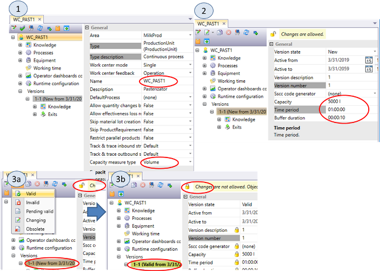{.center}

1) Автоматично відкриється вікно властивостей робочого центру (рис.1.4(1)). Його в будь-який момент можна відкрити пізніше з навігатора об\'єктів модуля Layout.  

У вікні властивостей `WC_XX_PAST1` показується весь вміст робочого центру у вигляді дерева. Значення і перелік цих властивостей поступово будуть змінюватися в процесі створення навчального проекту. Мінімально потрібно задати основні властивості - це `Name`, `Capacity Measured type` і продуктивність. Зверніть увагу, що властивості які в даний момент редагуються або доступні тільки для читання підсвічуються сірим кольором.

2) У загальних (General) настройках робочого центру (рис.1.4(1)) визначте ім\'я **`WC_XX_PAST1`** (`Name` та  `Code`), де XX -- номер варіанту, і одиницю виміру продуктивності (`Capacity Measure Type = Volume`).

В процесі розробки проекту може виникнути необхідність зміни робочого центру або виведення його з експлуатації. Щоб Momentum правильно інтерпретувала стан робочого центру здійснюється керування версіями. Так, наприклад, тільки об'єкти, які в даний момент не використовуються (в тому числі і робочі центри) можуть редагуватися. Тільки діючі об\'єкти (`Valid`) можуть використовуватися в експлуатації. Тому, властивості, які не можуть бути змінені «на льоту» і можуть залежати від часу, входять в властивості версії.

3) У переліку властивостей версії робочого центру визначте продуктивність (`Capacity`), `Time Period` і `Buffer Duration`, як показано на рис.1.4(2).
   Для робочих центрів неперервного типу `Capacity` спільно з `Time Period` задають властивість продуктивності за одиницю часу (`Capacity Per Time Period`). `Buffer Duration` означує затримку подачі продукту на вихід робочого центру після подачі продукту на його вхід.

4) Валідуйте продукт через пункт меню (рис.1.4(3a)). Ту саму дію можна зробити через контекстне меню або властивість `version state`. Зверніть увагу на стан версії після валідації (рис.1.4(3b)). Якщо валідація не пройшла успішно, необхідно перевірити правильність виконання всіх попередніх пунктів.

---

###  5. Настройки доступу до панелі керування робочим центром

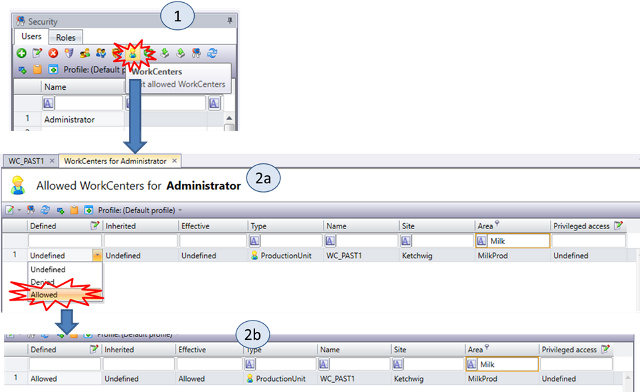{.center}

Для керування робочим центром в режимі виконання, існують стандартні панелі керування оператора доступні в модулі `Supervisor`.

1) Відкрийте модуль `Supervisor` (`View -> Supervisor`). У вікні `Location Browser` виділіть `WC_XX_PAST1`. У переліку не буде жодної панелі керування, так як за замовчуванням вони не доступні користувачам.

**Для виконання пунктів 2-3 необхідно мати права адміністратора, повідомте викладача, коли необхідно буде його виконати!**

2) Відкрийте модуль керування доступом `View->Security`. У списку користувачів (`Users`) виберіть `Administrator` і натисніть на кнопку означення доступу до робочих центрів (рис.1.5(1)).

3) У вікні властивостей відкриється табличний редактор настройки доступу користувача `Administrator` до панелей керування робочими центрами (рис.1.5(2a)). Виберіть `Allowed` в колонці `Defined`, після чого доступ буде дозволений.

4) Відкрийте модуль `Supervisor`(`View-Supervisor`). Натисніть кнопку `Refresh`. У списку має з\'явитися робочий центр `WC_XX_PAST1`.

---

### 6. Знайомство з роботою панелі керування робочим центром

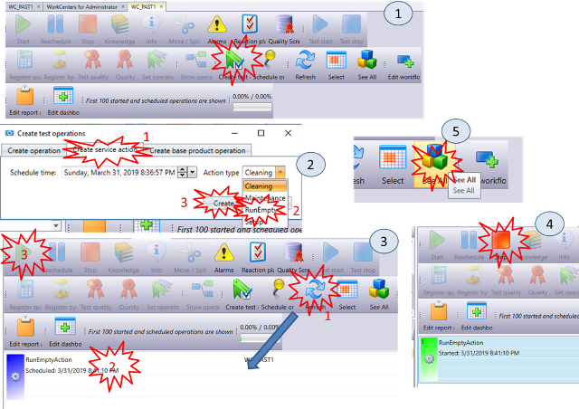{.center}

1.  У модулі `Supervisor` (`View-Supervisor`) виберіть робочий центр `WC_XX_PAST1`. З\'явиться вікно керування робочим центром (рис.1.6(1)). Подивіться на доступні кнопки в панелі а також на перелік запланованих операцій.
2.  Для тестового запуску операцій скористайтеся кнопкою `Create Test Operation`. З\'явиться вікно вибору запуску операцій для тестування (рис.1.6(2)). Оскільки жоден продукт не означений і робочий центр не робить ніякої технологічної операції на цій закладці неможливо вибрати продукт для виробництва.
3.  Виберіть закладку `Create service action`. На цій закладці можна запустити сервісні дії, такі як `Cleaning`, `Maintenance`, `RunEmpty` і `Setup`. Виберіть пункт `Run Empty` і створіть операцію кнопкою `Create`.
4.  На панелі керування після натискання кнопки `Refresh` в списку з\'явиться дія `RunEmptyAction` (рис.1.6(3)). Синій колір означає що операція (дія) запланована, але ще не виконується. Клацніть по ній і запустіть кнопкою `Run`.
5.  Дія змінила колір на зелений, що свідчить що вона знаходиться в стані роботи (рис.1.6(4)). Зупиніть дію кнопкою `Stop`. Зупинка операції приводить її до стану Виконаної.
6.  По одній з решти, які залишились, створіть інші сервісні дії: `Cleaning` - мийка устатковання, `Maintenance` - обслуговування (наприклад ремонтні роботи), `Setup` - підготовка робочого центру до виконання операції (наприклад виставлення необхідного маршруту, добавлення матеріалу) . Після їх створення запустіть одну з них і спробуйте запустити після цього іншу, не зупиняючи попередню. Система не дасть вам паралельно запустити кілька дій/операцій.
7.  Одна за одною виконайте всі заплановані дії. Після цього переведіть режим відображення переліку дій в `See All` (рис.1.6(5)). Крім запланованих і виконуваних операцій ви побачите і зупинені а також час завершення. Зробіть копію екрану для звіту.
8.  Переведіть панель знову в режим `ToDo`.

---

###  7. Перегляд історії операцій у вікні Scheduler

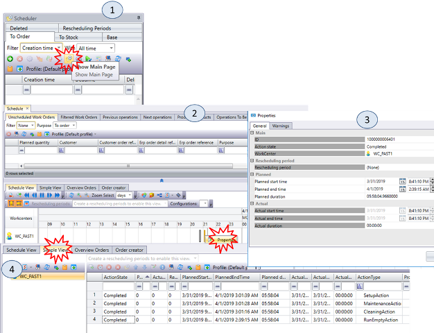{.center}

Модуль `Scheduler` можна використовувати як для планування операцій (буде розглянуто пізніше) так і для перегляду історії операцій.

1.  Відкрийте вікно модуля `Scheduler` (`View -Scheduler`). У вікні навігатора об\'єктів (рис.1.7(1)) виберіть `Show Main Page`. Дочекайтеся поки відкриється вікно властивостей (рис.1.7(2)).
2.  На вкладці `Scheduled View` (див. рис.1.7(2)) виберіть `Zoom Select = hours`. Знайдіть сервісні операції, які були проведені. У контекстному меню операції можна вибрати і показати вікно властивостей (рис.1.7(3)). У вікні властивостей відображається детальна інформація про операції, а також попередження, якщо такі мали місце при виконанні операції.
3.  Перейдіть на вкладку `Simple View` (рис.1.7(4)). У цьому вікні видно перелік операцій у вигляді таблиці. Через контекстне меню також можна подивитися всі необхідні властивості.
4.  Зробіть копію екрану для звіту.

---

###  8. Планування сервісних операцій з використанням Scheduler: спосіб 1 

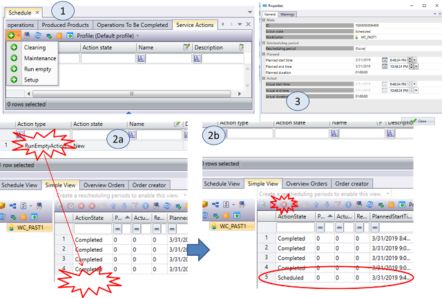{.center}

Можна скористатися `Scheduler` для формування плану як виробничих так і сервісних операцій на робочому центрі. Для цього у верхній частині головної сторінки планувальника є вікно де можна вибирати як робочі замовлення (`Work Orders`) так і сервісні операції.

1.  На головній сторінці `Scheduler`, відкрийте закладку `Service Action` (рис.1.8(1)). Додайте `Run Empty`.
2.  Перетягніть мишкою дане замовлення в список `Simple View` (рис.1.8(2a)).
3.  Після цього список замовлень на сервісні операції стане порожнім, а список операцій в `Simple View` поповниться `RunEmptyAction` зі станом `Scheduled` (рис.1.8(2b)).
4.  Зробіть копію екрану для звіту.
5.  Подвійним кліком або через контекстне меню відкрийте вікно властивостей операції (рис.1.8(3)). Використовуючи це вікно можна змінювати налаштування плану запуску і зупинки.
6.  Використовуючи кнопку видалення замовлення (рис.1.8(2b)) видаліть операцію з плану.

---

###  9. Планування сервісних операцій з використанням Scheduler: спосіб 2 

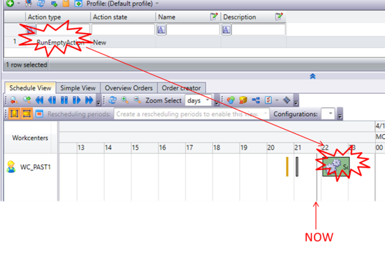{.center}

1.  Переключіть основне вікно `Scheduler` на вкладку `Scheduler View`, створіть `RunEmptyAction` і перемістіть її на графік правіше лінії поточного часу. Підсвічування контуру буде показувати можливість такого переміщення.
2.  Тут також є вікно властивостей (`Properties`) в якому можна означити точний час планованого запуску. Відкрийте його і змініть час на 10 хвилин від поточного.
3.  Не закривайте цю вкладку, перейдіть на панель керування робочим центром і запустіть операцію на виконання.
4.  Перейдіть у вікно `Simple View` і подивіться на стан операції, також подивіться на її стан в вікні `Schedule View`.
5.  Зупиніть виконання операції з робочого центру.
6.  Зробіть копію екрану `Schedule` для звіту.

---

### 10. Визначення необхідного устатковання робочого центру. 

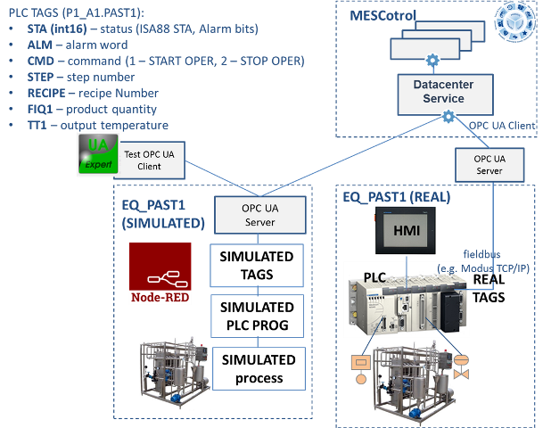{.center}

- Ознайомтеся з описом демонстраційної установки.

Устатковання `EQ_XX_PAST1` для пастеризаційної установки призначене для взаємодії робочого центру Monentum (показано як `MESControl`) з системою керування технологічним процесом. Необхідні у функціях Monentum дані надходять від ПЛК установки, а значення параметрів процесу, команди диспетчерського керування, вибір рецепта від Monentum до ПЛК. Рішення за місцем щодо запуску в даному випадку приймає оператор установки з використанням операторської панелі HMI.

Тег `STA` призначений для отримання загальної інформації про стан установки. Цей тег буде використовуватися як для синхронізації рівнів керування, так і для ведення історії процесу. Тег `ALM` показує наявність аварій, `STEP` - поточний крок роботи програми установки. `FIQ1` - поточне значення лічильника пастеризованого молока, яке подається на вихід пастеризатора. `TT1` - температура молока на виході пастеризатора. RECIPE використовується для вибору номера рецепту в установці. Тег `CMD` - призначений для відправки команд на запуск установки і її зупинка. Команди підтверджуються оператором за місцем.

Зв\'язок з устаткованням пастеризаційної установки здійснюється з використанням стандарту OPC UA. Замість реального контролера, в даних прикладах використовується демонстраційний застосунок, який функціонує в середовищі Node-RED. У складі демонстраційного застосунку знаходиться імітатор процесу, імітатор додатку ПЛК який змінює імітовані теги і реагує на їх зміну. Імітаційні моделі розроблені спеціально під навчальне завдання курсу.

Для перегляду значень, тесту і зміни тегів використовується безкоштовний тестовий OPC UA Client - UA Expert. Цей клієнт можна використовувати з будь-яким OPC UA Server.

---

### 11. Робота с тестовим OPC UA Client для перевірки тегів: налаштування підключення до OPC UA серверу Node-RED. 

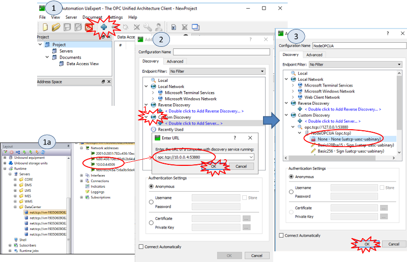{.center}

Тестовий OPC Client `UA Expert` дає можливість переглядати і змінювати значення об\'єктів OPC UA Server.

1.  Для визначення IP-адреси у вікні Layout виберіть перший сервер зі списку і запам'ятайте адресу IP (рис.1.11(1а)).
2.  Запустіть `OPC UA Expert`. При першому запуску необхідно буде ввести в поле `Organization` назву організації або своє прізвище і натиснути `Ok`.
3.  Виберіть `Add Server` (рис.1.11(1)).
4.  У вікні вибору серверів виберіть `Add Custom Discovery` (рис.1.11(2)).
5.  У полі URL введіть адресу з IP, визначеною в п.1 і портом 53880 (див на рис.1.11(2)) і натисніть `Ok`.
6.  У списку способів підключення виберіть None як показано на рис.1.11(3) і натисніть кнопку Ok.
7.  Після цього в списку серверів навігатора проекту з\'явиться сервер з ім\'ям NodeOPCUA.

---

###  12. Робота з тестовим OPC UA Client для перевірки тегів: підключення до серверу Node-RED. 

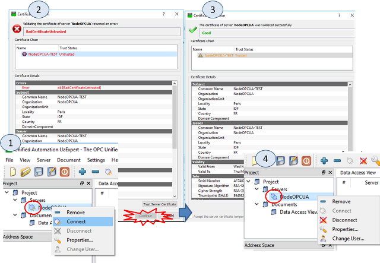{.center}

1.  Клієнт за замовчуванням не підключається до сервера, про що свідчить піктограма (рис.1.12(1)). Через контекстне меню виберіть команду Connect.
2.  Якщо до цього OPC UA Expert не з\'єднує з цим Node-RED, з\'явиться вікно про недійсний сертифікат (рис.1.12(2)).
3.  Вибравши команду `Trust Server Certificate`, сертифікат сервера приймається за дійсний (рис.1.12(3)). Після цього вікно підтвердження сертифіката можна закривати, а Клієнт підключається до сервера.

---

###  13. Робота з тестовим OPC UA Client для перевірки тегів: відображення і зміна значення тегів. 

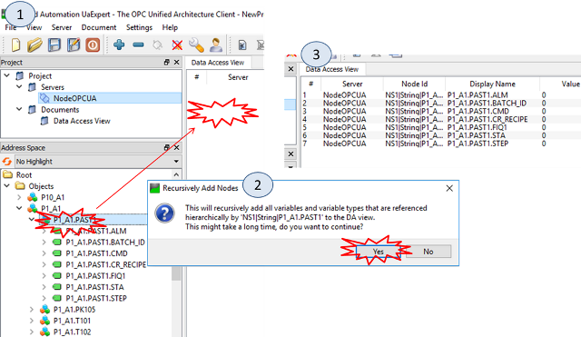{.center}

1.  З панелі `Address Space` виберіть об\'єкт `PX_A1.PAST1` і перетягніть його на панель `Data Access View` (рис.1.13(1)), де `X` -- номер варіанту.
2.  З\'явиться вікно в якому потрібно підтвердити свій вибір (рис.1.13(2))
3.  Перелік всіх тегів з\'явиться в списку `Data Access View` (рис.1.13(3)).
4.  Подвійним кліком в поле `Value` для тега `FIQ1` змініть значення на `123`.

---

### 14. З\'єднання Data Center з джерелом даних на OPC UA Server

**Даний пункт тільки для перегляду. Нічого не змінюйте в налаштуваннях!**

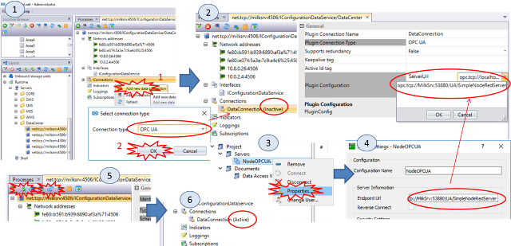{.center}

1.  У `Shell` відкрийте модуль `Layout`, знайдіть і відкрийте сервер `DataCenter`.
2.  У розділі `Connections` знайдіть з\'єднання з ім\'ям `DataConnections` (рис.1.14). Виділіть `DataConnections` щоб з\'явилися його налаштування.
3.  У `Server URL` повинно бути вказана повна URL для доступу до endpoint OPC UA Server.

---

### 15. Створення устатковання в робочому центрі WC\_XX\_PAST1 

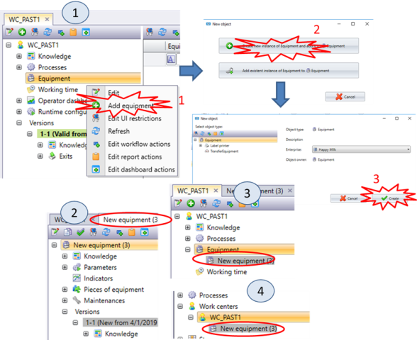{.center}

1.  У Shell відкрийте в модулі `Layout` робочий центр `WC_XX_PAST1`, у вікні властивостей виберіть `Add Equipment` (рис.1.15(1)). Вам запропонують створити нове устатковання або підключити існуюче. Підключення існуючого устатковання можливо тільки при наявності його в списку непідключених.
2.  Буде створено `Equipment`, в окремій вкладці відкриється його вікно властивостей (рис.1.15(2)). Як видно, робота з устаткованням також проходить через керування версіями. Устаткування з\'являється як дочірній компонент `WC_XX_PAST1`, який видимий як у вікні властивостей робочого центру (рис.1.15(3)) так і в навігаторі об\'єктів (рис.1.15(4)).

---

### 16. Налаштування властивостей і створення параметрів устатковання 

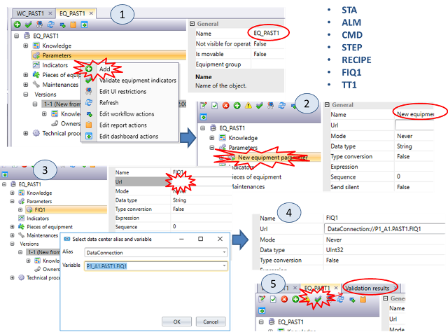{.center}

1.  У властивостях устатковання задайте ім\'я (`Name` та `Code`) `EQ_XX_PAST1` (рис.1.16(1)) після чого, використовуючи кнопку `Add`, додайте параметр.

2.  Змініть ім\'я параметра на `FIQ1` (рис.1.16(2)).

3.  В URL джерела даних задайте адресу тега `FIQ1` з адресою `PXX_A1.PAST1.FIQ1` , де `XX` -- номер варіанту (рис.1.16(3)). Результат з\'явиться в зазначеній властивості (рис.1.16(4)).

4.  Перевірте правильність використовуючи кнопку `Validate Equipment Indicator` (рис.1.16(5)). Якщо теги задані правильно у вікні `Validation results` не буде повідомлень.

5.  Крім  `FIQ1`  додайте також всі інші теги як параметри:

- `STA`
- `ALM`
- `CMD`
- `STEP`
- `RECIPE`
- `TT101`

---

### 17. Перегляд значень параметрів устатковання 

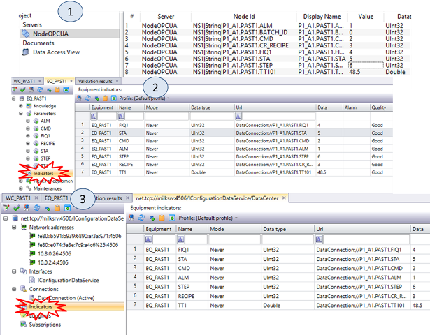{.center}

1.  Використовуючи OPC UA Expert змініть значення тегів в OPC UA Server для `PAST1` (рис.1.17(1)). **Зверніть увагу, що теги можуть імітуватися, щоб це не відбувалося, виставіть значення тегу `smOn` в `false`.** **Значення CMD завжди обнуляється самостійно.**
2.  Перевірте значення тегів в `Indicators` `EQ_XX_PAST1` (рис.1.17(2)). Зверніть увагу, дані там з'являться не одразу.
3.  Всі використовувані теги для `DataCenter` можна подивитися в розділі `Indicators` його властивостей (рис.1.17(3)).
4.  Зробіть копії екранів.

---

## Питання до захисту

1. Розкажіть про цех, який використовується в лабораторній роботі та призначення робочих центрів в ньому.
2. Які типи робочих центрів відповідно до технологічних процесів Ви знаєте? Розкажіть особливість проходження технологічних процесів в ньому.
3. Які мінімальні властивості необхідно задати для робочого центру? Поясніть за що вони відповідають для робочого центру неперервного типу.
4. Навіщо потрібне керування версіями робочих центрів?
5. Яке призначення модуля Supervisor? Які дії і для чого використовувалися з цього модуля?
6. Які сервісні дії робочих центрів використовувалися в лабораторній роботі? Розкажіть про їх призначення.
7. Покажіть як передивитися історію операцій/дій робочого центру в модулі Supervisor? 
8. Покажіть як передивитися історію операцій/дій робочого центру в модулі Scheduler?
9. Яким чином можна видалити заплановану операцію/дію?
10. Яким чином можна дізнатися про стан операції/дії?
11. Яке призначення устатковання (Equipment) в Momentum? Які рівні Equipment воно реалізує відповідно до ISA-95/ISA-88?
12. Прокоментуйте які теги і для чого використовуються з ПЛК? 
13. Розкажіть про реалізацію демонстраційної установки з імітатором. Яким чином відбувається зв'язок з Momentum?
14. Навіщо в лабораторній роботі використовуєтсья тестовий OPC UA Client? Які саме його можливості використовувалися в роботі?
15. Яким чином задається адреса тега, до якого прив'язується параметр устатковання?

| [<- до лаборних робіт](README.md)                       | [на основну сторінку курсу](../README.md)              |
| ------------------------------------------------------- | ------------------------------------------------------ |
| [<- 1. Підключення до віртуальної машини](0_prepare.md) | [Лр2. Основи роботи з сегментами продукту-](2_prod.md) |