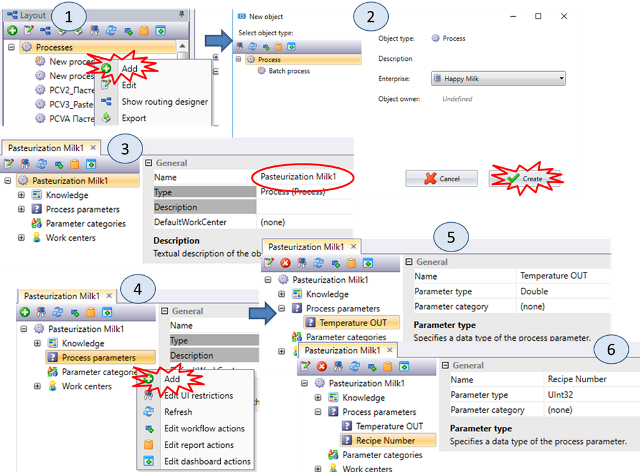
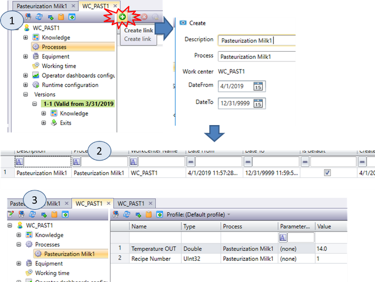
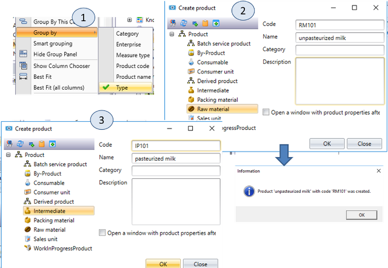
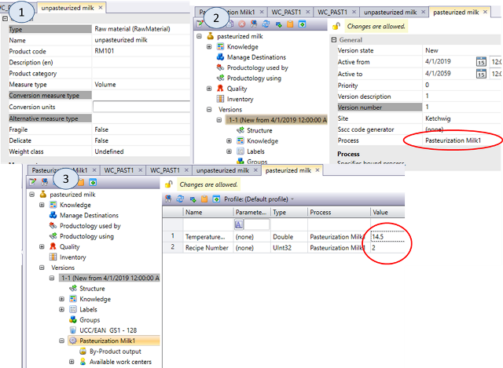
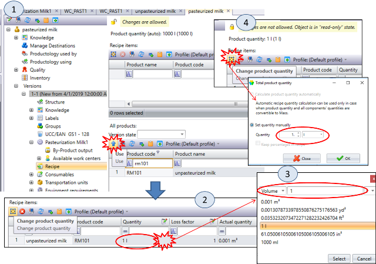
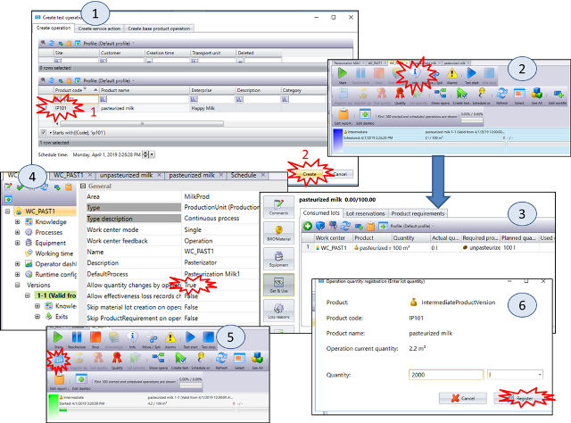
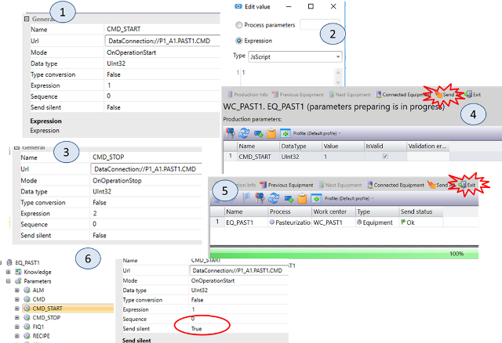
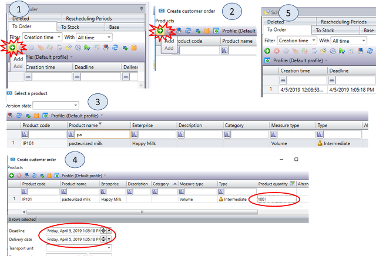
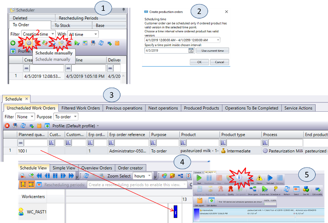

| [<- до лаборних робіт](README.md)                            | [на основну сторінку курсу](../README.md)                 |
| ------------------------------------------------------------ | --------------------------------------------------------- |
| [<-Лр1. Основи роботи з робочими центрами та операціями та устаткованням](1_base.md) | [Лр3. Основи роботи з зонами зберігання->](3_storzone.md) |

# Лабораторна робота №2 

## Тема. Основи роботи з сегментами продукту та ручне планування

**Тривалість**: 4 акад. години (2 пари).

**Мета:** ознайомлення з означенням сегментів продуктів та ручним плануванням.    

**Завдання для виконання роботи**

**Цілі.** 

1. Означити сегменти продукту для сировини і напівпродукту "Пастеризоване молоко"

2. Зробити тестовий запуск операції для виготовлення напівпродукту.
3. Налаштувати взаємодію між робочим центром та устаткованням для запуску/зупинки операцій.
4. Створити та вручну запланувати замовлення на виготовлення напівпродукту.  

## Порядок виконання роботи 

### 1. Створення процесу 

1.  У модулі Layout створіть новий процес (рис.2.1(1)). У типах процесу виберіть звичайний процес (рис.2.1(2))
2.  Перейменуйте новостворений процес в `Pasteurization Milk XX`, де **XX** --номер варіанту (рис.2.1(3)). 

Процеси використовуються для означення технологічних процесів для перетворення одного матеріалу (продукту) в інший. Процеси з одного боку означуються в сегменті продукту для того щоб вказати яку технологічну дію необхідно провести для вироблення цього продукту, а з іншого в робочих центрах, для того щоб вказати які процеси може виконувати даний робочий центр. Перелік процесів видно в модулі Layout на будь-якому рівні ієрархії, так як вони глобальні для всього підприємства.

3. Для новоствореного процесу задайте два технологічних параметра `Temperature OUT` з типом `Double` і `Recipe  Number` з типом `Uint32`(рис.2.1(5) і рис.2.1(6)), які будуть приймати участь в контролі і управлінні процесом створення продукту.

Технологічні параметри процесу вказують на вимоги до проходження даного процесу. Це можуть бути, наприклад різноманітні рецептурні уставки. Ці параметри задаються для робочого центру, процесу, версії сегменту продукту. Якщо для процесу параметр на заданий, його значення береться з робочого центру. Параметр, що заданий в означенні сегменту продукту для конкретної версії має найвищий пріоритет.    

---

### 2. Додавання процесу в робочий центр 

Кожен робочий центр може виконувати певний набір технологічних операцій. Саме цей набір означує які виробничі операції може виконувати цей робочий центр. Пастеризатор може виконувати пастеризацію різних типів продуктів за різних параметрів. Для цього можна визначити кілька процесів, але можна змінювати параметри того ж процесу для різних продуктів.

1. Відкрийте властивості робочого центру `WC_XX_PAST1`. У списку процесу додайте процес `Pasteurization Milk XX` (рис.2.2(1))
2. В результаті в списку процесів робочого центру з\'явиться один процес (рис.2.2(2)).
3. Визначте значення параметрів для робочого центру:  `Temperature OUT=14.0` і `Recipe  Number=1`  (рис.2.2(3))

---

### 3. Додавання сегментів продуктів 

Пізніше ми будемо розбивати кінцеві продукти на сегменти. Зараз же визначимо всього два сегменти продукту: сировина -- "непастеризоване молоко XX" (`unpasteurized milk XX`) і "напівфабрикат XX" -- "пастеризоване молоко XX" (`pasteurized milk XX`). Тобто для виготовлення пастеризованого молока необхідно сировину - непастеризоване молоко. 

1.  Виберіть модуль `View -> Products`, для зручності через контекстне меню колонок виберіть групування по Типу (рис.2.3(1)).
2.  Використовуючи кнопку `Add`(`+`) в браузері об\'єктів `Products` додайте новий продукт. У типах продукту виберіть `Raw material` (пізніше це змінити буде неможливо), у властивостях вкажіть код (`RM_XX_101`) і ім\'я (`unpasteurized milk XX`) (рис.2.3(2)). Після натискання кнопки ОК натисніть кнопку підтвердження у вікні `Information`.
3.  Створіть продукт `pasteurized milk XX` типу Intermediate з кодом `IP_XX_101` (рис.2.3(3)).

---

### 4. Визначення властивостей продукту 

У цьому пункті необхідно вказати технологічний процес та параметри його проходження для виготовлення цього сегменту продукту.

1.  У вікні властивостей для `unpasteurized milk XX` означте властивість `Measure Type = Volume` (рис.2.14(1)). Аналогічну операцію зробіть для `pasteurized milk XX`
2.  У вікні властивостей версії `pasteurized milk XX` визначте процес `Pasteurization Milk XX` (рис.2.4(2)). Після цього в переліку властивостей з\'явиться цей процес для настройки. Таким чином для цього сегмента продукту визначається який процес необхідний для створення продукту.
3.  Визначте параметри процесу для продукту `pasteurized milk XX` (рис.2.4(3)). Ці значення параметрів будуть мати вищий пріоритет ніж означені в процесі і в робочому центрі. 

---

### 5. Означення рецепта для продукту 

У цьому пункті необхідно означити рецепт створення продукту, тобто які компоненти і в якій кількості необхідні для цього. Для кожного інгредієнта необхідно вказати:

- **Product code** - код інгредієнта 
- **Quantity**  - кількість інгредієнта, яка подається у відповідності з рецептом. 
- **Loss factor** - визначається як відношення кількості продукції на виході (Actual quantity) до кількості продукту на вході (Quantity)
- **Actual quantity** = **Quantity/LossFactor**  - кількість інгредієнта в готовому продукті після виробництва.  

Загальна кількість продукту на виході (`Product Quantity`) може розраховуватися автоматично як сума `Actual quantity` усіх компонентів. Це можливо у випадку, якщо виставлені масові одиниці. У іншому випадку це здається вручну (задається `Change product quantity`) 

1. У налаштуваннях `Recipe` для `pasteurized milk XX`, використовуючи кнопку `Use`, додайте попередньо виділений рецепт в список `Recipe items` (рис.2.5(1)).

2. Використовуючи кнопку `...` (рис.2.5(2)) змініть `Quantity` на `1l` (рис.2.5(3)). Використовуючи кнопку `Change product quantity` (рис.2.5(4)) змініть загальну кількість продукту на `1 l`. При таких налаштуваннях для приготування продукту `pasteurized milk XX` буде потрібна така ж кількість сировини (100%).

3. Валідуйте версії обох продуктів ( `unpasteurized milk XX` і  `pasteurized milk XX`): у контекстному меню продукту виберіть опцію `Edit version status -> Valid`.

---

### 6. Тестовий запуск приготування продукту

У цьому пункті запускається операція для виготовлення конкретного сегменту продукту на робочому центрі і вручну реєструється певна кількість виготовленого продукту.  

1.  Відкрийте модуль `Supervisor`, і в робочому центр виберіть `Create Test operation`. У вікні вибору операцій виділіть продукт `pasteurized milk XX` і натисніть `Create` (рис.2.6(1)).
2.  Зробіть оновлення щоб операція з'явилася в переліку запланованих. Виберіть заплановану операцію і натисніть кнопку `Info` (рис.2.6(2)).
3.  Перейдіть у вікно інформації про операції та подивіться зміст всіх розділів і вкладок (`Comment`, `Bill of Material`, `Get & Use` \...). За допомогою цього вікна можна отримати інформацію про продукт а також визначати деякі параметри. Пізніше ми більш детально їх розглянемо. Натисніть `Exit` для того щоб закрити вікно Info.
4.  Запустіть на виконання операцію по створенню продукту. Для введення кількості виробленого продукту існує кнопка `Register Quantity`, але вона не активна. Для активації такої можливості перейдіть в властивості робочого центру і виставте опцію в `Allow quantity changes = TRUE` (рис.2.6(4)).
5.  На панелі команд активізується кнопка `Register Quantity` (рис.2.6(5)). Натиснувши на неї вкажіть кількість виробленого продукту `2000 l` (рис.2.6(6)).
6.  Зупиніть виконання поточної операції. У вікні вибору зупинки вкажіть `Break OFF`.

---

### 7. Означення запису параметрів-команд на устатковання 

У цьому пункті необхідно забезпечити синхронізацію команд запуску і зупинки в робочому центрі та прив'язаному до нього  устаткування. Для цього при старті операції на устатковання буде відправлятися команда (`CMD`) зі значенням `1`, а при зупинці - `2`.  

1.  В обладнанні робочого центру  `EQ_XX_PAST1` (вибирається у модулі `Layout`) створіть параметр `CMD_START`. Значення `Mode` вкажіть рівним `On Operation Start` (рис.2.7(1)). 
2.  Визначте значення `Expression` рівним  `1` (рис.2.7(2)). Таким чином при старті операції в робочому центрі в OPC Server буде встановлюватися значення `PXX_A1.PAST1.CMD` рівним 1.
3.  Створіть параметр `CMD_STOP` щоб при стопі операції (`On Operation Stop`) в робочому центрі в OPC Server встановлюватися значення `PXX_A1.PAST1.CMD` рівним `2` (рис.2.7(3)).
4.  Відкрийте модуль супервізора, створіть нову тестову операцію по виробництву продукту `pasteurized milk` і запустіть її на виконання. При старті з\'явиться вікно підтвердження відправки значення `1` в параметр `CMD_START` устатковання (рис.2.7(4)). При натисканні `Send_All`, значення будуть відправлені в OPC Server. Після чого з\'явиться вікно звіту відправки (рис.2.7(5)). Закрийте вікно, натиснувши `Exit`. Використовуючи UA Expert упевніться, що значення змінної `PXX_A1.PAST1.STA` змінилося в `2`, що значить перехід до виконання операції.
5.  Зупиніть виконання операції робочого центру. З\'явиться вікно підтвердження відправки значення `2` в параметр `CMD_STOP` устатковання. Проведіть дії аналогічно п.4. Використовуючи UA Expert упевніться, що значення змінної `PXX_A1.PAST1.STA` змінилося в `1`, що значить простій.
6.  Виставте для параметрів `CMD_START` і `CMD_STOP` властивості `Send Slient` рівним значенню `True`. Це означає що запис буде проводитися без підтвердження оператором. Зробіть створення, запуск і зупинку операції з виробництва продукту `pasteurized milk`.

---

### 8. Створення замовлення на виготовлення напівфабрикату 

**До уваги викладачів!** Для виконання даного завдання параметр `Possible product types to order` (`MEScontrol.MES.Serverices-> Scheduler`) має дорівнювати `SalesUnit, IntermediateProduct, ConsumerUnit`.

У даному пункті створюється клієнтське замовлення на створення певної кількості пастеризованого молока. Сьогодні на більшості молочних підприємств нерозфасоване пастеризоване молоко не реалізовується як готовий продукт. Тим не менше ця ситуація гіпотетично можлива. Клієнтське замовлення мало б відправлятися від рівня ERP, але в даній лабораторній роботі воно створюється в Momentum. Для замовлення, зокрема, вказується продукт, кількість, час постачання (`Delivery Date`) та максимальний час виробництва (`Deadline`).    

1.  Відкрийте модуль `Scheduler`.
2.  Проконтролюйте щоб у вікні `Location Browser` було обрано ваш `Area`.  Використовуючи кнопку `Add` (рис.2.8(1)) додайте клієнтське замовлення (`Customer Order`).
3.  У вікні створення замовлень натисніть `Add` (рис.2.8(2)), після чого виберіть напівфабрикат `IP_XX_101` (рис.2.8(3)) і натисніть «Ok»
4.  Впишіть в комірку `Product quantity` значення `100 l` (рис.2.8(4))
5.  Змініть `Deadline` i `Delivery date` на 3-4 години пізніше поточного часу і натисніть «Ok».
6.  У вікні клієнтських замовлень з\'явиться нове замовлення.

---

###  9. Ручне планування (Schedule Manually) і запуск виробництва напівфабрикату 

У даному пункті клієнтське замовлення вручну планується на робочий центр. Для цього клієнтське замовлення розбивається на робочі замовлення (`Work Orders`) відповідно до означення сегментів продукту. Враховуючи, що для приготування пастеризованого молока використовується тільки перетворення з сировини на сегмент продукту `Pasteurization Milk`, достатньо тільки одного робочого замовлення. Далі при ручному плануванні робоче замовлення можна запланувати на конкретний робочий центр, який сумісний з ним (тобто в сегменті продукту використовується той самий процес як в робочому центрі).

1.  Відкрийте головне вікно планувальника (`Show Main Page`) (рис.2.9(1)).
2.  Виділіть замовлення, натисніть кнопку `Schedule manually` (рис.2.9(1)).
3.  У вікні `Create production orders` натисніть «Ok» (рис.2.9(2)).
4.  Тепер з клієнтського замовлення було зроблено одне робоче замовлення (`Work Orders`), оскільки для приготування напівфабрикату використовується тільки один процес `Pasteurization Milk XX` . Усі незаплановані робочі замовлення можна знайти у закладці `Unsheduled Work Orders`(рис.2.9(3)).
5.  Перетягніть створений `Work Order` на `Schedule View` за смугу поточного часу для робочого центру (рис.2.9(4)).
6.  Відкрийте панель керування робочим центром `WC_XX_PAST1` У панелі керування з\'явиться робочий замовлення (рис.2.9(5)).
7.  Натисніть кнопку \"Info\" і ознайомтеся з вмістом всіх вкладок.
8.  Використовуючи модуль супервізора запустіть, зареєструйте 100 літрів виготовленої продукції і через кілька секунд зупиніть виконання операції.

---

## Питання до захисту

1. Розкажіть про призначення технологічного процесу. Що таке параметри процесу? Яку пріоритетність має значення параметрів заданих в процесі, робочому центрі і в версії продукту?
2. Поясніть як при плануванні буде відомо на яких робочих центрах можна виготовляти конкретні сегменти продукту?
3. Поясніть що таке сегменти продукту? Які сегменти продукту і якого типу використовувалися в лабораторній роботі? Чим відрізняються типи сегментів?
4. Які основні властивості і навіщо задаються в означенні сегментів продукту?
5. Розкажіть як на основі параметрів рецепту задається необхідна кількість вхідної речовини та розраховується кількість вихідної?
6. Розкажіть яким чином в ручну реєструється виготовлена кількість продукту на робочому центрі.
7. Як в лабораторній роботі вирішено питання синхронізації команд запуску і зупинки робочого центру з відповідним устаткованням? Що задає властивість `Send Silent`  в параметрі? 
8. Розкажіть що таке клієнтське замовлення (`Customer order`). Які властивості вказуються для замовлення в Monentum?
9. Розкажіть про процес перетворення клієнтського замовлення в заплановані операції на робочих центрах при ручному плануванні.        

| [<- до лаборних робіт](README.md)                            | [на основну сторінку курсу](../README.md)                 |
| ------------------------------------------------------------ | --------------------------------------------------------- |
| [<-Лр1. Основи роботи з робочими центрами та операціями та устаткованням](1_base.md) | [Лр3. Основи роботи з зонами зберігання->](3_storzone.md) |