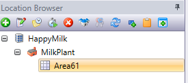
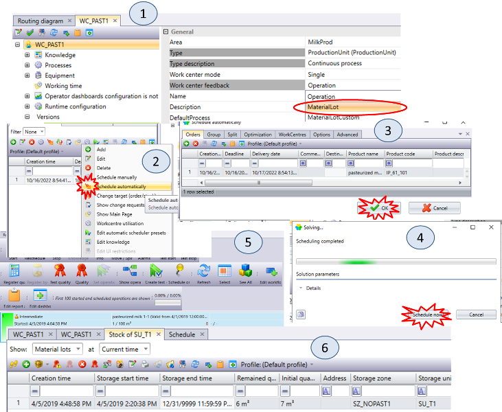

| [<- до лаборних робіт](README.md)                       | [на основну сторінку курсу](../README.md)                    |
| ------------------------------------------------------- | ------------------------------------------------------------ |
| [<-Лр2. Основи роботи з сегментами продукту](2_prod.md) | [Лр4. Основи роботи з автоматичним плануванням->](4_schedbase.md) |

# Лабораторна робота №3 

## Тема. Основи роботи з партіями матеріалу та зонами зберігання 

**Тривалість**: 4 акад. години (2 пари).

**Мета:** ознайомлення з принципами переміщення та зберігання партій матеріалів.    

**Завдання для виконання роботи**

**Цілі.** 

1. Створити зони та вузли зберігання для рідкої продукції.
2. Зареєструвати вручну надходження матеріалу (сировини) до зони зберігання.
3. Налаштувати маршрутну діаграму для зв'язку між робочим центром та зоною зберігання.
4. Перевірити автоматичну реєстрацію вивантаженого матеріалу з зони зберігання при реєстрації виробленого матеріалу на робочому центрі.  

## Порядок виконання роботи 

### 1. Створення зони зберігання

У цьому пункті необхідно створити зону зберігання для розміщення сировини, яка використовується в цеху приготування. Зона та вузол зберігання використовуються для контролю та керування переміщення матеріалів а також їх обліку. У якості одиниці переміщення вважається  партія матеріалу (`Material Lot`) - це одиниця (певного об'єму, маси, або кількості) матеріалу, яка фіксується в базі даних як певний запис.  

Зони та вузли зберігання бувають різного типу. Наприклад **Буферна зона зберігання (Buffer storage zone)** вказує на те, що зона зберігання використовуєтсья як місце тимчасового зберігання, не має обмеження за пропускною здатністю, може зберігати матеріали різних типів і мір,  

**Зона зберігання з резервуарами(Tank storage zone)** може містити танки. Резервуар (танк) - це підтип буферу, який призначений для збереження рідини, має ємність, має тип вимірювання, має правила збереження FIFO/LIFO/Пропорційний. Таким чином тип `Tank storage zone` вказує на те, що в зоні будуть використовуватися резервуари(вузли зберігання), в яких зберігається рідкий продукт.  

1.  Використовуючи кнопку `Add` у вікні навігатора об\'єктів модуля `Layout` додайте зону зберігання (`Storage Zone`) (рис.3.1(1))
2.  Вкажіть тип `Tank storage zone` (рис.3.1(2)) а місце розміщення Area залиште Вашу Area. 
3.  Вкажіть ім\'я `SZ_XX_NOPAST1`.
4.  Зробіть валідацію зони зберігання.

---

### 2. Створення танка зберігання 

У цьому пункті необхідно створити вузол зберігання - танк, означити для нього необхідні властивості, зокрема: ємність, правила зберігання (Storage rule). Простежування матеріалу йде по партіям. Тобто якась партія надходить в танк зони зберігання, якась виходить з неї. Кожна партія має певний обсяг. Тому партія матеріалу буде переміщуватися відповідно до означених правил. Ці правила `Storage rule` можуть бути:

- FIFO - перший прийшов, перший вийшов. У даному випадку партія матеріалу, яка прийшла першою в танк, покине його також першою. Це можна представити як танк в якому матеріал не перемішується, і надходить до нього зверху, а забирається знизу.    
- LIFO - останнім прийшов, першим вийшов. У даному випадку партія матеріалу, яка прийшла першою в танк, покине його остнньою. Це можна представити як танк в якому матеріал не перемішується, і надходить до нього знизу і забирається також знизу.    
- Пропорційний (Proportional) -  коли матеріал з споживається пропорційно з кожної партії.  Це можна представити як танк в якому матеріал миттєво перемішується. Тому умовно при споживанні частини від усіх партій пропорційно попадають на вихід. 

1.  Використовуючи кнопку `Add` у вікні навігатора об\'єктів модуля Layout додайте вузол зберігання (`Storage Unit`) (рис.3.2(1))
2.  У вікні вибору (рис.3.2(2)) вкажіть `Create new instance of Storage unit and add ...`
3.  Вкажіть тип `Tank Storage Unit` (рис.3.2(3)) і натисніть `Create`
4.  Для створеного Tank Storage Unit вкажіть ім\'я `SU_XX_T1` (рис.3.2(4))
5.  У властивостях версії вкажіть обсяг 10000 л (рис.3.2(5))
6.  Зробіть валідацію.

---

### 3. Реєстрація додавання сировини в танк зберігання

Реєстрація поступання партії речовини в вузол зберігання або споживання з нього може відбуватися вручну, наприклад через вікно `Stock`, або автоматично при відповідній реєстрації його відправки чи приймання на суміжних робочих центрах або зонах зберігання. У цьому пункті необхідно зареєструвати надходження матеріалу ручну. Вказується тип сегменту продукту, його кількість та автоматично генерується ідентифікатор.  

1.  Відкрийте модуль Stock
2.  Через контекстне меню танка `SU_XX_T1` відкрийте вікно Stock Grid (рис.3.3(1)).
3.  Зареєструйте надходження сировини, використовуючи кнопку Produce (рис.3.3(2))
4.  У вікні вибору типу і кількості продукту (рис.3.3(3)) використовуючи кнопку `Change`  виберіть сировину `RM_XX_101` (рис.3.3(4))
5.  Визначте кількість в `QuantityToHandle` рівним 7000 л (рис.3.3(3)) і натисніть «Ок».
6.  В «initial quantity» і «remain quantity» таблиці Stock буде по 7000 л (рис.3.3(5))
7.  Подивіться властивості версії `SU_XX_T1` там також відображається поточна кількість в танку д (рис.3.3(6))

---

### 4. Конфігурація маршрутизації Routing Diagram 

Для того щоб вказати системі яким чином пов'язані робочі центри та області зберігання між собою використовується  маршрутна дігаграма `Routing Diagram`, в якій усі пов'язані частини виробництва показуються зв'язками. Використовуючи цю діграму система, наприклад знатиме як переміщуються матеріали, як пов'язані операції різних робочих центрів та яким чином проводити планування. 

У даному пункті важливо вказати як пов'язаний робочий центр та зона зберігання матеріальними потоками. Тому для з'єднань важливо для цього вказати властивість `Feedback behavior` (поведінка зворотного зв'язку), яка показує як буде пов'язана реєстрація виготовлення/споживання партії матеріалу на пов'язаних робочому центрі та зонах зберігання:

- `No action` - не будуть пов'язані, у кожного робочого центра відбувається незалежна реєстрація продукту;  
- `Feedback to previous` (зворотній зв'язок до попереднього) - реєстрація вироблення на кінцевому вузлі (на який вказує стрілка) буде автоматично приводити до реєстрації на початковому (русурсі) 
- `Feedback to next` (зворотній зв'язок до наступного) - Реєстрація на вироблення на ресурсному вузлі буде автоматично приводити до реєстрації на кінцевому.

1.  Через браузер об\'єктів модуля `layout` відкрийте `Routing Designer` (рис.3.4(1))
2.  У вікні `Location Browser` виставте курсор на вашій Area. **Це важливо, щоб не конфілктувати з  Routing Designer інших Area!**

1.  У вікні Routing Designer відкрийте вкладку `Storage zones` (рис.3.4(2)). Якщо такої вкладки немає, очевидно не стоять опції `Show Resorces`, `Show Properties` , тоді активуйте їх (перша опція-кнопку `Show All locations` повинна бути деактивована).  У  вкладці `Storage zones` будуть відображатися всі нерозміщені в `Routing Designer` зон зберігання. Перетягніть зону `SZ_XX_NOPAST` на діаграму.
2.  Відкрийте вкладку `Work Centers` (рис.3.4(3)). Перетягніть `WC_XX_PAST1` на діаграму. Таким чином на діаграмі будуть розміщені два об\'єкти (рис.3.4(4)).
3.  Зробіть з\'єднання від `SZ_XX_NOPAST1` до `WC_XX_PAST1` використовуючи контекстні меню об\'єктів (рис.3.4(4)). Кінцевий результат показаний на рис.3.4(5).
4.  Натиснувши по з\'єднанню з\'явиться вікно його властивостей (рис.3.4(6)). Змініть властивість `Feedback behavior` рівним `Feedback to previous`. Таким чином прогрес (реєстрація продукту) в робочому центрі `WC_XX_PAST1` буде приводити до прогресу в `SZ_XX_NOPAST` (споживання сировини).

---

### 5. Запуск приготування продукту з урахуванням споживання сировини

1.  У властивостях робочого центру `WC_XX_PAST1` задайте значення `Work center feedback` рівним значенню `Material lot` (рис.3.5(1)). Реєстрація відібраної з зони зберігання партії матеріалу буде проводитися по зворотному зв\'язку за кількістю виробленої продукції.
2.  У модулі Scheduler створіть клієнтське замовлення на виготовлення 1000 л напівфабрикату `Pasteurized milk XX`  `IP_XX_101`, як це робилося у лабораторній роботі 2.9 . Змініть `Deadline` i `Delivery date` на 3-4 години пізніше поточного часу і натисніть «Ok». У вікні клієнтських замовлень з\'явиться нове замовлення. 
3.  Натисніть кнопку `Schedule Automatically` в модулі `Scheduler`  (рис.3.5(2)) для запуску автоматичного планування виберіть замовлення та натисніть `Ok` (рис.3.5(3)). У спливаючому вікні `Solving` (рис.3.5(4)) натисніть кнопку `Schedule now`. Відкрийте в `Sheduler` вікно `Shedule View` (  `Show Main Page`)  і проконтролюйте що на робочий центр автоматично спланувалася операція. 
4.  В панелі керування (Supervisor) робочого центру `WC_XX_PAST1` запустіть операцію по виготовленню "Pasteurized milk XX\". За допомогою кнопки `Register quantity` зареєструйте 1000 л продукту (рис.3.5(5)). Зупиніть виконання операції.

5. Перейдіть у вікно `Stock Grid` модуля `Stock`. Кількість продукту, що залишився  має зменшитися на 1000 л (рис.3.5(6)).

---

## Питання до захисту

1. Поясніть що таке партія матеріалу (`Material Lot`).
2. Для чого використовуються зони зберігання? Розкажіть про призначення зони зберігання та вузлів зберігання типу Tank.
3. Розкажіть про призначення властивості `Storage rule` . Що значить FIFO, LIFO та Proportional.
4. Яким чином (за ініціюванням чого) може відбуватися поступання і споживання речовини в/з вузлу зберігання (наприклад танку)?
5. Для чого використовується Маршрутна діаграма ( `Routing Diagram`)? Що саме і для чого задавалося в маршрутній діаграмі в даній лабораторній роботі?
6. Розкажіть про налаштування `Feedback behavior` в зв'язках маршрутної таблиці. На що ця властивість впливає?

| [<- до лаборних робіт](README.md)                       | [на основну сторінку курсу](../README.md)                    |
| ------------------------------------------------------- | ------------------------------------------------------------ |
| [<-Лр2. Основи роботи з сегментами продукту](2_prod.md) | [Лр4. Основи роботи з автоматичним плануванням->](4_schedbase.md) |