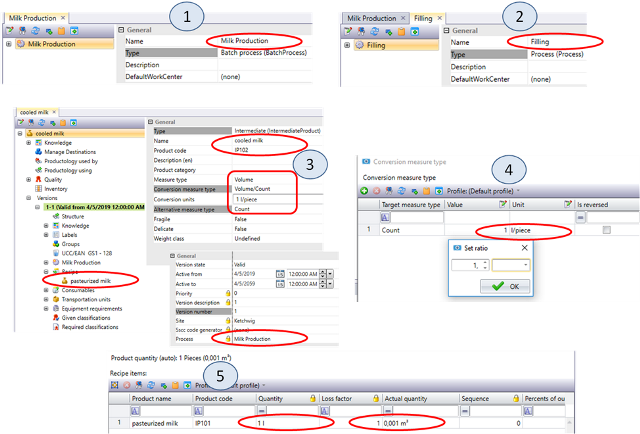
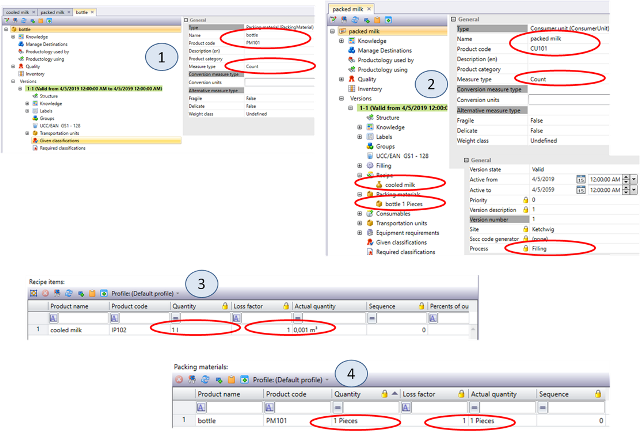
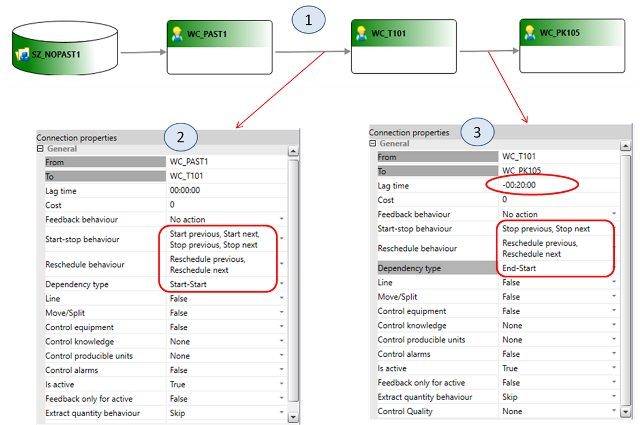
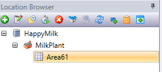
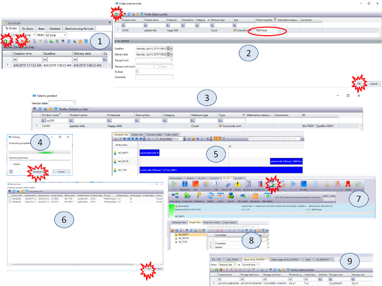

| [<- до лаборних робіт](README.md)                         | [на основну сторінку курсу](../README.md)          |
| --------------------------------------------------------- | -------------------------------------------------- |
| [<-Лр3. Основи роботи з зонами зберігання](3_storzone.md) | [Лр5. Основи роботи з DMS та WorkFlow->](5_dms.md) |

# Лабораторна робота №4.

## Тема. Основи роботи з автоматичним плануванням 

**Тривалість**: 4 акад. години (2 пари).

**Мета:** ознайомлення з основами автоматичного планування виготовлення продукції.    

**Завдання для виконання роботи**

**Цілі.** 

1. Створити процеси, сегменти продуктів та робочі центри для виготовлення та фасування молока.
2. Налаштувати маршрутну діаграму для зв'язку між робочими центрами для координації та планування.
3. Запланувати виготовлення фасованої продукції та виконати план.

## Порядок виконання роботи 

### 1. Створення процесів `Milk Production`, `Filling` і продуктів `cooled milk`

У цьому пункті необхідно означити робочі процеси та продукти для вироблення молока та його фасування в тару. 

Виготовлення молока відбувається в танках, у яких по суті відбувається перемішування та охолодження. Ці частини процесу відбуваються періодично, тобто спочатку йде наповнення, потім охолодження, потім вивантаження. Вони відбуваються одразу з усією партією (Batch), тому цей процес підпадає під тип Batch. Для таких процесів можна означувати рецептуру відповідно до ISA-88 (IEC-61512). 

Фасована продукція вимірюється штуками, а виготовлене молоко в танках вказується в літрах. Тому при плануванні необхідно передбачати перетворення одні одиниці (літри) в інші (штуки). Для цього в одному з робочих центрів необхідно робити відповідне перетворення, вказавши альтернативні одиниці. У цьому пункті кожен літр буде вимірюватися як одна штука безпосередньо в означенні охолодженого молока.       

1.  За аналогією з процесом `Pasteurization Milk1 XX` створіть процеси `Milk Production XX` типу Batch process (рис.4.1(1)), `Filling XX` типу Process (рис.4.1(2)).
2.  У модулі Products створіть продукт `cooled milk XX` (рис.4.1(3)) - intermediate product з кодом `IP_XX_102`
3.  Задайте наступні параметри:

    -   `Conversion units` як `1 l/piece` (рис.4.1(4));

    -   процес `Milk Production XX`;

    -   `Pasteurized milk XX` в Recipe (рис.4.1(5)).
    
    -   `Quantity = 1 l`
    
    -   `Product Quantity = 1 l`
4.  Після внесення налаштувань переведіть створений продукт в стан Valid.

---

### 2. Створення продуктів `packed milk` і `bottle`

У цьому пункті необхідно створити сегменти продуктів для фасованого молока та пляшок.  Варто відзначити, що матеріал з якого вирбляєтья продукт вказується в `Recipe` , однак окрім цього при виготовленні продукту використовуються додаткові матеріали. 

При фасуванні окрім сегменту основного продукту використовується упаковочний матеріал, у даному випадку - це пляшка (Bootle). На кожну одиницю розфасованого продукту витрачається одна одиниця тари (пляшки). 

Крім того в означенні сегменту продукту можна вказати інші матеріали, які безпосередньо не входять в рецептуру, але споживаються.  Це, наприклад, різні енерго-матеріали, типу пари чи горячої води, електроенергії, які входять в  `Consumables` . 

1.  У модулі Products створіть продукти

-   `bottle XX` (рис.4.2(1)) - packing material `PM_XX_101`. Процес для пакувальних матеріалів не потрібно ставити, одиниці виміру вказати Count;

-   `packed milk XX` (рис.4.2(2)) - consumer unit `CU_XX_101`. 
    -   Необхідно прив\'язати процес `Filling XX`, 
    -   одиниці виміру `Count`, 
    -   в рецепті продукт `cooled milk XX` (рис.4.2(3)) в пропорціях 1:1 в кількості 1 шт 
    -   пакувальний матеріал  (packing material) - `PM_XX_101`(рис.4.2(4));

2.  Після внесення налаштувань переведіть створені продукти в стан Valid.

---

### 3. Створення робочих центрів `WC_T101`, `WC_PK105`

1.  На вкладці Layout створіть робочий центр `WC_XX_T101` типу `Process Cell` з настройками як на рис.4.3.1.  **Для всіх робочих центрів і обладнання в цьому та інших пунктах ставте Name і Code однаковими!** У Processes добавте процес `Milk Production XX` (рис.4.3(2)). У версії задайте настройки для партії (рис.4.3(3)). Таким чином, розмір партії буде обмежений діапазоном від 10 до 1000 літрів, а час виготовлення складе 1 годину 40 хвилин.
2.  Також створіть робочий центр `WC_XX_PK105` типу Production Line. Налаштування задайте відповідно як на рис.4.3(4) і рис.4.3(5). Добавте процес `Filling XX`. Продуктивність складе 50 пляшок в хвилину.
3.  Зробіть валідацію робочих центрів. Не забутьте поміняти настройки доступу до робочих центрів для використання панелі керування.

---

### 4. Настройка маршрутизації 

При налаштування маршрутної діаграми в попередній лабораторній роботі важливо було вказати тільки параметри зв'язку для автоматичної реєстрації партій матеріалів при прогресі на одному з вузлів. При керування та плануванні також треба означувати інші типи зв'язків. Розглянемо їх тут. 

- `Start-stop behaviour` (поведінка запуску/зупинки) - вказує на зв'язок поведінки запусків та завершення роботи робочих центрів, які пов'язані між собою послідовно. Це впливає на керування та координацію між робочими центрами.  Можна вибрати чотири опції: 
  - No action - немає зв'язку 
  - `Start previous` (запуск попереднього) - забезпечує автоматичний запуск ресурсного робочого центру (звідки йде стрілка) після запуску цільового робочого центру (куди йде стрілка)  
  - `Start next` (запуск наступного) - забезпечує автоматичний запуск цільового робочого центру після запуску ресурсного 
  - `Stop previous` (зупинка попереднього) - забезпечує автоматичну зупинку ресурсного робочого центру  після зупинки цільового. 
  - `Stop next` (зупинка наступного)  - забезпечує автоматичну зупинку цільового робочого центру  після зупинки ресурсного. 
- `Reshedule behaviour` - вказує яким чином буде відбуватися зв'язок дії перепланування на суміжних робочих центрах (аналогічно як з зупинкою)
- `Dependency type` (тип залежності) - вказує як зв'язані операції на суміжних робочих центрах, що впливає на планування:
  - Start-Start -  Операції можуть мати різну тривалість. Тривалість операції залежить від ємності робочих центрів для виробленої продукції. Якщо тривалість першої операції буде коротшою, ніж наступна, операції розпочнуться одночасно. Наступна операція закінчиться пізніше першої. Якщо тривалість першої операції буде довшою, ніж наступна, наступна операція розпочнеться пізніше, ніж перша, щоб вони мали однаковий час завершення. 
  - End-Start - операція в попередньому робочому центр повинна бути завершеною, перед початком запуску в наступному.
  - End-End (одночасний запуск і завершення) - Операції починаються і закінчуються одночасно. Операції мають однакову тривалість. Тривалість операцій залежить від найбільш повільного робочого центру.
- `Lag Time` - час простою між двома операціями. Цей час використовується для того, щоб вказати що треба запустити операцію в наступному робочому центрі з певною затримкою після початку запуску першої.  

1.  У вікні Routing Designer перемістіть нові робочі центри в область діаграми і з\'єднайте як на рис.4.4(1). З\'єднання між робочими центрами конфігуруються відповідно до рис.4.4(2) і рис.4.4(3).

Зверніть увагу на налаштування `Dependency type` та `Lag Time` зв'язків.  У вікні `Location Browser` повинен бути курсор на вашій Area. **Це важливо, щоб не конфілктувати з  Routing Designer інших Area!**

- Початок запуску операції на робочому приготування продукту (WC_T101) починається разом з запуском пастеризаційної установки. По факту на виробництві між запуском пастеризатора і виходом продукту з нього проходить певний час. Тому в `LagTime` для цього випадку можна поставити певну паузу.
- Фасування продукту починається після завершення його приготування в танку. Але під час фасування продукт знаходиться в танку аж до завершення. Тому для врахування цього ефекту запуск фасування відбувається на -20 хвилин пізніше, тобто на 20 хвилин раніше ніж завершиться планове завершення приготування в танку. 
- Для правильного вирішення цієї задачі планування, необхідно б було, щоб в танку було означено три окремі процеси: набір, приготування, вивантаження, які б незалежно планувалися. Це можна зробити тільки при кастомізації Momentum, у стандартній версії такої можливості немає.      

---

### 5. Автоматичне планування і запуск на виробництво

1.  У модулі `Scheduler` (рис.4.5(1)) створіть нове клієнтське замовлення на виробництво молока в пляшках натиснувши кнопку Add.
2.  У вікні `Create custom order` (рис.4.5(2)) натисніть кнопку Add для вибору продукту.
3.  У вікні Select a product (рис.4.5(3)) виберіть продукт `CU_XX_101`. Потім у вікні `Create custom order` задайте кількість продукту для виготовлення, (наприклад, 1000 шт), а також граничний час поставки і виготовлення не менше ніж на кілька годин пізніше.
4.  Натисніть кнопку `Schedule Automatically` в модулі `Scheduler` для запуску автоматичного планування. У спливаючому вікні `Solving` (рис.4.5(4)) натисніть кнопку `Schedule now`. В результаті повинен вийти графік як на рис.4.5(5). Як видно, автоматичне планування не тільки розбило клієнтські замовлення на робочі замовлення, але також розподілило операції по робочим центрам.
5.  При зміні часу початку одного з процесів відбувається `rescheduling ` для всіх робочих центрів.
6.  У модулі `Оператор` запустіть на виконання процес в робочому центрі `WC_XX_PAST1`. У вікні (рис.4.5(6)) натисніть кнопку Start. Це запустить на виконання процеси в робочих центрах `WC_XX_PAST1` і `WC_XX_T101`. Для `WC_XX_T101` необхідно також запустити на виконання Batch (рис.4.5(7)).
7.  Зареєструйте поступово виготовлення продукту по 50% на кожному робочому центрів
8.  У модулі `Scheduler` в вікні `Simple View` перегляньте стан процесів, кількість виготовленого продукту і запасів (рис.4.5(8)).
9.  У модулі `Stock` в вікні `Stock Grid` (рис.4.5(8)) подивіться зміну запасів сировини в танку при ручному завданні прогресу в `WC_XX_PAST1`.
10.  Зареєструйте поступово виготовлення продукту інших 50% на кожному робочому центрів.
11.  Подивіться ще раз на кількість використаних запасів сировини.
12.  Зупиніть  `WC_XX_PAST1`.  Проконролюйте, що всі операції в наступних за потоком робочих центрах зупинилися також. 

## Питання до захисту

1. Чому процес для виготовлення молока вибраний типу Batch?
2. Навіщо в означенні продукту в даній лабораторній роботі вказувалися альтернативні одиниці вимірювання та правила перетворення?
3. Які типи сегментів продуктів Ви можете назвати? 
4. Які матеріали окрім тих які входять в рецептуру можуть бути означені в сегменті продукту?
5. Поясніть, чому саме такі типи робочих центрів було вибрано для `WC_XX_PAST`, `WC_XX_T101` і `WC_XX_PK105`   
6. Поясніть властивість з'єднання між робочими центрами  `Start-stop behaviour` та `Reshedule behaviour`. Вони впливають на планування чи керування?
7. Поясніть властивість з'єднання між робочими центрами `Dependency type`. Вони впливають на планування чи керування?
8. Поясніть налаштування зав'язків між робочими центрами, що вказані в п.4.
9. Поясніть як при автоматичному плануванні Scheduler визначив в яких робочих центрах йому необхідно робити сегменти продуктів?

---

| [<- до лаборних робіт](README.md)                         | [на основну сторінку курсу](../README.md)          |
| --------------------------------------------------------- | -------------------------------------------------- |
| [<-Лр3. Основи роботи з зонами зберігання](3_storzone.md) | [Лр5. Основи роботи з DMS та WorkFlow->](5_dms.md) |