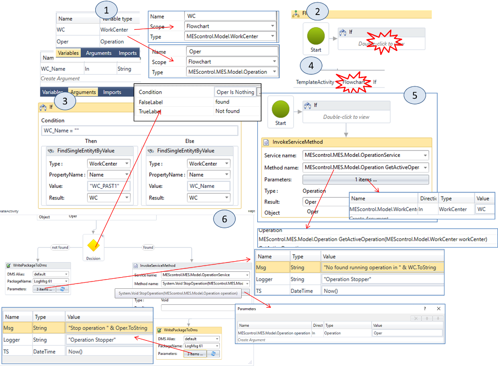

| [<- до лаборних робіт](README.md)                            | [на основну сторінку курсу](../README.md)                 |
| ------------------------------------------------------------ | --------------------------------------------------------- |
| [<- Лр4. Основи роботи з автоматичним плануванням](4_schedbase.md) | [ Лр6. Робота з продуктами та планування](6_scheduler.md) |

# Лабораторна робота №5. 

## Тема. Основи роботи з DMS та WorkFlow

**Тривалість**: 4 акад. години (2 пари).

**Мета:** ознайомлення з основами роботи колекціонування даних (DataMining), користувацькими програмами на WorkFlow, навчитися робити автоматичну реєстрацію продукту.       

**Завдання для виконання роботи**

**Цілі.** 

1. Сконфігурувати реєстрацію параметру (температури продукту на виході) в DMS.
2. Передивитися записи в модулі Operator.
3. Створити WorkFlow для: виведення повідомлень в архів, зупинки активної операції.
4. Створити підписку для зупинки активної операції при відповідній зміні стану устатковання.
5. Налаштувати автоматичну реєстрацію виробленого продукту на пастеризаторі за показами лічильника-витратоміра.
6. Створити усі налаштування для устатковання та параметри для існуючих робочих центрів.

## Порядок виконання роботи 

### 1. Означення пакета для ведення архіву по температурі.

В цьому і в наступному пункті необхідно конфігурувати ведення журналу для параметра `TT1` обладнання `EQ_PAST1`. Це потрібно, наприклад для формування звіту по температурі пастеризації. Для цього необхідно створити пакет, в якому налаштувати поля записів в ньому. 

Пакет (package) - це по суті таблиця бази даних з означеними полями. Є користувацькі пакети, структура яких означується користувачем, а є наперед визначені, які використовуються в існуючих функціях Momentum, наприклад для розрахунку KPI, які будуть в наступних лабораторних роботах.

1.  Відкрийте модуль `Data Mining: View -> Data Mining`.
2.  Додайте порожній пакет: `add empty` (рис.5.1(1)). Створиться пакет з ім\'ям `New Package`

У даному випадку добавляється пакет, який означується користувачем. Тобто користувач сам означує структуру пакету.  

3. Подвійним кліком відкрийте пакет `New Package` для настройки.

4. Визначте `Name = TT1 LOG Package XX` де XX-номер варіанту; задайте  `Append Package Data = TRUE`, для режиму додавання нових записів (рис.5.1(2)).

5. За допомогою кнопки `Add Filed` (рис.5.1(2)) додайте наступні поля (рис.5.1(3)):

| **Name**  | **Filed Type** | **Length** | **Nullable** |
| --------- | -------------- | ---------- | ------------ |
| TimeStamp | DateTimeOffset | 0          | false        |
| Value     | Decimal        | 0          | false        |

6.Активуйте пакет Active = True (рис.5.1(4))

---

###  2. Конфігурація записування в пакет з Data Center.

Означення пакету, аналогічно як означення тиблиці в базі даних не означує самі записи. Для формування записів необхідно використати відповідні сервіси. При необхідності зберігання даних для конкретного параметру, це налаштовується в  Data Center шляхом означення підписки в розділі `Loggins`. 

У цьому пункті налаштовується періодичність та джерело даних для записування в пакет. Властивість `Min period` вказує на мінімальну періодичність запису, тобто якщо протягом цього часу параметр зміниться кілька раз в пакет буде занесене тільки останнє значення.`Max Period` - це максимальний час очікування змін. Тобто, навіть якщо протягом цього часу нічого не зміниться, значення все одно запишеться.  

1) Перейдіть на в настройку `Data Center Logging`: `Layout -> Runtime -> Servers -> Datacenter` (рис.5.2(1))

2) Додайте нову підписку в `Data Center-> Log entries -> Add Datacenter Logging` (рис.5.2(1))

3) Буде створена нова підписка з червоною іконкою, що свідчить про неактивність підписки .

4) Перейменуйте підписку в `TT1_XX `(де XX номер варіанту), заповніть властивості `TT1_XX` як показано на рис.5.2(2):

- `Min Period: 00:00:30`
- `Max Period: 00:01:00`
- `Dms Server Alias: default`
- `Package: TT1 LOG Package XX` 

5) У закладці `Subscription items` натисніть ` Add` (рис.5.2(2)) для додавання підписки.

6) Вкажіть назву підписки `TT1_XX Subscription` а також ім\'я параметра `TT101` устатковання `EQ_XX_PAST1` (рис.5.2(3)). Решту полів залиште без зміни. Таким чином в підписці братиме участь параметр устатковання, зміна якого буде ініціювати запис в пакет DMS.

7) Перейдіть на вкладку `Logged fields` (рис.5.2(4)). Тут потрібно вказати значення, які будуть писатися в поля пакета. Для поля `Value` виберіть значення підписки (рис.5.2(5)).

8) Для поля `TimeStamp` вкажіть визначений вираз `TimeStamp` (рис.5.2(6)). Таким чином під час запису в поле `TimeStamp` буде записуватися поточна дата і час.

9) Увімкніть журнал (рис.5.2(7)).

---

### 3. Перегляд записів пакету. 

Записи пакетів можна переглядати у вбудованому переглядачі самого модулю DataMining, що потрібно для мети налагодження, або в місці його цільового використання. Наприклад, це може бути модуль Operator робочого центру, для якого він призначений, або звіти з відповідними трендами.

У цьому пункті необхідно подивитися сформовані записи за допомогою вбудованого переглядача.        

1. Відкрийте модуль `Data Mining: View -> Data Mining`.
2. Виділіть створений раніше пакет і через контекстне меню запустіть команду `Show RAW data view` (рис.5.3(1)). З\'явиться таблиця з значеннями записів (рис.5.3(2)). Упорядкуйте записи за спаданням `TimeStamp`.

3. Кожне значення записується не рідше ніж раз на хвилину і не частіше 2-х раз за хвилину, так як це вказується в налаштуваннях пакета. Використовуючи OPC UA Expert переведіть режим імітації в `smOn=False` змініть кілька разів значення `PXX_A1.PAST1.TT101`. в проміжках порядку 20-40 секунд. За відмітками часу записів подивіться, як часто пишеться значення в пакет DMS. Для поновлення перегляду записів користуйтеся кнопкою `Refresh`.

4. У модулі `Data Mining` виберіть `TT1 Log Package XX` і натисніть `Edit Work Center DMS Package View` (рис.5.3(3)). Додайте один `View` (рис.5.3(4)) і `Workcenter`, де він буде відображатися. 

5. Відкрийте вікно `Supervisor` для Work Center `WC_XX_PAST1`. Створіть тестову операцію на виготовлення пастеризованого молока. Перейдіть в `Info -> Data Mining` (рис.5.3(5)). Ви побачите зміст пакета. Запустіть і зупиніть тестову операцію.

---

### 4. Створення Workflow для виводу повідомлень в DMS. 

Workflow Activities - це користувацькі скрипти, які записані на мові Workflow. Для роботи з системою в   Workflow наявні різноманітні блоки, частина з яких використовуються в даній і наступних лабораторних роботах.

Workflow Activities можуть визиватися з інших функціональних частин Momentum. 

У цьому пункті необхідно створити Workflow для виведення повідомлень в пакет DMS. Тому спочатку створюється і налаштовується пакет з відповідними полями. Потім створюється Workflow Activities, який записує повідомлення в цей пакет з вказівкою часу запису.   

1.  Відкрийте модуль `DataMining` і створіть новий пакет `Empty`.

2.  Визначте Name = `LogMsg XX` (де XX -- номер варіанту), встановіть `Append package data = TRUE` (рис.5.4(1)).

3.  Визначте поля:

-   `TS` (рис.5.4(2)) для запису позначки часу

-   `Msg` (рис.5.4(3)) для запису повідомлення

-   `Logger` (рис.5.4(4)) для запису позначки

4\. Увімкніть Packet: `LogMsg->Active = True`

5\.Відкрийте зміст пакета з використанням `RAW Data Viewer` модуля `DataMining`. Пакет не буде містити жодного запису. Тим не менш не закривайте вкладку, вона буде використовуватися для перегляду як альтернатива журналу.

6\.Відкрийте модуль `Workflows`: меню `View -> Workflow`. Додайте новий Workflow на вкладці `Activity`(рис.5.4(5)).

7.На вкладці `Definition` визначте ім\'я Activity = `Message XX` (де XX - номер варіанту), `Transactional = FALSE` (рис.5.4(6)).

Виконання Workflow починається з елементу Start. Далі виконання елементів іде по ходу направлення з'єднувальних стрілок. У Workflow можна використовувати Variable  - це змінні, які можна використовувати для збереження проміжних результатів. Для їх використання їх спочатку об'являють і можна вказати значення за замовченням. 

8.Додайте одну Variable з назвою `LoggerName` (рис.5.4(8)). Зверніть увагу що поле вводу змінних з'явиться тільки після кліку в області Workflow. В поле `default` записано значення за замовчуванням в форматі VB - `"Info"`. 

9.Збережіть `Activity` кнопкою `Save` (рис.5.4(7)).

10.Добавте з панелі елемент `WritePackageToDms` і з'єднайте його з елементом `Start`(рис.5.4(9)). Заповніть поля, як показано на рисунку. Зверніть увагу, що при введенні значень НЕ ТРЕБА тиснути `Enter`, бо вийде багаторядкове введення (візуально введені значення пропадуть, але по факту вони будуть).

Елемент `WritePackageToDms` робить запис у вказаний пакет Dms. У параметрах вказується що саме треба писати. Поля `Value` в Workflow заповнюються в форматі виразів VB.NET. Там можна використовувати константи, змінні або викликати функції, об'єднуючи це все у вирази. 

11.Збережіть Activity кнопкою `Save`. Запусіть `Execute` . Перегляньте записи пакету DMS, аналогічно як це робилося в попередньому пункті.

Кнопка `Execute` використовується для перевірки роботи  Workflow, так як ініціювання виклику проводиться з інших функціональних частин Momentum.

---

### 5. Зупинка активної операції WC_XX_PAST1 

Workflow має достатньо обширну бібліотеку для керування різними діяльностями в Momentum. Це дає можливість автоматизувати багато діяльностей, які не входять в стандартні функції Momentum. Зрештою, якщо на Workflow  якусь функцію зробити важко або не можливо, можна скористатися функціональністю `C#`, скрипти на якому можна писати у відповідному блоці. У даному пункті  Workflow  використовується для зупинки активної операції на вказаному робочому центрі. Саме використання даного  Workflow  передбачено в п.7, тут необхідно тільки створити і перевірити його. 

У Workflow використовуються наступні блоки:

- `if` - виконує один з двох блоків, в залежності від спрацювання умови (Condition)  
- `Decision` - перенаправляє виконання на той блок, для напрямку якого сформувався вихід умови (Condition)
- `InvokeServiceMethod` - запускає вказаний метод вказаного сервісу Momentum. У даному випадку використовується два методи:
  - `GetActiveOperation` сервісу `MESCotrol.MES.Model.OperationService` для отримання активної операції (та, яка виконується) за вказаним робочим центром
  - `StopOperation` сервісу `MESCotrol.MES.Model.OperationService` для зупинки вказаної аргументом операції 

1) У модулі `WorkFlows` клонуйте (`Контекстне меню дії->Clone`) перед цим створений `Action` і дайте йому назву `StopActiveOperation_XX` (де XX - номер Вашого варіанту). На вкладці `Definition` означте `Transactional = TURE`.

2) Означте `Arguments` (рис.5.5(1)): `WC_Name` типу `String` означує ім\'я робочого центру, в якому потрібно зупинити активну (в роботі) операцію. 

3) Означте `Variables` (рис.5.5(1)): 

- `WC` типу `MESControl.Model.WorkCenter` - необхідний робочий центр, 
- `Oper` типу `MEScontrol.MES.Model.Operation` - необхідна операція. 

Для вибору типу змінної в списку типів треба вибрати `Browse of types` після чого задати фільтр, наприклад `WorkCenter` 

4) Перемістіть існуючий вузол `WritePackageToDms`нижче, він ще знадобиться.  Вставте вузол `IF` (рис.5.5(2)). Перейдіть в зміст вузла подвійним кліком.

5) У вузлі означте умову `WC_Name = ""` це дає можливість визначити чи задано ім\'я робочого центру (рис.5.5(3)). Якщо ім\'я задано проводиться пошук робочого центру (`FindSingleEntityByValue`) по вказаному імені, якщо немає - для пошуку використовується ім\'я `WC_PAST1`. Замість `WC_PAST1` запишіть тут назву Вашого робочого центру в форматі `WC_XX_PAST1`. 

> Примітка. Більш компактним рішенням було б використання значення `Default Value` для визначення змінної `WC_Name`. Тут модуль «IF» використовується для навчальних цілей.
>

6) Перейдіть на основну програму (рис.5.5(4)) Додайте в програмі функцію `InvokeServiceMethod`, і визначте в ній виклик методу `GetActiveOperation` із зазначеним робочим центром WC, як це показано на рис.5.5(5).

7) Доповніть програму іншими блоками, як це показано на рис.5.5(6). Не забувайте вказувати назви відповідно до Вашого варіанту. Існуючий блок `InvokeServiceMethod` з'єднайте з `Decision`. Налаштування блоку `Decision` відбувається через панель властивостей `Properties`. У повідомлення можна вписувати на кирилиці, наприклад:

- "не знайдені запущені операції в робочому центрі"
- "операцію з вказаним ідентифікатором зупинено"

Загальний вигляд програми буде наступний:

Таким чином, якщо в робочому центрі є активна операція, вона буде зупинена. В іншому випадку в пакет `LogMSG DMS` буде внесено відповідний запис.

8) Збережіть і запустіть (Execute) створену Workflow в тестовому режимі безпосередньо з редактора. Перейдіть на вкладку з відкритим переглядом `RAW Data viewer` `LogMSG`. Оскільки виконуються операцій немає, там буде відповідний запис.

9) Використовуючи кнопку `Create test operation` панелі інструментів `Operator Control` для Workcenter `WC_XX_PAST1` додайте `Operation` для продукту з кодом `IP_XX_101` і запустіть її на виконання. Після цього запустіть створену `Workflow` в тестовому режимі безпосередньо з редактора. Операція повинна завершитися, а в `LogMSG` повинен з\'явитися відповідний запис.

---

### 6. Автомат станів (State Machine) для операцій обладнання робочого центру 

У цьому навчальному курсі для опису та управління станом робочого центру використовується підхід, який описаний в стандартах ISA-88 (IEC-61512). Подивіться на модель станів, яка показана на рисунку. Для кожного стану може бути визначений окремий алгоритм керування в ПЛК. По станам можна вести облік роботи устаткування (звіти, KPI і т.п.).

0 - ініціалізація (при старті ПЛК): це стан свідчить про зупинку ПЛК або його ініціалізацію.

1 - Idle: що операція не виконується.

13 - Starting: операція запускається (виконуються стартові кроки).

2 - Running: нормальне виконання операції.

14- Completing: виконується програма завершення операції.

8 - Complete (завершено): кінцевий стан нормального завершення. Після команди reset (наприклад від оператора) переходить в Idle.

3 - Pausing: перехід в паузу;

4 - Paused: знаходиться в паузі;

5 - Holding: перехід в утримання;

6 - Hold: стан свідчить про виконання програми тимчасового утримання виконання операції в зв\'язку з нештатною ситуацією (наприклад, відсутністю можливості вивантаження продукту);

7 - Restarting: перехід з утримання в нормальний режим роботи;

9 - Stopping: зупинка за запитом;

10 - Stopped (зупинено): зупинений на вимогу;

11 - Aborting (переривається): переривання виконання;

12 - Aborted (перерваний): швидке нештатне переривання виконання операції.

Таким чином значення: 8, 10, 12 свідчать про закінчення операції в обладнанні, що призводить до необхідності автоматичної реєстрації зупинки операції і в робочому центрі. У наступних вправах стан буде використано для автоматичної реєстрації зупинки операції в робочому центрі.

---

### 7. Створення і перевірка роботи Subscriber, який зупиняє активну операцію по значенню параметра обладнання STA\_INT

Один із способів виклику  Workflow є підписка під зміну параметру устатковання. Для цього використовується **Subscription**. При цьому Workflow  у якості аргументу отримує як значення параметру так і додатковий контекст, тобто WorkCenter, Area, Units і т.д, до якого відноситься даний параметр. Тобто, при підписці на параметр система перевіряє значення цього параметру, і якщо воно змінюється - викликає вказаний Workflow, передаючи йому ці значення та об'єкт-контекст.  

У цьому пункті необхідно створити і перевірити роботу `Subscriber`, який буде відслідковувати параметр стану `STA` обладнання робочого центру , і переводити активну операцію в стан зупинки при зупинці операції устатковання. У наступній вправі необхідно створити Subscription `WC_XX_PAST1`. 

Перші 4 біта змінної `STA` показують стан операції в обладнанні (ПЛК) та можуть набувати значення, описані в попередньому пункті.

1) У модулі `Layout` в розділі `Runtime` створіть новий `Subscriber` (рис.5.7(1))

2) Вкажіть назву `Operation complete XX` (рис.5.7(2)).

3) Вкажіть `Subscription Item` ( `STA` type `UInt32`) і `Context Item` (`WC` type `Work Center`) (рис.5.7(3)). Таким чином Subscriber буде отримувати значення параметрів і контекст робочого центру.

4) Подвійним кліком по `Workflow` зайдіть в `Workflow Editor`. Редактор запропонує автоматично перевизначити `Arguments` (рис.5.7(4)), підтвердіть кнопкою `Yes`.

5) Визначте `Variables` (`STA4` , `WC_NAME`) і `Arguments` як показано на рис.5.7(5) і рис.5.7(6). Значення `Default Values` будуть використовуватися для налагодження Subscriber. Тому для `WC_NAME` вставте за замовченням назву робочого центра у форматі `"WC_XX_PAST1"`, а для `STA` виставте `2`.

6) Створіть FlowChart, як показано на рис.5.7(7). Замість `StopActiveOperation` вкажіть створений раніше Workflow `StopActiveOperation_XX` (де XX - номер Вашого варіанту). Зверніть увагу, що аргументи в Items мають задаватися самостійно, а регістр літер має значення. В `Invoke Activity` вихід `Result` має бути порожнім. Збережіть Workflow.

7) Використовуючи кнопку «Create test operation» панелі інструментів Supervisor для Workcenter `WC_XX_PAST1` додайте Operation для продукту з кодом `IP_XX_101` і запустіть його на виконання.

8) У Workflow проконтролюйте щоб `Default Value` для arguments `STA` (рис.5.7(6)) не дорівняювало жодному з 8, 10, 12. Збережіть створену Workflow, після чого запустіть її в тестовому режимі безпосередньо з редактора. Операція не повинна завершитися, так як `STA` відмінна від 8,10 і 12.

9) Змініть `Default Value` для arguments `STA` (рис.5.7(6)) в будь-який з значень 8, 10 або 12. Збережіть створену Workflow, після чого запустіть її в тестовому режимі безпосередньо з редактора. Операція повинна завершитися і в `LogMSG` повинен з\'явитися відповідний запис.

Таким чином ми перевірили як працює Subscriber. У наступній вправі ми зробимо Subscription для пастеризатора і перевіримо його роботу.

---

### 8. Створення і перевірка роботи Subscription для STA Past                           

 При використанні  Subscription вказується параметр налаштування періоду підписки та контекст, який передається. 

1. У модулі `Layout` відкрийте `Runtime -> Servers -> DataCenter -> NUFTAppSrv/DataCenter/default:ui`.

2. Додайте новий `Subscription` (рис.5.8(1)).

3. Вкажіть назву `Past XX Complete` (де `xx` - номер варіанту)  , період опитування, а також `Subscriber` (рис.5.8(2)).

4. Вкажіть `Subscription Items` (рис.5.8(3)), який буде вказувати на параметр `STA`  `Equipment` пастеризатора, який Ви створили до цього, а в  `Context` (рис.5.8(4)) відповідний `Equipment` 

5. Активуйте підписку (рис.5.8(5)).

6. Використовуючи UAExpert, змініть `PXX_A1.PAST1.smOn = false`, після чого змініть значення тега `PXX_A1.PAST1.STA` в значення відмінне від 8,10 і 12. 

7. Використовуючи кнопку `Create test operation` панелі інструментів Operator Control для Workcenter `WC_PAST1` додайте Operation для продукту з кодом `IP_XX_101` і запустіть його на виконання. Дочекайтеся 10 секунд і переконайтеся що операція виконується.

8. Використовуючи UAExpert, змініть значення тега `PXX_A1.PAST1.STA` в значення рівне 10. Дочекайтеся 2-3 секунд, зробіть refresh в Operator Control і переконайтеся що операція завершилася. Зверніть увагу на значення `Execution Counter` у створеній Вами підписці.

9.  Використовуючи UAExpert, змініть `PXX_A1.PAST1.smOn = true`.

---

### 9. Налаштування автоматичної реєстрації продукту на пастеризаторі.

У минулих лабораторних роботах реєстрація продукту проводилася вручну оператором. Однак при інтегруванні MOM з АСКТП, значення виробленого продукту доцільно брати з лічильників, ваг та інших реєстраторів. Для цього в Momentum для робочого центру в Runntime Configuration передбачена функція Quantity Registration яка передбачає автоматичну реєстрацію продукту за показами параметрів устатковання:

- кількості якісного продукту (**Good quantity**)
- кількості неякісного/забракованого продукту (**Rejected quantity**) 
- загальної кількості продукту (**Total quantity**) 

Для такої реєстрації  передбачені відповідні предустановлені пакети DMS, які створюються автоматично.   При конфігуруванні робочого центру необхідно визначитися з вибором одного із способів вимірювання фактичної кількості продукту (**Actual quantity**): 

- Actual quantity = кількості якісного продукту (good quantity) 
- Actual quantity = загальної кількості (Total quantity) = якісної (Good)  + забракованої (Rejected).   

Якщо обирано підрахунок Actual quantity = good (типовий вибір), тоді:

- виміряна кількість якісного продукту збільшить фактичну кількість для операції і призведе до споживання та реєстрації партій спожитого/виробленого матеріалу 
- виміряна кількість забракованого продукту збільшить забраковану кількість для операції та призведе до споживання матеріалу 
- існуючі реєстрації прогресу будуть показувати реєстрацію кількості якісного продукту
- сума кількостей хорошої і забракованої продукції буде використана для розрахунку продуктивності та виявлення зупинок

Якщо обирано підрахунок Actual quantity =Total quantity:

- виміряна загальна кількість продукту збільшить фактичну кількість для операції і призведе до споживання та реєстрації спожитого/виробленого матеріалу
- виміряна кількість забракованого продукту збільшить кількість забракованого продукту для операції та призведе до зменшення фактичної кількості продукту 
- існуючі реєстрації прогресу будуть показувати реєстрацію загальної кількості продукту
- ці реєстрації загальної кількості використовуватимуться для розрахунку продуктивності та виявлення зупинок.

У налаштуваннях реєстрації можна вказати різноманітні способи реєстрації:

- інкрементну: mode=**Incremental** з добавленням приросту до попереднього значення
- абсолютну: mode=**Absolute** з абсолютних лічильників, у свою чергу є дав способи:
  - Absolute by Material lot mode - кожен запуск операції буде брати значення лічильника як початкове
  - Absolute by Operation mode - кожен запуск операції буде брати значення лічильника відносно попереднього ненульового значення

У цьому прикладі необхідно сконфігурувати автоматичну реєстрацію якісного продукту за показаннями загальної кількості продукту з лічильника-витратоміра обладнання `PAST1_FIQ1`.

1) Переконайтеся що для `WC_XX_PAST1` немає активних і запланованих операцій. Якщо такі є запустіть і зупиніть операції.

2) У модулі Layot перейдіть до `WC_XX_PAST1`, додайте `Runtime Configuration` (рис.5.9(1))

3) У налаштуваннях `Total Quantity` (рис.5.9(2)) виставте всі налаштування відповідно рис.5.9(3).

4) У налаштуваннях `Quantity registration` виберіть `Active operation` і додайте `DataCenter Subscription` (кнопка «+»). (рис.5.9(4)) 

5) Після цього, використовуючи кнопку `...` (рис.5.9(5)) перейдіть в налаштування Subscription (рис.5.9(6)), де визначте ім'я (враховуючи варіант) і параметри (рис.5.9(7)).

6) Активуйте підписку, використовуючи кнопку `Activate` (рис.5.9(8))

7) Використовуючи кнопку `Create test operation` панелі інструментів `Supervisor` для Workcenter `WC_XX_PAST1` додайте Operation для продукту з кодом `IP_XX_101`. 

8) Через OPC UA Expert переведіть установку в режим відключення імітації `PXX_A1.PAST1.smOn = false`.  

9) Запустіть на виконання тестову операцію для робочого центру `WC_XX_PAST1`. Для перевірки роботи автоматичної реєстрації запустіть клієнт OPC UA Expert. Змініть значення `PXX_A1_PAST1` на 3000. Переконайтеся що кількість виробленого продукту змінилося відповідної.  Змініть значення на 5000, проконтролюйте відповідну зміну кількості. 

10) Зупиніть тестову операцію. 

---

### 10. Створення Equipment і параметрів для WC\_T101 WC\_PK105.

Подібно налаштуваннням робочого центру WC\_PAST1, проведіть самостійно наступні дії:

1) Створіть для робочого центру `WC_XX_T101` Equipment `EQ_XX_T101` (Name та Code) а також параметри, показані на рис.5.10(1).

2) Створіть для робочого центру `WC_XX_PK105` Equipment `EQ_XX_PK105`  (Name та Code)  а також параметри, показані на рис.5.10(2).

3) Додайте параметри `CMD_START` і `CMD_STOP`, які будуть відправляти обладнанню значення «1» при старті і «2» при стопі операції, аналогічно, як це зроблено для `EQ_XX_PAST1`.
4) Зробіть валідацію Equipment . 

## Питання до захисту

1. Що таке пакет (packet) в DMS? Для чого в Momentum використовують пакети?
2. Розкажіть як проводиться означення записування значень параметру устатковання в робочий центр.
3. Розкажіть для яких цілей були використані записані в пакет дані по температурі.
4. Поясніть що таке Workflow Activities? Як перевірити працездатність Workflow?
5. Які блоки і для чого використовувалися в даній лабораторній роботі? 
6. Розкажіть про автомат станів, який описаний в п.6. Навіщо він використовується в даній лабораторній роботі?
7. Що таке `Subscriber` і які принципи їх функціонування? Для чого вони використовувалися в даній лабораторній роботі?
8. Розкажіть про налаштування автоматичної реєстрації продукту.
9. 

| [<- до лаборних робіт](README.md)                            | [на основну сторінку курсу](../README.md)                 |
| ------------------------------------------------------------ | --------------------------------------------------------- |
| [<- Лр4. Основи роботи з автоматичним плануванням](4_schedbase.md) | [ Лр6. Робота з продуктами та планування](6_scheduler.md) |

