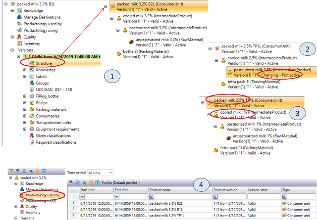
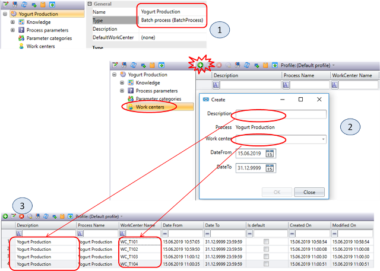
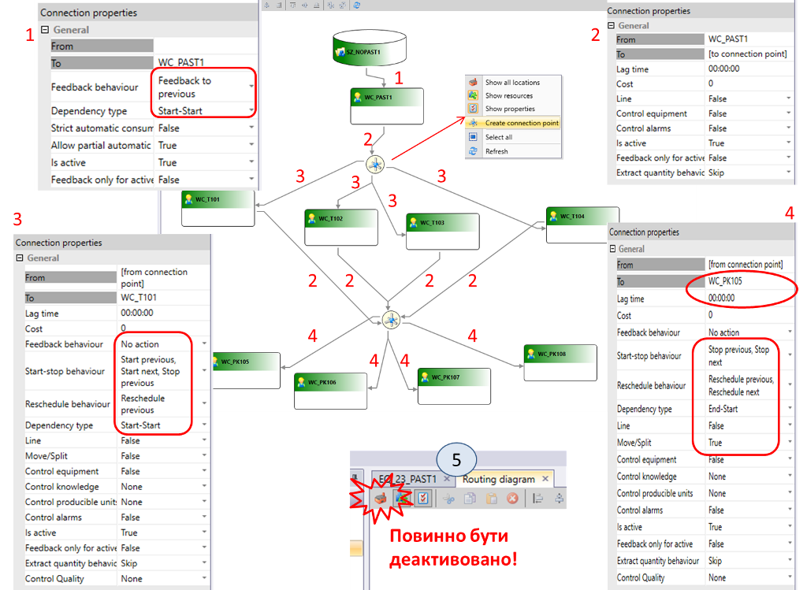
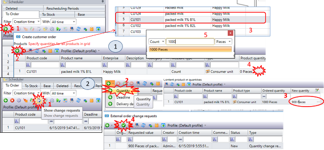
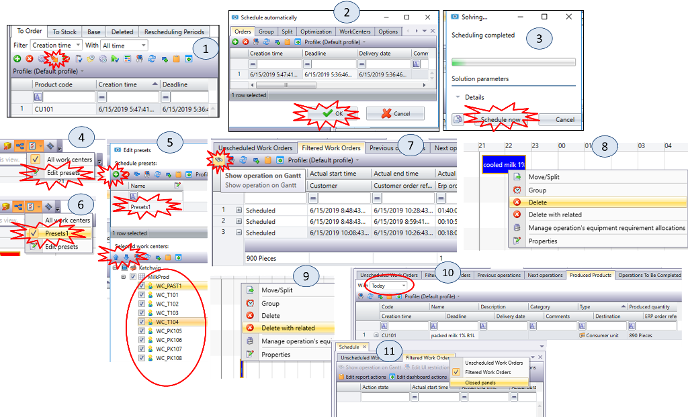
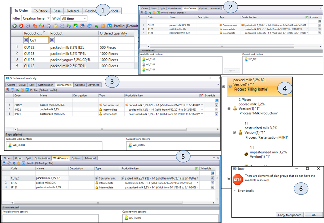
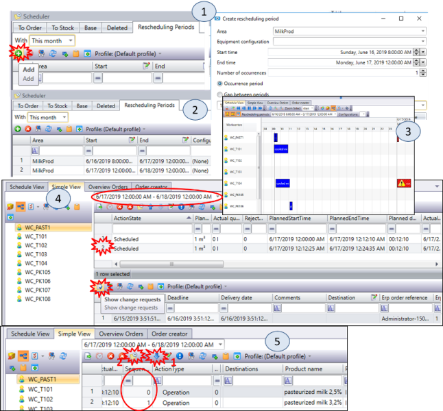
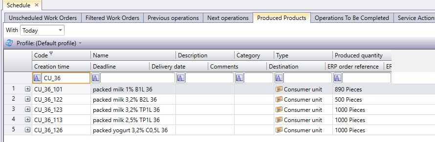

| [<- до лаборних робіт](README.md)                  | [на основну сторінку курсу](../README.md) |
| -------------------------------------------------- | ----------------------------------------- |
| [<-Лр5. Основи роботи з DMS та WorkFlow](5_dms.md) | [Лр7. KPI->](7_KPI.md)                    |

# Лабораторна робота №6 

## Тема. Робота з продуктами та планування

**Тривалість**: 4 акад. години (2 пари).

**Мета:** поглибити навики роботи з сегментами продуктів та ознайомитися з базовими можливостями модуля планування  

**Завдання для виконання роботи**

**Цілі.** 

1. Створити робочі центри для приготування продукту.
2. Створити процеси та робочі центри для фасування у різну тару.
3. Створити сегменти продуктів для різного типу продукції, упаковану в різну тару.
4. Навчитися перевіряти цілісність означення продукту.
5. Створити танки для зберігання сировини різної жирності.
6. Модифікувати маршрутну діаграму для виготовлення різної продукції.
7. Навчитися працювати з клієнтським замовленням.
8. Ознайомитися з базовими можливостями модуля планування.  

## Порядок виконання роботи 

### 1. Створення робочих центрів `WC_T102`, `WC_T103`, `WC_T104`

У цьому пункті необхідно створити три робочі центру типу Process Cell аналогічних `WC_T101`.

1. На вкладці Layout створіть робочі центри `WC_XX_T102` типу Process Cell з настройками як на рис.6.1(1). У версії задайте налаштування для партії (рис.6.1(2)). У Processes прив'яжіть процес `Milk Production_XX` (рис.6.1(3)). 
2. Аналогічно створюємо `WC_XX_T103` і `WC_XX_T104`.
3. Переведіть `Version state` в `Valid` для всіх новостворених робочих центрів.
4. Не забудьте змінити налаштування доступу до робочих центрів для використання панелі оператору (необхідні права адміністратора).

---

### 2. Створення процесів `Filling_tetrapack`, `Filling_can` і робочих центрів `WC_PK106`, `WC_PK107`, `WC_PK108`

У цьому пункті необхідно створити процеси для наповнення упаковок `tetra pack` і `скляну тару`. Також потрібно створити три пакувальні машини і зв\'язати їх з відповідними процесами.

1. На вкладці `Layout` виберіть процес `Filling XX` і перейменуйте його в `Filling_bottle XX` (рис.6.2(1)).
2. Створіть процеси `Filling_tetrapack XX` (рис.6.2(2)), `Filling_can XX` (рис.6.2(3)) типу Process.
3. На вкладці `Layout` створіть робочий центр `WC_PK106_XX` типу `Production Line` з налаштуваннями як на рис.6.2(4). У версії задайте налаштування як на рис.6.2(5). У `Processes` прив\'яжіть процес `Filling_tetrapack XX` (рис.6.2(6)).
4. Аналогічно створіть `WC_PK107_XX` з процесом `Filling_can XX` і `WC_PK108_XX` і з процесом `Filling_bottle XX`.
5. Переведіть `Version` state в `Valid`.
6. Не забудьте змінити налаштування доступу до робочих центрів для використання панелі оператору (необхідні права адміністратора).

---

### 3. Створення продуктів `RM102`, `RM103`, пакувального матеріалу `PM102`, `PM103`, `PM104`

У цьому пункті необхідно створити сировину (молоко різної жирності) і різні типи пакувального матеріалу.

1. У вкладці `Products` створіть продукт `RM_XX_102` з ім\'ям `unpasteurized milk 2,5% XX` типу `Raw material` з настройками як на рис.6.3(1).
2. Аналогічно створіть `RM_XX_103` з ім\'ям `unpasteurized milk 3,2% XX`.
3. Продукт `RM_XX_101` з ім\'ям `unpasteurized milk XX` перейменуйте в `unpasteurized milk 1% XX`.
4. Створіть пакувальний матеріал `PM_XX_102` з назвою `bottle 2l XX` типу `Packing material XX` (рис.6.3(2)) і означте налаштування як на рисунку.
5. Аналогічно створіть `PM_XX_103` з назвою `tetra pack 1l XX` і `PM_XX_104` з назвою `can 0,5l XX`.
6. Перейменуйте існуючий пакувальний матеріал `PM101` з `Bottle XX` на `Bottle 1l XX`. 
7. Переведіть Version state в Valid.

---

###  4. Створення продуктів `IP111`, `IP121`

У цьому пункті необхідно створити проміжні продукти після процесу пастеризації і змінити кількість продукту.

1. У модулі `Products` створіть продукт `IP_XX_111` з ім\'ям `pasteurized milk 2,5% XX` типу `Intermediate` (рис.6.4(1)). Задайте настройки як на рис.6.4(2). У версії прив\'яжіть процес `Pasteurization Milk XX` (рис.6.4(3)). У `Recipe` задайте продукт `RM_XX_102` (рис.6.4(4)).
2. Зверніть увагу, що кількість продукту автоматично визначилося як 1000 літрів. Для зміни цієї цифри натисніть кнопку `Change product quantity XX` і вручну задайте необхідну кількість (рис.6.4(5)).
3. Аналогічно створіть`IP_XX_121` з ім\'ям `pasteurized milk 3,2% XX` з тим же процесом, але в Recipe задайте продукт `RM_XX_103`.
4. Продукт `IP_XX_101` з ім\'ям `pasteurized milk XX` перейменуйте в `pasteurized milk 1% XX`.
5. Переведіть Version state в Valid.

---

### 5. Створення продуктів `IP112`, `IP122`

У цьому пункті необхідно створити проміжні продукти після процесу приготування молока.

1. У модулі Products створіть продукт `IP_XX_112` з ім\'ям `cooled milk 2,5% XX` типу `Intermediate` і параметрами як на рис.6.5(1). Задайте перерахунок одиниць виміру (рис.6.5(2)). У версії прив\'яжіть процес `Milk Production XX`. У Recipe задайте продукт `IP_XX_111` та кількість (рис.6.5(3)).
2. Аналогічно створіть `IP_XX_122` з ім\'ям `cooled milk 3,2%  XX` з тим же процесом, але в `Recipe` задайте продукт `IP_XX_121`.
3. Продукт `IP_XX_102` з ім\'ям `cooled milk XX` перейменуйте в `cooled milk 1% XX`.
4. Переведіть `Version state` в Valid.

---

### 6. Створення продуктів `CU111`, `CU112`, `CU113`

У цьому пункті необхідно створити `Consumer units` для молока різної жирності розфасованої в тару різного виду та обсягу. Слід звернути увагу, що в даному випадку використовуються упаковки різної ємності. 

У лабораторній роботі №4 (п.1) описано, що у версії продукту можна вказувати різні альтернативні одинці вимірювання.  Так для продуктів  `cooled milk XX` задаються шт, які перераховуються як 1 л/штуку. Таким чином, можна умовно вважати, що даний продукт можна вимірювати не тільки в об'ємних одиницях, але і в штуках (кількість літрів). У такому випадку для рецептів сегментів продуктів що на виході отримують кількість в штуках (упакована продукція) на вході можна також вважати штуки (літри). У такому випадку:

- для 1шт літрової пляшки необхідно 1 літр вхідного матеріалу, або одну одно-літрову штуку (що те саме)
- для 1 шт 0.5 літрової пляшки необхідно 0.5 одно-літрові штуки 
- для 1 шт 2-х літрової пляшки треба дві одно-літрові штуки  

Як вже пояснювалося альтернативні одиниці потрібні для перетворення матеріалів різної розмірності, що в свою чергу впливає на реєстрування матеріальних потоків (для WMS), та для планування.  

У лабораторній роботі №2 (п.5) пояснено яким чином розраховується вихідна кількість продукту від вхідної в залежності від рецепту. 

**Actual quantity** = **Quantity/LossFactor**  - кількість інгредієнта в готовому продукті після виробництва.  

де **Quantity**  - кількість інгредієнта, яка подається у відповідності з рецептом. **Loss factor** - визначається як відношення кількості інгредієнта на виході (Actual quantity) до кількості на вході (Quantity)

Таким чином, для того щоб виготовити одну 2-літрову пляшку, необхідно на вході 2 шт одно-літрового охолодженого молока. Для того щоб отримати таку формулу треба вказати `Loss factor=2`, щоб формула вийшла наступною:

1 (Actual quantity) = 2(Quantity)/2(LossFactor)

Щоб виготовити дві 0.5-літрові пляшки треба (див.п.9):

2 (Actual quantity) = 1(Quantity)/0.5(LossFactor)    

1.У вкладці Products створіть продукт `CU_XX_111` з ім\'ям `packed milk 2,5% B1L XX` типу `Consumer unit` (рис.6.6(1)). Задайте одиниці виміру (рис.6.6(2)). Додайте пакувальний матеріал `bottle 1L XX`  (рис.6.6(3)). У версії прив\'яжіть процес `Filling_bottle XX` (рис.6.6(4)). У Recipe задайте продукт `IP_XX_112` (рис.6.6(5)). 

Таким чином для виготовлення 1 одиниці розфасованого продукту  `packed milk 2,5% B1L XX` необхідно 1 л `cooled milk 2,5% XX`, одну тару - пляшку `bottle 1L 36` при цьому буде використовуватися процес `Filling_bottle XX`.  

2.Аналогічно `CU_XX_111` створіть продукти  з типом `Consumer unit`: 

- `CU_XX_112` з іменем `packed milk 2,5% B2L XX` 
- `CU_XX_113 ` з іменем `packed milk 2,5% TP1L XX` .

3.Для `CU_XX_112` прив\'яжіть процес `Filling_bottle XX`. У Recipe задайте  налаштування з рис.6.6(6), зверніть увагу на параметр `loss factor`, він повинен бути рівний 2, так як `Actual quantity = Quantity/LossFactor`. Пакувальний матеріал з рис.6.6(7).

4.Для `CU_XX_113` прив\'яжіть процес `Filling_tetrapack XX` (рис.6.6(4)). У Recipe задайте налаштування з рис.6.6(8))., Пакувальний матеріал з рис.6.6(9).

5.Аналогічно створіть:

- `CU_XX_121` з іменем `packed milk 3,2% B1L XX` на основі напівпродукту `cooled milk 3,2% XX` розфасованої в пляшку 1л (`Filling_bottle XX`)
- `CU_XX_122` з іменем `packed milk 3,2% B2L XX` на основі напівпродукту `cooled milk 3,2% XX` розфасованої в пляшку 2л (`Filling_bottle XX`)
- `CU_XX_123`  з іменем  `packed milk 3,2% TP1L XX` на основі напівпродукту `cooled milk 3,2% XX` розфасованої в упаковку тетрапак 1л (`Filling_tetrapack XX`)
- `CU_XX_101` - він вже існує, перевірте його налаштування і ім'я: ім'я `packed milk 1% B1L XX` на основі напівпродукту `cooled milk 1% XX` розфасованої в пляшку 1л (`Filling_bottle XX`); 
- `CU_XX_102` з іменем `packed milk 1% B2L XX` на основі напівпродукту `cooled milk 1% XX` розфасованої в пляшку  2л (`Filling_bottle XX`)
- `CU_XX_103` з іменем `packed milk 1% TP1L XX` на основі напівпродукту `cooled milk 1% XX` розфасованої в упаковку тетрапак 1л (`Filling_tetrapack XX`)

6.Переведіть Version state в Valid.

---

### 7. Перевірка продуктів

У сегменті продуктів можна дізнатися інформацію про використання цього сегменту у рецептах інших сегментів, та навпаки - структуру сегменту, тобто ланцюжок сегментів, що входять до нього. 

- Productology used by (продуктологія використана в) - Огляд означень продукту, в яких вибраний продукт використовується як сегмент продукту; 

- Productology using (продуктологія використовує) -  Огляд усіх означень вкладених продуктів, аж до рівня споживаних витратних матеріалів та сировини для 
- Structure - залежна від версії структура сегменту продукту 

У цьому пункті необхідно перевірити правильність заданих рецептів для продукту.

1. Для продуктів типу `Consumer units` перейдіть у вкладку Structure. Натискаючи на +, розкрийте дерево продукту (рис.6.7(1)).
2. За допомогою `Structure` перевірте, чи всі продукти переведені в Valid (рис.6.7(2)). Також перевірте відповідність типів продуктів (їх жирності) і пакувального матеріалу (рис.6.7(3)).
3. Для продуктів, що вже вироблялися  (`RM`, `IP`) перевірте в яких продуктах вони використовуються за допомогою `Productology used by` (рис.6.7(4)).

---

### 8. Створення процесу Yogurt Production

У цьому пункті необхідно створити процес виготовлення йогурту і прив\'язати його до робочих центрів.

1. На вкладці `Layout` в `Processes` створіть процес `Yogurt Production XX`  типі `Batch Process` (рис.6.8(1)).
2. У вкладці `Work centers` натисніть кнопку `Create link` і додайте зв\'язок процесу з робочими центрами (рис.6.8(2)). Опис і робочі центри показані на рис.6.8(3).

Спосіб прив'язки процесів з робочими центрами має той самий ефект як і добавлення процесів до робочих центрів. 

---

### 9. Створення продуктів `IP123`, `CU125`, `CU126`

У цьому пункті необхідно створити всі продукти пов'язані з йогуртом.

1. У вкладці `Products` створіть продукт типу `Intermediate` з кодом `IP_XX_123` з ім\'ям `Yogurt 3,2% XX` і параметрами як на рис.6.9(1). Задайте перерахунок одиниць виміру. У версії прив'яжіть процес `Yogurt Production XX`. У `Recipe` задайте продукт `IP_XX_121` (1:1).
2. Створіть продукт типу `Consumer unit` з кодом `CU_XX_125` з ім\'ям `packed yogurt 3,2% TP1L XX` (рис.6.9(2)). Задайте одиниці виміру. Додайте пакувальний матеріал `tetra pack 1L XX`. У версії прив'яжіть процес `Filling_tetrapack XX`. У Recipe задайте продукт `IP_XX_123` (рис.6.9(4)).
3. Створіть продукт типу `Consumer unit` з кодом `CU_XX_126` з ім\'ям `packed yogurt 3,2% C0,5L XX` (рис.6.9(3)). Задайте одиниці виміру. Додайте пакувальний матеріал `can 0,5L XX`. У версії прив'яжіть процес `Filling_can XX`. У Recipe задайте продукт `IP_XX_123` (рис.6.9(5)), зверніть увагу що необхідно 0.5 л на одиницю.
4. Переведіть Version state в Valid.
5. Перевірте правильність продуктів через `Structure` .

---

###  10. Створення танків для зберігання `SU_T2`, `SU_T3`

У цьому пункті необхідно створити два додаткових танка для збереження і заповнити їх сировиною різної жирності.

1. На вкладці `Layout` в `Storage zones` створіть `Storage unit` типу `Tank Storage Unit` для `SZ_XX_NOPAST1` з ім\'ям `SU_XX_T2` (рис.6.10(1)). У версії задайте `Capacity` 10000 л, рис.6.10(2).
2. Аналогічно створіть `SU_XX_T3`.
3. Переведіть `Version state` обидвох танків в `Valid`.
4. На вкладці `Stock` створіть 10000 літрів `RM_XX_102` в `SU_XX_T2` (рис.6.10(3)) і 10000 літрів `RM_XX_103` в `SU_XX_T3`.

Таким чином на виробництві є три танки зберігання з сировиною різної жирності 1%, 2.5% та 3,2%.

---

###  11. Налаштування Routing

У цій вправі необхідно налаштувати маршрутну діаграму для цеху. Налаштування маршрутизації розглядалося в  пункті 4 лабораторної роботи 3. Зверніть увагу, що опція "Show all locations" (5) повинна бути **деактивована** інакше будуть видимі усі зв'язки інших варіантів!

1. У `Routing Diagram` (у модулі `Layout`) створіть схему як показано на рисунку 6.11. Створення `connection point` (вузол перемикання) проводиться через відповідний пункт контекстного меню: правий клік миші по полю, виберіть `Create connection point`. Червоними цифрами позначені однотипні лінії для подальшого їх налаштування.
2. Задайте настройки для ліній відповідно до номером. Поля `From` і `To` заповнюються автоматично.

Зробіть копію екрану для звіту.

---

### 12. Робота з Customer Order

У цьому пунктів необхідно створити, змінити і видалити `Customer Order`.

1. У модулі `Scheduler` створіть `Customer Order` на 1000 шт. `Packed milk 1% BL XX` (`CU_XX_101`) як це показано на рис.6.12(1), при цьому задайте `Deadline` і `Delivery Date` десь на добу пізніше.
   Тепер в списку `Customer Orders` є один незапланований `Customer Order`. Зміна властивостей `Customer Order` можна тільки через спеціальну команду.
2. Використовуючи команду `Show Change Request` (рис.6.12(2) поз.1) зробіть запит на зміну `Quantity`, вкажіть кількість 900 шт. замість 1000 і на наступному вікні зробіть `Approve` (поз.4). У вікні змін буде відображатися вся історія змін цього `Customer Order`.
3. Видаліть `Customer Order` з використанням кнопки `delete`. Після цього скасуйте видалення з вікна `deleted` кнопкою `Restored`.

---

###  13. Робота з Work orders

У цьому пункті необхідно автоматично запланувати замовлення, користуючись засобами Momentum, отримати інформацію про зв\'язок операцій, Work orders і Customer Order, навчитися видаляти розміщення Work orders з робочих центрів і видаляти всі пов\'язані Work orders з плану.

1.У модулі `Scheduler` виділіть створений в попередній вправі `Customer Order` і, використовуючи команду `Schedule Automatically` (рис.6.13(1)), автоматично заплануйте замовлення (рис.6.13(2)). Після закінчення розрахунку плану з\'явиться напис `Scheduling Complete`, після чого потрібно натиснути кнопку `Schedule Now` (рис.6.13(3)).

2.Відкрийте в `Scheduler` вікно `Main Window`. Використовуючи кнопку `Edit Presets` у нижній половині екрану (рис.6.13(4)) визначте нові установки з іменем  `Presets XX`, у яких вкажіть послідовності робочих центрів:

- натисніть кнопку `+` рис.6.13(5)
- натисніть `Refresh`
- змініть назву на `Presets XX`, натисніть по ньому, щоб з'явився перелік робочих центрів  
- користуючись кнопками переміщення вгору і вниз, вкажіть послідовності робочих центрів як на рис.6.13(5)

3.Активуйте установки, як це показано на рис.6.13(6). У `zoom select` виберіть `Days`. 

Тепер робочі центри будуть відображатися у вікні планувальника у тій послідовності, яка була означена. 

4.У вікні `Scheduler View` на діаграмі Ганта виберіть заплановану операцію на `WC_XX_PAST1`. Відкрийте вкладку `Filtered Work Order`. Ви побачите всі `Work Orders` пов\'язані із замовленням, для виділеної операції, а також операції робочих центрів, які заплановані для цих `Work Orders`. Використовуючи кнопку `Show Operation on Gantt` (рис.6.13(7)) виділіть операцію, пов\'язану з `packed milk`. Після цього перейдіть на вкладку `Previous Operation` подивіться, яка операція тут відображається. 

**Увага! Якщо якось закладки немає, активуйте пункт `Close Panels` (рис.6.13(11), покажуться закриті закладки, які можна буде відкрити.** 

5.Видаліть операцію з робочого центру `WC_XX_T10x`, на який запланована `Work Order` з процесом `Milk Production` (рис.6.13(8)). Оскільки на цей `Work Order` тепер немає запланованих операцій (робочого центра), він з\'явиться в закладці `Unscheduled Work Orders`.

6.Знову у вікні `Scheduler View` на діаграмі Ганта виберіть заплановану операцію на `WC_XX_PAST1`. Відкрийте вкладку `Filtered Work Order`. Тепер в списку запланованих `Work Orders` пов\'язаних із замовленням немає однієї віддаленої операції.

7.У вікні `Scheduler View` на діаграмі Ганта виберіть будь-яку заплановану операцію і використовуючи команду `Delete with related` (рис.6.13(9)) видаліть всі пов\'язані `Work Orders`. Після цього у вікні `Customer Orders` повинно з\'явитися Ваше замовлення, планування якого було відмінено.

8.Виділіть створений в попередньому прикладі `Customer Order` і використовуючи команду `Schedule Automatically` знову автоматично заплануйте замовлення. 

9.Відкрийте модуль `Operator`, і для запланованих робочих центрів відкрийте вікно `operations Control`. Запустіть операцію на `WC_XX_PAST1` а також на робочому центрі `WC_XX_PK10x`. На `WC_XX_PK10x` зареєструйте вироблення в 890 штук і зупиніть операцію. 

Автоматично відбудеться зупинка на всіх робочих центрах, так як це прописано налаштуванням зв'язків між ними в `Routing`.

9.У головному вікні модуля `Scheduler` перейдіть на вкладку `Produced Products` (рис.6.13(10)) і виділіть відображення `Today`

Зробіть копію екрану для звіту.

---

### 14. Автоматичне планування з означенням обмежень на робочі центри

У цьому пункті необхідно створити 4-и замовлення для виробництва різних продуктів. Також необхідно означити обмеження на вибір робочих центрів при автоматичному плануванні.

1.У модулі `Scheduler` створіть 4 `Customer Order`, як показано на рис.6.14(1). Увага треба робити 4-ри окремі замовлення, а не одне замовлення на 4-ри продукти.

2.Для кращого розуміння процесу автоматичного планування подивіться на `Productology` в означенні продукту `CU_XX_122` рис.6.14(4) і на доступні робочі центри для кожного із задіяних процесів. Також відкрийте `Routing` і повторно проаналізуйте зв\'язки між робочими центрами.

3.Запустіть автоматичне планування для `CU_XX_122`. У вікні налаштування (рис.6.14(5)) виберіть `Workcenters` , подивіться доступні робочі центри, на які можуть плануватися кожен із `Work Orders`. У нашому випадку для `cooled milk XX` підходять всі `WC_XX_T101`-`WC_XX_T104` а для `packed milk` - `WC_XX_PK105` і `WC_XX_PK108`. У цьому вікні можна обмежити вибір робочих центрів для планування. Використовуючи кнопку `delete` для процесу `cooled milk` залиште тільки один робочий центр - `WC_XX_T101` (рис.6.14(2)), а для `packed milk XX`  - `WC_XX_PK105` (рис.6.14(3)). Далі натисніть `Ok` для початку процесу планування. Після закінчення процесу планування натисніть `Schedule Now` у вікні `Schedule View` подивіться на створений календарний план.

4.У вікні `Scheduler View` на діаграмі Ганта виберіть будь-яку заплановану операцію і використовуючи команду `Delete with related` видаліть всі пов\'язані `Work Orders` для того щоб відмінити замовлення.

5.Відкрийте вікно конфігурації робочого центру `WC_XX_PK105`. Переведіть версію в `Mode = Changing`, тим самим вказуючи, що валідної версії робочого центру на даний момент немає. Відкрийте вікно автоматичного планування для `CU_XX_122`. У вікні вибору `Workcenters` тепер для `packed milk XX` існує тільки один робочий центр - `WC_XX_PK108`, так як тільки цей робочий центр для цього процесу має валідну версію. Скасуйте планування. Поверніть `WC_XX_PK105` в валідний режим.

6.Виконайте таку ж дію робочим центром `WC_XX_PAST1`: переведіть версію в `Mode = Changing`, запустіть автоматичне планування для `CU_XX_122`. Після запуску з'явиться вікно з помилкою (рис.6.14(6)). Скасуйте планування. Поверніть `WC_XX_PAST1` в валідний режим.

---

### 15. Робота з Reschedule Period і Simple View

У цьому пункті необхідно створити два періоди перепланування: на поточну добу і наступні. В межах цих періодів необхідно запланувати замовлення і означити послідовність операцій.

1.У модулі  `Schedule View` на закладці `Rescheduling Period` виберіть період відображення `With=This month`. Створіть один `Rescheduling Period` на добу вперед від поточного моменту (рис.6.15(1)) використовуючи поля  `Stat Time` та  `End Time`. Аналогічно створіть ще один на наступну добу. Зверніть увагу, що періоди перепланування не повинні перекриватися.

Таким чином у Вас з\'явиться 2 періоди перепланування (рис.6.15(2)) 

2.Закрийте, а потім повторно відкрийте `Main Page` для `Scheduler`, для того, щоб нові періоди вступили в силу. У вікні `Schedule View` виберіть `Rescheduling Period` за плинну добу. Заплануйте автоматично замовлення `CU_XX_122` і `CU_XX_123`, виділивши їх разом.

3.Тепер в `Schedule View` виберіть `Rescheduling Period` на наступну добу. Заплануйте автоматично замовлення `CU_XX_126` і `CU_XX_113`, виділивши їх разом. У `Zoom Select` виберіть `days` або `2 days` і перемикаючись між 2-ма `Rescheduling Period` подивіться як сформувався календарний план (рис.6.15(3)).

4.Відкрийте вікно `Simple View` (рис.6.15(4)), виділіть `Rescheduling Period` на наступну добу. Виділіть `WC_XX_PAST1` і користуючись кнопкою `Show change Request` для зазначеного Customer order змініть `Deadline` і `Delivery Date` на 2 доби вперед і зробіть `Approve`.

5.У `Scheduler View` подивіться в якій послідовності заплановані операції на `WC_XX_PAST1`. Ця послідовність визначена в `Sequence`, який можна подивитися і змінити в `Simple View` (рис.6.15(5)). Змініть порядок з використанням кнопки `Move UP` або `Move Down`. Після цього запустіть перепланування з використанням кнопки `Reschedule`. Після цього в `Scheduler View` подивіться в якій послідовності тепер заплановані операції на `WC_XX_PAST1`, вони повинні помінятися згідно із зазначеним в `Sequence`.

6.Зробіть запуск виготовлення продукції з реєстрацією продукту на фасуванні. Після реєстрації завершіть операції. 

7.У головному вікні планувальника перейдіть на `Produced Products`, використовуючи фільтр виведіть перелік виготовленого продукту. Зробіть копію екрану для звіту. 

## Питання до захисту

1. Розкажіть про налаштування рецептів для формування фасування в тари різної ємності. 
2. Яким чином можна подивитися в яких продуктах використовується даний сегмент і які сегменти (структура) входять в даний продукт?
3. Розкажіть яким чином з використанням модуля планування можна:
   -  означити перелік та послідовність робочих центрів у вікні планувальника
   - показати усі операції пов'язані з клієнтським замовленням
   - подивитися перелік операцій, незапланованих на робочі станції
   - видалити усі пов'язані одним клієнтським замовленням операції 
   - подивитися завершені замовлення за певний період часу
   - вибрати робочі центри, на які дозволяється автоматичне планування   
4.  Поясніть що таке період перепланування (`Reschedule Period`). Які можливості він надає?

