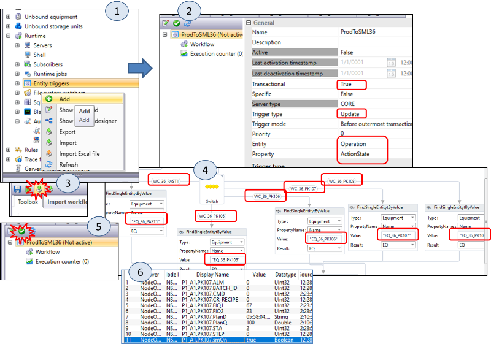
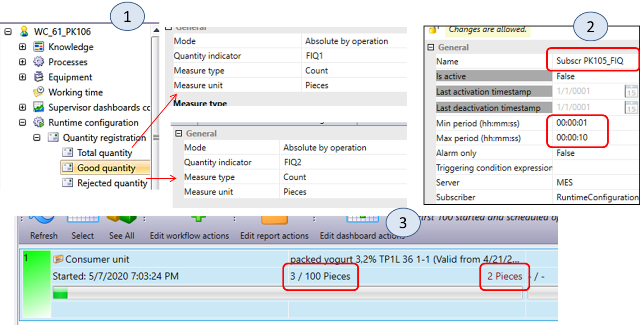
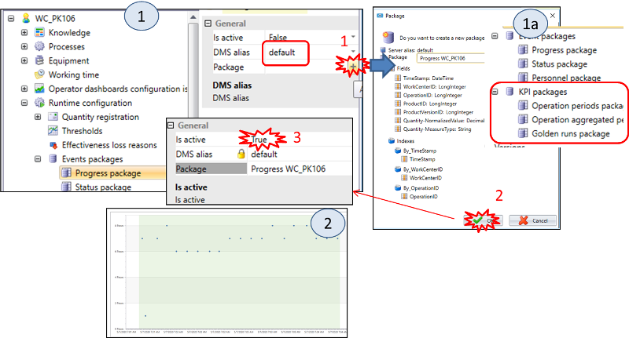
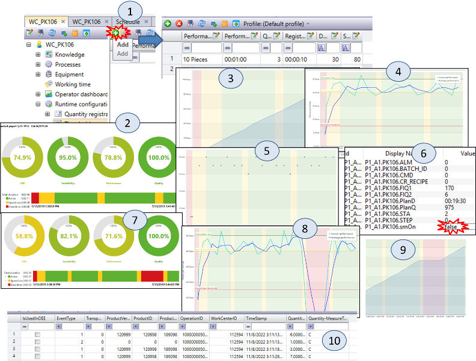
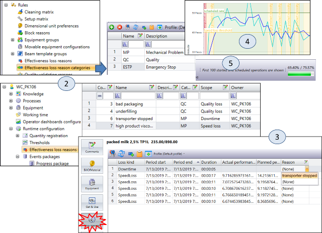

| [<- до лаборних робіт](README.md)                            | [на основну сторінку курсу](../README.md) |
| ------------------------------------------------------------ | ----------------------------------------- |
| [<-Лр6. Робота з робочими центрами та планування](6_scheduler.md) | [--> Лр8. WMS](8_wms.md)                  |

# Лабораторна робота №7 

## Тема. Ключові показники ефективності (KPI)

**Тривалість**: 4 акад. години (2 пари).

**Мета:** навчитися налаштовувати систему для розрахунку показників KPI та аналізувати результати.   

**Завдання для виконання роботи**

**Цілі.** 

1. Створити устатковання для робочих центрів фасування.
2. Налаштувати `Entity Trigger` ля запису планової продуктивності в робочий центр.
3. Сконфігурувати автоматичну реєстрацію кількості якісної і неякісної продукції.
4. Налаштувати пакети для розрахунку KPI.
5. Проаналізувати отримані результати. 

---

## Порядок виконання роботи 

### 1. Створення та налагодження EQUIPMENT для робочих центрів PK105-PK108

У цьому пункті необхідно створити устатковання та параметри, необхідні для автоматичної реєстрації продукту і розрахунку KPI. Для устатковання підготовлена імітаційна програма, яка потребує означення продуктивності. 

1.Додайте EQUIPMENT з ім\'ям `EQ_XX_PK105` в робочий центр `WC_XX_PK105` якщо він відсутній.

2.Додайте і налаштуйте відсутні `EQUIPMENT Parameters` в EQUIPMENT `EQ_XX_PK105` згідно з таблицею, якщо Ви цього не зробили раніше:

| **EQUIPMENT** **Parameter** | **URL**                               | **Mode**         | **Expression** |
| --------------------------- | ------------------------------------- | ---------------- | -------------- |
| STA                         | `DataConnection://PXX_A1.PK105.STA`   | Never            |                |
| CMD_START                   | `DataConnection://PXX_A1.PK105.CMD`   | OnOperationStart | 1              |
| CMD_STOP                    | `DataConnection://PXX_A1.PK105.CMD`   | OnOperationStop  | 2              |
| PlanD                       | `DataConnection://PXX_A1.PK105.PlanD` | OnDemand         |                |
| PlanQ                       | `DataConnection://PXX_A1.PK105.PlanQ` | OnDemand         |                |
| FIQ1                        | `DataConnection://PXX_A1.PK105.FIQ1`  | Never            |                |
| FIQ2                        | `DataConnection://PXX_A1.PK105.FIQ2`  | Never            |                |

Виставте для всіх параметрів значення `Send Silent = True`

3.Необхідно створити аналогічні EQUIPMENT для інших робочих центрів `EQ_XX_PK106`-`EQ_XX_PK108`. Для цього:

- Зробіть три повних клони EQUIPMENT для інших робочих центрів (рис.7.1(1)). Вони з\'являться в списку `Unbound equipment` (рис.7.1(2)). 
- Якщо склоновані EQUIPMENT завалідовані (не сірого кольору) зробіть їх версію в `changing` щоб можна було добавити їх до потрібних робочих центрів
- Змініть назву Equipment на `EQ_XX_PK106`, `EQ_XX_PK107`, `EQ_XX_PK108`.
- Добавте створені Equipment  до відповідних робочих центрів (рис.7.1(3))
- Перейменуйте імена параметрів як було в оригіналі.
- У кожному параметрі кожного клону замініть в полях URL текст `PK105` на `PK106`, `PK107` і `PK108` відповідно до імені Equipment
- зробіть валідацію версії усіх створених Equipment 

4.Додайте в `EQ_XX_PAST1` параметри `PlanD` і `PlanQ`, аналогічно як для `EQ_XX_PK105`. Ці параметри потрібні будуть для імітаційної програми для перерахунку планової продуктивності.

---

### 2. Створення та налаштування `Entity Trigger` для запису планових показників в ПЛК.

До того, щоб означені параметри продуктивності для імітаційної програми відправлялися при старті операції необхідно означити `Entity Trigger`.

**Entity trigger** можуть слугувати для відслідковування найбільш важливих подій, пов'язаних з різними об'єктами в базі даних Momentum. При спрацюванні події, буде викликатися WorkFlow, в який передаватиметься контекст Entity. Таким чином entity trigger виконується у відповідь на певну подію в базі даних, таку як створення, оновлення або видалення об'єкту. При означенні тригеру вказуються властивості:

- Entity - тип об'єкту, для якого цікавить виникнення події;
- Property - властивість, при зміні/створенні/видалення якої повинна викликатися подія 
- Trigger type - коли викликати WorkFlow: Create - при створенні вказаного об'єкту, Update - при його оновленні, Delete - при видалені
- Workflow - workflow, який буде викликатися при спрацюванні тригеру
- Trigger mode - режим, коли викликати тригер

1.Створіть новий `Entity Trigger` для запису `PlanD` і `PlanQ` в `Equipment` при старті операції.

- У модулі `Layout` створіть `Entity Trigger` (рис.7.2(1)) з назвою `ProdToSMLXX` 
- означте налаштування, як це показано на рис.7.2(2)
- Зайдіть в редактор Workflow, погодьтеся з синхронізацією параметрів.
- Користуючись командою `Import Workflow` (рис.7.2(3)) імпортуйте `WF ProdToSML`, розміщення файлу вкаже викладач (за замовченням `C:\BrightEye`).
- відредагуйте `Workflow` щоб він вказував на Ваші імена робочих центрів і Equipment (рис.7.2(4))
- Збережіть Workflow. Активуйте `Entity Trigger`(рис.7.2(5)).

**Увага!** Workflow `ProdToSML` базується на іменах `WorkCenter`, `Equipment` і `Equipment Parameters`, які означені в попередніх вправах. Якщо імена будуть інші, при виконанні Workflow буде видаватися помилка!

5.Для перевірки правильності роботи імітаційної програми для обладнання і зв\'язку її з робочими центрами на одному їх `Workcenter PK`, наприклад `WC_XX_PK107`, зробіть наступні кроки:

- У вікні настройки `EQ_XX_PK107` відкрийте `Indicators`, в полі `Data` повинні бути значення; якщо значень немає, перевірте правильність URL в параметрах; повідомте викладача якщо виникли проблеми

- Запустіть OPC UA Expert, з\'єднаєтеся з NodeOPCUA і виведіть весь вміст сайту `PXX_A1.PK107` (рис.7.1(6)). Призначення тегів:
  - `STA` - стан керуючої програми розливної машини: `0` - ініціалізація, `1` - простій, `2` - виконання; значення `0` - неприпустимо і означає непрацездатність програми;
  - `CMD` - команда управління: `1` - старт, `2` - зупинка; скидається в `0` автоматично після обробки в програмі устаткування.
  - `FIQ1` - лічильник якісно розфасованої продукції
  - `FIQ2` - лічильник неякісно розфасованої продукції (бій, деформація і т.п.)
  - `smOn` - включений режим імітації лічильників продукту

- У модулі `Supervisor` відкрийте панель керування `WC_XX_PK107`. Якщо робочий центр не видимий - попросіть адміністратора надати вам права на цей та інші робочі центри.  Створіть тестову операцію на фасування якого-небуть продукту, наприклад `CU_XX_126` `packed yogurt 3,2% C0,5L XX`

- Запустіть тестову операцію на виконання. Десь через 10 секунд проконтролюйте в NodeOPCUA наступні значення:

  - `PlanD` і `PlanQ` повинні прийняти ненульові значення
  - `STA` має дорівнювати 2 (Running)
  - `FIQ1` повинен збільшуватися кожні 10 секунд
  - `FIQ2` повинен збільшуватися десь протягом хвилини (частота не має значення)

- Відкладіть виконання тестової операції кнопкою `Reschedule`. Десь через 10 секунд проконтролюйте в NodeOPCUA наступні значення:
  -  `STA` має дорівнювати 1 (простій)
  -  `FIQ1` і `FIQ2` обнуляються.

- запустіть і зупиніть виконання тестової операції
- Якщо наведені вище умови не виконані, виправте помилки.

---

### 3. Автоматична реєстрація на PK105-PK108

Для розрахунку показників ефективності необхідно реєструвати кількість виробленої та дефектної продукції. Це потрібно для:

- порівняння планової продуктивності з фактичною
- визначити коефіцієнт втрат  

Також ці показники приймають участь у розрахунку узагальненого показника OEE. 

У цьому пункті необхідно реалізувати реєстрацію кількості якісно і неякісно розфасованої продукції за лічильниками `FIQ1` і `FIQ2`.

1.За подобою вправи 5.9 означте автоматичну реєстрацію якісно і неякісно розфасованої продукції:

- У `WC_XX_PK105` додайте `Runtime Configuration`

- У налаштуваннях `Total Quantity` і `Rejected Quantity` виставте всі налаштування відповідно рис.7.3(1).

- У налаштуваннях `Quantity registration` виберіть `Active operation` і додайте DataCenter Subscription (кнопка «+»). Після цього, використовуючи кнопку «\...» перейдіть в налаштування Subscription, де означте ім\'я `Subscr PK105_XX_FIQ ` і параметри (рис.7.3(2)). Активуйте підписку, використовуючи кнопку `Activate`

- Проконтролюйте що `Work Center Feedback` в Work Center встановлено в `Material Lot`.

- Використовуючи кнопку `Create test operation` панелі інструментів `Supervisor` для Workcenter `WC_XX_PK105` додайте Operation для продукту `CU_XX_122` `packed milk 3,2% B2LXX`. Запустіть на виконання. Переконайтеся що кількість виробленого якісного (actual - зелена поділка) і неякісного (rejected - червоне число праворуч від поділки) продукту змінюється (рис.7.3(2)). Якщо кількість не змінюється, першопочатково перевірте, чи в налаштуваннях робочого центру стоїть властивість `Work Center Feedback = Material Lot`  а також чи змінються відповідні змінні як вказано в попередньому пункті.    
- Зупиніть виконання операції.

2\. Повторіть п.1. для `WC_XX_PK106`-`WC_XX_PK108`.

---

### 4. Реєстрація статусу і прогресу в DMS

Для визначення часу втрати швидкості та нештатної зупинки необхідно архівувати кількісні показники в DMS. Для цього передбачені спеціалізовані формати пакетів та відповідні діяльності:

- Progress package - для реєстрації кількості продукту
- Status Package - для реєстрації стану, коли робочий центр працює (1) або зупинений (0) 

Порівняння записаних в базу даних показників з плановими дає можливість визначити час зниження продуктивності, нештатну зупинку робочого центра, та вказати причини.

Для розрахунку KPI також використовуються спеціалізовані пакети. У Momentum є наперед визначена функціональність розрахунку OEE. Детальніше про призначення OEE читайте в лекції, тут розглянемо, як OEE конфігурується в Momentum. Тут використовується формула: 

`OEE` = `Availability` * `Performance` * `Quality`

***Performance*** = *Actual performance* / *planned performance*

Де *Performance*  - продуктивність, *Actual performance* - дійсна продуктивність, *Planned performance* - планова продуктивність. Дійсна продуктивність розраховується на основі дійсного приросту кількості  (Actual quantity) за період часу (Actual duration):   

*Actual performance = Actual quantity / Actual duration*

За цей же час рахується планова продуктивність (пояснення дано в наступному пункті):

*Planned performance* = *Planned quantity* / *Planned duration*

Ці дані заносяться в пакет `Performance package`. 

Доступність (Availability) розраховується як співвідношення дійсного робочого часу до запанованого робочого:   

***Availability*** = (WorkingTime – DownTime) / WorkingTime

WorkingTime - робочий час, DownTime - час простою. WorkingTime  рахується як час коли операція знаходилася в стані роботи, тоді як DownTime, коли на виході не було продукції. Цей показник зберігається в `Availability package`

Показник якості розраховується як співвідношення хорошої кількості до загальної. 

***Quality*** = Good Count / Total Count

Для цього показника також означується окремий пакет DMS.

У цьому пункті необхідно для `WC_XX_PK106` конфігурувати реєстрацію в DMS (Package):

- кількість виробленого продукту
- статуси для робочого центру 
- пакетів для KPI 

1.Створіть і прив'яжіть `Progress Package` (рис.7.4(1.1)) з назвою `Progress WC_XX_PK106` з вікна робочого центру `WC_XX_PK106` , перед цим вказавши `DMS alias = default`. Активуйте його (рис.7.4(1.3)). Цей пакет тепер буде використовуватися для реєстрації кількості продукту.

2.Аналогічним чином створіть `Status Package` з ім\'ям `Status WC_XX_PK106`. Цей пакет тепер буде використовуватися для реєстрації початку і кінця запуску і зупинки операцій продукту.

3.Аналогічним чином створіть і активуйте 3-ри KPI пакета (рис.7.4 (1а)):

- `Operations Period Package WC_XX_PK106`
- `Operations Agreagated Period Package WC_XX_PK106`
- `Golden runs WC_XX_PK106`

4.Використовуючи `Scheduler` створіть `Customer Order` на виробництво 1000 штук `CU_XX_125` `packed yogurt 3,2% TP1L XX`. Зробіть автоматичне планування. Проконтролюйте, щоб на `PK_XX_106 ` була запланована операція.

5.Перейдіть у вікно супервізора `WC_XX_PK106`. Запустіть операцію на виконання. Переконайтеся, що кількість продукту збільшується.

6.Зайдіть в інформаційну панель робочого центру, використовуючи кнопку \"Info\". Перейдіть в розділ `KPI` а потім на вкладку `Registration` (рис.7.4(2)). Проаналізуйте побачену інформацію.

7.У вікні `Operator` натисніть `Reschedule` для тимчасового зупинення вироблення робочого центру.

---

### 5.Налаштування порогів (Thresholds)

Для розрахунку деяких KPI у тому числі OEE, необхідно визначати моменти втрати швидкості  (продуктивності) і зупинки. Для цього використовується прогнозування очікуваної кількості при певній плановій продуктивності. Враховуючи можливі відмінності прогнозованих характеристик в залежності від продуктивності різного типу продукту, у Momentum використовується Thresholds для різних продуктивностей. Алгоритм прогнозування базується на очікуванні того, що виконується реєстрація прогресу з деяким ритмом. Якщо протягом певного періоду не виконується реєстрація з очікуваним ритмом або прогресом на кожну реєстрацію, меншу ніж очікувалося, цей період буде відмічено як час простоювання (**down-time**) або втрата швидкості (**speed-loss**).

Прогноз втрати швидкості (Speed loss prediction) або прогноз простоювання (downtime prediction) базуються на реєстрації необроблених даних і налаштуваннях порогів (thresholds). Планова продуктивність розраховується як планова кількість поділена на планову тривалість:

 `Operation planned performance` = `Planned quantity` / `Planned duration`.

Ці планові величини розраховуються при плануванні і залежать від версії робочого центру, в якій задаються кількість та час, а також від налаштувань зв'язків між робочими центрами в маршрутній діаграмі. Так, наприклад при налаштуваннях зв'язків "Dependency type" рівним "End-End", планова продуктивність може бути меншою ніж означена в версії робочого центру, так як буде підлаштовуватися під менш продуктивний робочий центр в матеріальному ланцюжку.  

Кожен запис в налаштуваннях `Thresholds` має параметри `Performance number` та `Performance period`. Ці параметри означують заплановану продуктивність, для якої даний запис використовується в розрахунку в алгоритмі прогнозування. 

 `Planned performance` = `Performance quantity` / `performance period`.

Кожен запис має декілька параметрів:

- **Performance quantity** (значення для продуктивності) і **performance period** (період для продуктивності) означують, для яких планових показників роботи параметри цього запису повинні бути вибрані для розрахунку; при виборі запису буде враховуватися найбільш відповідне значення продуктивності

- **Downtime** (порогові значення часу простоювання) и **speed-loss** (втрати швидкості) означають рівень від запланованої швидкості, коли повинен реєструватися час простоювання або втрати швидкості. 

- **Registration period** (Період реєстрації) означує, як часто очікується запис в прогрес реєстрації (залежить від означення підписки параметра устатковання). 

- **Queue size** (Розмір черги) - це параметр, який означує, як розраховується середня продуктивність (average performance). Коли це значення велике, не видно коротких втрат швидкості і простоювання, якщо маленьке - значення дуже чутливе до всплесків.  

У цьому пункті необхідно налаштувати Thresholds для робочого центру `WC_XX_PK106` для визначення середнього значення, втрати швидкості і визначення зупинки  а також подивитися їх на вбудованих в моделі Operator графіках .

1) У налаштуваннях `WC_XX_PK106` створіть `Thresholds` як показано на рис.7.5(1).

2) Перейдіть у вікно оператора `WC_XX_PK106`. Запустіть операцію на виконання.

3) Через хвилину зайдіть в інформаційну панель робочого центру, використовуючи кнопку `Info`. Перейдіть в розділ `KPI` (рис.7.5(2)), а потім на вкладку `Progress` (рис.7.5(3)), вкладку `Performance` (рис.7.5(4)) і `Registration` (рис.7.4(5)). Зверніть увагу на уставки і діапазони втрати швидкості (`speed loss`) і простою (`Down Time`). 

4) Відкрийте OPC Client UAExpert. Вимкніть імітацію для `PK_XX_106` шляхом присвоєння `PXX_A1.PK106.smOn = false` (рис.7.5(6)). Зачекайте хвилину, потім знову ввімкніть імітацію (`PXX_A1.PK106.smOn = true`). Тепер на екранах KPI ви побачите простій виділений червоним (рис.7.5(7)) або рожевим кольором (рис.7.5(8-9). Зробіть копії екрану для звіту.

5) У вікні оператора `WC_XX_PK106` відкрийте вікно KPI. На вкладці OEE видно, що Quality відрізняється від 100%. Це пов\'язано з урахуванням гарної і поганої якості продукту. Зробіть копію екрану для звіту.

6) У вікні `Operator` натисніть `Reschedule` для тимчасового призупинення вироблення робочого центру.

7) З використання модуля `Data Mining` відкрийте `Raw Data` для пакету `Progress WC_XX_PK106`. Проаналізуйте вміст (рис.7.4(10). Те саме зробіть для інших створених Вами пакетів для робочого центру.

---

### 6. Створення `Effectiveness loss reasons` і пакетів для KPI 

У цьому пункті необхідно створити опис причин втрати ефективності і зупинки.

1. **Це робиться адміністратором один раз для всієї системи.** Створіть `loss reason category`. Для цього виділіть в `Location Browser` потрібну `Area XX`, відкрийте модуль «Layout» і в пункті «Effectiveness loss reason category» створіть три категорії, як показано на рис.7.5(1): 
   - MP - мехнічна проблема
   - QC - проблема з якістю
   - ESTP - аварійна зупинка 
2. **Це робиться адміністратором один раз для всієї системи.** Відкрийте налаштування `Effectiveness loss reasons` для заводу. Створіть 4-ри причини втрати ефективності як це показано на рис.7.5(2). Поле `Code` залишайте без змін.
   - погано упаковане
   - недолив
   - зупинка транспортера
   - продукт в'язкий

Тепер, коли створені категорії і причини втрати ефективності, їх можна використовувати для уточнення причин у визначенні KPI. 

3.Перейдіть у вікно оператора `WC_XX_PK106`. Запустіть операцію на виконання.

4.У вікні оператора `WC_XX_PK106` відкрийте вікно `Loss Reasons`. Тепер для кожного падіння швидкості або простою в поле `Reason` задайте причини (рис.7.5(3)).

5.У вікні оператора `WC_XX_PK106` відкрийте вікно KPI. Подивіться вкладки `Progress`, `Performance` (рис.7.5(4)) і `Registration`. Там повинні відображатися причини.

6.У вікні `Operator` натисніть `Reschedule` для тимчасового зупинення вироблення робочого центру.

7.У вікні `Operator` перейдіть в режим перегляду історії операцій `See All`. Для останньої зупиненої операції повторіть пункти 5-6. Після цього знову перейдіть в режим перегляду операцій для виконання `ToDo`.
З цього пункту видно, що KPI можна переглядати і вносити причини втрати ефективності як під час виробництва так і після.

8.Запустіть повторно операцію і зверніть увагу на порівняння KPI з найкращим (рис.7.6(5)).

9.У вікні `Operator` натисніть `Stop` для зупинення вироблення робочим центром.

---

### 7. Mass Balance 

Масові баланси показують споживані кількості із підключеного буферу. Якщо при виконанні операції є усі необхідні продукти в підключеному буфері, теоретична кількість (показано зеленим) і фактичне споживання (жовтий) повинні бути однаковими. 

1. Створіть реєстрацію і KPI для робочого центру `WC_XX_PAST1`.

2. Запустіть заплановану операцію на робочому центрі `WC_XX_PAST1`.

3. Відкрийте модуль `Stock` і зареєструйте необхідну для пастеризатора сировину (`Produce`).

4. У вікні оператора `WC_XX_PAST1` відкрийте вікно KPI і перейдіть на вкладку `Mass Balance`. Подивіться на різницю теоретичного і фактичного споживання.

5. У вікні `Operator` натисніть `Reschedule` для тимчасового зупинення виготовлення робочим центром.

## Питання до захисту

1. Розкажіть яке призначення параметрів устатковання `PlanD` і `PlanQ`. Як вони використовуються в лабораторній роботі?
2. Що таке `Entity Trigger`? Для чого він використовується в даній лабораторній роботі?
3.  Для чого необхідно реєструвати кількість виробленої якісної і дефектної продукції? Яким чином це означується в Momentum.
4. Навіщо означувати пакети `Progress package` та `Status Package` в Momentum?
5. Що таке OEE і яка формула розрахунку цього KPI в Momentum?
6. Розкажіть про налаштування порогів (`Thresholds`).
7. Розкажіть від чого залежить планова продуктивність?
8. Прокоментуйте отримані в лабораторній роботі графіки та показники з вкладки KPI модуля Operator з робочого центру.

| [<- до лаборних робіт](README.md)                            | [на основну сторінку курсу](../README.md) |
| ------------------------------------------------------------ | ----------------------------------------- |
| [<-Лр6. Робота з робочими центрами та планування](6_scheduler.md) | [--> Лр8. WMS](8_wms.md)                  |
