# Правила встановлення та налаштування системи

## Інсталяція Momentum 

### На стороні серверу

Треба мати:

- Setup.Tool.InstallationManager
- ключі XML для конкретних застосунків
- завантажені версії конкретної системи
- дистрибутив MS SQL Server

#### Встановлення MS SQL Server

- Встановити MS SQL Server Comunity Edition

#### Встановлення та налаштування InstallationManager

- [ ] Встановити InstallationManager
- [ ] Запустити InstallationManager
- [ ] Створити новий екземпляр або змінити існуючий в настройках Download
  -  скопіювати файли в папку `Download Folder`

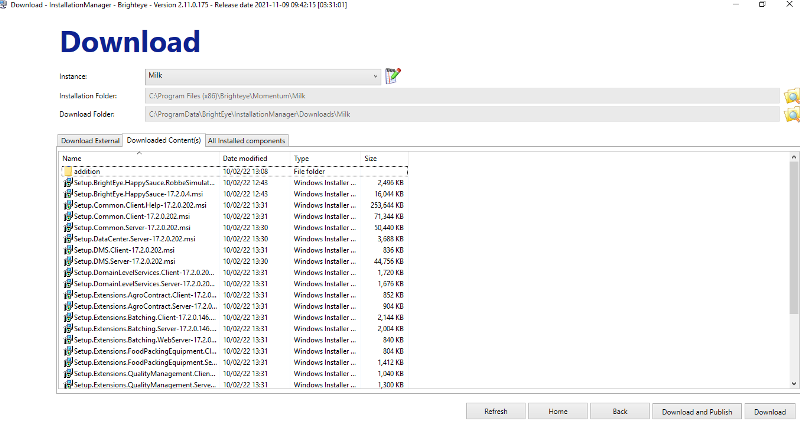

- налаштування екземплярів через "карандаш" 

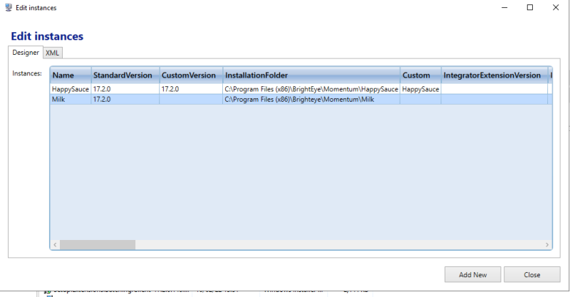

- зміни екземпляру через подвійний клік

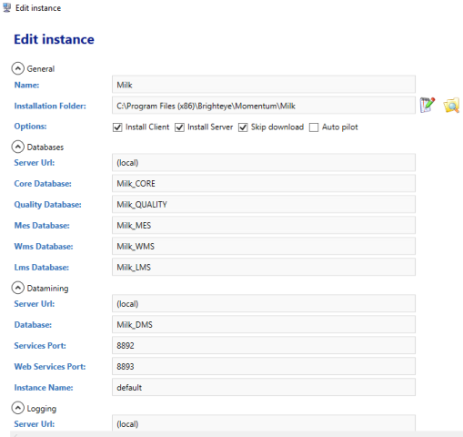

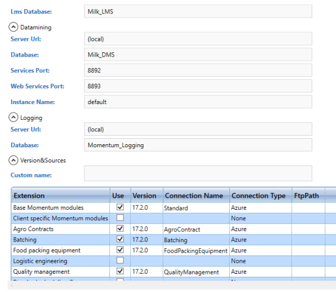

#### Встановлення екземпляру та створення бази

- [ ] Запустити Install

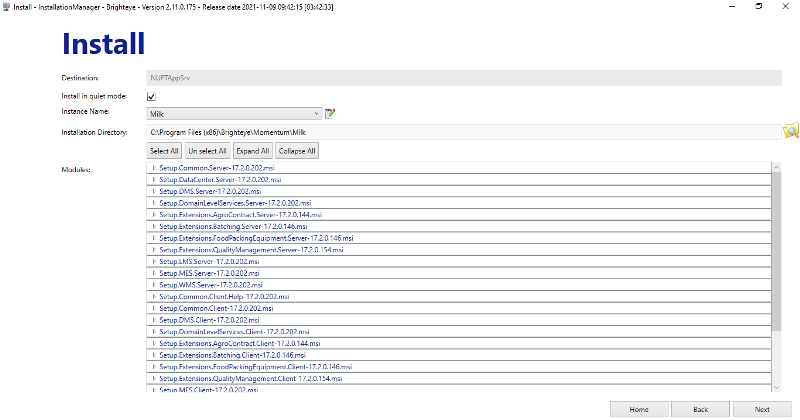

- [ ] Створити базу через Upgrade для `Server` і `DMS`

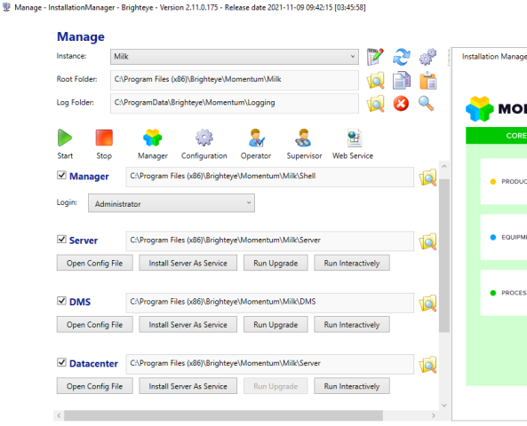

### На стороні клієнта

Треба мати:

- Setup.Tool.InstallationManager
- завантажені версії конкретної системи

#### Встановлення та налаштування InstallationManager

- [ ] Встановити InstallationManager
- [ ] Запустити InstallationManager
- [ ] Створити новий екземпляр або змінити існуючий в настройках Download
  -  скопіювати файли в папку `Download Folder`
  - Поставити галочку `Install Client`

#### Встановлення та налаштування клієнта

- [ ] Запустити Install

## Інсталяція та налаштування інших застосунків на сервері

### Інсталювання Node-RED

- [ ] Завантажити msi-файл Node.JS LTS версії https://nodejs.org

- [ ] Запустити на виконання msi-файл від імені адміністратора і встановити Node.JS, при виклику діалогових вікон все залишати за замовченням

- [ ] перезавантажте машину

- [ ] Інсталюйте Node-RED . Інсталювання проводиться з використанням npm з командою install. Наберіть в командному рядку

```bash
npm install -g --unsafe-perm node-red
```

- [ ] Запустіть Node-RED з командного рядка

```bash
node-red
```

- [ ] Можуть бути показані повідомлення про пропозицію розблокування брандмауером, з якими треба погодитись.

- [ ] зайдіть на `127.0.0.1:1880`, перевірте що все працює 

- [ ] зупиніть node-red через CTRL+ALT+DEL

### Підготувати програму імітації для Node-RED

- [ ] завантажити бібліотеку OPC UA: перейдіть в домашню директорію

```bash
npm install node-red-contrib-opcua@0.2.52
```

- [ ] зайдіть на 127.0.0.1:1880

- [ ] імпортуйте потоки звідси https://github.com/pupenasan/MOMlabsim/blob/master/simul.json 

- [ ] зробіть розгортання

### Поставити OPC UA Expert

- [ ] Завантажте та встановіть тестовий OPC UA Client [UaExpert](https://www.unified-automation.com/downloads/opc-ua-clients.html).

- [ ] Запустіть UaExpert, з'єднайтеся з імітаційним ОРС сервером opc.tcp://localhost:53880

- [ ] перевірте роботу 

### Поставити Node-RED як службу

- [ ] завантажити і встановити NSSM - http://nssm.cc/download 

- [ ] налаштувати встановлення node-red як служби

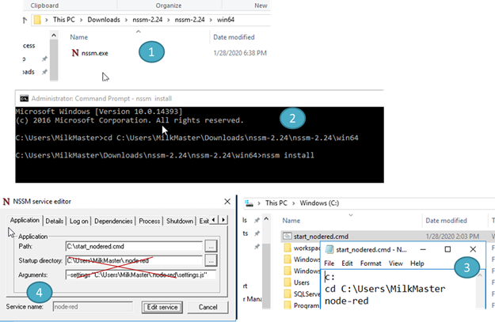

 


- [ ] перезапустити ПК і перевірити чи працює імітатор OPC UA Server 


## Налаштування Momentum 

- [ ] На віртуалці термінального серверу треба поставити UAExpert
- [ ] Створити Site, Area для кожного варіанту 

- [ ] Добавити юзерів за шаблоном `Stud1`  , добавити групи `student1`, добавити юзерів в групи

- [ ] Створити групу `students`, добавити туди усі інші групи, та надати усі дозволи модулів окрім секюріті

- [ ] Добавити для груп юзерів

- доступ до тип арій


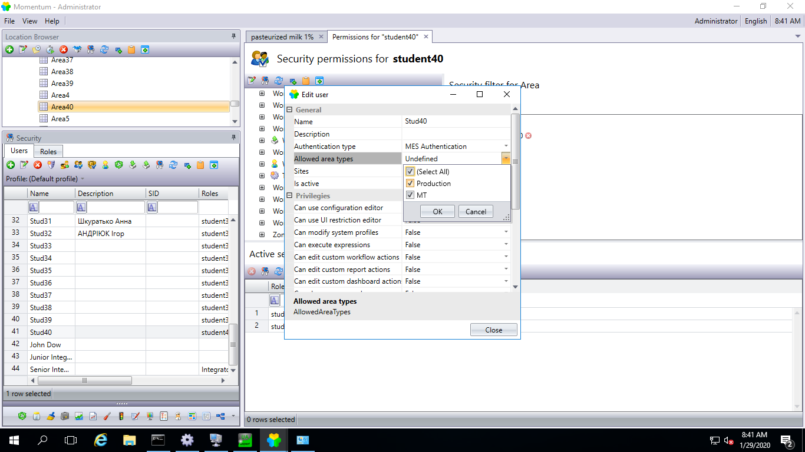

- добавити пермішинси

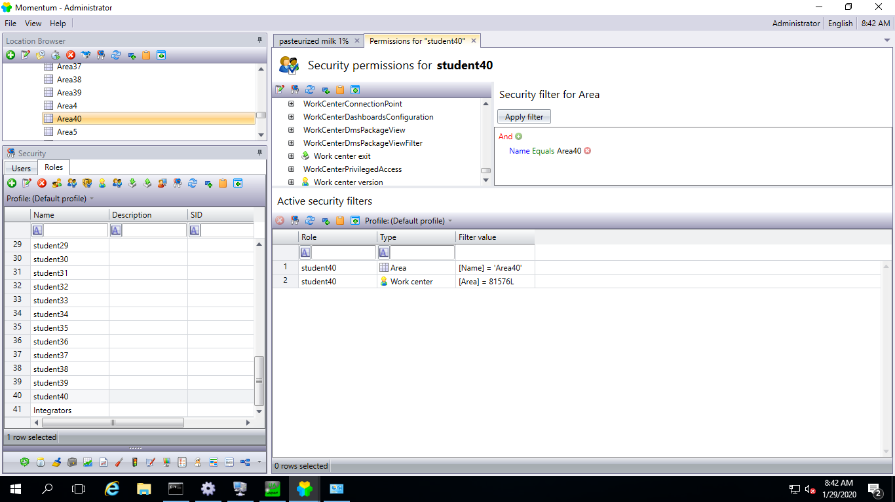

- на машині шела і віртуалці ажура дозволити вхідні порти 1000-1500, 8000-10000

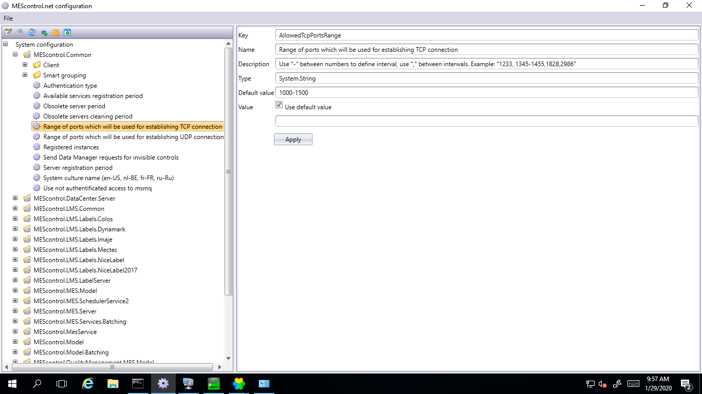

- [ ] Добавити DMS сервер в Shell
- [ ] Дозволити усі дії за замовченням

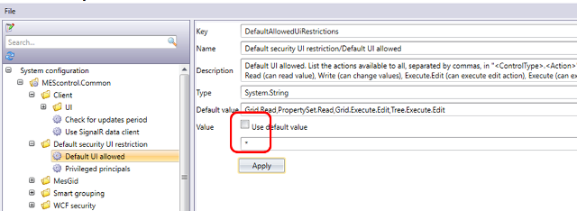


- у серваках деактивувати IPv6 на:
  - NUFTAppSrv/CORE/default:ui
  - NUFTAppSrv/DataCenter/default:ui
  - NUFTAppSrv/DataCenter/default:signalr
  - та інших серверах


## ToDo

**всі робочі центри видимі і редагуються через вибір підприємства** 

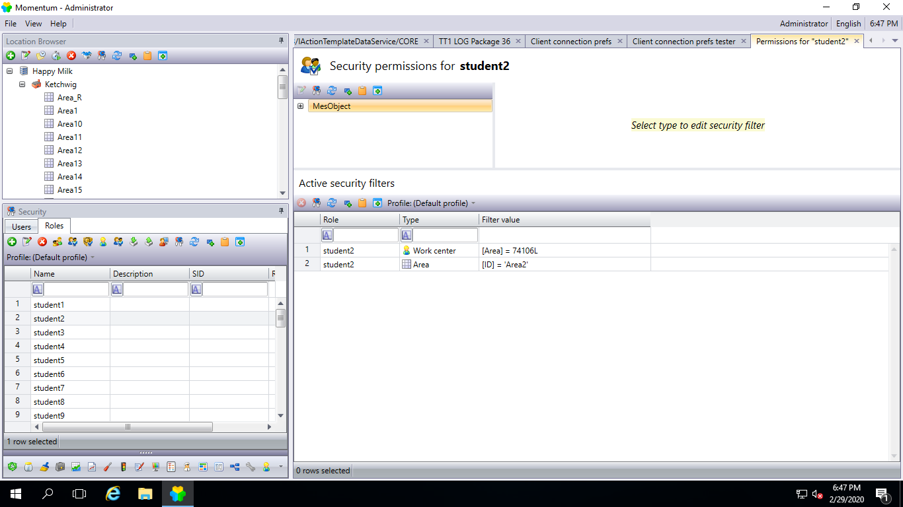

 

**щоб було видно записи в** **datamining**  (поки працює тільки під зареєстрованим у вінді адміном )

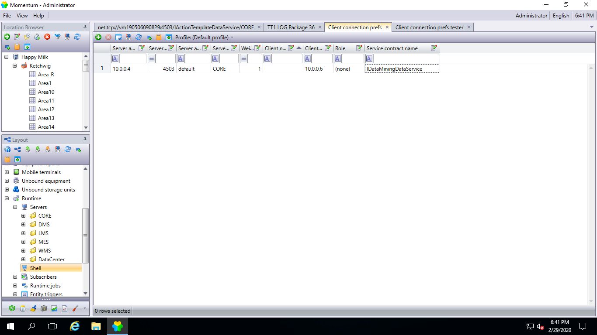

 

 


 


\-     лабораторка 1.8 перший метод через Simple View не у всіх працює

\-     у пункті 1.31 при заміні реєстрації по material lot видає помилку на реєстрацію продукту, а з часом стає все норм чомусь

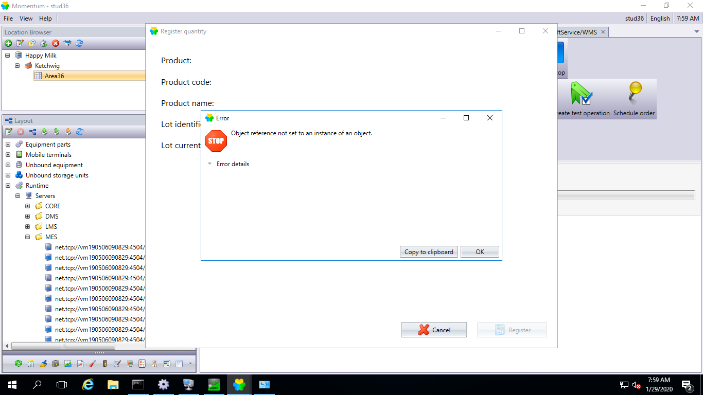

 