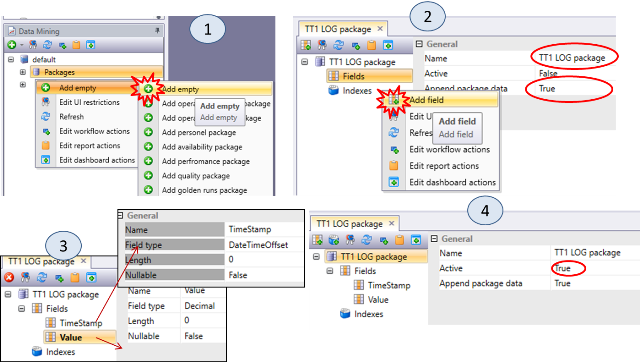
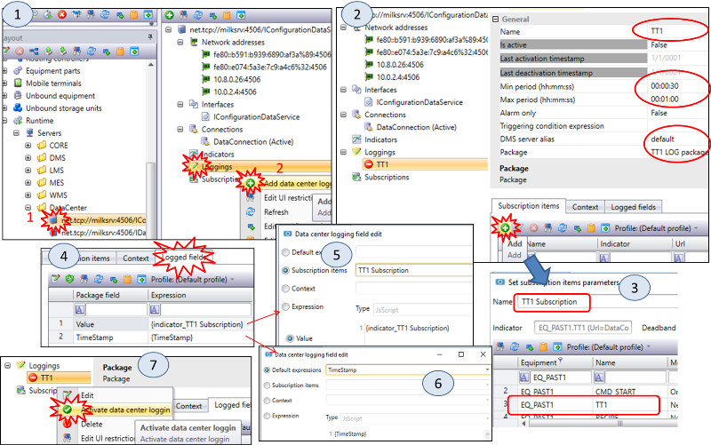
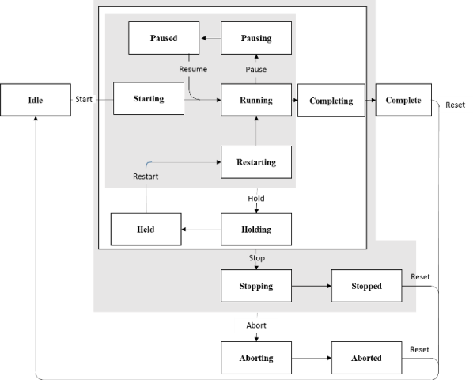
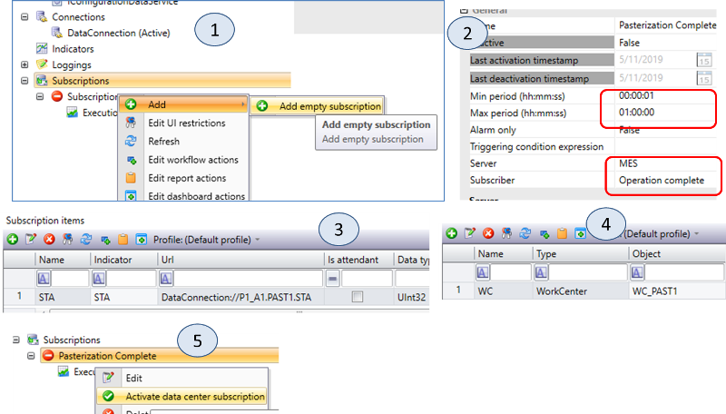
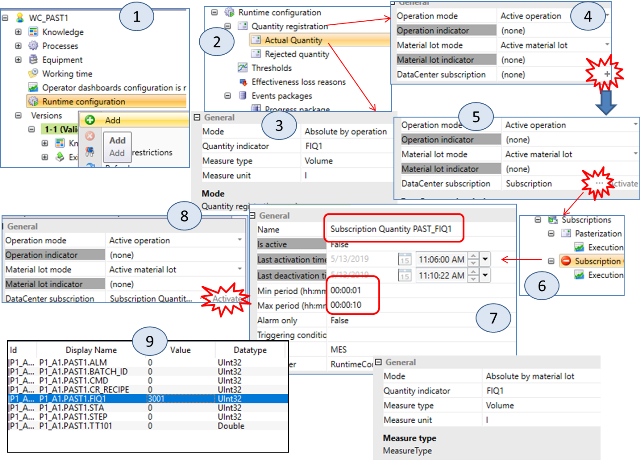

| [<- до лаборних робіт](README.md)                            | [на основну сторінку курсу](../README.md)                 |
| ------------------------------------------------------------ | --------------------------------------------------------- |
| [<- Лр4. Основи роботи з автоматичним плануванням](4_schedbase.md) | [ Лр6. Робота з продуктами та планування](6_scheduler.md) |

# Лабораторна робота №5. 

## Тема. Основи роботи з DMS та WorkFlow

**Тривалість**: 4 акад. години (2 пари).

**Мета:** ознайомлення з основами роботи колекціонування даних (DataMining), користувацькими програмами на WorkFlow, навчитися робити автоматичну реєстрацію продукту.       

**Завдання для виконання роботи**

**Цілі.** 

1. Сконфігурувати реєстрацію параметру (температури продукту на виході) в DMS.
2. Передивитися записи в модулі Operator.
3. Створити WorkFlow для: виведення повідомлень в архів, зупинки активної операції.
4. Створити підписку для зупинки активної операції при відповідній зміні стану устатковання.
5. Налаштувати автоматичну реєстрацію виробленого продукту на пастеризаторі за показами лічильника-витратоміра.
6. Створити усі налаштування для устатковання та параметри для існуючих робочих центрів.

## Порядок виконання роботи 

### 1. Означення пакета для ведення архіву по температурі.

В цьому і в наступному пункті необхідно конфігурувати ведення журналу для параметра `TT1` обладнання «EQ\_PAST1». Це потрібно, наприклад для формування звіту по температурі пастеризації. Для цього необхідно створити пакет, в якому налаштувати поля записів в ньому. 

Пакет (package) - це по суті таблиця бази даних з означеними полями. Є користувацькі пакети, структура яких означується користувачем, а є наперед визначені, які використовуються в існуючих функціях Momentum, наприклад для розрахунку KPI, які будуть в наступних лабораторних роботах.

1.  Відкрийте модуль Data Mining: View -\> Data Mining.
2.  Додайте порожній пакет: add empty package (рис.5.1(1)). Створиться пакет з ім\'ям «New Package»

У даному випадку добавляється пакет, який означується користувачем. Тобто користувач сам означує структуру пакету.  

3. Подвійним кліком відкрийте пакет «New Package» для настройки.

4. Визначте Name = \"TT1 LOG Package XX» де XX-номер варіанту; задайте "Append Package Data" = TRUE, для режиму додавання нових записів (рис.5.1(2)).

5. За допомогою кнопки Add Filed (рис.5.1(2)) додайте наступні поля (рис.5.1(3)):

| **Name**  | **Filed Type** | **Length** | **Nullable** |
| --------- | -------------- | ---------- | ------------ |
| TimeStamp | DateTimeOffset | 0          | false        |
| Value     | Decimal        | 0          | false        |

6.Активуйте пакет Active = True (рис.5.1(4))

---

###  2. Конфігурація записування в пакет з Data Center.

Означення пакету, аналогічно як означення тиблиці в базі даних не означує самі записи. Для формування записів необхідно використати відповідні сервіси. При необхідності зберігання даних для конкретного параметру, це налаштовується в  Data Center шляхом означення підписки в розділі `Loggins`. 

У цьому пункті налаштовується періодичність та джерело даних для записування в пакет. Властивість `Min period` вказує на мінімальну періодичність запису, тобто якщо протягом цього часу параметр зміниться кілька раз в пакет буде занесене тільки останнє значення.`Max Period` - це максимальний час очікування змін. Тобто, навіть якщо протягом цього часу нічого не зміниться, значення все одно запишеться.  

1. Перейдіть на в настройку `Data Center Logging`: `Layout -> Runtime -> Servers -> Datacenter` (рис.5.2(1))
2. Додайте нову підписку в `Data Center-> Loggings -> Add Datacenter Logging` (рис.5.2(1))
3. Буде створена нова підписка з червоною іконкою, що свідчить про неактивність підписки .
4. Перейменуйте підписку в `TT1_XX `(де XX номер варіанту), заповніть властивості `TT1_XX` як показано на рис.5.2(2).

5. У закладці «Subscription items» натисніть Add (рис.5.2(2)) для додавання підписки.
6. Вкажіть назву підписки `TT1_XX Subscription` а також ім\'я параметра `TT101` устатковання «EQ\_XX\_PAST1» (рис.5.2(3)). Решту полів залиште без зміни. Таким чином в підписці братиме участь параметр устатковання, зміна якого буде ініціювати запис в пакет DMS.
7. Перейдіть на вкладку `Logged fields` (рис.5.2(4)). Тут потрібно вказати значення, які будуть писатися в поля пакета. Для поля \"Value\" виберіть значення підписки (рис.5.2(5)).

8. Для поля `TimeStamp` вкажіть визначений вираз TimeStamp (рис.5.2(6)). Таким чином під час запису в поле `TimeStamp` буде записуватися поточна дата і час.

9. Увімкніть журнал (рис.5.2(7)).

---

### 3. Перегляд записів пакету. 

Записи пакетів можна переглядати у вбудованому переглядачі самого модулю DataMining, що потрібно для мети налагодження, або в місці його цільового використання. Наприклад, це може бути модуль Operator робочого центру, для якого він призначений, або звіти з відповідними трендами.

У цьому пункті необхідно подивитися сформовані записи за допомогою вбудованого переглядача.        

1. Відкрийте модуль `Data Mining: View -> Data Mining`.
2. Виділіть створений раніше пакет і через контекстне меню запустіть команду `Show RAW data view` (рис.5.3(1)). З\'явиться таблиця з значеннями записів (рис.5.3(2)). Упорядкуйте записи за спаданням `TimeStamp`.

3. Кожне значення записується не рідше ніж раз на хвилину і не частіше 2-х раз за хвилину, так як це вказується в налаштуваннях пакета. Використовуючи OPC UA Expert переведіть режим імітації в `smOn=False` змініть кілька разів значення `P1_A1.PAST1` в проміжках порядку 20-40 секунд. За відмітками часу записів подивіться, як часто пишеться значення в пакет DMS. Для поновлення перегляду записів користуйтеся кнопкою `Refresh`.

4. У модулі `Data Mining` виберіть `TT1 Log Package XX` і натисніть `Edit Work Center DMS Package View` (рис.5.3(3)). Додайте один View (рис.5.3(4)) і Workcenter, де він буде відображатися. Відкрийте вікно Operator Work Center `WC_XX_PAST1`. Перейдіть в \"Info\" -\> Data Mining (рис.5.3(5)). Ви побачите зміст пакета.

---

### 4. Створення Workflow для виводу повідомлень в DMS. 

Workflow Activities - це користувацькі скрипти, які записані на мові Workflow. Для роботи з системою в   Workflow наявні різноманітні блоки, частина з яких використовуються в даній і наступних лабораторних роботах.

Workflow Activities можуть визиватися з інших функціональних частин Momentum. 

У цьому пункті необхідно створити Workflow для виведення повідомлень в пакет DMS. Тому спочатку створюється і налаштовується пакет з відповідними полями. Потім створюється Workflow Activities, який записує повідомлення в цей пакет з вказівкою часу запису.   

1.  Відкрийте модуль `DataMining` і створіть новий `Empty Packet`.

2.  Визначте Name = «LogMsg XX» (де XX -- номер варіанту), встановіть `Append package data = TRUE` (рис.5.4(1)).

3.  Визначте поля:

-   `TS` (рис.5.4(2)) для запису позначки часу

-   `Msg` (рис.5.4(3)) для запису повідомлення

-   `Logger` (рис.5.4(4)) для запису позначки

4\. Увімкніть Packet: `LogMsg->Active = True`

5\.Відкрийте зміст пакета з використанням `RAW Data Viewer` модуля `DataMining`. Пакет не буде містити жодного запису. Тим не менш не закривайте вкладку, вона буде використовуватися для перегляду як альтернатива журналу.

6\.Відкрийте модуль `Workflows`: меню `View -> Workflow`. Додайте новий Workflow на вкладці Activity(рис.5.4(5)).

7.На вкладці `Definition` визначте ім\'я Activity = `Message XX` (де XX - номер варіанту), `Server = MES`, `Transactional = FALSE` (рис.5.4(6)).

8.Збережіть Activity кнопкою `Save` (рис.5.4(7)).

Виконання Workflow починається з елементу Start. Далі виконання елементів іде по ходу направлення з'єднувальних стрілок. У Workflow можна використовувати Variable  - це змінні, які можна використовувати для збереження проміжних результатів. Для їх використання їх спочатку об'являють і можна вказати значення за замовченням. 

9.Додайте одну Variable з назвою «LoggerName» (рис.5.4(8)). Зверніть увагу що поле вводу змінних з'явиться тільки після кліку в області Workflow. В поле default записано значення за замовчуванням в форматі VB. 

10.Добавте з панелі елемент `WritePackageToDms` і з'єднайте його з елементом `Start`(рис.5.4(9)). Заповніть поля, як показано на рисунку.

Елемент `WritePackageToDms` робить запис у вказаний пакет Dms. У параметрах вказується зо саме треба писати. Поля `Value` в Workflow заповнюються в форматі виразів VB.NET. Там можна використовувати константи, змінні або викликати функції, об'єднуючи це все у вирази. 

11.Збережіть Activity кнопкою `Save`. Запусіть `Execute` . Перегляньте записи пакету DMS, аналогічно як це робилося в попередньому пункті.

Кнопка `Execute` використовується для перевірки роботи  Workflow, так як ініціювання виклику проводиться з інших функціональних частин Momentum.

---

### 5. Зупинка активної операції WC_XX_PAST1 

Workflow має достатньо обширну бібліотеку для керування різними діяльностями в Momentum. Це дає можливість автоматизувати багато діяльностей, які не входять в стандартні функції Momentum. Зрештою, якщо на Workflow  якусь функцію зробити важко або не можливо, можна скористатися функціональністю `C#`, скрипти на якому можна писати у відповідному блоці. У даному пункті  Workflow  використовується для зупинки активної операції на вказаному робочому центрі. Саме використання даного  Workflow  передбачено в п.7, тут необхідно тільки створити і перевірити його. 

У Workflow використовуються наступні блоки:

- `if` - виконує один з двох блоків, в залежності від спрацювання умови (Condition)  
- `Decision` - перенаправляє виконання на той блок, для напрямку якого сформувався вихід умови (Condition)
- `InvokeServiceMethod` - запускає вказаний метод вказаного сервісу Momentum. У даному випадку використовується метод `GetActiveOperation` сервісу `OperationService` для отримання активної операції (та, яка виконується) за вказаним робочим центром
- `InvokeMethod` - виконує вказаний метод вказаного об'єкту    

1.  У модулі `WorkFlows` клонуйте (`Контекстне меню дії->Clone`) перед цим створений Action і дайте йому назву `StopActiveOperation_XX` (де XX - номер Вашого варіанту). На вкладці `Definition` означте `Transactional = TURE`.
2.  Визначте Arguments (рис.5.5(1)): `WC_Name` визначає ім\'я робочого центру, в якому потрібно зупинити активну (в роботі) операцію. 
3.  Визначте Variables (рис.5.5(1)): `WC` - необхідний робочий центр, `Oper` - необхідна операція. Для вибору типу змінної в списку типів треба вибрати `Browse of types` після чого задати фільтр, наприклад `WorkCenter` 
4.  Перемістіть існуючий вузол `WritePackageToDms`нижче, він ще знадобиться.  Вставте вузол `IF` (рис.5.5(2)). Перейдіть в зміст вузла подвійним кліком.
5.  У вузлі визначте умову `WC_Name = ""` це дає можливість визначити чи задано ім\'я робочого центру (рис.5.5(3)). Якщо ім\'я задано проводиться пошук робочого центру по імені, якщо немає - використовується ім\'я `WC_PAST1`. Замість `WC_PAST1` запишіть тут назву Вашого робочого центру. 

> Примітка. Більш компактним рішенням було б використання значення `Default Value` для визначення змінної `WC_Name`. Тут модуль «IF» використовується для навчальних цілей.
>

6.Перейдіть на основну програму (рис.5.5(4)) Додайте в програмі функцію `InvokeServiceMethod`, і визначте в ній виклик методу `GetActiveOperation` із зазначеним робочим центром WC, як це показано на рис.5.5(5).

7.Доповніть програму іншими блоками, як це показано на рис.5.5(6). Не забувайте вказувати назви відповідно до Вашого варіанту. Налаштування блоку Decision відбувається через панель властивостей `Properties`. У повідомлення можна вписувати на кирилиці, наприклад:

- "не знайдені запущені операції в робочому центрі"
- "операцію з вказаним ідентифікатором зупинено"

Таким чином, якщо в робочому центрі є активна операція, вона буде зупинена. В іншому випадку в пакет `LogMSG DMS` буде внесено відповідний запис.

8.Збережіть і запустіть (Execute) створену Workflow в тестовому режимі безпосередньо з редактора. Перейдіть на вкладку з відкритим переглядом `RAW Data viewer` `LogMSG`. Оскільки виконуються операцій немає, там буде відповідний запис.

9.Використовуючи кнопку `Create test operation` панелі інструментів `Operator Control` для Workcenter `WC_XX_PAST1` додайте `Operation` для продукту з кодом `IP_XX_101` і запустіть її на виконання. Після цього запустіть створену `Workflow` в тестовому режимі безпосередньо з редактора. Операція повинна завершитися, а в `LogMSG` повинен з\'явитися відповідний запис.

---

### 6. Автомат станів (State Machine) для операцій обладнання робочого центру 

У цьому навчальному курсі для опису та управління станом робочого центру використовується підхід, який описаний в стандартах ISA-88 (IEC-61512). Подивіться на модель станів, яка показана на рисунку. Для кожного стану може бути визначений окремий алгоритм керування в ПЛК. По станам можна вести облік роботи устаткування (звіти, KPI і т.п.).

0 - ініціалізація (при старті ПЛК): це стан свідчить про зупинку ПЛК або його ініціалізацію.

1 - Idle: що операція не виконується.

13 - Starting: операція запускається (виконуються стартові кроки).

2 - Running: нормальне виконання операції.

14- Completing: виконується програма завершення операції.

8 - Complete (завершено): кінцевий стан нормального завершення. Після команди reset (наприклад від оператора) переходить в Idle.

3 - Pausing: перехід в паузу;

4 - Paused: знаходиться в паузі;

5 - Holding: перехід в утримання;

6 - Hold: стан свідчить про виконання програми тимчасового утримання виконання операції в зв\'язку з нештатною ситуацією (наприклад, відсутністю можливості вивантаження продукту);

7 - Restarting: перехід з утримання в нормальний режим роботи;

9 - Stopping: зупинка за запитом;

10 - Stopped (зупинено): зупинений на вимогу;

11 - Aborting (переривається): переривання виконання;

12 - Aborted (перерваний): швидке нештатне переривання виконання операції.

Таким чином значення: 8, 10, 12 свідчать про закінчення операції в обладнанні, що призводить до необхідності автоматичної реєстрації зупинки операції і в робочому центрі. У наступних вправах стан буде використано для автоматичної реєстрації зупинки операції в робочому центрі.

---

### 7. Створення і перевірка роботи Subscriber, який зупиняє активну операцію по значенню параметра обладнання STA\_INT

Один із способів виклику  Workflow є підписка під зміну параметру устатковання. Для цього використовується **Subscription**. При цьому Workflow  у якості аргументу отримує як значення параметру так і додатковий контекст, тобто WorkCenter, Area, Units і т.д, до якого відноситься даний параметр. Тобто, при підписці на параметр система перевіряє значення цього параметру, і якщо воно змінюється - викликає вказаний Workflow, передаючи йому ці значення та об'єкт-контекст.  

У цьому пункті необхідно створити і перевірити роботу `Subscriber`, який буде відслідковувати параметр стану `STA` обладнання робочого центру , і переводити активну операцію в стан зупинки при зупинці операції устатковання. У наступній вправі необхідно створити Subscription `WC_XX_PAST1`. 

Перші 4 біта змінної `STA` показують стан операції в обладнанні (ПЛК) та можуть набувати значення, описані в попередньому пункті.

1\. У модулі Layout створіть новий Subscriber (рис.5.7(1))

2\. Вкажіть назву `Operation complete XX` (рис.5.7(2)).

3\. Вкажіть `Subscription Item` ( `STA` type `UInt32`) і `Context Item` (`WC` type `Work Center`) (рис.5.7(3)). Таким чином Subscriber буде отримувати значення параметрів і контекст робочого центру.

4\. Подвійним кліком по Workflow зайдіть в Workflow Editor. Редактор запропонує автоматично перевизначити Arguments (рис.5.7(4)), підтвердіть кнопкою «Yes».

5\. Визначте `Variables` і `Arguments` як показано на рис.5.7(5) і рис.5.7(6). Значення `Default Values` будуть використовуватися для налагодження Subscriber.

6\. Створіть FlowChart, як показано на рис.5.7(7). Замість `StopActiveOperation` вкажіть створений раніше Workflow `StopActiveOperation_XX` (де XX - номер Вашого варіанту).

7\. Використовуючи кнопку «Create test operation» панелі інструментів Operator Control для Workcenter `WC_XX_PAST1` додайте Operation для продукту з кодом `IP_XX_101` і запустіть його на виконання.

8\. Змініть `Default Value` для arguments STA (рис.5.7(6)) в будь-яке значення крім 8, 10, 12. Збережіть створену Workflow, після чого запустіть її в тестовому режимі безпосередньо з редактора. Операція не повинна завершитися, так як STA відмінна від 8,10 і 12.

9\. Змініть `Default Value` для arguments STA (рис.5.7(6)) в будь-який з значень 8, 10 або 12. Збережіть створену Workflow, після чого запустіть її в тестовому режимі безпосередньо з редактора. Операція повинна завершитися і в LogMSG повинен з\'явитися відповідний запис.

Таким чином ми перевірили як працює Subscriber. У наступній вправі ми зробимо Subscription для пастеризатора і перевіримо його роботу.

---

### 8. Створення і перевірка роботи Subscription для STA Past                           

 При використанні  Subscription вказується параметр налаштування періоду підписки та контекст, який передається. 

 

1. У модулі `Layout` відкрийте `DataCenter`.

2. Додайте новий `Subscription` (рис.5.8(1)).

3. Вкажіть назву `Past XX Complete` (де `xx` - номер варіанту)  , період опитування, а також `Subscriber` (рис.5.8(2))

4. Вкажіть `Subscription Items` (рис.5.8(3)), який буде вказувати на параметр `STA`  `Equipment` пастеризатора, який Ви створили до цього, а в  `Context` (рис.5.8(4)) відповідний `Equipment` 

5. Активуйте підписку (рис.5.8(5)).

6. Використовуючи UAExpert, змініть значення тега `PXX_A1.PAST1.STA` в значення відмінне від 8,10 і 12.

7. Використовуючи кнопку `Create test operation` панелі інструментів Operator Control для Workcenter `WC_PAST1` додайте Operation для продукту з кодом `IP_XX_101` і запустіть його на виконання. Дочекайтеся 10 секунд і переконайтеся що операція виконується.

8. Використовуючи UAExpert, змініть значення тега `PXX_A1.PAST1.STA` в значення рівне 10. Дочекайтеся 2-3 секунд, зробіть refresh в Operator Control і переконайтеся що операція завершилася. Зверніть увагу на значення `Execution Counter` у створеній Вами підписці.

9. Використовуючи UAExpert, змініть значення тега `PXX_A1.PAST1.STA`в значення відмінне від 8,10 і 12.

---

### 9. Налаштування автоматичної реєстрації продукту на пастеризаторі.

У минулих лабораторних роботах реєстрація продукту проводилася вручну оператором. Однак при інтегруванні MOM з АСКТП, значення виробленого продукту доцільно брати з лічильників, ваг та інших реєстраторів. Для цього в Momentum передбачена функція Quantity Registration яка передбачає автоматичну реєстрацію якісного (Actual) і неякісного (Rejected) продукту за показами параметрів устатковання. Для такої реєстрації  передбачені відповідні предустановлені пакети DMS, які створюються автоматично.  У налаштуваннях реєстрації можна вказати як абсолютну (mode=Absolute з абсолютних лічильників) так і інкрементну (mode=Incremental з добавленням приросту до попереднього значення) реєстрацію   

У цьому прикладі необхідно сконфігурувати автоматичну реєстрацію якісного продукту за показаннями кількості продукту з лічильника-витратоміра обладнання `PAST1_FIQ1`.

1\. Переконайтеся що для `WC_XX_PAST1` немає активних і запланованих операцій. Якщо такі є запустіть і зупиніть операції.

2\. У `WC_XX_PAST1` додайте Runtime Configuration (рис.5.9(1))

3\. У налаштуваннях `Actual Quantity` (рис.5.9(2)) виставте всі налаштування відповідно рис.5.9(3).

4\. У налаштуваннях `Quantity registration` виберіть `Active operation` і додайте `DataCenter Subscription` (кнопка «+»). (рис.5.9(4)) 

5\. Після цього, використовуючи кнопку `...` (рис.5.9(5)) перейдіть в налаштування Subscription (рис.5.9(6)), де визначте ім'я (враховуючи варіант) і параметри (рис.5.9(7)).

6\. Активуйте підписку, використовуючи кнопку `Activate` (рис.5.9(8))

7\. Використовуючи кнопку `Create test operation` панелі інструментів Operator Control для Workcenter `WC_XX_PAST1` додайте Operation для продукту з кодом `IP_XX_101`. Запустіть на виконання.

8\. Для перевірки роботи автоматичної реєстрації запустіть клієнт OPC UA Expert. Переведіть установку в режим відключення імітації `smOn=false`. Змініть значення `PXX_A1_PAST1` на 3000. Переконайтеся що кількість виробленого продукту змінилося відповідної.

9\. Зупиніть тестову операцію. 

---

### 10. Створення Equipment і параметрів для WC\_T101 WC\_PK105.

Подібно налаштуваннням робочого центру WC\_PAST1, проведіть самостійно наступні дії:

1\. Створіть для робочого центру `WC_XX_T101` Equipment `EQ_XX_T101` а також параметри, показані на рис.5.10(1).

2\. Створіть для робочого центру `WC_XX_PK105` Equipment `EQ_XX_PK105` а також параметри, показані на рис.5.10(2).

3\. Додайте параметри `CMD_START` і `CMD_STOP`, які будуть відправляти обладнанню значення «1» при старті і «2» при стопі операції, аналогічно, як це зроблено для `EQ_XX_PAST1`.

## Питання до захисту

1. Що таке пакет (packet) в DMS? Для чого в Momentum використовують пакети?
2. Розкажіть як проводиться означення записування значень параметру устатковання в робочий центр.
3. Розкажіть для яких цілей були використані записані в пакет дані по температурі.
4. Поясніть що таке Workflow Activities? Як перевірити працездатність Workflow?
5. Які блоки і для чого використовувалися в даній лабораторній роботі? 
6. Розкажіть про автомат станів, який описаний в п.6. Навіщо він використовується в даній лабораторній роботі?
7. Що таке `Subscriber` і які принципи їх функціонування? Для чого вони використовувалися в даній лабораторній роботі?
8. Розкажіть про налаштування автоматичної реєстрації продукту.
9. 

| [<- до лаборних робіт](README.md)                            | [на основну сторінку курсу](../README.md)                 |
| ------------------------------------------------------------ | --------------------------------------------------------- |
| [<- Лр4. Основи роботи з автоматичним плануванням](4_schedbase.md) | [ Лр6. Робота з продуктами та планування](6_scheduler.md) |

