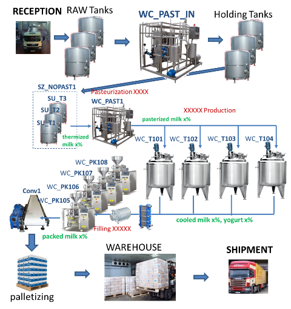
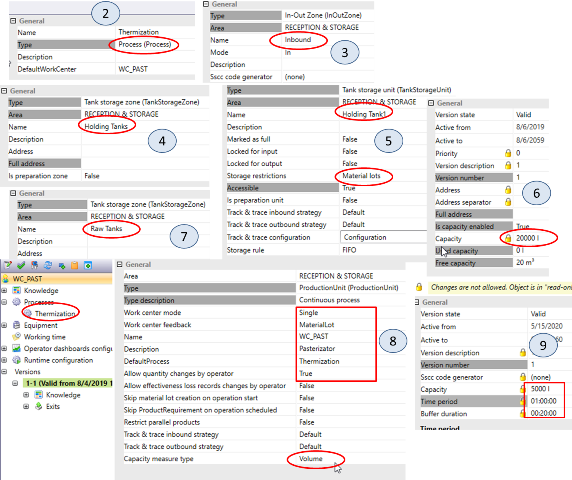
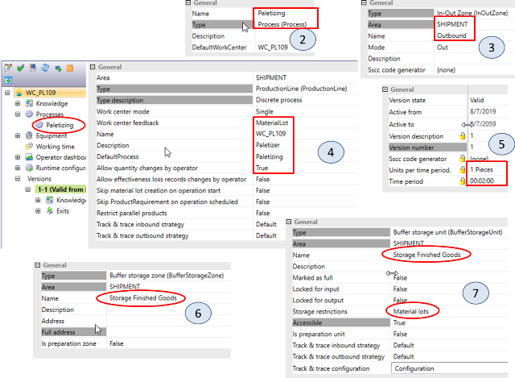
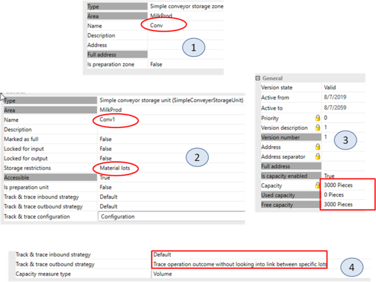
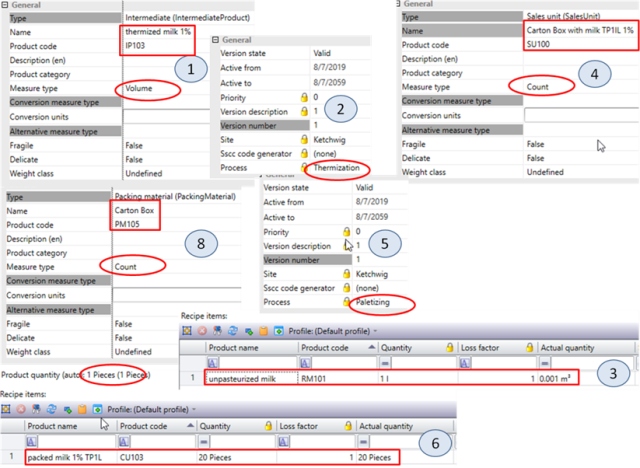
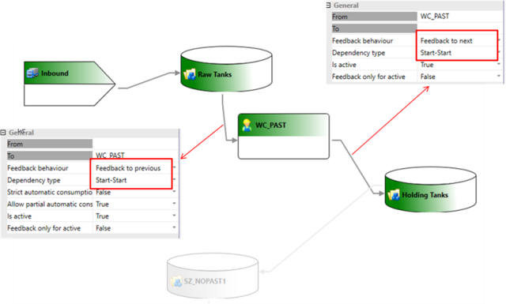
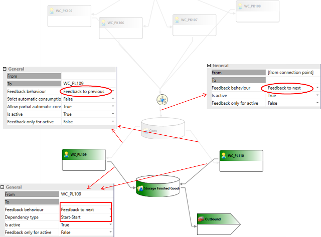
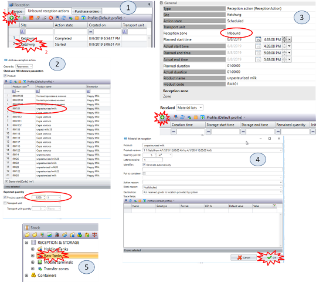
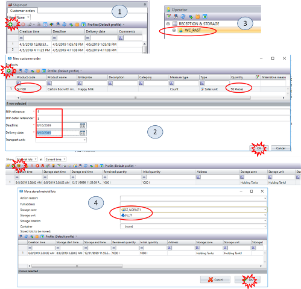
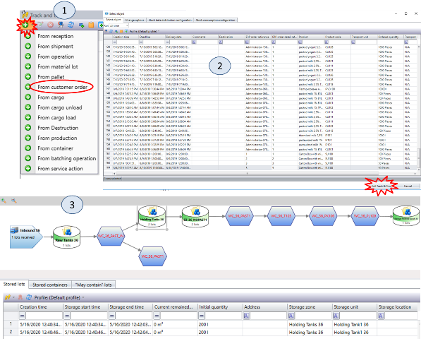

| [<- до лаборних робіт](README.md) | [на основну сторінку курсу](../README.md) |
| --------------------------------- | ----------------------------------------- |
| [<-Лр7. KPI](7_KPI.md)            |                                           |

# Лабораторна робота №8 

## Тема. Простежуваність продукції.

**Тривалість**: 8 акад. години (4 пари).

**Мета:** навчитися налаштовувати та використовувати простежуваність продукції. 

**Завдання для виконання роботи**

**Цілі.** 

1. Сконфігурувати усі частини виробництва від примйання до вивантаження.
2. Створити Track & Trace.

## Порядок виконання роботи 

У минулих лабораторних роботах розглядалася тільки частина виробництва, починаючи від певної сировини в танках завершуючи фасуванням. У цій лабораторній роботі розглядається весь виробничий ланцюг починаючи від приймання сировини - завершуючи вивантажанням. На реальному молочному виробництві, як правило, є окремий цех для приймання та зберігання сировини - молока. Також є окремі склади для зберігання продукції та вивантаження. Для спрощення виконання (адміністрування) в лабораторній роботі ці цеха доповнюються як частина одного цеху. Таким чином в цій лабораторній роботі необхідно зробити наступні дії:

- добавити частину устатковання (робочі центри, зони та вузли зберігання), що відповідає за приймання та зберігання сировини
- добавити частину устатковання (робочі центри, зони та вузли зберігання), що відповідають за пакування продукції в тару для вивантаження кінцевому замовнику та зберігання в складі;
- добавити та змінити сегменти продукту
- модифікувати діаграму потоків (Routing Digram)
- зробити замовлення продукту
- зробити простежування для клієнтського замовлення 

### 1. Створення частини цеху приймання та зберігання

У цьому пункті необхідно б було створити окремий цех для приймання та збергіання сировини `RECEPTION & STORAGE` , я якому створити робочий центр для термізації молока `WC_XX_PAST_IN`, зону приймання та танки сирого молока `Raw Tanks`,  зону зберігання та танки зберігання для термізованого молока `Holding Tanks`, процес  `Thermization`. Для простоти адміністрування окремий Area не створюється, а усі необхідні робочі центри та зони зберігання створюються в тому ж цеху.

1. У вкладці Layout створіть процес `Thermization XX` типу `Process` (рис.8.1(2)).
3. У модулі `Layout` створіть `Reception` з назвою `Inbound XX` (рис.8.1(3)). Валідуйте його.
4. У `Storage zones` створіть `Tank storage zone` з назвою `Holding Tanks XX` (рис.8.1(4)). Валідуйте її.
5. Створіть `Storage unit` `Holding Tank1 XX` c настройками як на рис.8.1(5), настройки Version як на рис.8.1(6) - по 20 000 л. Створіть `Storage unit` `Holding Tank2 XX` з аналогічними налаштуваннями. Валідуйте тільки перший танк (при валідних двох танках працювати не буде, **баг**).
6. У `Storage zones` створіть `Tank storage zone` з назвою `Raw Tanks XX` (рис.8.1(7)), а також `Storage units` `Raw Tank1 XX` і `Raw Tank2 XX` з настройками як у `Holding Tank1 XX`. Валідуйте зону зберігання та танки.
7. Створіть робочий центр  `WC_XX_PAST_IN` з настройками як на рис.8.1(8), настройки Version як на рис.8.1(9) і прив\'яжіть `Process`.
8. Не забудьте перевести все в стан Valid і налаштувати Security для `WC_XX_PAST_IN`.

---

### 2. Створення частини цеху для складу

У цьому пункті необхідно створити робочі центри для пакування продукту в тару та палети `WC_XX_PL109`, зону зберігання для складу  `Storage Finished Goods XX` , та процес `Palletizing XX`. Для простоти адміністрування окремий Area не створюється, а усі необхідні робочі центри та зони зберігання створюються в тому ж цеху.

1. У вкладці Layout створіть `Process Palletizing XX` типу `Process` (рис.8.2(2)).
3. У вкладці Layout створіть Shipment з назвою `Outbound XX` (рис.8.2(3)). Зробіть його валідним. 
4. Створіть робочий центр дискретного типу  `WC_XX_PL109` з настройками як на рис.8.2(4), настройки Version як на рис.8.2(5) і прив\'яжіть Process. Зробіть його валідним.
5. Аналогічно створіть `WC_XX_PL110`.
6. У Storage zones створіть `Buffer storage zone` з назвою `Storage Finished Goods XX` (рис.8.2(6)) і `Buffer storage unit XX` (рис.8.2(7)).
7. Не забудьте перевести все в стан Valid і налаштувати Security для `WC_XX_PL109` і `WC_XX_PL110`.

---

### 3. Створення Storage zone для конвеєра

У цьому пункті необхідно створити особливий Storage zone `Conv`, який забезпечує передачу розфасованої продукції по конвеєру на палетизацію.

1. У вкладці `Layout` для `Area XX` створіть Storage zone `Conv XX` типу `Simple conveyor storage zone` (рис.8.3(1)). Зробіть її валідною.
2. Створіть Storage unit `Conv1 XX` з настройками як на рис.8.3(2), настройки Version як на рис.8.3(3).
3. Для всіх Work centers в Area `Area XX` замініть настройки `Track & trace` як показано на рис.8.3(4).
4. Не забудьте перевести все в стан Valid.

---

### 4. Створення продуктів

Тепер при появі процесу термізації та пастеризаційної установки, що його проводить в цеху приймання, необхідно добавити нові проміжні продукти "термізоване молоко", яке буде робитися з сирого молока. У свою чергу пастеризоване молоко робиться на з сирого, а з термізованого молока, тому необхідно змінити означення відповідних продуктів. 

Таким чином у цій вправі необхідно створити продукти Intermediate products: `IP103`, `IP113`, `IP124`, Sales units `SU100`, `SU101`, Packing material: `PM105`.

1. Створіть `IP_XX_103` з назвою `thermized milk 1% XX` з настройками як на рис.8.4(1), настройки Version як на рис.8.4(2). У Recipe задайте `RM_XX_101` (рис.8.4(3)).
3. Аналогічно створіть `IP_XX_113` з назвою `thermized milk 2,5% XX` з `RM_XX_102` і `IP_XX_124` з назвою `thermized milk 3,2% XX` з `RM_XX_103` .
3. У Recipe продуктів `IP_XX_101`, `IP_XX_111`, `IP_XX_121` замініть `RM_XX` на `IP` відповідно :
   - для `IP_XX_101` задати `IP_XX_103`,
   - для `IP_XX_111` задати `IP_XX_113` 
   - для `IP_XX_121` задати`IP_XX_124`.
4. Створіть пакувальний матеріал `PM_XX_105` з назвою `Carton Box XX` з настройками як на рис.8.4(8). Цей пакувальний матеріал буде використовуватися у процесі пакування `Consumer Unit`  в `Sales Unit`
5. Створіть продукт типу Sales Unit `SU_XX_100` з назвою `Carton Box with milk TP1L 1% XX` з настройками як на рис.8.4(4), настройки Version як на рис.8.4(5). У Recipe задайте `CU_XX_103` (рис.8.4(6)).
6. Аналогічно створіть `SU_XX_101` з назвою `Carton Box with milk TP1L 2,5% XX` та `CU_XX_113`.
7. Не забудьте перевести все в стан Valid.

---

### 5. Налаштування Routing для приймання та зберігання сировини

У цьому пункті необхідно налаштувати Routing для області RECEPTION & STORAGE.

1. У Routing Designer налаштуйте схему як показано на рисунку. Налаштування для ліній без виносок не змінюються.

---
### 6. Налаштування Routing для складу

У цьому пункті необхідно налаштувати Routing для складу.

1. У Routing Designer налаштуйте схему як показано на рисунку. Налаштування для ліній без виносок не змінюються.
2. Для ліній пов\'язаних з `WC_XX_PL110` налаштування аналогічні `WC_XX_PL109`.

---

### 7. Створення поставки

У цьому пункті необхідно створити поставку і перевести продукт в Raw Tanks.

1. Зайдіть в модуль Reception, натисніть на кнопку «ADD» (1) для `Unbound reception actions` (рис.8.7(1)).
2. У вікні (рис.8.7(2)) виберіть продукт `RM_XX_101` для поставки і задайте необхідну кількість `5000` л. Після цього натисніть «ОК».
3. У Reception зробіть подвійний клік на запису що з\'явився (2) (рис.8.7(1)).
4. У вікні (рис.8.7(3)) вкажіть Reception zone і натисніть на кнопку «ADD».
5. У вікні (рис.8.7(4)) натисніть \"ОК\".
6. Перейдіть на вкладку Stock і перевірте наявність продукту в одному з Raw Tanks (рис.8.7(5)).

---

### 8. Створення та виконання замовлення

У цьому пункті необхідно створити замовлення і запустити на виконання.

1. Через модуль Stock видаліть усі зареєстровані Material Lot з зони "SZ_XX_NOPAST", яке залишилось з минулої лабораторної роботи. У причині видалення (`Destrution Reason`) вкажіть `Undefined`.
2. У модулі Shipment натисніть на кнопку «ADD» (рис.8.8(1)).
3. У вікні (рис.8.8(2)) натисніть на кнопку «ADD» і створіть замовлення на 50 штук продукту `SU_XX_100`. У полі `ERP reference` вкажіть номер замовлення в форматі "XX_номер", де "номер" - порядковий номер замовлення. Задайте параметри, після цього натисніть «ОК».
4. У модулі Sheduler зробіть автоматичний шедулінг для створеного замовлення.
5. Запустіть в роботу `WC_XX_PAST_IN`, зареєструйте половину з потрібної (заданої замовленням) кількості продукту, через кілька секунд іншу половину, після чого зупиніть процес.
6. Попросіть викладача або адміністратора перейти на вкладку Stock і з `Holding Tanks` перевести продукт в `SZ_XX_NOPAST1` натиснувши кнопку «Move» і вказавши призначення (рис.8.8(4)).
7. Перейдіть на вкладку Stock і перевірте наявність продукту в Raw Tanks (рис.8.8(5)).
8. Продовжіть виготовлення продукту, запускаючи робочі центри відповідно до послідовності планування та реєструючи продукт. На робочому центрі типу танк необхідно:
   - після запуску операції треба натиснути команду `Start Batch`.
   - зареєструвати необхідну кількість продукту,
   - натиснути команду `Stop Batch` а потім `Stop Operation`

---

### 9. Створення Track & Trace

У цьому пункті необхідно створити Track & Trace (простежуваність) для виконаного замовлення.

1. У модулі `Track & Trace` натисніть на кнопку «ADD» (рис.8.9(1)) і виберіть `From customer order`.
2. У вікні (рис.8.9(2)) виберіть потрібне замовлення і натисніть на кнопку «Full Track & Trace». Повинен з'явитися маршрут для простежуваності виготовлення продукту (рис.8.9(3)). Оцініть правильність маршруту. Натискаючи на робочі центри, зони зберігання, переходи спробуйте оцінити інформацію, яка там наводиться. 
3. Зробіть копію екрану для звіту.
4. Спробуйте створити `Track & Trace` з іншої початкової точки, наприклад з `Material Lot`.

## Порядок захисту

Дана лабораторна робота є заключною, тому викладачем перевряється розуміння усіх налаштувань модуля Layuot, Products, Routing та результатів Track & Trace.

| [<- до лаборних робіт](README.md) | [на основну сторінку курсу](../README.md) |
| --------------------------------- | ----------------------------------------- |
| [<-Лр7. KPI](7_KPI.md)            |                                           |