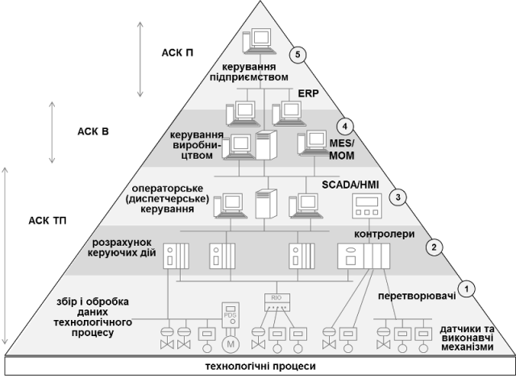

## Вступ

Сучасні системи автоматизації є інтегрованими, оскільки включають у себе взаємопов’язані різні за функціями та рівнями управління підсистеми (рис.1.1). Функції перших трьох рівнів реалізовуються системами ***АСКТП*** (Автоматизовані системи керування технологічними процесами, або АСУТП) і забезпечують оптимальне протікання технологічного процесу. На більшості українських підприємств системи АСКТП в певній степені впроваджені, однак мало де пов’язані між собою. Тим не менше, в інтегрованих автоматизованих системах керування (***ІАСК*** або ***ІАСК***) для ефективної роботи всього виробництва необхідна узгоджена робота всіх ділянок технологічного процесу, що можливо тільки при скоординованій роботі всіх АСКТП. Для цього використовуються системи управління виробництвом (***АСКВ***), які також слугують зв’язувальною ланкою між АСКТП та АСКП. На сучасних підприємствах на рівні АСКВ впроваджують системи ***MES*** (Manufacturing Execution System) , де збираються і обробляються дані всього виробництва, проводиться їх аналітичний аналіз з використанням статистичних методів, проводиться аналіз якості продуктів та напівпродуктів відповідно до лабораторних показників, готуються виробничі звіти, виконується оперативне планування виробництва, відповідно до чого формуються завдання для технологічних процесів. Грамотна побудова таких систем дає колосальні економічні ефекти. Нижче буде зазначено, що окрім функцій вироблення продукції, на цьому рівні також вирішуються інші діяльності, в тому числі по керуванню якістю продукції, технічного обслуговування обладнання та запасами. Весь перелік цих функцій входить до операцій MOM (Manufacturing operations management).    

Автоматизовані системи управління підприємством (***АСКП*** ) орієнтовані на вирішення завдань автоматизації управлінською і фінансово-господарською діяльністю, а також на планування ресурсів підприємства. Це рівень різноманітних бізнес-застосунків, які як правило входять в пакети систем ERP. 

Ефективна робота всього підприємства може проходити тільки при взаємодії всіх підсистем, що можливо тільки при реалізації їх функціональної, технічної та програмної інтеграції. Технічна та програмна інтеграція проводиться з використанням різноманітних промислових мереж та технологій міжпрограмної взаємодії, які є предметом вивчення дисциплін "Промислові мережі та інтеграційні технології", "Промислові контролери", "Людино-машинний інтерфейс та SCADA". Промислові мережі використовуються як для об'єднання АСУТП між собою, так і для підключення до них інтелектуальних засобів. Технології міжпрограмної інтеграції використовуються на всіх рівнях ІАСУ. У даній дисципліні розглядаються функції MOM, стандарти та технології інтеграції на функціональному рівні, де визначається як взаємодіють між собою функції різних рівнів керування для досягнення заданої мети. 