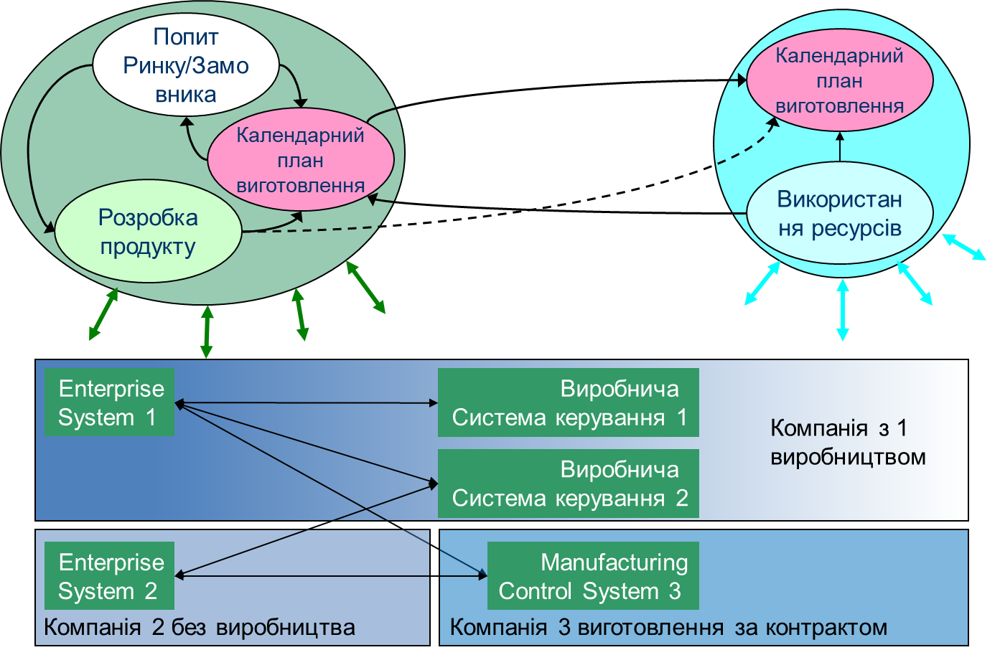
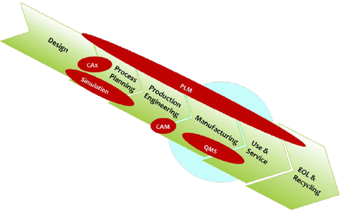
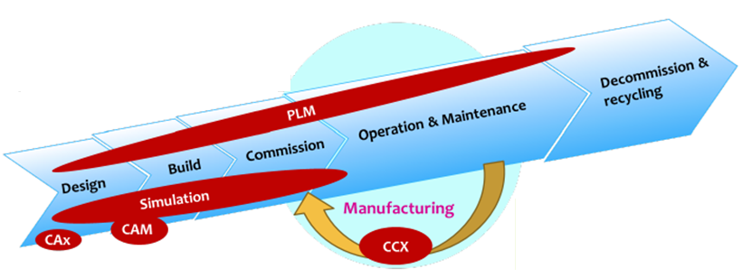
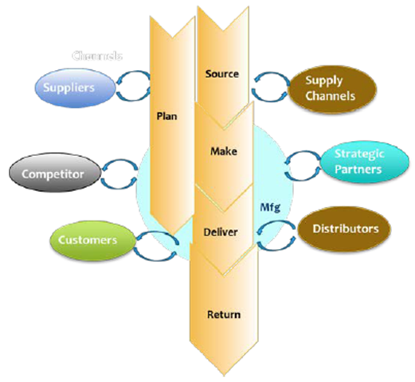
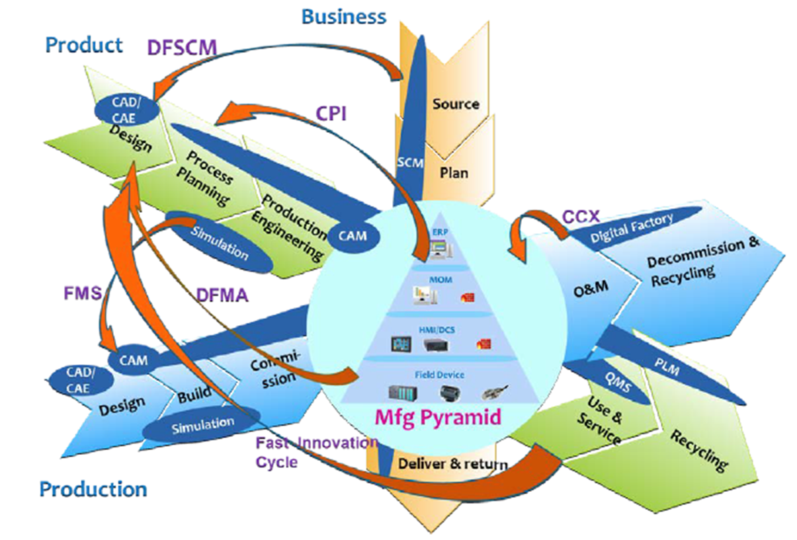
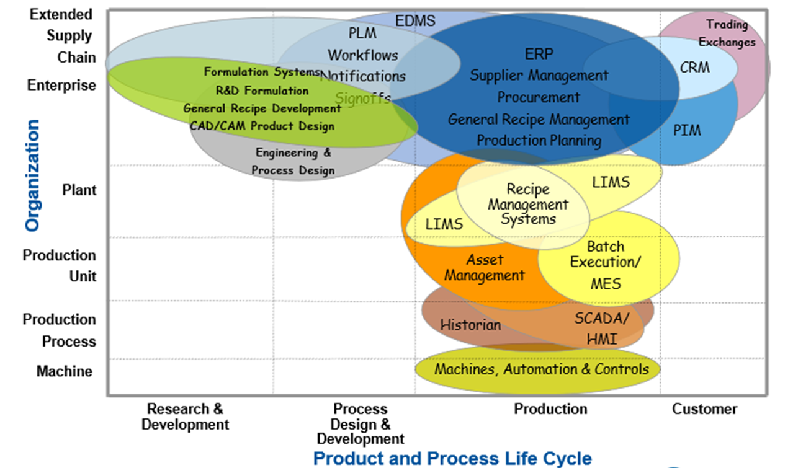
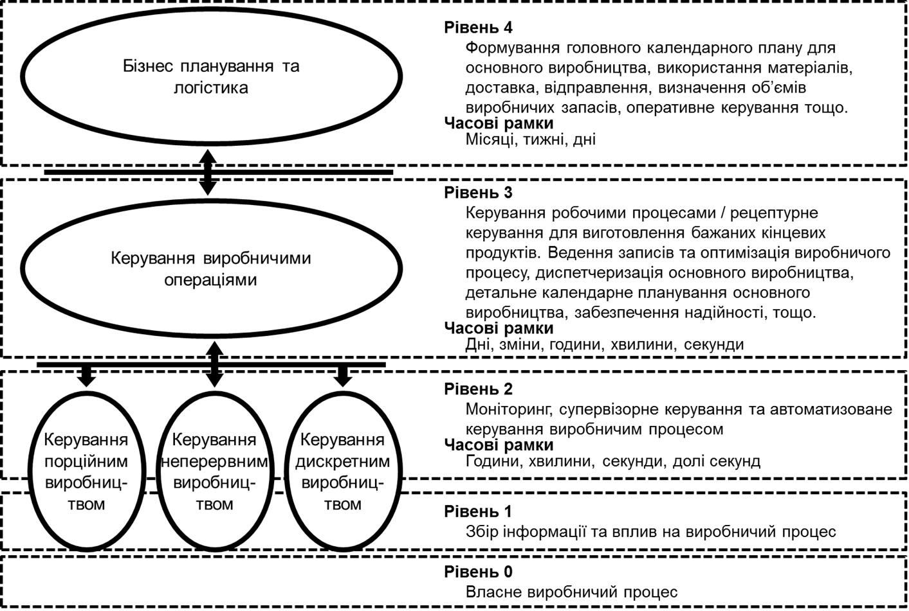

# 1. Функції та загальні принципи побудови ІАСК виробництвом

## 1.1. Підприємства в мережах створення вартості

Основний спосіб заробітку виробничого підприємства є вироблення та продаж продукції, а саме перетворення сировини в продукти шляхом використання матеріалів, енергії, обладнання, персоналу/робочої сили. Ефективне керування ресурсами та процесами що забезпечують досягнення максимізації прибутку в постійно змінному середовищі є серйозним викликом для підприємств. У наш час Індустрії 4.0/5.0 ефективне підприємство має мати гнучкість та постійно змінюватися. Воно повинно надавати ринку максимально якісну і спеціалізовану під замовника продукцію в найменш короткий термін. При цьому кінцева вартість продукту для споживача може мати не саме визначальне значення, більш пріоритетними стають можливість підлаштування продукту під споживача та зменшення та гарантування часу випуску з моменту замовлення. За таких обставин, підприємства можуть об'єднуватися для формування мереж вартості, де кожне з підприємств вносить свою частину доданої вартості в кінцевий продукт. 

На рис.1.11 показаний приклад взаємодії кількох підприємств. Одне з них є виробничим, тобто має виробничі майданчики, інше має добре налагоджені процеси маркетингу та продажу та відділ R&D для розроблення нових продуктів. Взаємодіючи між собою, ці підприємства можуть налагодити випуск продукції та реалізувати її. Якщо ця взаємодія відбувається через ручні операції (приймання та оформлення замовлення, облік доступних ресурсів, планування і т.п.) затрачений час, точність розрахунків та прогнозування не дозволить це робити в короткі терміни та з необхідними гарантіями.           

рис.1.1. Гнучке промислове виробництво (I4.0) в мережі створення вартості кількох підприємств 

Наведена мережа вартості з 2-х підприємств стає ще більш складнішою, коли кількість підприємств в ній збільшується, і ланцюги повинні створюватися динамічно. З одного боку така мережа буде більш гнучкою, так як в ній з'являться альтернативні варіанти. Однак з кожним новим учасником (підприємство) ускладнюється і взаємодія. Ефективна робота в таких мережах підприємств можлива тільки за рахунок цифровізації цих підприємств та автоматизації всіх бізнес-процесів в ньому. 

Таким чином, якщо до недавнього часу автоматизацію процесів керування можна було розглядати в контексті окремих підрозділів підприємств, то в сучасному світі питання цифровізації всього підприємства і узгоджена робота усіх його функцій є питанням економічного виживання. При цьому варто говорити про сумісну роботу всіх процесів, які пов'язані з підприємством, незалежно від домену та рівня керування. Так, наприклад, вихід з ладу якогось насосу, що потребує ремонту, повинно відразу проявитися в процесах планування виготовлення продукції а отже і у відповіді на запит клієнта щодо можливого виготовлення продукції та термінів. Нижче розглянемо виробничу екосистему через різноманітні життєві цикли підпримєства.     

## 1.2.Розгляд виробничої екосистеми через життєві цикли

### Продукт

Розглянемо типові функціональні області для виробничих підприємств в контексті життєвих циклів (ЖЦ). Для початку варто зазначити, що на виробництві задіяні процеси, які так чи інакше стосуються:

- продукції, яка виробляється
- виробничої системи, яка забезпечує таке виробництво, включаючи обладнання та персонал
- планування та постачань

Для початку розглянемо життєвий цикл продукту, який виготовляється на виробництві (рис.1.2). 

рис.1.2. Життєвий цикл продукту

Життєвий цикл продукту як правило включає такі етапи:

1. Design (Проектування): На цьому етапі проектується виріб, визначається його функціональні та технічні характеристики, розроблюється дизайн та конструкція виробу.
2. Process Planning (Планування процесу): На цьому етапі розроблюється план виробництва виробу, включаючи послідовність операцій та матеріали, необхідні для виробництва виробу.
3. Production Engineering (Інженерія виробництва): На цьому етапі розроблюється технологія виробництва виробу, включаючи розробку обладнання та інструментів, необхідних для виробництва виробу.
4. Manufacturing (Виробництво): На цьому етапі виріб виготовляється виробничими процесами, розробленими на попередніх етапах, і готується до відвантаження на ринок.
5. Use & Service (Використання та обслуговування): На цьому етапі виріб використовується споживачами, та може потребувати підтримки або обслуговування протягом свого життєвого циклу, якщо цей продукт цього потребує (наприклад автомобіль, або насос).
6. End of Life (Кінець життя виробу): На цьому етапі виріб відновлюється або відходить до кінця свого життєвого циклу, наприклад, через застарілість, пошкодження або інші причини.
7. Recycling (Переробка): На цьому етапі матеріали виробу переробляються або видаляються з нього відповідно до вимог щодо охорони навколишнього середовища. Цей етап може бути важливим для зменшення відходів та забезпечення сталого використання ресурсів,  оскільки він дозволяє використовувати матеріали виробу у знову  виробництві нових виробів.

Така схема дозволяє керівникам підприємств та розробникам виробів визначити, на якому етапі розвитку продукту знаходиться виріб та які кроки потрібно зробити для його поліпшення, оптимізації виробництва або зменшення відходів. Врахування ЖЦ також дозволяє збільшити довговічність виробів та зменшити їх вплив на довкілля, забезпечуючи зручне та стале використання виробу протягом всього його життєвого циклу. Зважаючи на те, що ЖЦ - це універсальна схема, яка застосовується до різних типів продуктів, у тому числі до хлібобулочних виробів, можна навести приклад життєвого циклу для хлібобулочного виробу, наприклад хліба:

1. Design - розроблення рецепту хліба, визначення складу та необхідних інгредієнтів.
2. Process Planning - розроблення процесу виробництва хліба, наприклад: вибір інгредієнтів, заміс тіста, формування, випікання з описом конкретики послідовності.
3. Production Engineering - проектування виробництва та визначення необхідної техніки та обладнання для приготування хліба, наприклад тип печі, тип замішуючого пристрою і т.п.
4. Manufacturing - виробництво хліба у масових масштабах.
5. Use & Service - постачання та продаж хліба в магазинах або закладах громадського харчування.
6. End of Life (EOL) - споживачі використовують та споживають хліб.
7. Recycling - у разі залишків хлібу, відходи сортуються та переробляються, якщо можливо.

Це тільки приклад, і життєвий цикл будь-якого продукту може бути складнішим чи простішим, в залежності від типу продукту та виробничих процесів. 

На рис.1.2 та на інших рисунках, що наведені нижче, блакитним кружечком виділена та частина ЖЦ, яка стосується саме виробництва. Інші частини ЖЦ виконуються за межами виробничих потужностей, і можуть виконуватися іншими організаціями. Так на рис.1.1 був показаний приклад, в якому  Design (Проектування) та Process Planning (Планування процесу) виконуються на невиробничому підприємстві.

### Виробнича система

У свою чергу продукт виготовляється з використанням певної виробничої системи. Виробнича система (Production System) включає всі елементи і процеси, пов'язані з виробництвом продукції. До складу виробничої системи можуть входити:

1. Обладнання: машини, інструменти, пристрої і технічні засоби, необхідні для виробництва продукту.
2. Матеріали: використовуються для створення продукту, включаючи сировину, напівфабрикати та комплектуючі.
3. Технології: методи та процедури, що використовуються для виготовлення продукту, включаючи креслення, технічні специфікації, стандарти і процедури виробництва.
4. Робоча сила: люди, які займаються виробництвом продукту, включаючи операторів, техніків, інженерів, менеджерів і т.д.
5. керування виробництвом: системи та процеси, які забезпечують ефективне функціонування виробництва, включаючи планування виробництва, керування запасами, контроль якості, керування персоналом та інші аспекти.

Виробнича система може бути складною та містити багато компонентів, але її головна мета полягає в забезпеченні виробництва продукту відповідно до стандартів якості та наданні конкурентної переваги на ринку. Виробничі системи можуть включати додаткові функціональні  області, такі як контроль якості, логістика, складський облік тощо, в  залежності від конкретного контексту виробництва. Отже, конкретні  складові виробничої системи можуть відрізнятися залежно від сфери  виробництва та типу продукції, але загальний підхід до керування  виробничим процесом залишається схожим. ЖЦ виробничої системи можна показати як на рис.1.3:

рис.1.3. Життєвий цикл виробничої системи

Життєвий цикл виробничої системи включає наступні етапи:

1. Design (Проектування) - цей етап передбачає розроблення концептуальної моделі виробничої системи. На цьому етапі вирішуються питання щодо того, як система повинна працювати, які ресурси необхідні, як вона повинна бути організована та які технології мають використовуватись.
2. Build (Будівництво) - на цьому етапі виробляються всі компоненти системи, від машин та обладнання до комп'ютерів та програмного забезпечення. Зазвичай цей етап включає в себе збірку та випробування окремих компонентів, перед тим як вони будуть зібрані в одну систему.
3. Commission (Введення в експлуатацію) - після того, як всі компоненти системи зібрані, настає етап пусконалагодження системи. В цей час проводяться тестування, визначається оптимальна робоча конфігурація та налаштування.
4. Operation & Maintenance (Експлуатація та обслуговування) - на цьому етапі система працює в повному обсязі та виробляє продукцію. Протягом цього етапу проводяться заходи щодо забезпечення безперебійної роботи системи та здійснення технічного обслуговування.
5. Decommission & Recycling (Вивід з експлуатації та переробка) - цей етап настає після того, як виробнича система вийшла з ладу, вже не ефективна або її доводиться зняти з експлуатації з інших причин. На цьому етапі проводяться роботи щодо демонтажу, знешкодження небезпечних відходів та переробки вторинних ресурсів.

Цей життєвий цикл відображає усі етапи виробництва виробничої системи, від стадії її розроблення та збирання до пуску в роботу та зняття з експлуатації подальшої переробки. Кожен з етапів має свої особливості та завдання, які необхідно виконувати для забезпечення ефективної та безперебійної роботи виробничої системи протягом усього її життєвого циклу.

Наведемо приклад для виробництва хлібобулочних виробів, життєвий цикл виробничої системи може мати наступний вигляд:

1. Design - на цьому етапі розробляється концепт виробничої лінії, відповідно до потреб ринку та виробничих можливостей. Визначається обладнання, яке необхідно для виробництва хлібобулочних виробів, враховуючи різні типи продукції та її обсяг.

2. Build - на цьому етапі виробляються всі компоненти виробничої лінії, включаючи машини для замішування тіста, пресування, випікання та упаковки продукції.

3. Commission - після збирання компонентів лінії проводиться пусконалагодження, включаючи налаштування режимів роботи, контроль якості та інші важливі параметри.

4. Operation & Maintenance - на цьому етапі виробнича лінія працює в повному обсязі, виготовляючи хлібобулочну продукцію з високою якістю. Забезпечується її безперебійна робота, а також проводиться регулярне технічне обслуговування та ремонт.

5. Decommission & Recycling - після того, як виробнича лінія втратила свою ефективність або її доводиться зняти з експлуатації з інших причин, проводяться роботи з її демонтажу та знешкодження небезпечних відходів. Можуть використовуватися різні методи переробки та утилізації матеріалів, які були задіяні у виробництві виробничої системи.

Життєвий цикл виробничої системи є важливим елементом планування та керування виробництвом, оскільки він дозволяє оцінити ефективність виробництва на різних етапах та визначити потребу в технічному обслуговуванні та модернізації. Крім того, знання життєвого циклу виробничої системи дозволяє виробникам зменшити вплив їх виробництва на довкілля та забезпечити більш ефективне використання ресурсів. У загальному, життєвий цикл виробничої системи може включати більше етапів або вони можуть бути поділені на менші частини, залежно від конкретної ситуації та потреб виробництва. Однак, загальна ідея полягає в тому, що кожна виробнича система має свій власний життєвий цикл, який необхідно ретельно планувати та контролювати, щоб забезпечити якість продукції та максимальну ефективність виробництва.

Слід звернути увагу, що як і в попередньому випадку, життєвий цикл виробничої системи тільки під час введення в дію та експлуатації стає частиною виробничого майданчика. Інші діяльності як правило проводяться іншими організаціями (проектні, монтажні, налагоджувальні, тощо)

### Ланцюжок постачань

Життєвий цикл ланцюга постачань (Supply Chain) виробничого підприємства - це процес взаємодії між підприємствами та організаціями, які забезпечують матеріали та послуги для виробництва та постачання продукції на ринок, а також повернення непотрібної або пошкодженої продукції.

   

рис.1.4. Цикл ланцюжка постачань

Життєвий цикл ланцюга постачань можна розбити на кілька етапів (рис.1.4):

1. Source (Джерело) - це пошук та вибір постачальників та партнерів для забезпечення потреб виробництва підприємства. На цьому етапі виробник встановлює контакти з постачальниками сировини та матеріалів, компонентів, обладнання та інших ресурсів, необхідних для виробництва продукції.
2. Make (Виготовлення) - це етап виробництва самої продукції, який може включати процеси виробництва, збирання, пакування та маркування. На цьому етапі виробники забезпечують якість продукції та дотримуються встановлених стандартів та вимог клієнтів.
3. Deliver (Доставка) - це етап, коли готова продукція доставляється до клієнтів та роздрібних продавців. На цьому етапі важливо забезпечити своєчасну доставку та високу якість послуг.
4. Return (Повернення) - це етап, коли клієнти повертають продукцію з різних причин: через брак якості, невідповідність вимогам, зміну потреб тощо. Важливо забезпечити ефективну обробку повернутої продукції, зокрема її утилізацію, переробку або повторне використання.
5. Plan (Планування) - Цей етап знаходиться паралельно з етапами Source та Make і полягає у плануванні операцій постачальної ланки. Планування включає в себе розподіл ресурсів, визначення пріоритетів, контроль якості та ефективності процесів, аналіз результатів і удосконалення системи. Наприклад, на етапі планування можуть вирішувати питання про те, як підтримувати стабільний запас сировини та матеріалів для виробництва продукції, як забезпечити вчасну доставку готової продукції до клієнтів, як впровадити систему відслідковування продукції під час транспортування та інші питання, пов'язані з плануванням діяльності ланки постачання. 

У цьому ЖЦ приймають участь різноманітні організації, яку мають різну роль:

1. Постачальники (Suppliers) - це компанії або організації, які постачають сировинні матеріали, комплектуючі, обладнання та інші ресурси для виробництва продукції. У життєвому циклі підприємства постачальники грають важливу роль у забезпеченні стабільного та ефективного виробництва продукції.
2. Конкуренти (Competitors) - це інші компанії, що діють у тому ж сегменті ринку, що і дане підприємство. У життєвому циклі підприємства конкуренти відіграють важливу роль у формуванні стратегій розвитку та маркетингу продукції.
3. Клієнти (Customers) - це особи або компанії, які купують продукцію або послуги, які надає підприємство. У життєвому циклі підприємства клієнти є основним джерелом прибутку, тому їх потреби та вимоги повинні бути добре вивчені та задоволені.
4. Supply Channels - це канали постачання, що використовуються  підприємством для забезпечення своїх потреб у сировині, комплектуючих та інших ресурсах. У життєвому циклі підприємства канали постачання  відіграють важливу роль у забезпеченні потрібною сировиною та  комплектуючими вчасно та з оптимальними цінами.
5. Дистриб'ютори (Distributors) - це компанії, які займаються реалізацією  продукції підприємства на ринку. У життєвому циклі підприємства  дистриб'ютори відіграють важливу роль у забезпеченні доступності та  зручності купівлі продукції для кінцевих споживачів, а також у  збільшенні обсягів продажу та прибутку підприємства.
6. Стратегічні партнери ( Strategic Partners) - це стратегічні партнери, які співпрацюють з  виробничим підприємством з метою досягнення спільних цілей. Це можуть  бути інші підприємства, постачальники, дистриб'ютори або інші  організації, з якими виробниче підприємство укладає довгострокові  договори та співпрацює на постійній основі.

В цілому, життєвий цикл ланцюжка постачання - це комплексний процес,  який включає в себе взаємодію багатьох сторін і етапів. Ефективне  керування кожним з етапів може забезпечити успішне функціонування  постачальної ланки та позитивний результат для всіх сторін, включених у  процес.

Розглянемо приклад життєвого циклу ланцюжка постачання для хлібобулочних виробів:

1. Source На цьому етапі здійснюється пошук та закупівля сировини для виробництва хлібобулочних виробів, таких як борошно, дріжджі, цукор, сіль та інші інгредієнти. Наприклад, пекарня може закуповувати борошно від постачальників з різних країн, враховуючи якість та ціну продукту.
2. Make Цей етап включає процес виробництва хлібобулочних виробів, який включає в себе підготовку інгредієнтів, змішування, формування, випікання та упакування. 
3. Deliver На цьому етапі здійснюється доставка готової продукції до клієнтів. Пекарня може мати свій власний автопарк для доставки продукції або користуватися послугами зовнішніх перевізників.
4. Return Цей етап включає в себе повернення продукції клієнтами у разі недоліків або невідповідності якості. Наприклад, якщо пекарня випекла продукт з низькою якістю або з проблемами зі смаком, клієнт може повернути продукт і отримати повернення коштів або обмін на іншу продукцію.
5. Plan На етапі планування можуть вирішуватися питання про оптимізацію процесів постачальної ланки, планування виробництва з урахуванням сезон

Як і в попередньому випадку, даний життєвий цикл виробничої системи тільки під час введення в дію та експлуатації стає частиною виробничого майданчика. 

### Розумна виробнича екосистема

Отже, принаймні три ЖЦ, пов'язані з виробництвом перекриваються саме на виробничому майданчику. На рис.1.5 показана розумна виробнича екосистема (Smart Manufacturing Ecosystem), яка б мала узгодити процеси цих життєвих циклів для оптимальної роботи. 

 

рис.1.5. Розумна виробнича екосистема

Таким чином, для успішного функціонування і розвитку будь-якого підприємства, всі його системи мають функціонувати як єдине ціле, всі функції мають бути узгоджені та скоординовані. Однак традиційно, для автоматизації процесів наведених вище життєвих циклах використовуються різні інформаційні системи, тому варто трохи зупинитися на них.  

## 1.3. Інформаційні системи

### PLM

Почнемо з системи керування життєвим циклом продукту (PLM, Product Lifecycle Management) - це інформаційна система, що дозволяє керувати життєвим циклом продукту від його створення до виведення зі служби. Варто зауважити, що як видно з рис.1.2 та 1.3 виробнича система підприємства також є продуктом, але з точки зору тих інжинірингових підприємств, які розробляли цю систему. Тому той чи інший актив (система) має певну роль в залежності від позиції того, хто на неї дивиться. В системній інженерії така позиція називається стейкхолдером (stakeholder).

PLM системи дозволяють забезпечити координацію та інтеграцію різних процесів виробництва, від проектування та розробки до виробництва, маркетингу та обслуговування. PLM системи забезпечують збір, зберігання та обмін даними про продукт на різних етапах його життєвого циклу. За допомогою PLM системи, команда розробників може керувати процесом проектування, моделювання та аналізу продукту, а також виконувати його технічне затвердження, визначати комплектацію та створювати каталоги.

PLM система включає такі функції як:

1. керування конфігурацією – забезпечує зберігання та керування інформацією про компоненти продукту, їх версії та зміни.
2. керування змінами – дозволяє контролювати та відстежувати зміни, що вносяться до продукту на різних етапах його життєвого циклу.
3. керування проектами – дозволяє керувати проектами на різних етапах його життєвого циклу.
4. керування документами – забезпечує зберігання та керування документами, пов'язаними з продуктом.
5. керування виробництвом – дозволяє керувати виробництвом, включаючи планування виробництва, керування запасами, виконання замовлень тощо.
6. керування якістю – забезпечує контроль якості продукту та дотриман

Наприклад, PLM система може бути використана для керування життєвим циклом хлібобулочних виробів виробничого підприємства. Така система може забезпечувати керування всіма етапами від проектування до утилізації хлібобулочного виробу, включаючи такі етапи, як:

1. Дизайн та розробка: система PLM дозволяє планувати та керувати розробкою нових хлібобулочних виробів, включаючи визначення їх характеристик, складу та форми.
2. Виробництво: система PLM може відстежувати технологічні процеси та виробничі потужності для виробництва хлібобулочних виробів, забезпечуючи ефективність та якість виробництва.
3. керування якістю: система PLM може допомагати відстежувати якість хлібобулочних виробів, включаючи контроль якості входящих матеріалів та відстеження якості виробів на кожному етапі виробництва.
4. керування постачанням: система PLM може допомагати управляти постачанням необхідних компонентів для виробництва хлібобулочних виробів, забезпечуючи своєчасне та ефективне постачання необхідних матеріалів.
5. Утилізація: система PLM може допомагати керувати етапом утилізації хлібобулочних виробів, включаючи збір та переробку відходів, що зменшує вплив на навколишнє середовище.

Приклад системи PLM для виробничої системи пекарні може включати наступні елементи:

1. Проектування виробничих приміщень і обладнання: система PLM може включати моделі планування виробничого приміщення, які враховують оптимальні розміри, розміщення та конфігурацію обладнання, а також оптимізовані маршрути руху матеріалів та працівників.
2. керування документацією: система PLM дозволяє пекарням зберігати та оновлювати всю документацію, пов'язану з виробництвом, таку як інструкції з техніки безпеки, інструкції з обслуговування та ремонту обладнання, інструкції з якості та інші документи.
3. керування проектами: система PLM дозволяє пекарням керувати проектами, пов'язаними з розробкою нових продуктів, впровадженням нових технологій та процесів, а також оновленням обладнання.
4. керування якістю: система PLM дозволяє пекарням відстежувати якість продукту та процесів виробництва, забезпечувати відповідність стандартам та вимогам клієнтів, а також виявляти та вирішувати проблеми з якістю виробництва.
5. керування запасами: система PLM дозволяє пекарням контролювати запаси сировини та інших матеріалів, необхідних для виробництва, та оптимізувати їхнє використання.
6. керування виробничим процесом: система PLM дозволяє пекарням відстежувати виробничий процес, контролювати якість продукту та ефективність виробничих процесів, виявляти та вирішувати проблеми виробництва.
7. керування життєвим циклом обладнання: PLM може бути використаний для керування життєвим циклом обладнання, яке використовується в пекарні. Компанія може використовувати PLM для планування покупки нового обладнання, керування його життєвим циклом, підтримки та ремонту, а також забезпечення його безпечної експлуатації.
8. керування стандартами безпеки та сертифікацією: PLM може допомогти в плануванні та керуванні процесами, пов'язаними з дотриманням стандартів безпеки та сертифікацією виробів. Компанія може використовувати PLM для стеження за вимогами до безпеки та сертифікації, дотримання норм та стандартів, а також для зберігання та керування даними про документацію т

### CAD/CAM/CAx

У контексті життєвого циклу продукту часто використовується термін "CAx", який означає "Computer-Aided Technologies" або "Computer-Aided Everything". Цей термін охоплює в собі всі комп'ютеризовані технології, що використовуються на різних етапах життєвого циклу продукту, включаючи проектування, розробку, виробництво, тестування та інші. Використання CAx систем дозволяє підвищити ефективність та якість проектування, розробки та виробництва продукту, знизити час та витрати на розробку та виробництво, а також забезпечити високу якість та конкурентоспроможність продукту на ринку. На наведених вище рисунках під цим терміном розуміють CAD та CAE: 

- CAD (Computer-Aided Design) - системи проектування продукту;
- CAE (Computer-Aided Engineering) - системи інженерного аналізу, які дозволяють вирішувати технічні питання та оптимізувати проектування продукту;

Системи CAD (Computer-Aided Design) - це інформаційні технології, які дозволяють автоматизувати процеси проектування продукту. У контексті життєвого циклу продукту, системи CAD використовуються на етапах проектування та розробки нового продукту. Системи CAD дозволяють інженерам та дизайнерам створювати електронні моделі продукту в 2D або 3D форматі, використовуючи спеціальні програмні засоби. Ці моделі можуть бути використані для візуалізації та аналізу різних варіантів дизайну продукту, вирішення технічних питань та зменшення можливих помилок на етапі проектування. Системи CAD також дозволяють автоматизувати процес розробки документації для виробництва продукту, такої як креслення, специфікації матеріалів та компонентів, технічні вимоги до продукту та ін. Застосування систем CAD дозволяє підвищити ефективність проектування та розробки нових продуктів, скоротити час розробки та зменшити витрати на розробку та виробництво продукту. Для виробничих підприємств використання систем CAD є ключовим для забезпечення якості та конкурентоспроможності продукту на ринку.

Системи CAM (Computer-Aided Manufacturing) - це інформаційні технології, які дозволяють автоматизувати процеси виробництва продукту. У контексті життєвого циклу продукту, системи CAM використовуються для оптимізації виробничих процесів на етапах виготовлення та експлуатації продукту. Системи CAM можуть включати в себе різноманітні інструменти для планування виробничих процесів, моделювання виробництва, побудови електронних моделей продукту (CAD/CAM), моніторингу та контролю виробничих процесів, виконання розрахунків для підвищення ефективності виробництва, керування якістю продукту тощо. Застосування систем CAM може зменшити час виробництва продукту та витрати на виробництво, забезпечити високу якість продукту та підвищити продуктивність виробництва. Для виробничих підприємств використання систем CAM є ключовим для досягнення конкурентних переваг на ринку.

### Simulation

Системи імітаційного моделювання (Simulation) дозволяють моделювати фізичні процеси та явища, що відбуваються на  різних етапах життєвого циклу продукту, наприклад, проектування,  виробництво, експлуатація та тестування. З їх допомогою можна  аналізувати різні параметри продукту, такі як міцність, стійкість, маса, геометрію та інші, що дозволяє покращити якість продукту та знизити  витрати на його виробництво.  Зокрема, системи Simulation використовуються для:

- проектування та розробки продукту - дозволяють проводити технічний аналіз та оцінювати властивості продукту на ранніх етапах його життєвого циклу;
- виробництва - дозволяють моделювати процеси виробництва, аналізувати потреби в ресурсах та визначати оптимальні режими виробництва;
- тестування та валідації - дозволяють проводити віртуальні тести та аналізувати поведінку продукту в різних умовах та середовищах;
- підтримки експлуатації - дозволяють моделювати різні умови експлуатації та прогнозувати технічний стан продукту на різних етапах його життєвого циклу.

Використання систем Simulation дозволяє підвищити якість та ефективність виробництва, знизити час та витрати на проектування та розробку продукту.

### CRM

Системи CRM (Customer Relationship Management, системи керування взаємовідносинами з клієнтами) використовуються для автоматизації та оптимізації процесів взаємодії з клієнтами. У контексті ЖЦ продукту системи CRM можуть бути використані для таких завдань:

1. Збір та аналіз інформації про клієнтів: системи CRM дозволяють збирати та зберігати інформацію про клієнтів, їх історії замовлень, проблеми, побажання та іншу інформацію, що дозволяє компанії краще зрозуміти потреби та бажання клієнтів.
2. Підтримка взаємодії з клієнтами на всіх етапах ЖЦ продукту: системи CRM допомагають забезпечити ефективну взаємодію з клієнтами на всіх етапах ЖЦ продукту, починаючи від замовлення продукту і закінчуючи післяпродажним обслуговуванням.
3. Оптимізація процесів взаємодії з клієнтами: системи CRM допомагають автоматизувати та оптимізувати процеси взаємодії з клієнтами, що дозволяє компанії забезпечити швидку та якісну відповідь на запити клієнтів, збільшити ефективність роботи та зменшити кількість помилок.
4. Аналіз та вдосконалення процесів взаємодії з клієнтами: системи CRM надають можливість аналізувати дані про взаємодію з клієнтами, що дозволяє компанії виявляти проблемні моменти в процесах та вдосконалювати їх для забезпечення кращого відношення з клієнтами та збільшення їх задоволеності від роботи з компанією.

### ERP

Системи планування ресурсів підприємства (Enterprise Resource Planning, ERP) - це комп'ютерні програми, які допомагають управляти різними аспектами діяльності підприємства, включаючи фінанси, облік, логістику, виробництво, ресурсну планування, кадровий облік, управління проектами та інші. ERP системи дозволяють організаціям автоматизувати багато процесів, які раніше виконувалися вручну, тим самим знижуючи витрати на операційну діяльність та покращуючи продуктивність. ERP системи також дозволяють отримувати більш точну та швидку інформацію про стан підприємства, що дозволяє приймати більш обґрунтовані рішення. ERP системи можуть бути налаштовані під потреби конкретного підприємства. Наприклад, виробничі підприємства можуть використовувати ERP системи для керування процесом виробництва та складським обліком, тоді як роздрібні компанії можуть використовувати ERP для керування фінансами та продажами.

1. Фінансове управління: ця функція дозволяє контролювати фінансову діяльність підприємства, включаючи облік доходів та витрат, створення фінансових звітів, керування банківськими операціями, оплатою рахунків та заробітної плати.
2. Управління виробництвом: ця функція дозволяє планувати та керувати виробничими процесами підприємства, включаючи облік запасів, контроль якості, виробниче планування та керування виробничими лініями.
3. Управління логістикою: ця функція дозволяє планувати та керувати логістичними процесами підприємства, включаючи контроль запасів, планування транспорту, управління доставками та маршрутизацією.
4. Управління ресурсами людей: ця функція дозволяє керувати процесами з приводу кадрів підприємства, включаючи управління заробітною платою, розкладуванням робочого часу, підготовкою навчальних програм та контролю за відпустками.
5. Управління проектами: ця функція дозволяє керувати проектами підприємства, включаючи планування робіт, контроль за витратами та часом, оцінку ризиків та роботу з командою.
6. Управління продажами та маркетингом: ця функція дозволяє керувати процесами з приводу продажу та маркетингу підприємства, включаючи управління контактами з клієнтами, плануванням кампаній та моніторингом результатів продажу та звітністю про продажі.
7. Управління запасами: ця функція дозволяє керувати запасами матеріалів та товарів підприємства, включаючи контроль за запасами, плануванням закупівель та управлінням постачальниками.
8. Управління зв'язками з клієнтами: ця функція дозволяє керувати взаємовідносинами з клієнтами, включаючи управління контактами з клієнтами, плануванням зустрічей та збором даних про клієнтів.
9. Аналітика та звітність: ця функція дозволяє збирати, обробляти та аналізувати різноманітну інформацію

### Asset Managemnet/EAM

Enterprise Asset Management (EAM) - це інформаційна система для управління активами підприємства, що забезпечує збір, аналіз та зберігання даних про всі активи компанії, такі як обладнання, машини, транспортні засоби, будівлі, інфраструктура тощо.

Основні функції EAM включають:

1. Управління життєвим циклом активів: система дозволяє планувати та виконувати профілактичний ремонт та обслуговування обладнання, моніторинг його ефективності та оцінювати витрати на його експлуатацію.
2. Управління запасами: EAM допомагає відстежувати запаси запчастин та матеріалів для обслуговування активів, що дозволяє ефективно планувати та контролювати витрати.
3. Управління документацією: система забезпечує централізоване зберігання документації про активи, включаючи сертифікати, інструкції з експлуатації, технічні специфікації тощо.
4. Управління проектами: EAM допомагає координувати проекти зі зберігання, підтримки та ремонту активів, включаючи планування, кошторисування, виконання та контроль витрат.
5. Управління ресурсами: система дозволяє відстежувати використання ресурсів, таких як робочий час, матеріали, запчастини, енергія тощо.

EAM часто інтегрується з іншими інформаційними системами, такими як ERP, PLM та CRM, щоб забезпечити цілісну систему управління підприємством. 

EAM-системи також можуть містити функції, пов'язані зі зберіганням інформації про замовлення та запаси матеріалів, що пов'язані з обслуговуванням обладнання. Це дозволяє здійснювати ефективне управління запасами та запобігати затримкам в обслуговуванні через нестачу матеріалів.

У підсумку, EAM-системи є важливим інструментом для ефективного управління фізичними активами компанії, дозволяючи забезпечити їхню максимальну продуктивність та ефективність, зменшити витрати на їхнє обслуговування та збільшити загальну прибутковість бізнесу.

### Recipe Managment System (RMS)

Recipe Management System (RMS) - це система управління рецептами, що використовується в промисловості для автоматизації процесів змішування, дозування та контролю різних інгредієнтів для створення продукту. RMS дозволяє користувачам зберігати та керувати рецептами, які включають інформацію про всі необхідні інгредієнти та їх кількість, послідовність додавання та час, необхідний для змішування. Крім того, RMS може забезпечувати контроль якості виробів за допомогою моніторингу параметрів, таких як температура, тиск та інші. RMS може використовуватися в різних виробничих галузях, таких як харчова, фармацевтична, хімічна та інші, де точність та стабільність процесу виробництва є критичними факторами для досягнення високої якості продукту та зменшення відходів. Завдяки використанню RMS, процес змішування та дозування інгредієнтів може бути автоматизованим, що дозволяє забезпечити більш високу точність та швидкість виробництва. Крім того, RMS дозволяє забезпечити повторюваність процесу виробництва, що є критичним для стандартизації якості продукту.

### MES

MES (Manufacturing Execution System) - це система управління виробництвом, яка дозволяє підвищити ефективність та якість виробництва, зменшити час та зусилля, необхідні для виробництва продукту. MES забезпечує інтеграцію між різними підрозділами підприємства, такими як основне виробництво, логістика, облік та управління якістю. MES дозволяє контролювати процеси виробництва, збір та аналіз даних з різних джерел, таких як обладнання, системи автоматизації, датчики, ручний ввід даних, інформацію про замовлення, запаси та інше. Основні функції MES включають в себе:

- Планування та контроль виробництва: система дозволяє планувати виробничі процеси, контролювати виконання планів та реагувати на зміни у режимі роботи;
- Моніторинг та контроль якості: MES дозволяє контролювати якість продукції та виявляти несправності, що дозволяє забезпечити виробництво високоякісної продукції;
- Управління ресурсами: система дозволяє контролювати використання матеріалів, енергії, праці та інших ресурсів, що дозволяє зменшити витрати та підвищити ефективність виробництва;
- Забезпечення безпеки: MES дозволяє контролювати відповідність вимогам безпеки праці та виробничої безпеки;
- Інформаційне забезпечення: система забезпечує доступ до інформації про стан виробництва, процесів та продукту для прийняття керівництвом виробничих рішень та планування майбутнього виробництва. Крім того, MES дозволяє автоматизувати більшість процесів виробництва, що дозволяє знизити кількість ручної роботи та зменшити ризики виникнення помилок.

Для імплементації MES на підприємстві потрібно провести аналіз процесів виробництва, вибрати відповідну систему, налаштувати її на конкретні потреби підприємства та навчити персонал користуватися системою. При успішній імплементації MES може допомогти підприємству підвищити ефективність виробництва, знизити витрати та покращити якість продукції.

### WMS

Системи управління складом (WMS - Warehouse Management System) - це інформаційні системи, які допомагають управляти всіма операціями, пов'язаними зі складом. Такі системи зазвичай мають різноманітні функції, які дозволяють контролювати весь життєвий цикл товарів від моменту їх прибуття на склад до моменту відправлення замовникам.

Деякі з основних функцій WMS включають:

1. Прийомка товарів - система WMS дозволяє контролювати прийом товарів на склад. Це включає в себе сканування штрих-кодів, перевірку кількості і якості товарів, а також призначення місця для зберігання товарів.
2. Керування запасами - WMS дозволяє контролювати кількість та місце зберігання товарів на складі. Це допомагає забезпечити оптимальний рівень запасів, уникнути зайвих витрат на зберігання та забезпечити достатню кількість товарів для виконання замовлень.
3. Керування переміщенням товарів - система WMS дозволяє контролювати переміщення товарів на складі. Це включає в себе переміщення товарів з одного місця на інше, а також переміщення товарів між різними складами.
4. Керування замовленнями - WMS дозволяє контролювати виконання замовлень на складі. Це включає в себе підготовку замовлень для відвантаження, підготовку документів для відправлення замовлень, а також відправлення замовлень до замовників.
5. Моніторинг стану запасів - система WMS дозволяє контролювати стан запасів на складі в реальному часі. Це дозволяє оперативно реагувати на зміни попиту на товари та забезпечити достатню кількість товарів для задоволення потреб замовників.
6. Оптимізація простору на складі - WMS дозволяє ефективно використовувати простір на складі. Це включає в себе розташування товарів у відповідних місцях на складі для забезпечення максимальної використання простору та ефективного переміщення товарів.
7. Відстеження товарів - система WMS дозволяє відстежувати товари на складі в реальному часі. Це допомагає уникнути помилок відправки товарів неправильному замовнику, покращує точність і швидкість виконання замовлень та дозволяє вчасно виявляти втрати та крадіжки товарів.
8. Аналіз даних - WMS забезпечує збір та аналіз даних про рух товарів на складі. Це дозволяє знаходити шляхи оптимізації процесів складської діяльності та покращення ефективності.
9. Інтеграція з іншими системами - WMS може бути інтегрована з іншими інформаційними системами, такими як ERP та SCM, що дозволяє забезпечувати єдину точку керування всією ланкою постачання від постачальника до замовника.

Загалом, система WMS дозволяє ефективно керувати складською діяльністю  та забезпечувати високий рівень обслуговування замовників.

### LIMS

LIMS (лабораторна інформаційна система) - це програмний комплекс, який призначений для автоматизації процесів управління лабораторними дослідженнями та дослідницькими процесами в лабораторіях різних галузей, таких як хімія, біологія, фармація та інші. LIMS складається зі спеціального програмного забезпечення, бази даних та апаратного забезпечення, яке використовується для зберігання, обробки та аналізу даних. Ця система може забезпечувати повний цикл дослідницьких процесів - від збору зразків до звітності про результати.

Основні функції системи LIMS включають:

1. Керування зразками: система може допомогти управляти збіром, зберіганням та ідентифікацією зразків. Вона може також відстежувати різні параметри зразків, такі як час збору, температура та інші.
2. Управління дослідженнями: система дозволяє контролювати всі етапи досліджень - від планування до завершення. Вона може відстежувати кількість зразків, які були взяті для досліджень, та розподіляти їх на різні дослідження.
3. Аналіз даних: система може допомогти обробляти та аналізувати дані, отримані під час досліджень. Вона може створювати графіки, таблиці та інші види звітності.
4. Керування якістю: система може допомогти забезпечити якість лабораторних досліджень шляхом використання стандартів та процедур, які забезпечують точність та надійність результатів.
5. Управління замовленнями: система може допомогти управляти замовленнями та виконанням робіт за замовленнями. Вона може стежити за термінами виконання робіт, кількістю зразків, що були взяті для досліджень, та іншими параметрами. Крім того, система може виконувати автоматичні повідомлення замовникам про статус їх замовлень.
6. Управління електронними документами: система може допомогти керувати електронними документами, що стосуються лабораторних досліджень, такі як лабораторні протоколи, сертифікати якості, технічні завдання та інші. Це дозволяє зберігати всю необхідну документацію в електронному вигляді та забезпечує зручний та швидкий доступ до неї.
7. Інтеграція з іншими системами: система LIMS може бути інтегрована з іншими системами управління, такими як системи управління виробництвом, системи управління запасами та інші. Це дозволяє автоматизувати всі процеси, що стосуються лабораторних досліджень, та забезпечити їх ефективне управління.
8. Безпека даних: система LIMS забезпечує безпеку даних та забезпечує конфіденційність інформації про зразки та дослідження. Вона забезпечує контроль доступу до даних та може виконувати автоматичне резервне копіювання та відновлення даних.

В цілому, система LIMS допомагає забезпечити ефективність та точність лабораторних досліджень, сприяє автоматизації бізнес-процесів та дозволяє зменшити час та зусилля, необхідні для виконання дослідних робіт. Крім того, система LIMS дозволяє зберігати інформацію про всі  зразки та дослідження в електронному вигляді, що дозволяє швидко знайти  необхідну інформацію та уникнути помилок, пов'язаних з ручним введенням  даних. Застосування систем LIMS особливо актуальне в лабораторіях, де  виконуються багато досліджень та зразків, а також де вимоги до точності  та надійності досліджень є дуже високими.

### QMS

Системи QMS (Quality Management Systems, системи керування якістю) використовуються в життєвому циклі продукту з метою забезпечення високої якості продукту та задоволення потреб замовників. Загалом, системи QMS охоплюють такі процеси як планування якості, контроль якості, впровадження та керування якістю. У контексті ЖЦ продукту системи QMS можуть бути використані для таких завдань:

- Планування та контроль якості в різних етапах ЖЦ продукту, від розробки до випуску та післяпродажного обслуговування.
- Визначення та документування вимог замовника щодо якості продукту та контроль виконання цих вимог.
- Контроль виробництва продукту та відстеження дотримання встановлених стандартів якості.
- Проведення аудитів та оцінка ефективності системи керування якістю.

Використання систем QMS допомагає забезпечити високу якість продукту, зменшити кількість відхилень та ризиків, підвищити ефективність та рентабельність виробництва, а також підвищити задоволення клієнтів та зберегти репутацію компанії.

### Historian

Historian (історіан) - це програмне забезпечення, яке використовується для збору, зберігання та аналізу даних процесів виробництва в режимі реального часу. Ця система забезпечує збір даних з різних джерел, таких як датчики, контролери та інші прилади, та зберігає їх в базі даних, де вони можуть бути аналізовані для розуміння та оптимізації процесів виробництва. Основні функції Historian включають:

1. Збір та зберігання даних в режимі реального часу: Historian забезпечує постійний збір даних процесів виробництва та зберігання їх у базі даних в режимі реального часу.
2. Аналіз даних: Historian може аналізувати дані процесів виробництва, що дозволяє виявляти та усувати проблеми виробництва, а також забезпечує підтримку процесу прийняття рішень.
3. Візуалізація даних: Historian може відображати дані процесів виробництва у вигляді графіків та діаграм, що дозволяє користувачам бачити та аналізувати дані у зручний спосіб.
4. Архівування даних: Historian забезпечує архівування даних процесів виробництва, що дозволяє зберігати їх на довгі періоди часу та відновлювати доступ до них у майбутньому.
5. Інтеграція з іншими системами: Historian може інтегруватися з іншими системами автоматизації виробництва, такими як SCADA, MES, ERP тощо, що забезпечує повний контроль над процесами виробництва.
6. Безпека даних: Historian забезпечує захист даних від несанкціонованого доступу та використання за допомогою різноманітних механізмів, таких як аутентифікація, авторизація та шифрування. 

Таким чином, Historian є важливою складовою систем автоматизації виробництва, що дозволяє збирати та аналізувати дані процесів виробництва для підвищення ефективності та якості виробництва.

### SCADA/HMI, PLC/PAC

SCADA/HMI та PLC/PAC є системами автоматизації виробництва, які використовуються для керування технологічними процесами та машинами. 

SCADA/HMI (Supervisory Control and Data Acquisition/Human Machine Interface) - це система, що забезпечує збір та відображення даних процесів виробництва, а також керування ними за допомогою інтерфейсу, що дозволяє операторам взаємодіяти з системою. SCADA/HMI дозволяє зібрати дані з датчиків та інших пристроїв, обробити їх та відобразити на екрані монітора. Оператор може відстежувати та контролювати різні параметри процесів виробництва, такі як температура, тиск, рівень рідини, швидкість руху конвеєра та інші.

PLC/PAC (Programmable Logic Controller/Programmable Automation Controller) - це електронна система керування, яка забезпечує автоматизацію виробничих процесів. PLC/PAC забезпечує зчитування даних з датчиків та інших пристроїв, а також виконання різних керуючих дій на основі програмного забезпечення. Це дозволяє виробництву працювати у відповідності з певними стандартами та протоколами, а також оптимізувати витрати на енергію та матеріали.

## 1.4. Необхідність інтегрування систем керування

Ряд досліджень, які проводилися у світі показали основні бізнес драйвери, які спонукають до сумісної роботи інформаційних систем, які автоматизують процеси в контексті різних ЖЦ на різних рівнях керування. Інтегрування систем приводить створення єдиної інтегрованої системи керування ІАСК виробничим підприємством, яка передбачає виконання функцій через взаємодію між кількома інформаційними системами в їх складі. 

Ключові бізнес-драйвери – це найважливіші для успіху організації показники ефективності, що посилаються на основні вимоги на рівні організації, які випливають із коротко- та довгострокового стратегічного планування. Вони включають клієнто-орієнтовані вимоги до якості та операційні вимоги, такі як продуктивність, час циклу, швидкість та вартість впровадження нової технології, стратегічні альянси з іншими організаціями, розвиток взаємовідношень з постачальниками, а також дослідження та розробки. Простіше кажучи, ключовими бізнес-драйверами є ті речі, які організація повинна робити добре, щоб досягти своєї стратегічної мети. 

У додатку С до стандарту IEC 62264 (та ISA-95), про який буде описано нижче, наведені ключові бізнес-драйвери, які можуть бути покращені за рахунок інтегрування інформаційних систем різного рівня керування. Бізнес-драйвери на рівні засобів виробництва формують потребу в інформаційному обміні між адміністративними підрозділами та технологічними або виробничими ділянками. Підприємства зосереджуються на цих бізнес-драйверах для задоволення конкурентних ринкових вимог, далі вони впливають на формування інформації, що надсилається на виробничий рівень, та навпаки – вони залежать від інформації, отриманої з рівня виробництва.

Виробничі підприємства є, як правило, змінними об’єктами. Щоб відповідати мінливим бізнесовим та правовим середовищам бізнес-процеси підприємства постійно змінюються. Зазвичай, також відбуваються постійні зміни і у виробничих процесах, як-от поява нових технологій або збільшення продуктивності.  Для виробництва можуть виділятись наступні бізнес-драйвери:

### Можливість швидкого прогнозування

Це можливість швидкого доступу осіб, які приймають замовлення, до інформації про запаси та потужності, а в деяких випадках навіть про постачальника. Це дає їм можливість дізнатися та взяти на себе зобов’язання встановлення достовірних дат постачання продукції ще під час спілкування з замовником по телефону. Інформація, необхідна для автоматизованої доступності прогнозування:

- поточний запас готової продукції;
- поточний план виробництва цього продукту;
- реалістичні потужності засобів виробництва необхідні для виготовлення цього продукту;
- запаси сировини або можливість придбання сировини.

### Зменшення час циклу виготовлення

Час циклу означується як час, який необхідний для виготовлення продукту з моменту розміщення замовлення і залежить від швидкості реагування та часу виконання. Причина того, що підприємства зосереджуються на мінімізації загального часу циклу, як правило пов’язано зі збільшенням обігу запасів, що в свою чергу збільшує бізнесові ROA (рентабельність активів).

З метою скорочення часу циклу, бізнес визначає області, де відбуваються найбільші затримки та очікування, і намагається їх усунути. У більшості випадків час, необхідний для перепланування та реагування на зміни, значно довший, ніж час для побудови планів. Зменшення швидкості реагування можливе за рахунок врахування всіх аспектів об’ємного планування, календарного планування та виконання. Скорочення часу на планування дозволяє більш часто аналізувати прогнози та менше залежати від даних прогнозування. 

### Гнучкість у виробництві

Гнучке виробництво – це можливість змінювати налаштування виробничих активів для швидкого задоволення попиту на ринку. Для цього потрібна можливість змінити виробництво, використовуючи існуючі установки та устатковання.

Гнучкість у виробництві – це здатність ефективно функціонувати у виробничому середовищі безперервних і часто непередбачуваних змін та швидко реагувати на потреби ринку за допомогою кастомізованих (розроблених під вимоги користувача) продуктів. Гнучке виробництво використовує концепції швидкої зміни налаштувань за потребою.

Гнучке виробництво вимагає, щоб основне виробництво швидко реагувало на зміни в означенні продукту, а іноді навіть змінювало процеси виготовлення продукції в середині потоку. 

### Керування ланцюжками постачань

Метою керування ланцюжка постачань (SCM – supply chain management) є підвищення ефективності ведення бізнесу кожним учасником ланцюжка за рахунок використанням останньої і якісної інформації від інших учасників, щоб якнайкраще збалансувати попит і пропозицію. Результатом є переміщення продукту з точки походження до споживання за мінімальний час та з найменшими затратами.

Керування ланцюжками постачань допомагає менеджерам робити інтеграцію роздрібних каналів із виробництвом, притягнення попиту з точок продажу або усунення буферних запасів у ланцюжку збуту. За межами підприємства SCM поширюється на постачальників та дистриб’юторів.

Керування ланцюжками постачання призводить до їх оптимізації, коли ланцюжок постачань використовується для досягнення максимальної ефективності цілого, а також для досягнення максимальної ефективності окремих частин.

Оптимізація ланцюжків постачань передбачає здійснення складних вигідних заходів для задоволення цілей бізнесу щодо скорочення операційних витрат та виробничих запасів, підвищення надійності доставки, зменшення часу реагування та обслуговування клієнта. 

### Якість та простежуваність

Для деяких підприємств бізнес-драйверами можуть бути якість та простежуваність. Цього можуть вимагати такі фактори, як відповідність нормативним вимогам, визначення затрат на обслуговування для покращення продукту, безпечність для клієнтів та відстеження впливу небезпечних предметів на персонал.

Якість та простежуваність вимагають, щоб інформація, яка зазвичай зберігається у виробничій системі, була доступною для інших частин підприємства. Це часто потребує інтеграції системи керування виробництвом та забезпечення якості з корпоративною системою керування якістю. 

### Збільшення повноваження оператора

Конкурентну перевагу може дати надання операторам більшої можливості у прийнятті рішень для виконання операцій, якщо ці рішення будуть безпосередньо вимірюватися фінансовими результатами. У цьому випадку, область операційної діяльності вимагає значного збільшення інформації, яка в минулому була доступною лише на організаційно-економічному рівні підприємства.

Повноваження – умова, згідно з якою працівники мають можливість приймати рішення та здійснювати заходи у своїх робочих сферах без попереднього погодження зверху. Це акт надання відповідних повноважень в руки людей, найближчих до вирішення цих задач. 

### Вдосконалене планування

Вдосконалене планування є ключовим бізнес-драйвером для компаній з дорогою вартістю запасів, трудомістким виробництвом, але зі швидкими змінами клієнтів та змінним попитом. Удосконалене планування вимагає доступу та використання інформації з усієї корпорації для переміщення результатів об’ємного планування від виробничих замовлень та наближення їх до календарних планів виробництва.

Вдосконалене планування вимагає постійного зворотного зв’язку щодо фактичного стану виробництва та споживання матеріалів, а також попиту та запасів.

### Підсумок

Узгодження даних є серйозною проблемою для інтеграції систем керування підприємством та виробництвом.  Системи повинні бути налаштовані таким чином, щоб забезпечити надсилання точних даних на виробництво та з виробництва. Ненавмисні помилки оператора виробництва чи офісного співробітника можуть призвести до занадто великої або навпаки малої кількості виробленої продукції, неефективного основного виробництва та неефективного керування запасами.

## 1.5. Проблеми інтегрування та необхідність стандартизації

Таким чином для ефективної роботи виробничого підприємства необхідно щоб всі процеси, задіяні в різних ЖЦ але в одному виробничому сегменті були синхронізовані. Але ці процеси автоматизуються різними інформаційними системами, функціонал яких нерідко перетинається. Це продемонстровано на рис.1.6. Тобто на рівні виробничого майданчику ми маємо принаймні кілька напрямків такої синхронізації, яка потребує інтеграції інформаційних систем і відповідно підсистем керування:

- між інформаційними системами різного рівня керування - вертикальна інтеграція 
- між інформаційними системами одного рівня керування але в контексті виконання різних функційних сфер - горизонтальна інтеграція

 

​                               

Рис 1.6. Різні системи керування на підприємстві

Проблема такої інтеграції має кілька причин. Інформаційні системи відповідають за різні аспекти виробництва, і відносяться до різних рівнів функціональної ієрархії, оперують різним понятійним апаратом і мають свою онтологію (представлення світу). Крім того, рівень керування бізнес-процесами та рівень керування виробництвом знаходяться в сфері відповідальності різних осіб, розробляються та розвиваються незалежно один від одного. Рівень керування бізнес-процесами, зазвичай, розробляється спеціалістами з ІТ сектора, які мало, або і взагалі нічого не розуміють в керуванні виробничими операціями. У свою чергу рівень керування виробництвом розробляється спеціалістами ОТ (операційні технології), що мислять виробничими а не бізнес-категоріями. 

Незважаючи на це, всі інформаційні системи повинні бути пов’язані між собою і обмінюватись інформацією у зручній та зрозумілій формі. Ця координація та керування часто підтримується системами керування виробництвом (MES, Manufacturing  Execution Systems) для керування виробничими операціями, системами керування інформацією в лабораторіях (LIMS,  Laboratory Information Management Systems) для перевірки якості та керування тестовими лабораторіями, системами керування складами (WMS, Warehouse Management Systems) або системами керування резервуарними фермами для керування запасами операцій, а також керування активами або комп’ютеризовані системи керування техобслуговуванням (CMMS, Computerized Maintenance Management Systems) для операцій технічного обслуговування. Ці системи разом називаються системами керування виробничими операціями (MOM, Manufacturing Operations Management). MOM означує різноманітний набір функцій, які працюють над системами автоматизованого керування, розташовані нижче рівня корпоративних бізнес-систем і є локальними для виробничого майданчику чи цеху. 

**Обмін інформацією про матеріали:** Для виробництва потрібні матеріали. Не дивно, що виробничі системи мають вимогу ідентифікувати та відстежувати матеріали, оскільки основна мета виробництва полягає в перетворенні матеріалів однієї форми в матеріали іншої форми. Важливою частиною інтеграції MOM є підтримка та обмін ідентифікацією матеріалу та інформацією про нього, зокрема.

1. MES ідентифікує матеріали та їх придатність до використання, системи керування партіями підтверджують, що використовуються правильні матеріали, як зазначено в рецептах,
2. Системи відстеження та простежування (сканери штрих-кодів та зчитувачі RFID),
3. LIMS підтверджує, що перевірено правильні матеріали та використано правильні матеріали під час тестування,
4. WMS визначає матеріали в місцях їх зберігання.

Спільну інформацію про матеріали можна розділити на три основні категорії:

- інформація про клас матеріалу ідентифікує матеріали без урахування джерела матеріалу,
- інформація про означення матеріалу означує матеріал від конкретних постачальників або джерел,
- інформація про партію матеріалу означує фактичний матеріал, його місцезнаходження та кількість.

**Обмін інформацією про устатковання (обладнання):** Одним із важливих елементів керованої інформації є правильна ідентифікація про стан устатковання, яке використовується для виробництва. Ідентифікація стану устатковання використовується для:

- планування,
- відстеження та простежування,
- обслуговування,
- вирішення проблем з обладнанням,
- візуалізації стану (HMI),
- відстеження потужності,
- розрахунку загальної ефективності обладнання (OEE).

На жаль, нерідкі випадки, коли виробнича компанія має декілька ідентифікацій стану для одного устатковання. Таким чином, критичним аспектом управління інформацією про устатковання є керування різними ідентифікаціями одного і того ж устатковання в системах і застосунках багатьох постачальників.

**Обмін інформацією про фізичний актив:** Ідентифікація унікального фізичного активу, незалежно від ролі, яку виконує устатковання, життєво важлива для:

- обслуговування,
- кваліфікації устатковання та відповідність нормативним вимогам,
- відстеження фінансових операцій з активами

У той час як устатковання зазвичай ідентифікується тегом, наприклад TT-101 для датчика температури, який визначає роль або поточну функцію інформації про фізичні активи конкретного активу, цього недостатньо для відстеження окремих активів для технічного обслуговування та фінансових цілей. Щоб керувати активами, компанія повинна мати унікальний ідентифікатор фізичного активу, який не залежить від ролі, яку він виконує в певний момент часу. Наприклад, датчик температури TT-101 може мати серійний номер X2 у певний день, наступного дня передавач може бути замінений на датчик із такими самими характеристиками, але з серійним номером X3. Тоді X3 буде налаштовано на тег TT-101, а X2 більше не буде відомий як TT-101. Для відстеження передавачів X2 і X3 буде використовуватися інформаційна модель фізичних активів, тоді як для операційних цілей важливо лише те, що TT-101 використовується та забезпечує зчитування температури. Операторам і системам керування зазвичай не потрібно знати ідентифікатор (серійний номер) активів.

Відстеження окремих фізичних активів дозволяє компаніям відстежувати записи про стан окремих активів, щоб пересвідчуватися, що вони придатні для виробництва, і відстежувати їх у фінансових системах.

**Обмін інформацією про персонал:** Численні нормативні правила, закони та внутрішні процедури вимагають, щоб персонал, який виконує цехові дії, був однозначно ідентифікований, уповноважений виконувати дії та мав дійсну підготовку або кваліфікацію для виконання дій. Оскільки інформація про персонал зазвичай зберігається в кількох ІТ-системах і системах керування, це ключова область обміну інформацією. Специфічні використання в різних системах, які потребують координації та спільного використання, включають:

- Кваліфікації персоналу MES має бути перевірена, перш ніж комусь дозволять вжити заходів
- LIMS Ідентифікація схваленого персоналу для проведення випробувань і роботи з матеріалами, часто на основі їх кваліфікації навчання,
- Інформація сертифікації AM (sset Management) про персонал, який виконує діяльність з технічного обслуговування, щоб переконатися, що вони мають відповідну підготовку, необхідну для діяльності,
- Сертифікація WMS про те, що персонал навчений і кваліфікований для роботи з системами переміщення матеріалів, такими як вантажівки або кранові системи.

Для узгодження зв’язку між функціями рівня керування підприємства та виробництва ще в 2000-у році вийшла перша версія стандарту інтегрування ANSI/ISA-95 (ANSI-національні стандарти США, ISA – галузеві стандарти по автоматизації для рядку країн), який сьогодні налічує вже 5 частин та кілька редакцій. Організація ISA заохочує використання та застосування своїх галузевих стандартів на глобальній основі, що відповідно сприяло прийняттю стандарту на міжнародному рівні - IEC 62264. 

До появи стандарту рішення з інтеграції систем керування бізнес-процесами та систем керування виробничими операціями були індивідуальними для кожного виробництва, з власною термінологією, підходами та реалізацією. Крім того, що такі рішення були досить дорогими, виникала складність розширення таких систем при необхідності. Також ускладнювалась оцінка ефективності систем через відсутність спільних означень, а отже й можливості їх порівняння. Відсутність стандартної термінології, різнорідна організаційна культура та інші фактори спричиняли низький відсоток успішних проектів з інтеграції, а їх розробка тривала протягом багатьох років.

## 1.6. Про стандарти інтегрування IEC-62264/ISA-95

Для рішення цих проблем IEC 62264 (ISA 95) пропонує стандартну термінологію та узгоджений набір концепцій та моделей для інтеграції систем керування із системами підприємства, що покращить комунікацію між усіма зацікавленими сторонами, і зможе надати наступні переваги:

- скоротити час на створення нової системи;
- надавати можливість постачальникам надавати відповідні інструменти для впровадження інтеграції систем керування із системами підприємства;
- дозволяти користувачам краще означувати свої потреби;
- скоротити витрати на автоматизацію виробничих процесів;
- оптимізувати ланцюги постачань;
- зменшити трудовитрати на виконання інженерних робіт протягом життєвого циклу систем.

Стандарт дозволяє замінити специфічну термінологію постачальників на чіткі означення інформації для обміну між функціями організаційно-економічного рівня підприємства та керування виробничими операціями, дає чітке означення кожному елементу інформації за рахунок об'єктних моделей UML та таблиць атрибутів, дозволяє відокремити бізнес-процеси від виробничих. 

В Україні з 1-го вересня 2019-го року стандарт ДСТУ EN 62264-1:2019 діє на ряду з [іншими стандартами](http://online.budstandart.com/ua/catalog/doc-page?id_doc=84240&fbclid=IwAR07xUmganKTUUne1xPRWRSSbtNP4kbbMLenvvWHi1yJdGEFC_IgHfa1XXY), що просуваються в рамках Технічного Комітету 185 «Промислова автоматизація» (далі – ТК 185). Наразі він прийнятий методом підтвердження (в англомовному варіанті). Основний зміст першої частини перекладений українською і доступний за [посиланням](https://tk185.appau.org.ua/62264/standard-iec-62264/mek62264/). 

У світі стандарт IEC 62264 займає міцні позиції. За оцінками провідного американського експерта Dennis Brandl з BR&L Consulting його використання може привести до:

- зменшення затрат та зусиль для інтеграції ERP-MES/MOM на 90%;
- кількість вдалих реалізацій з менше 50% зростає до понад 90%;
- скорочення часу на ранніх етапах розробки MES/MOM на 75%;
- підвищення продуктивності виробництва;
- збільшення ринку MES/MOM та конкуренцію на ньому.

Як і будь-який стандарт, IEC 62264 має свою цільову аудиторію. В першу чергу він призначений для тих, хто:

- бере участь у проектуванні, будівництві чи експлуатації засобів виробництва (засобів і предметів праці, що їх використовують у процесі виготовлення продукції);
- відповідає за означення інтерфейсів між системами керування виробництвом та іншими бізнес-системами підприємства; 
- бере участь у проектуванні, створенні, збуті та інтеграції продуктів автоматизації, що використовуються для забезпечення інтерфейсу між системою керування виробничими операціями та бізнес-системою;
- бере участь у проектуванні або керуванні створенням, переміщенням та зберіганням продуктів на виробничих підприємствах.

Також стандарт IEC 62264 може застосовуватись в якості навчального матеріалу, в цьому курсі він є основою для розуміння тих процесів які відбуваються на рівні керування виробничими операціями.

## 1.7. Ієрархія керування промисловим виробництвом

Згідно стандарту IEC 62264 функціональна модель керування промисловим виробничим підприємством має кілька рівнів (рис.1.7). 

Рис 1.7. Ієрархічна модель керування промисловим підприємством 

На рівнях 0-2 відбувається керування технологічними процесами та машинами. Як вже було зазначено вище 0-й рівень автоматизується за рахунок використання польових засобів (датчики, приводи, виконавчі механізми, перетворювачі і т.п.), 1-й - промислових контролерів (PLC/PAC), 2-й - SCADA/HMI. Тут вирішуються локальні для якоїсь ділянки виробництва задачі, які зосереджуються на одному або кількох технологічних процесах створення напівпродукту (рівень Production Process на рис.1.6) або/та керування технологічними установками (рівень Machine на рис.1.6).

На рівні 4 вирішуються різноманітні задачі бізнес-планування та логістики. Це процеси, які автоматизуються різноманітними інформаційними системами типу ERP, CRM, PLM та іншими, які на рис 1.6 вони показані на рівні Eneterpise. 

На 3-му рівні вирішуються задачі керування виробничими операціями. Сюди входять функції керування усіма типами виробничих операцій націлених на виготовлення продукції, обслуговування обладнання, контролю якості, керування запасами та інші. Вони можуть проводитися як людьми так і автоматично машинами або сумісно. На рис.1.6 це показано рівнями Production Unit та Plant. Ці системи забезпечують керування гнучким виробництвом і є предметом даної дисципліни. Цей рівень, як вже зазначалося називається MOM (Manufacturing Operations Management).  

## Запитання для самоперевірки

1. Розкажіть на прикладі про принципи функціонування мережі створення вартості з кількох підприємств та важливість їх цифровізації при цьому.
2. Розкажіть про основні етапи життєвого циклу продукту, наведіть приклад. Які етапи стосуються саме виробничої частини? Які типи організацій приймають участь на кожному етапі?
3. Розкажіть про основні етапи життєвого циклу виробничої системи, наведіть приклад. Які етапи стосуються саме виробничої частини? Які типи організацій приймають участь на кожному етапі?
4. Розкажіть про основні етапи життєвого циклу ланцюжка постачань, наведіть приклад. Які етапи стосуються саме виробничої частини? Які типи організацій приймають участь на кожному етапі?
5. Покажіть на прикладі як життєві цикли продукту, виробничої системи та ланцюжка постачань пересікаються в частині виробництва. У чому необхідність їх інтегрування?
6. Розкажіть про призначення та основні функції наступних інформаційних систем: PLM, CAD/CAM/CAx, Simulation, CRM, ERP, Asset Managemnet/EAM, Recipe Managment System (RMS), MES, WMS, LIMS, QMS, Historian, SCADA/HMI, PLC/PAC
7.  Розкажіть про ключові бізнес-драйвери, які спонукають до інтегрування різноманітних інформаційних систем 
8. Які є проблеми інтегрування інформаційних систем виробничого підприємства, та в чому є необхідність стандартизації?
9. Які переваги надає використання стандарту IEC-62264/ISA-95?
10. Розкажіть про ієрархію керування промисловим підприємством з точки зору IEC 62264.