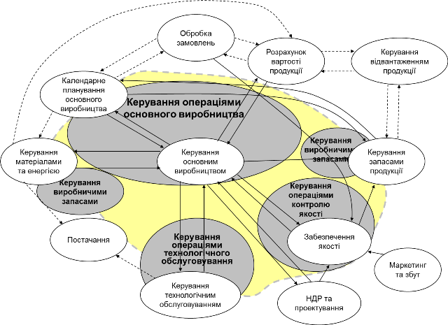
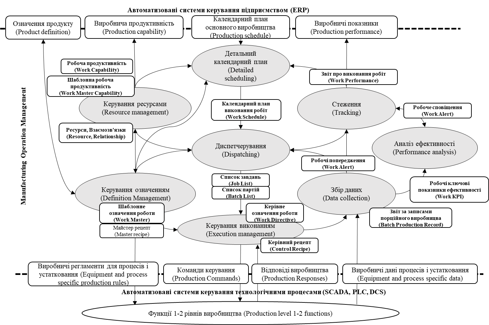
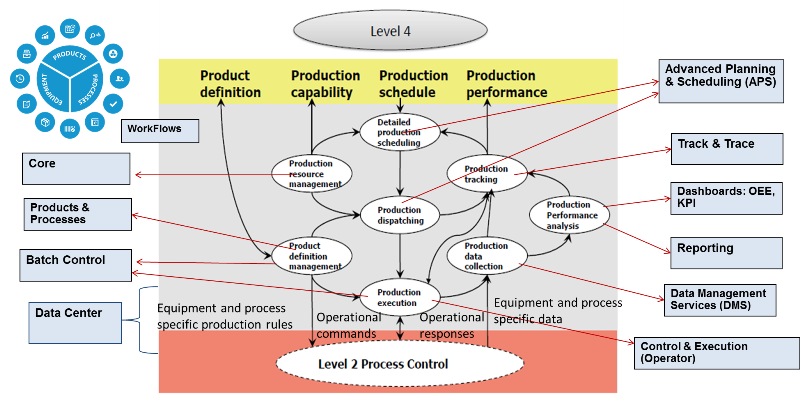
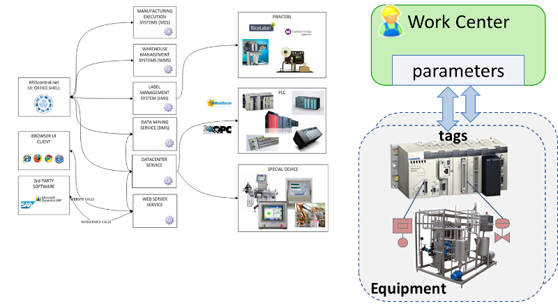
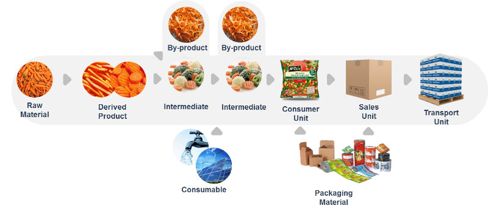
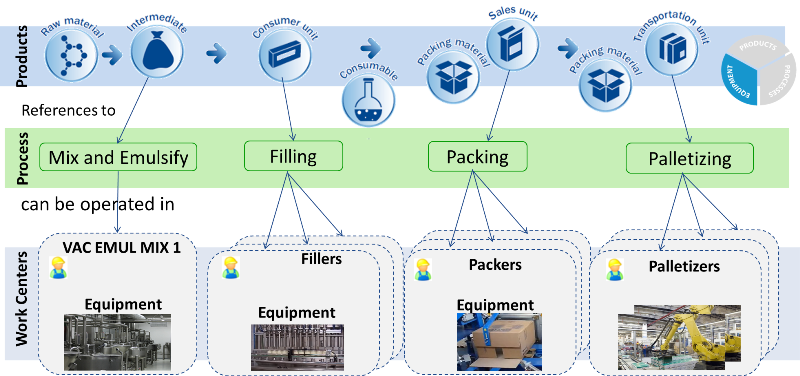
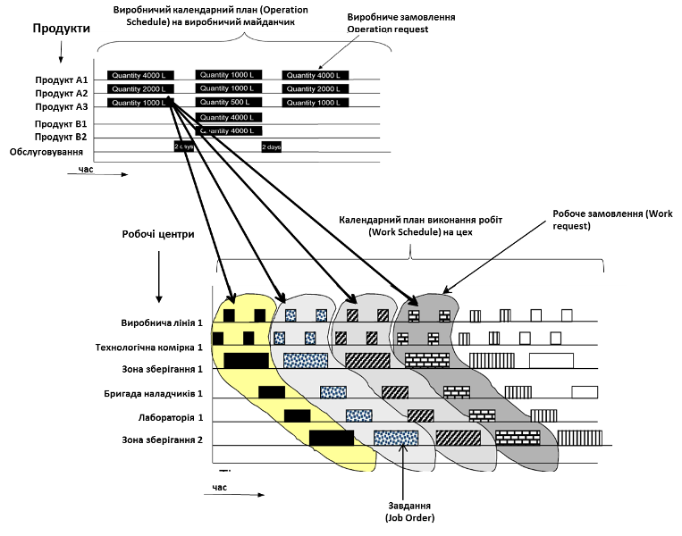
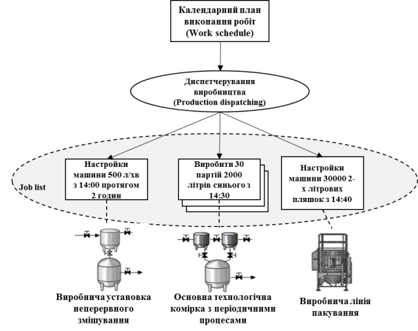
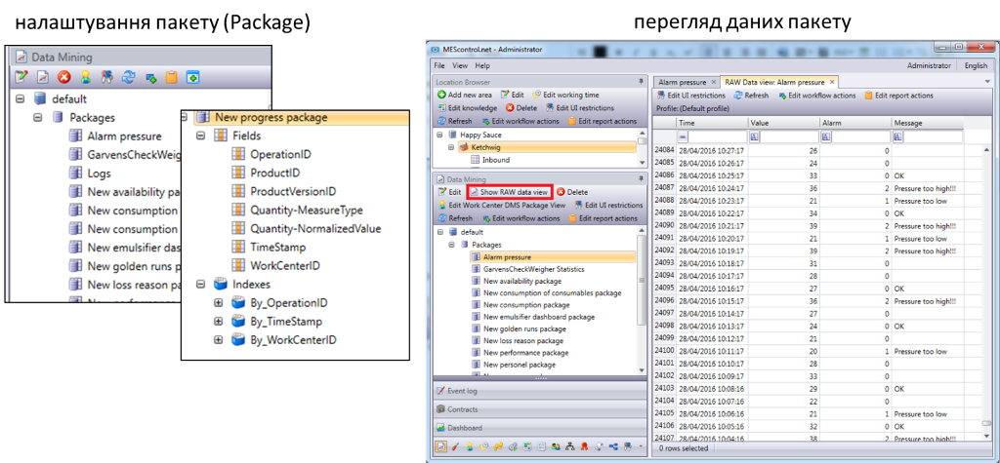
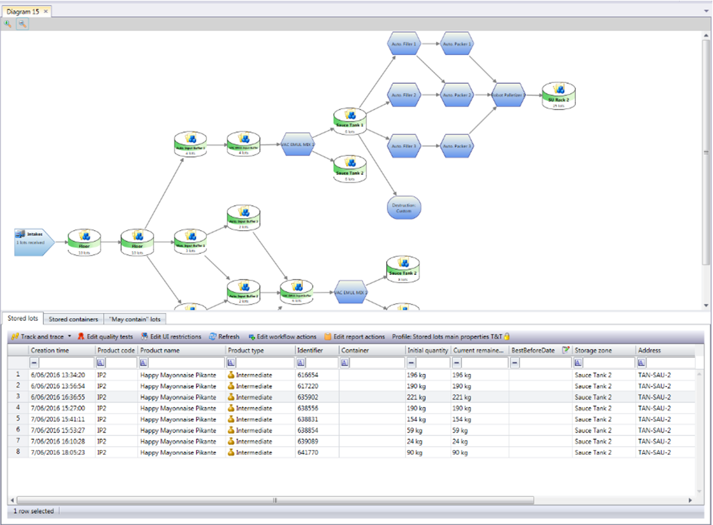

Автор і лектор: Олександр Пупена, Лабораторні: Олександр Пупена, Роман Міркевич

| [<- до лекцій](README.md) | [на основну сторінку курсу](../README.md) |
| ------------------------- | ----------------------------------------- |
|                           |                                           |

# Узагальнена функціональна модель керування виробничим підприємством

На рисунку 1 показана узагальнена функціональна модель виробничого підприємства. Пунктирна лінія зображує межу між системою керування виробництвом та підприємством. Ця лінія рівноцінна інтерфейсу між Рівнями 3 та 4 в ієрархії керування. Область в середині означує функції в межах відповідальності MOM. Сторона інтерфейсу, представлена виробничими операціями та керуванням технологічним процесом, включає в себе більшість функцій керування виробництвом та деякі діяльності інших основних функцій. 

рис.1.

Як видно з рисунку 1, ***виробництво*** (Manufacturing) включає в себе не тільки процеси виготовлення продукції (Production). До виробничих діяльностей відносяться операції по (див. рис.2):

- ***виготовлення продукції*** (Production), яке також називається ***основне виробництво***
- ***технічному обслуговуванню устатковання*** (Maintenance), зокрема ремонти, діагностування і т.п.;
- ***керуванню якістю*** (Quality), зокрема проведення аналізів матеріалів, перевірка відповідності стандартам і т.п.;
- ***керуванню запасами*** (Inventory), зокрема постачання сировини, логістика і т.п.;
- та інші, такі як охорона праці (safety) та охорона навколишнього середовища (Enviromental protection) .  

На рисунку жовтим кольором показана область діяльності MOM, в якій виділені різні категорії операцій та взаємозв'язки з іншими функціями підприємства.  

рис.2.

Цими операціями на підприємстві як правило займаються різні служби (підрозділи) і для їх автоматизації часто використовуються різні програмні продукти, наприклад:

- керуванням основним виробництвом - MES
- технічного обслуговування обладнання - EAM, ТОіР
- контроль якості - LIMS
- керування виробничими запасами - WMS+ (захватує також керування відвантаженням продукції)

З точки зору стандарту це не принципово, але враховуючи що вони використовують спільні ресурси та взаємопов'язані завдання необхідно їх узгоджувати через спільну інформаційну платформу, або через інформаційну взаємодію. Деякі системи MOM мають модульну структуру, де кожна із категорій є додатковим модулем. 

У BrightEye Momentum повністю реалізовані усі функції керування основним виробництвом. Функції керування виробничими запасами реалізовуються через модуль WMS, керування операціями по контролю якості - модулем Quality Management.       

    

Модульний підхід дає можливість вибирати замовнику необхідний функціонал, так як деякі функції на підприємстві можуть бути вже реалізовані на інших інформаційнх системах, а для реалізації деякого може не бути необхідності.

# Технічна структура MOM

Системи MOM технічно можуть бути реалізовані по різному. Система Momentum базується на клієнт-серверній структурі, де є кілька серверів, що відповідають за різні функції:

- DataCenter - взаємодія з пристроями рівня АСКТП (ПЛК, SCADA, тощо)
- MES - реалізовує основні функції MES 
- WMS - реалізовує функції модуля WMS 
- LMS (Labeling Management Server) - реалізовує функції генерування та друкування етикеток 
- DMS (Data Mining Server) - реалізовує функції збереження даних         

Сервери взаємодіють з іншими підсистемами, наприклад  DataCenter обмінюється даними реального часу з ПЛК через різноманітні драйвери (як правило OPC), LMS з принтерами етикеток, DMS з СКБД. Уся конфігураційна та плинна інформація зберігається в базах даних на MS SQL Server. 

Клієнтські застосунки взаємодіють з серверами для конфігурування та керування. Основним клієнтським застосунком є `Shell`, який надає можливість як конфігурувати систему так і проводити операційну діяльність. Також є можливість підключення через "тонкі" Веб-клієнти для виконання певних функцій. До серверів також можуть доступатися системи рівня ERP, наприклад SAP.           

# Функціональна структура MOM-систем

Згідно стандарту IEC 62264 для кожної, з категорій виробничих операцій, означена модель діяльностей (функцій). Це означає, що керування кожною з операцій зводиться до виконання наступних взаємопов’язаних діяльностей (рис.1):

- керування означенням проведення операції;
- контроль ресурсів; 
- детальне календарне планування;
- диспетчерування;
- керування виконанням операції;
- збір даних про операцію;
- стеження за виконанням операції; 
- аналіз ефективності операції.

Лінії зі стрілками на рис.1 вказують на інформаційні потоки між діяльностями. 

                               

 Рисунок 1 – Загальна модель діяльностей керування виробничими операціями

Узагальнена модель керування операціями використовується як шаблон для означення аналогічної моделі для ***керування основним виробництвом*** (Production), ***технічним обслуговуванням*** (Maintenance), ***контролем якості*** (Quality) та ***виробничими запасами*** (Inventory). Однак цей самий шаблон може бути використаний для інших можливих категорій виробничих операцій або для інших областей діяльності підприємства. Наприклад, такою операцією може бути керування мийкою відокремлено від основного виробництва, за умови що вона керується окремими службами. Іншим прикладом може бути розділення керування виробничими запасами на логістичні операції для зовнішніх постачань та відправлення, та внутрішньої логістики. 

Цикл керування операцією відбувається у наступній послідовності:

- формування інформації про доступні ресурси для виконання операцій за запитом з 4-го рівня (згідно стандарту);
- отримання з 4-го рівня виробничого замовлення;
- проведення детального планування відповідно до виробничого замовлення, означення операції та доступних ресурсів;
- диспетчерування робіт відповідно до детального календарного плану (видача завдань, підготовка робочих центрів);   
- керування виконанням робіт;
- збір даних про виконання робіт;
- формування звітності про виконання операції.

Виконання послідовності супроводжується наступними діяльностями: 

- аналізом виконаної роботи з метою покращення або виправлення;
- керуванням ресурсами, що використовуються для виконання робіт;
- керуванням означеннями виконуваної роботи.

Показана на рис.1 модель діяльностей, а також деталізація цієї моделі, що означені в частинах 3 та 4 стандарту IEC 62264, не призначені для реального впровадження виробничої інформаційної системи. Вони більше використовуються в якості каркасу для таких систем. 

Інформація про ресурси (матеріали, персонал, устатковання та фізичні засоби) може оброблятися в межах будь-якої з чотирьох моделей діяльності виробничих операцій (основне виробництво, технічне обслуговування, контроль якості чи виробничі запаси), представлених у стандарті. Дані для різних ресурсів можуть знаходитись в різних моделях, і у стандарті передбачені структури для обміну цими даними. Таким чином з будь-якої моделі діяльності може бути отримана необхідна інформація про персонал, устатковання,  витратні матеріали. Наприклад, інформація про запаси матеріалів, включаючи готову продукцію, сировину та інші витратні матеріали, може бути отримана з моделі керування виробничими запасами. У той же час, операції з переміщення матеріалів можуть керуватися діяльністю у моделях основного виробництва, технічного обслуговування, контролю якості та виробничих запасів. Але при цьому, конкретний екземпляр запису про рух витратних матеріалів існує лише в межах однієї моделі діяльності в будь-який момент часу.

Для кращого розуміння діяльностей на рівні MOM в даному курсі зосередимося тільки на одній категорії виробничих операцій – керування основним виробництвом. 

# Модель керування операціями основного виробництва

На рис.2 показана модель керування операціями основного виробництва. Як зазначено вище, керування операціями основного виробництва – це категорія, що складається з видів діяльностей, безпосередньо пов'язаних з виготовленням продукції. Пояснимо керівні діяльності для цієї категорії операції. IEC 62264-3 означує вісім діяльностей в межах операцій основного виробництва:

- Керування означенням продукту;

- Контроль виробничих ресурсів;

- Детальне календарне планування основного виробництва;

- Диспетчерування виробництва;

- Керування виконанням основного виробництва;

- Збір даних основного виробництва;

- Стеження за виробництвом;

- Аналіз ефективності основного виробництва.

                               

Рисунок 2 - Модель діяльності керування операціями основного виробництва

Нижче коротко зупинимося на призначенні кожної функції. Більш детальному опису цих функцій будуть присвячені окремі теми лекцій. 

## Діяльності керування в Momentum

Кожна із діяльностей у Momentum означується через відповідні розділи проекту. Основна частина (ядро, core) надає доступ до доступних ресурсів як для читання так і для використання. Взаємодія з рівнем АСКТП відбувається через Data Center. Модулі для реалізації усіх інших компонентів показаний на рисунку.     

## Обмін з рівнем 2 (АСКТП)

Для збору даних з устатковання та керування ним можуть використовуватися різні способи, к ручні так і автоматичні. У стандартах ISA-95/IEC-61512 цей зв'язок не означений. 

У Momentum зв'язок з рівнем АСКТП відбувається з використанням устатковання (Equipment) та їх параметрів. Тобто параметри устатковання є відображенням реального їх стану та команд керування.  

   

## Керування означенням продукту. 

### Сегмент процесу

Як було зазначено, **сегмент процесу** - це об'єднання ресурсів, які показують які ресурси є на виробництві для проведення операції (-цій), наприклад виготовлення певного напівпродукту. Це устатковання, персонал які задіяні в процесі, і матеріали які зараз є в наявності. Кожен сегмент процесу має свої власні характеристики, і для отримання прийнятних кінцевих продуктів необхідно виконувати різні операції в певному порядку. 

У Momentum є подібна до сегменту процесу сутність, яка зветься процесом. Вона означує технологічний процес, на який посилаються робочі центри та сегменти продукту. Таким чином через процес відбувається зв'язок між сегментами продуктів та робочими центрами, на яких вони можуть бути виготовлені.     

### Сегмент продукту

Природно, що для виготовлення продукту потрібна інформація про нього, зокрема: виробнича інструкція, відомості матеріалів та ресурсів. Вона тут більш конкретизована, ніж у бізнес-системі. 

**Сегмент продукту** – це найбільш детальний вигляд процесу керування матеріальними ресурсами, трудовими ресурсами, використанням ресурсів, затратами та якістю з метою керування виробництвом з точки зору бізнес систем. Сегмент продукту ідентифікує, посилається або відповідає сегменту процесу. Цей взаємозв'язок проілюстрований на рисунку 12.

  

Рисунок 12 Відношення сегмента продукту до сегмента процесу

Сегмент продукту пов'язаний з конкретним продуктом, тоді як сегмент процесу не залежить від продукту. Сегмент процесу включає в себе певну сукупність взаємопов’язаних ресурсів (персонал, устатковання, матеріали). Сегменти продукту і процесу відображають виробничі процеси з точки зору бізнесу і не призначені для подання детального огляду, необхідного для керування виробничими операціями в межах Рівня 3.

Таким чином, сегменти продукту формують означення ланцюга послідовностей сегментів процесу для створення конкретного продукту. Ці сегменти процесу можуть, наприклад, включати в себе робочі центри, в яких буде вироблятися продукт, задіяний персонал та матеріали. 

У середовищі Momentum сегменти продуктів означуються через модуль Products (продукти). Кожен продукт означується:

- процесом, який використовується для його виготовлення
- рецептом, який означує з яких продуктів він виробляється
- енергетичні та інші витратні матеріали, які споживаються, але не входять в продукт
- пакувальні матеріали
- інші характеристики 

Враховуючи, що сегменти продуктів робляться з інших сегментів, для означення кінцевого продукту виходить ланцюжок взаємозв'язаних.  

 

Рисунок 14 – Типи та зв’язки сегментів продукту

Продукти в Moentum діляться на типи, в залежності від їх особливостей (див.рис.14). Так, сегмент типу Consumer Unit (споживча одиниця) потребує матеріали, що виробляються в сегменті типу Intermediate (напівпродукт) та матеріли з сегменту Packaging material. Сировина (Raw marterial) не потребує вхідного продукту.  

### Зв'язок технології виробництва і устатковання 

Для забезпечення сегмента процесу потрібні різні фізичні ресурси: персонал, обладнання та продукти. Наприклад, для забезпечення процесу змішування потрібні оператор (персонал), змішувач (обладнання) та сировина (продукти). Іншими словами, сегмент процесу складається з робочих центрів і обладнання, які реально виконують зазначену роботу. Робочі центри представляють собою віртуальну колекцію супутнього обладнання, наприклад, пакувальні лінії. Устаткування відноситься до окремих машин або пристроїв, які виконують певне завдання, таким як принтер етикеток або змішувач.

Momentum використовує робочі центри (Work Centers) та устатковання (Equipment) для означення фізичного обладнання, необхідного в певний момент в процесі виробництва, а також для означення параметрів, що контролюються і налаштувань обладнання.

При плануванні ERP замовлення (клієнтські замовлення, customer order) для продуктів розбиваються на необхідні замовлення на роботи (work orders), відповідно до означення продуктів. Замовлення на роботи (work orders) призначаються (allocated) робочим центрам, які можуть виконувати процеси вказані у визначенні продукту. Призначені на замовлення на роботи називаються операціями.

## Контроль ресурсів. 

Ця діяльність передбачає визначення та надання інформації про плинний та майбутній стан ресурсів, таких як машини, робоча сила, матеріал та енергія. Це потрібно для задач планування та диспетчерування. Контроль ресурсів не передбачає керування ними. 

## Детальне календарне планування. 

Бізнес-система (ERP) надає календарний план виробництва, але він має бути адаптований та конкретизований. Тому для виконання загального плану проводиться детальне календарне планування. Воно використовує конкретні ресурси місцевого рівня (наприклад виробничого майданчику, цеху), враховуючи місцеві потужності. Ця адаптація до місцевих умов необхідна на рівні 3, оскільки системи планування рівня 4 для всього підприємства не мають детальної інформації, необхідної для керування виробництвом на необхідному рівні точності. При детальному календарному плануванні також існує можливість порівняння планів з фактичними результатами, які рідко проводяться на рівні 4. Ця діяльність також може об'єднувати або розділяти замовлення, щоб краще відповідати місцевим потужностям.

У Momentum передбачене як ручне так і автоматичне планування. Заплановані операції (Job згідно стандарту) можна відобразити як у вигляд списку так і у вигляді діаграми Ганта. Заплановані операції автоматично не запускаються в час назначення, ця функція по керуванню означена іншими діяльностями.    

## Диспетчерування основного виробництва. 

Тут відбувається керування фактичними виробничими потоками, шляхом задіяння конкретного персоналу та устатковання. Це може включати видачу завдань і, залежно від способу виробництва, планування початку партій, виробничих циклів тощо, як зазначено у детальному календарному плані основного виробництва. Тут також можна враховувати умови та задіювати ресурси, які не були заплановані при детальному календарному плануванні основного виробництва. У цій діяльності також зберігаються статус завдань і можливі непередбачувані умови.

У Momentum ця діяльність може виконуватися через інформаційні вікна операторських екранів, автоматичну відправку завдань на устатковання, відправка параметрів і т.п. 

## Керування виконанням основного виробництва. 

Ця діяльність спрямовує завдання на рівень 2 (АСКТП), керує та контролює його виконання шляхом відправлення команд та отримання стану. Також тут доступна інформація з попередніх запусків, яка може використовуватися для локальної оптимізації виробництва. 

У Momentum керування виконанням проводиться через зв'язок з АСКТП та використанням операторських екранів. 

## Збір та накопичення даних основного виробництва. 

У цій діяльності збираються та накопичуються дані про технологічні  процеси та виробничі запити. Дані можуть включати показання датчиків, стан устатковання, дані про події, введені оператором значення, дані про транзакції, дії оператора, повідомлення, результати розрахунків за моделями та інші дані, важливі для виготовлення продукції.  Тобто дані, що дозволяють підприємству відстежувати як було виконано виробництво та отримувати відповідну статистику по виробництву у вигляді звітів.

У Momentum накопичення даних реалізовано через модуль та сервер DMS.

## Аналіз ефективності основного виробництва. 

Тут здійснюють аналіз результатів діяльності основного виробництва з використанням ключових показників ефективності (KPI). Ці показники можна використовувати для ефективного керування в реальному часі та після-виробничого аналізу.  

У Momentum один з популярних показників для робочих центрів OEE (Overall equipment effectiveness, загальна ефективність обладнання) реалізований "з коробки" 

## Стеження за основним виробництвом. 

Інформація про те, як минуло виробництво, повинна бути передана на рівень 4, щоб бізнес-системи змогли оновити календарні плани для відповідності поточній ситуації. Підготовка цієї відповіді від основного виробництва проводиться в процесі стеження. Тут формується узагальнена інформація про фактичне використання персоналу, устатковання та матеріалів у виробництві, а також про фактично вироблений продукт. Ця інформація передається у формі, означеній першою та другою частинами стандарту. Дані, наведені тут, також використовуються для вдосконалення детального календарного плану основного виробництва. 

У Momentum стеження відбувається через "Track & Trace" із модуля WMS.

  

# Посилання

- [Стандарти 62264](https://tk185.appau.org.ua/category/62264/standard-iec-62264/)
- [МЕК 62264-1 Інтегрування систем керування підприємством та виробництвом. Частина 1: Моделі та термінологія](https://tk185.appau.org.ua/62264/standard-iec-62264/mek62264/)
- [Принципи функціонування систем керування основним виробництвом через призму стандарту IEC-62264. Посібник](https://tk185.appau.org.ua/guide/aCampus-users-guides-IEC62264+++.pdf)
- [Стандарти інтегрування систем керування підприємством та виробництвом: сучасний стан та перспективи в Україні. Біла книга](https://tk185.appau.org.ua/whitepapers/62264.pdf)
- [Глосарій термінів керування виробництвом](https://tk185.appau.org.ua/61512/hlosarii/hlosarii/)](https://tk185.appau.org.ua/category/62264/hlosarii-62264/)

| [<- до лекцій](README.md) | [на основну сторінку курсу](../README.md) |
| ------------------------- | ----------------------------------------- |
|                           |                                           |

<iframe width="800" height="600" src="https://www.youtube.com/embed/6CRxR0X6Ikg" frameborder="0" allow="accelerometer; autoplay; encrypted-media; gyroscope; picture-in-picture" allowfullscreen></iframe>