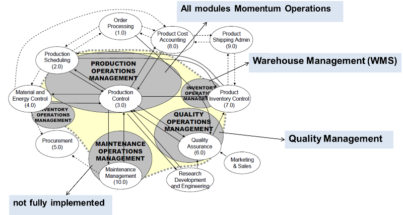

Автор і лектор: Олександр Пупена, Лабораторні: Олександр Пупена, Роман Міркевич

| [<- до лекцій](README.md) | [на основну сторінку курсу](../README.md) |
| ------------------------- | ----------------------------------------- |
|                           |                                           |

# Основи Momentum

## Про Momentum

***Momentum*** - це хмарна платформа MOM (Manufacturing Operation Management) від Brighteye, яка надає можливості системи керування основним виробництвом на рівні підприємства (MES), керування запасами (WMS), керування якістю, та багато іншого. Високомасштабна платформа Momentum була розроблена для задоволення потреб виробників дискретних, порційних та неперервних виробництв будь-яких розмірів. Вона створена для того, щоб компанії могли керувати та постійно вдосконалювати свої виробничі операції.

рис.1.

Серед функцій, що означені в стандарті IEC-62264 (ISA-95) Momentum повністю реалізує функції «Керування основними виробничими операціями» (production operations management). Ці функції входять до базового набору модулів. Крім того також доступні функції «керування операціями по якості» (Quality Operations Management), які реалізовані як однойменний додатковий модуль. Функції «керування операціями з запасами» (Inventory operations management) доступні в модулі керування складськими операціями (WMS).

рис.2.

## MES та WMS

Виробничі функції відповідають за виготовлення продукту та його пакування. Модуль WMS (Warehouse Management System) в Momentum гарантує як оптимізоване керування прийманням, так і керування запасами для всіх напівфабрикатів і готових виробів, координує всі переміщення матеріалів під час основного виробництва. Запаси завжди узгоджені з реальними виробничими вимогами. Можлива будь-яка конфігурація для конкретного клієнта. Модуль WMS підтримує кожен тип сховища зі своїми власними особливостями і гарантує керування стійками, бункерами, резервуарами і контейнерами, мобільними стелажами і автоматичними кранами.

## MES та Quality Management

**Стандарт якості** складається з набору специфікацій або характеристик продукту, які потрібно перевірити, наприклад колір, твердість, аромат. Відповідна класифікація записується для кожного результату в стандарті якості, наприклад, темно-зелений = АА, світло-зелений = А тощо. Кінцева якість партії визначається з урахуванням результатів усіх випробувань на партію. Можна негайно оцінити товар на основі різних стандартів.

Модуль контролю якості (**Quality Control module**) у Momentum дозволяє визначити власні стандарти якості та класифікації та планувати контроль. У ньому визначаються стандарти, щодо яких потрібно перевірити якість продукції. Можна протестувати всі матеріали, від сировини до пакувальних матеріалів, виходячи з особливостей їх якості, використовуючи цей модуль контролю якості.

Результати тестів якості передаються від одного процесу до іншого, і таким чином визначають подальший хід обробки партії та опосередковано кінцеву якість готової продукції.

| [<- до лекцій](README.md) | [на основну сторінку курсу](../README.md) |
| ------------------------- | ----------------------------------------- |
|                           |                                           |