[1 <--](1.md)   [Зміст](README.md)    [--> 3](3.md)

# 2. Стандарти інтегрування. Основні моделі.

## 2.1. Стандарти інтегрування систем керування підприємством

На минулій лекції інтегрована система керування виробничими підприємством представлялася як ієрархічна система, в якій є 5-рівнів керування. Враховуючи що на цих рівнях автоматизуються різні за характером функції а реалізація відбувається в зовсім різних інформаційних системах, то навіть предметна область там відрізняється. Для можливості сумісної взаємодії розроблено ряд стандартів, які описують моделі для представлення різноманітних сутностей. 

Серед найбільш важливих стандартів, в яких систематизовані кращі практики розробки інтегрованих автоматизованих систем керування є американські стандарти ANSI/ISA-95 [8-10] та аналогічні їм світові аналоги IEC-62264 (МЕК-62264), які по суті являються адаптацію ISA. В Україні, ці стандарти прийняті методом підтвердження.  Для розуміння місця сучасних стандартів в інтегрованому виробництві, слід розглядати їх в контексті функціональної структури, яка наведена в першій частині ISA-95 (див. рис.2.1), яка була наведена в минулій лекції. Пригадаємо, що згідно цього стандарту ієрархія керування виробничим підприємством описується 4-ма рівнями: 1-й та 2-й рівень призначений для керування технологічним процесом, 3-й – керування виробничими операціями (MOM), 4-й – для бізнес-планування та логістики. Слід звернути увагу, що ця структура інтегрованого виробництва ніяким чином не накладає вимоги щодо конкретної реалізації функцій. Так, наприклад, деякі всесвітньо відомі програмні продукти охоплюють частину функцій з кожного з наведених рівнів, але не реалізовують весь перерахований функціонал. З цих же причин 3-й рівень прийнято називати MOM (Manufacturing Operations Management) в противагу MES(Manufacturing Execution System), так як MOM охоплює більше функцій, ніж прийнято відносити до систем MES. Так, наприклад, MOM включає в себе ряд функцій оперативного керування обслуговування фізичних активів підприємства, що не передбачається моделлю MES. 

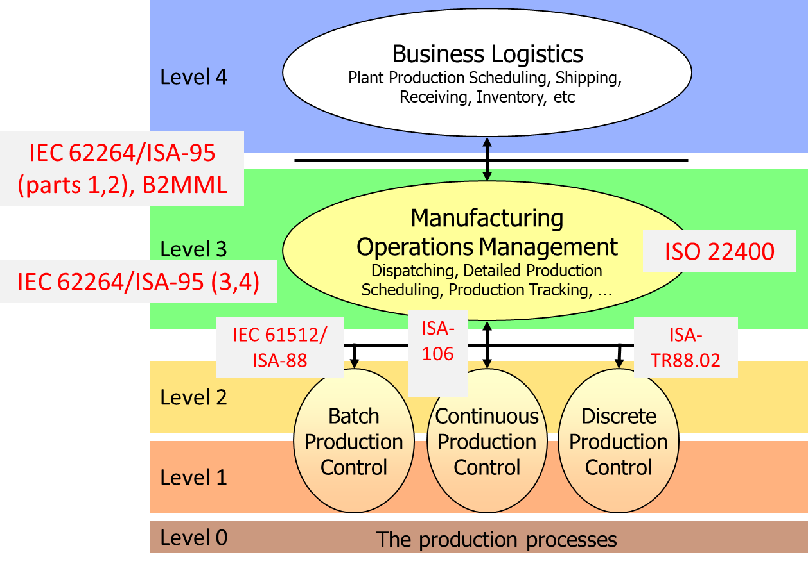

рис.2.1. Місце різних стандартів інтегрування у ієрархічній моделі керування промисловим підприємством 

Виконання функції 4-го рівня як правило охоплюються системами типу ERP (Enterprise Resource Planning). Перша та друга частина стандарту ISA-95, які були затверджені першочергово, якраз призначені для вирішення проблем інтеграції систем ERP та MOM. Тобто вони направлені на опис (моделі) представлення даних, якими будуть обмінюватися ці системи та в деякій мірі правила цього обміну. Слід зазначити, що в стандартах немає вимог до внутрішньої структури цих систем та реалізації конкретних функцій, а тільки до їх взаємодії (опису даних) на різних рівнях керування, що дозволить інтегрувати різні, навіть існуючі реалізації, вносячи певні зміни до їх інтерфейсної частини.   

Третя та четверта частина стандарту (ISA-95.03 та ISA-95.04) зосереджується на взаємодії функцій в середині рівня MOM, та з 2-м рівнем функціональної моделі. У деякій мірі цей стандарт описує модель самих функцій з точки зору взаємодії між ними. Як і в перших частинах описується тільки структура самих даних, якими обмінюються функції, а не програмний інтерфейс.  

Реалізація першого та другого рівня, згідно наведеної моделі, охоплюються автоматизованими системами керування технологічними процесами (АСКТП), на які не поширюється стандарт. Тим не менше, в даній моделі вже прийнято розділення між типами виробничих процесів:

1. Batch Production Control – керування порційним виробництвом 
2. Continues Production Control – керування неперервним виробництвом
3. Discrete Production Control – керування дискретним виробництвом

Це розділення зумовлене певними особливостями способу вироблення продукції, що, як відомо, накладає свій слід на особливості керування виробничими процесами. 

- Неперервне виготовлення продукції (Continues Production) передбачає неперервний потік матеріалу, для якого в потоці (просторі) змінюють властивості. Неперервність потоку передбачає відповідне керування, яке як правило включає більше неперервного регулювання.
- Дискретне виготовлення продукції (Discrete Production) базується на поштучному виготовленні, яке часто передбачає збірку з кількох деталей одного виробу.
- Порційний спосіб виготовлення продукції (Batch Production) передбачає проведення технологічних дій в один момент часу одразу з певною частиною матеріалу (порція, партія, batch).    

Для інтегрування систем цих рівнів у загальну систему керування виробництвом вони повинні бути попередньо підготовлені. По-перше, керування виробничим підприємством вимагає представлення ресурсів і діяльності цих рівнів у вигляді моделей, які відрізняються для різних типів виробництв. Так, наприклад для неперервного виробництва продуктивність означується через кількість продукту за певний час, тоді як для порційного - мінімальна/максимальна одиниця партії за певний час.  По-друге, алгоритми керування 2-го рівня повинні враховувати необхідність реалізації двохсторонньої інтеграції за принципом: вниз – планування, вгору – фактичний стан. Для цього, в керуванні порційним виробництвом (Batch Control) вже довгий час використовується стандарт ISA-88 (IEC 61512). У певній мірі адаптація стандарту зроблена також і для дискретних виробництв. Для неперервних виробництв теж існують адаптації стандартів ISA-88, тим не менше, вже біля десяти років ведуться роботи над стандартом ISA-106, який призначений саме для таких об’єктів. Зараз робота над стандартом триває, а попередні результати висвітлені в технічному звіті (ISA-TR106). У стандартах ISA-88 та ISA-106 закладені такі правила побудови систем керування технологічними процесами, які передбачають їх інтеграцію в єдину ІАСК, побудовану згідно стандарту ISA-95.       

Таким чином, на сьогоднішній день група стандартів ISA охоплює керівну діяльність практично усіх 3-х нижніх рівнів ієрархії керування виробничим підприємством:

1. ISA 95.01 та ISA 95.02 (та аналогічні IEC 62264) – моделі даних в обміні між 3-м (MOM) і 4-м (ERP) рівнем
2. ISA 95.03 та ISA 95.04 (та аналогічні IEC 62264) – моделі даних в обміні між функціями 3-го рівня (MOM) та в деякій мірі обміну з 2-м 
3. ISA 95.05 – високорівневий протокол для обміну даними 3-го (MOM) і 4-го (ERP) рівня
4. ISA 88.01, ISA 88.02, ISA 88.03, ISA 88.04, ISA-88.05 – стандарти для керування періодичним виробництвом
5. ISA TR88.02 – адаптація стандартів ISA-88 для задач пакування продукції (дискретні процеси)   
6. ISA TR88-95.00.01 – технічний звіт про сумісне використання ISA-88 та ISA-95
7. ISA TR106 – технічний звіт по розробці стандартів керування неперервним виробництвом 

Вище наведені тільки стандарти ISA, хоч у більшості з них є аналоги IEC. Окрім даної групи стандартів при розроблені систем керування виробництвом враховують також і інші стандарти. Стандарт ISO 22400 описує принципи розроблення та використання виробничих ключових показників ефективності (KPI) а також наводить найбільш вживані. Цей стандарт ще згадуватиметься в лекції по ключовим показникам ефективності. 

Багато з необізнаних про стандарт людей вважають, що стандарт покликаний забезпечити прозорість інформаційного обміну між застосунками на протокольному рівні, як це наприклад зроблено в OPC для інтегрування технічних та програмних засобів. Такого роду задачі вирішуються іншими стандартами та специфікаціями, і це не є сьогодні проблемою. Стандарт IEC 62264 розроблений для інтегрування систем керування підприємством та виробництвом на функціональному рівні. Тобто задача стандарту не в забезпеченні передачі даних, а у означенні сутностей (що саме) і набору їх атрибутів (як саме). Ось назви усіх частин стандартів IEC 62264:

- [IEC 62264-1 Edition 2.0 2013 Enterprise-control system integration – Part 1: Models and terminology](https://webstore.iec.ch/publication/6675)
- [IEC  62264-2 Edition 2.0 2013 Enterprise-control system integration – Part  2: Objects and attributes for enterprise-control system integration](https://webstore.iec.ch/publication/6676)
- [IEC  62264-3 Edition 2.0 2016 Enterprise-control system integration – Part  3: Activity models of manufacturing operations management](https://webstore.iec.ch/publication/33511)
- [IEC  62264-4 Edition 1.0 2015 Enterprise-control system integration – Part  4: Object model attributes for manufacturing operations management  integration](https://webstore.iec.ch/publication/23943)
- [IEC 62264-5 Edition 2.0 2016 Enterprise-control system integration – Part 5: Business to manufacturing transactions](https://webstore.iec.ch/publication/25465)
- [IEC 62264-6:2020  Enterprise-control system integration - Part 6: Messaging service model](https://webstore.iec.ch/publication/59706)

У перших 4-х частин в назві стандарту оперує слово `model`. Саме модельне представлення сутностей є предметом стандартизації. Архітектурна модель відображає логічні та фізичні зв'язки між  компонентами системи керування виробництвом та іншими системами, які  взаємодіють з ними. Архітектурна модель - це один з типів моделей, що описує структуру,  функції та взаємодії складних систем. Вона відображає абстрактні  поняття, які відображають функціональні та фізичні аспекти системи.  Архітектурна модель використовується для опису системи на високому рівні абстракції, тобто для надання загальної уяви про те, як система працює, а не для детального опису кожної її частини.

Перш за все в стандарті визначилися з тим, а взагалі, яку саме необхідно надавати інформацію і кому вона потрібна. Для цього IEC 62264 виділяє дві області керування: домен підприємства та домен керування виробничими операціями та технологічними процесами (MO&C Manufacturing Operations and Control).  Принципи за якими відбувається це розділення наведені в п.5 першої частини стандарту. Умовно, все що стосується зовнішньоекономічної діяльності підприємства, стратегічного та довгострокового планування ресурсами, тощо відносяться до домену підприємства, а виробничі операції – до MO&C. Далі, в межах кожного домену виділяються взаємопов’язані функції, частина з яких представляють інтерес в іншому домені. Так, наприклад, функція керування та керування ресурсами основного виробництва MO&C може бути використана в функції прогнозування випуску продукції на рівні ERP. Ці функції взаємопов’язані інформаційними потоками, які і є складовою тих даних, якими обмінюються рівні. Цю інформацію категоризують і описують у вигляді об’єктних моделей.   

Таким чином, IEC 62264 надає моделі та інформацію на різних рівнях деталізації та абстрагування. Кожна модель та схема збільшують рівень деталізації, представлений у попередній моделі. 

## 2.2. Функціональна модель

У загальному, усю діяльність виробничого підприємства можна показати у функціональному представленні як показано на рис.2.2. Ці функції стосуються як діяльностей що безпосередньо стосується виробничих потужностей, так і організаційно-економічних діяльностей підприємства.   

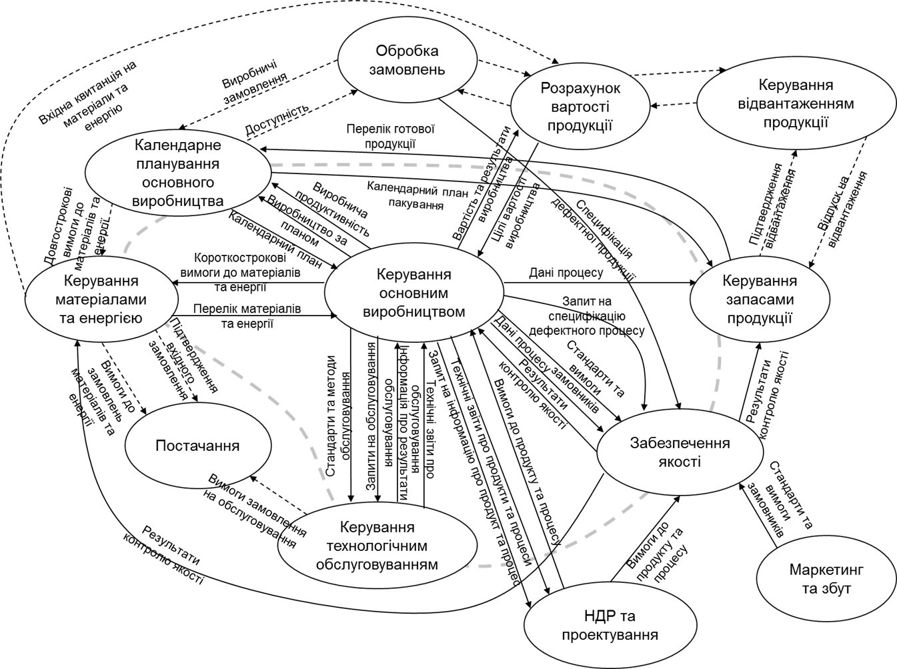

рис.2.2. Функціональна модель керування виробничим підприємством

Функції з рис.2.2. можна згрупувати за відношенням до домену та до категорії операцій, до яких вони застосовуються, в представлення, яке показане на рис.2.3. Частина функцій цих груп, що виділені на рисунку сірим в жовтому контурі, відносяться до домена виробництва. «Виробництво» (Manufacturing) - це не тільки операції по виготовленню продукції (Production), які в українській термінології відносяться до «основного виробництва». 

Рис 2.3. Спрощена функціональна модель з об'єднаними функціями

До виробничих операцій входять такі **категорії**:

- операції по виготовленню продукції (Production), основне виробництво;
- операції керування запасами (Inventory);
- операції по контролю якості (Quality);
- операції по технічному обслуговуванню (Maintenance);
- інші операції

Цими діяльностями традиційно займаються різні виробничі підрозділи і, як було зазначено в поепередній лекції, часто автоматизовані з використанням різних типів програмних засобів (EAM/ТОіР, LIMS, MES і т.п.). Стандарт об’єднав ці діяльності під один спільний знаменник «виробничі операції» (Manufacturing Operations), які використовують спільні моделі ресурсів, що дає змогу розглядати одні і ті самі сутності підприємства з різних точок зору. Тому стандарт на концептуальному рівні легко поєднує скажімо устатковання з точки зору виробничників і обслуговуючого персоналу. Це дає змогу інтегрувати системи не тільки на різних рівнях ієрархії, але і на одному і тому ж рівні MOM. Стандарт дозволяє розширювати ці типи діяльностей.

## 2.3. Обмін інформацією між рівнями L3 та L4

На рис.2.3 пунктирна лінія розділяє дві області керування: домен підприємства та домен керування виробничими операціями та технологічними процесами (MO&C Manufacturing Operations and Control). По цій лінії умовно проводиться межа між інформаційними системами рівня 4 (керування підприємством, наприклад ERP) та 3 (керування виробництвом, MOM) які показані на в рис.2.1. Саме по цій лінії повинно проходити інтегрування цих систем, тому обмін між ними і є предметом стандартизації перших 2-х частин стандарту. 

Як видно з рис.2.3 деякі функції розділені цієї лінією, а для інших функцій, які пов'язані між собою але знаходяться по різні боки від лінії, вона є точкою поєднання. Таким чином стандарт повинен надати механізми опису тих сутностей які передбачають таку взаємодію. Розглянемо це на прикладі категорії операції по виготовленню продукції. Як видно з рис.2.3 вона включає дві функції: керування основним виробництвом (production management) та календарне планування основного виробництва. Для кращого розуміння такої взаємодії, варто розібрати спочатку рис.2.2 Перша функція повністю зосереджена на виробничому майданчику і передбачає керування операціями по виготовленню продукції на конкретних виробничих потужностях. Це внутрішньо-цехові операції, які не потребують керування з боку планово-економічного відділу за винятком одного - календарного плану виготовлення. Однак календарне планування проводиться на різних рівнях: 

- об'ємне, яке показує скільки і якої продукції повинен виготовити наприклад цех за певний період часу
- детальне, яке показує коли і які ресурси і в якій послідовності на виробничому майданчику, наприклад в цеху, треба задіяти, щоб випустити вказану кількість продукції.     

Перша частина, тобто об'ємне планування, проводиться з урахуванням виробничого замовлення (див.рис.2.2). Однак для того щоб зробити коректне замовлення необхідно розуміти фактичну доступність ресурсів на вказаний момент часу. У будь якому випадку, це виконується на рівні планово-економічної діяльності підприємства (L4), що на рис.2.3 показано поза жовтою областю. Детальне календарне планування є діяльністю, яка направлена на задіяння ресурсів на виробничому майданчику, і є "жовтою частиною" календарного планування. Таким чином об'ємне календарне планування проводиться  з урахуванням доступних ресурсів на виробництві та видається на частину виробничого майданчику в якості завдання: що робити і в яких кількостях; які ресурси задіяти. З іншого боку, з виробничого майданчику повинна приходити  інформація про доступні ресурси та звітність про фактичні показники виробництва. Такий обмін між рівнями показаний на рис.2.4.           

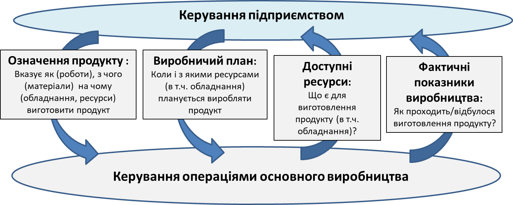

рис.2.4. Обмін між рівнями керування на прикладі категорії керування операціями основного виробництва.

Якщо подивитися на рис.2.3 та 2.4 з точки зору оцінки обміну інформацією між функціями, то видно, що деякий обмін є кроскатегоральний (між категоріями, а деякий є загальним який стосується всіх категорій операцій. Тому наведений на рис.2.4 принцип обміну буде характерним і для інших категорій операцій. Тому в стандарті передбачено чотири категорії інформації про виробничі операції, які відносяться до чотирьох категорій діяльностей керування виробничими операціями, а саме:

- інформація про календарне планування – інформація про запити на виконання робіт у межах однієї або декількох категорій діяльностей;
- інформація про результати діяльностей (показники виробництва) – інформація про роботу, виконану в межах однієї або декількох категорій діяльностей;
- інформація про продуктивність – інформація про можливості виконувати роботу в межах однієї або декількох категорій діяльностей;
- інформація про означення – інформація про означення роботи, яка може бути виконана в межах однієї або декількох категорій діяльностей.

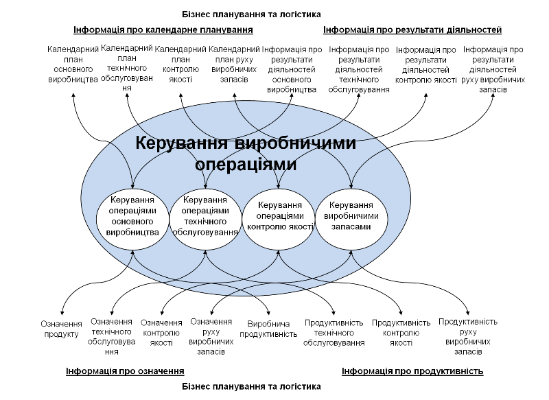 

Рис 2.5. Інформація про виробничі операції

Для того, щоб описати показані на рис.2.5 інформаційні потоки, стандарт означує моделі ресурсів.    

## 2.4. Моделі ресурсів

Не дивлячись на такі абстрактні на перший погляд описи, стандарт містить дуже конкретні моделі. Під словом «модель» треба розуміти опис об’єктів та їх взаємозв’язки. По суті інформація, яка слугує інтегруванню, включає в себе опис конкретних сутностей. Найпростішими для розуміння сутностями є виробничі ресурси. 

Підприємство з точки зору ресурсів представляє собою взаємопов’язану сукупність (систему) таких ресурсів:

- устатковання (equipment), яке виконує певну роль у виготовленні продукції;
- матеріали (materials) з яких виготовляється продукт і який представляє готовий продукт;
- персонал (personnel), який також приймає участь у виробництві;
- активи (physical asset) – устатковання з точки зору балансу підприємства.  

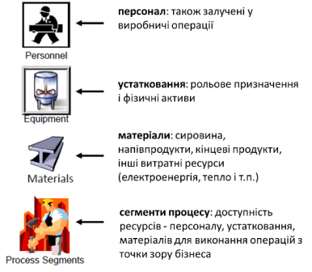

Рис.2.6. Моделі ресурсів 

Правильне означення усіх моделей є дуже важливим при керуванні. При необхідності надати інформацію про ресурси рівню керування підприємством, вони поєднуються в сегменти процесу. Таке логічне об'єднання проводиться з точки зору їх призначення.  

### Устатковання та активи 

Устатковання (Equipment), як ресурс розглядається детальніше в наступних лекціях, тут зупинимося тільки на основних моментах. По-перше, устатковання - це будь який невитратний нематеріальний ресурс, який є у підприємства і виконує певну роль. В залежності від того, на якому рівні керування це устатковання виконує свою роль, воно виділяється в ієрархії на певному рівні. На рис.2.7 показаний приклад ієрархії устатковання, відповідно до означеного в стандарті IEC 62264. Устатковання на нижньому рівні підпорядковується верхньому рівню і з точки зору групування є його частиною. Найвищим рівнем керування є підприємство, яке включє виробничі майданчики, що включають в себе цехи. Цехи включать в себе робочі центри, що виконують роль виготовлення напівпродукту за вказаними операціями, які він може виконувати з вказаної сировини у вказаний період часу. 

Саме робочі центри, як правило, є одиницями оперативного планування. При плануванні проявляється особливість типу виробництва (неперервне, дискретне і порційне). Робочі вузли в робочих центрах є «робочими конячками» процесу виконання операцій. Ці три рівні устатковання (цех, робочий центр, робочий вузол) складають основу виробництва і описуються в термінах продуктивності і потреб в ресурсах. Устатковання, що знаходяться вище них, задіяні в процесах керування рівня L4, що нижче – рівня L2. Для стандартів ISA-88/IEC 61512, PackML та  ISA-106 – модель устатковання є єдиною, що робить її застосовною для інтеграції між цими рівнями.

 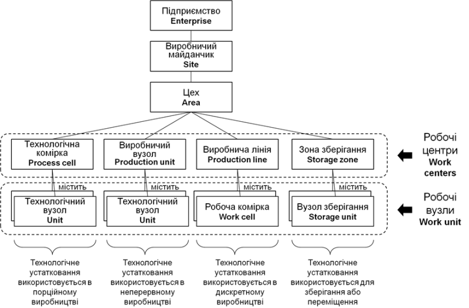

Рис.2.7. Модель устатковання 

Слід відмітити, що з точки зору виробничників на підприємстві використовується устатковання (Equipment, рольова ієрархія), а з точки зору обслуговуючого персоналу (електрики, механіки, КВПіА) – це є активами (Asset), які на певний час знаходяться в ролі певного устатковання (рис.2.8). 

Наприклад, двигун з певним серійним номером, який знаходиться на балансі є активом (asset). Але в певний момент часу він знаходиться в ролі двигуна для насосу - це устатковання (Equipment). На місці цього устатковання можуть знаходитися різні активи. Один і той самий актив може бути різним устаткованням, а може бути матеріалом, при його виготовленні.    

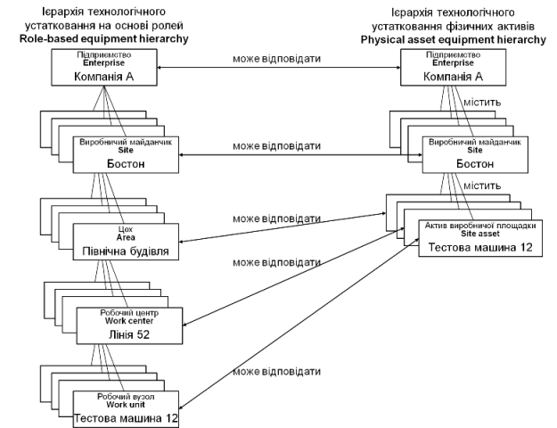 

Рис 2.8. Приклад ієрархії фізичних активів, пов'язаної з ієрархією технологічного устатковання на основі ролей 

Для операцій рівня L4 більш цікавими є не моделі ресурсів, а їх об’єднання з точки зору виконання певної операції. Тому окрім базових ресурсів в стандарті є «сегменти», які по суті об’єднують об’єкти різного типу для означення можливостей (сегмент процесу) або потреб для виготовлення продукту (сегмент продукту) (рис.7). 

### Матеріали

Матеріал (Material), це витратний ресурс, який означує партії (лоти, lot) та підпартії (sublot) матеріалів і класів матеріалів, які беруть участь у виробництві. Ця інформація дозволяє системам рівня 3 і рівня 4 однозначно ідентифікувати матеріал, зазначений у виробничих календарних планах і спожитий або вироблений у фактичному виробництві. Основним бізнес-чинником використання моделі матеріалу є надання можливості відстежувати всі матеріали, використані у виробництві продукту, щоб допомогти в аналізі залишків, руху та якості сировини, напівпродуктів чи продуктів.

Рис. 2.9 ілюструє модель матеріалу, яка складається з партій (Lot), підпартій (Sublot), класів (Material Class) матеріалів, означень матеріалів (Material Definition) та специфікації випробування матеріалу (QA Test Specification). Розглянемо це детальніше. 

Кожен екземпляр ресурсу, має означення матеріалу (Material Definition), напркилад "соляна кислота 50%" (HCl 50%) який у свою чергу може належати до класу матеріалу, наприклад "соляна кислота" (HCI Acid), який може використовувати для логічного групування. Кожне означення та клас матеріалу може мати певні властивості, наприклад `pH` чи колір. Ці властивості можуть бути вкладеними, тобто властивість може мати власні властивості. 

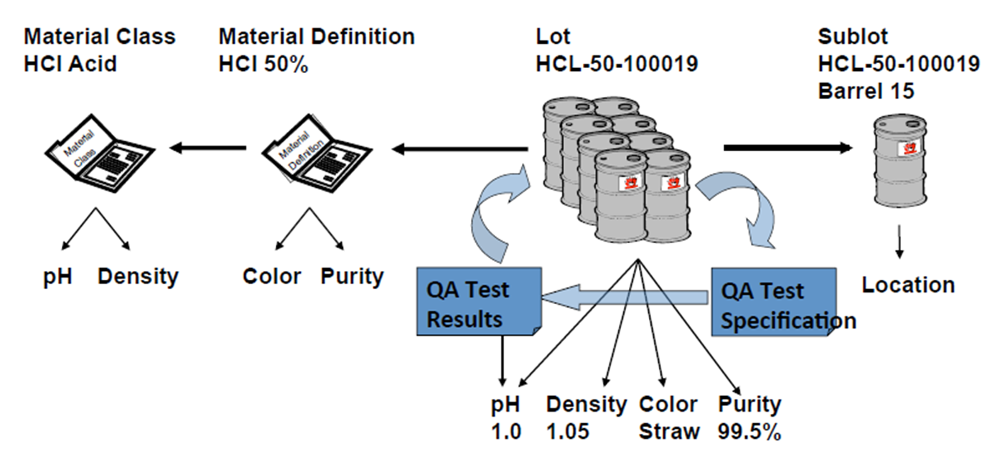

Рис 2.9. Приклад означення матеріалу

Означення матеріалів можуть бути зібрані з інших означень матеріалів, наприклад у випадку збірного вузла під час виробництва автомобілів. Так, наприклад `трансмісія`, яка ідентифікується як означення матеріалу, попередньо зібрана з багатьох інших означень матеріалів, які є його деталями. 

Кожна партія(лот, Lot) матеріалу є конкретним екземпляром означення матеріалу. Партія є унікально ідентифікованою. Партії матеріалів також мають властивості, які можна вкладати, а також можуть використовувати конструкцію складання, подібну до тієї, що використовується у означеннях матеріалів. Відмінність полягає в тому, що партію матеріалу можна зібрати з інших партій матеріалу та/або підпартій матеріалів. Властивості екземпляра партії матеріалу зазвичай використовуються для відстеження конкретних поставок або замовлень матеріалів.

Кожна підпартія матеріалу є унікально ідентифікованим екземпляром означення матеріалу. Підпартії матеріалу не мають властивостей, оскільки кожен екземпляр підпартії повинен мати ті самі властивості, що й партія матеріалу, частиною якої він є. Підпартії матеріалів також можуть використовувати ту саму конструкцію складання, що й партії матеріалів. Екземпляри підпартій матеріалів зазвичай використовуються для забезпечення чіткості відстеження в межах партій. Наприклад, партія матеріалу може бути отримана від постачальника в десяти бочках, кожна бочка може ідентифікуватися як окрема підпартія, щоб відстежувати її переміщення та умови навколишнього середовища під час зберігання і виробництва.

Специфікація випробування матеріалу (Material Test Specification, QA Test) означує випробування, яке може бути пов’язане з визначенням значення властивості класу матеріалу, визначення матеріалу або екземпляра партії матеріалу. Інформація, отримана під час виконання тесту, може бути змодельована в результатах тесту QA (QA Test Result).

### Персонал

Модель персоналу - це означення осіб і класів (ролей) персоналу, які беруть участь у виробництві. Цю інформацію можна використовувати для пов’язування виробництва з конкретними особами як частиною виробничого запису або з класами персоналу для розподілу виробничих витрат.

Модель персоналу є абстрактною моделлю, яка дозволяє визначити особу та ролі, які окремій особи можуть бути призначені. Вимоги, пов’язані з певною роллю, можуть включати спеціальне навчання або сертифікацію. Це може бути пов’язано з посадою або навичками. Одна особа може виконувати кілька ролей. Особи можуть бути згруповані в тип Person, щоб дозволити пов’язувати властивості з усіма особами, які належать до даного типу. Наприклад, тип особи або тип оператора може дозволяти кільком операторам проходити однакові визначені кваліфікаційні тести, деякі з яких визначаються роллю оператора, інші можуть визначатися роллю безпеки або роллю для певного типу обладнання.

Кожен екземпляр класу персоналу (Personnel Class) є об’єктною моделлю персоналу. Кожен екземпляр класу персоналу визначає роль, яку може виконувати особа, наприклад оператор. Кожна роль може мати певні властивості, наприклад номер ліцензії на розробку та дату закінчення терміну дії ліцензії. Ці властивості також можуть мати власні вкладені властивості. Кожна особа (Person) може бути пов’язана з однією або кількома ролями класу персоналу. Якщо особа є оператором, тоді властивості особи означують значення для номера ліцензії на оператора та дати закінчення терміну дії ліцензії для цієї особи. Специфікація кваліфікаційного тесту (Qualification Test Specification) означує тест, який може бути пов’язаний із визначенням значення властивості (наприклад, тест для кресляра, який використовується для отримання номера ліцензії на проектування). Інформація, отримана під час проходження тесту, може бути змодельована в результатах кваліфікаційного тесту (Qualification Test Result).

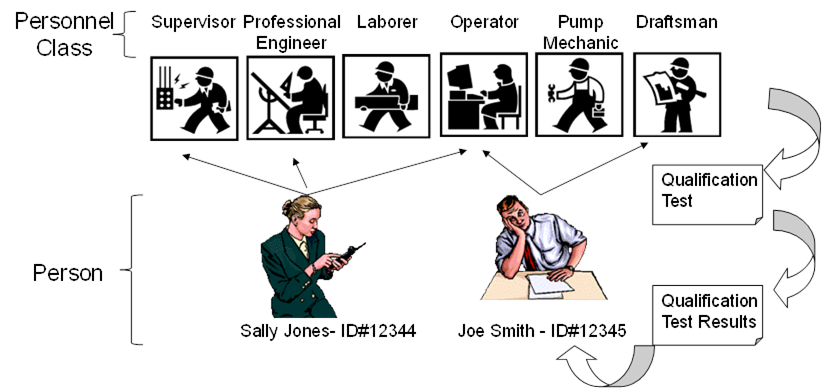

Рис 2.10. Приклад означення персоналу

This modelling approach for ISA-95 means that properties must be  able to be dynamically queried and browsed. The properties available for individual objects will be different, for example in [Figure 22 - Personnel Overview](https://reference.opcfoundation.org/ISA-95/v100/docs/?r=_Ref361072993), Joe Smith has a Drafting License Number, but Sally Jones does not.  

### Сегменти процесу

***Сегмент процесу*** - це об'єднання ресурсів, які показують які ресурси (або класи ресурсів) є або потребуються на виробництві для проведення операції (-цій), наприклад виготовлення певного напівпродукту. Це устатковання, активи, персонал які задіяні або потребуються в поцесі, і матеріали які зараз є в наявності або потребуються. Сегмент процесу розглядається без відношення до конкретного продукту.  Сегмент бізнес-процесів – синонім сегмента процесу,  при відображенні аспектів, орієнтованих на бізнес складову сегменту процесу.

Інші типи інформації в моделях представляють зв’язки між різними типами сегментів, що стосуються ресурсів та операцій. Наприклад, на рисунку 2.11 зображено взаємозв'язок наступних сегментів:

- сегмент процесу – це ідентифікація ресурсів із конкретними продуктивностями, необхідними для сегменту виробництва, незалежно від означення конкретного продукту чи операцій,

- сегмент продукту – еквівалентна назва сегмента операцій, який є специфічним для виробництва та визначений у цій частині МЕК 62264, сегмент операцій - це ідентифікація кадрових ресурсів, ресурсів устатковання та специфікацій матеріалів, необхідних для завершення сегмента процесу. операційний крок для конкретного продукту,

- вимоги до сегмента – це ідентифікація кадрових ресурсів, ресурсів устатковання та матеріальних специфікацій, необхідних для запланованих операцій (визначених в МЕК 62264-2),

- поточна інформація сегменту – це ідентифікація кадрових ресурсів, ресурсів устатковання та специфікацій матеріалів, що фактично використовуються в операціях (визначених в МЕК 62264-2).

рис.2.11. Взаємозв'язок сегментів. 

Сегмент процесу може складатися з інших сегментів процесу в ієрархії означень. Сегмент процесу може: 

- ідентифікувати тривалість часу, пов’язана з ресурсом, наприклад 5 годин або 5 годин/100 кг.

- ідентифікувати правила обмеження, пов'язані з упорядкуванням або послідовністю сегментів.
- містити специфікації конкретних ресурсів, необхідних для сегменту процесу
- містити параметри, які можуть бути перелічені в конкретних операційних запитах

На рис.2.12 показаний приклад сегментів процесу, який надає можливість показати можливості конкретних ділянок виробництва.

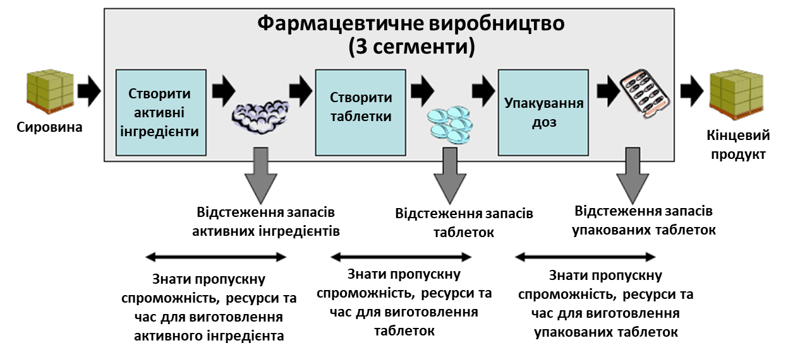

рис.2.12. Приклад сегментів процесу. 

## 2.5. Представлення моделей ресурсів в стандартах

Перша частина стандартів ISA-95/IEC-62264 має описовий характер та надає основні терміни та означення а також загальну ідею представлення моделі. Друга частина містить табличне представлення та схеми UML (уніфікована мова моделювання у вигляді схем), які вже означують вимоги до конкретної реалізації. Специфікація B2MML - це вже конкретна реалізація представлення сутності при передачі даних між різними інформаційними системами, яка використовує мову опису даних XML. 

Хоч даний курс не передбачає діяльності щодо розроблення частини інформаційного забезпечення що відповідає за обмін, для кращого розуміння наведемо приклад означення таблиць та схем в стандарті на прикладі сегменту процесу.

На рис.2.13 показана дещо спрощена модель сегменту процесу у форматі UML. Як видно зі схеми Сегмент процесу може складатися (позначення ромбом) з інших сегментів процесу, що дає можливість представляти виробничі можливості ієрархічним способом. Також сегменти процесу можуть залежати один від одного. Наприклад, залежність сегмента процесу може визначати, що сегмент `тестування` повинен слідувати за сегментом `збірки`. Зі схеми на рис.2.13 також видно, що сегмент процесу може включати параметри та специфікацію до ресурсів які відповідають певним моделям ресурсів.   Нижче розглянемо більш детально, як ця модель конкретизується у вигляді таблиць.

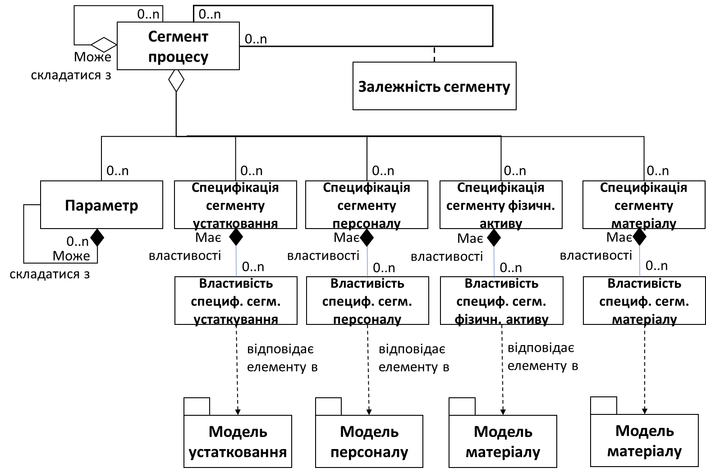

рис.2.13. Модель сегменту процесу 

У таблиці 2.1 показані атрибути Сегменту процесу.

Таб.2.1. Атрибути Сегменту процесу

| Атрибут                   | Опис                                                         | Приклад з основного виробництва                         |
| ------------------------- | ------------------------------------------------------------ | ------------------------------------------------------- |
| ID                        | Унікальна ідентифікація сегменту процесу в межах інформації, якою обмінюється для посилання на цей сегемнт | Фрезерування рам заготовок                              |
| Опис                      | Додаткова інформація про сегмент                             | Операція фрезерування рами, операція з окремою вартістю |
| Тип операції              | Описує категорію обов'язкового атрибута діяльності, тобто один з варіантів: основне виробництво, технічне обслуговування, якість, запаси або змішане. «Змішана» слід використовувати, якщо діяльність містить кілька категорій сегментів процесу. | Основне виробництво (Production)                        |
| Область ієрархії          | Означує місце обміну інформацією в рольовій ієрархії устатковання. Опційно означує область означення сегмента процесу, наприклад майданчик або цех, для яких він означений. | Південний берег (майданчик) / робоча лінія (цех)        |
| Тривалість                | Тривалість сегмента процесу, якщо відома.                    | 25                                                      |
| Одиниці виміру тривалості | Одиниці вимірювання тривалості, якщо вона означена.          | Хвилини                                                 |

Щодо специфікації розглянемо приклад на специфікації сегменту устатковання, який означує ресурси устатковання, необхідні для сегменту процесу.

Таб.2.2. Атрибути специфікації сегмента устатковання 

| Атрибут                       | Опис                                                         | Приклад з основного виробництва                           |
| ----------------------------- | ------------------------------------------------------------ | --------------------------------------------------------- |
| Клас устатковання             | Ідентифікує відповідний клас устатковання або набір класів можливостей устатковання. | (не застосовується)                                       |
| Устатковання                  | Ідентифікує пов’язане устатковання або набір можливостей устатковання . | Фрезерний верстат 001                                     |
| Опис                          | Містить додаткову інформацію та описи.                       | Устатковання, необхідне для сегменту процесу фрезерування |
| Використання устатковання     | Означує очікуване використання класу устатковання або устатковання в контексті сегменту процесу. | Фрезерування деталей                                      |
| Кількість                     | Вказує кількість необхідних ресурсів, якщо це застосовно.    | 1,3                                                       |
| Одиниця вимірювання кількості | Одиниця вимірювання відповідної кількості, якщо застосовно.  | Машино-годин / шт                                         |

 \* Зазвичай означується або клас устатковання або устатковання.

Конкретні властивості, необхідні для специфікацій сегмента устатковання, мають бути представлені як показано в таб.2.3. Ці властивості у свою чергу можуть складатися з інших властивостей.

Таб.2.3. Атрибути властивості специфікації сегмента устатковання

| Атрибут                       | Опис                                                         | Приклад з основного виробництва                              |
| ----------------------------- | ------------------------------------------------------------ | ------------------------------------------------------------ |
| ID                            | Ідентифікація властивості пов’язаного устатковання або класу устатковання. | Напрям фрезерування                                          |
| Опис                          | Містить додаткову інформацію та описи.                       | Для фрезерування заготівок підходять тільки вертикальні фрезерні верстати. |
| Значення                      | Значення, набір значень або діапазон властивості. Наприклад: Вертикально, Горизонтально | Вертикальний                                                 |
| Одиниця вимірювання значення  | Одиниця вимірювання значення пов’язаної властивості, якщо застосовно. | (не застосовно)                                              |
| Кількість                     | Вказує кількість необхідних ресурсів.                        | 1,0                                                          |
| Одиниця вимірювання кількості | Одиниця вимірювання відповідної кількості, якщо застосовно.  | Машино-годин / шт                                            |

Конкретні параметри, необхідні для сегменту процесу, повинні бути представлені як наведено в таблиці 2.4.  Параметри сегмента процесу можуть містити вкладені параметри сегмента процесу.

Таб.2.4. Атрибути параметра сегмента процесу

| Атрибут                      | Опис                                                    | Приклад з основного виробництва        |
| ---------------------------- | ------------------------------------------------------- | -------------------------------------- |
| ID                           | Ідентифікатор параметра сегмента процесу                | Час фрезерування                       |
| Опис                         | Містить додаткову інформацію.                           | Діапазон допустимого часу фрезерування |
| Значення                     | Значення, набір значень або діапазон прийнятних значень | {5..10}                                |
| Одиниця вимірювання значення | Одиниця вимірювання значень, якщо застосовно.           | Хвилини                                |

Як вже зазначалося вище залежності процесу, які не залежать від будь-якого конкретного продукту чи операційного завдання, повинні бути представлені як залежності сегменту процесу (див.рис.2.13).  У таблиці 2.5 означені атрибути для об’єктів залежності сегмента процесу.

Таб.2.5. Атрибути залежності сегмента процесу

| Атрибут             | Опис                                                         | Приклад з основного виробництва                              |
| ------------------- | ------------------------------------------------------------ | ------------------------------------------------------------ |
| ID                  | Ідентифікатор унікального екземпляра залежності сегменту процесу. | PSD001                                                       |
| Опис                | Містить додаткову інформацію та опис означення залежності сегменту процесу. | Означує впорядкування процесів складання в сегменті процесу складання деталей |
| Тип залежності      | Означує обмеження в залежності виконання одного сегмента іншим сегментом | Почати `Очищення` не раніше, ніж `T` (*Часовий фактор*) після завершення `Роботи` |
| Фактор залежності   | Фактор, який використовує залежність                         | 25                                                           |
| Одиниця вимірювання | Одиниці вимірювання коефіцієнта залежності, якщо означено.   | Хвилини                                                      |

Таким чином, згідно стандартів ISA-95/IEC 62264 обмін між інформаційними системами, наприклад L4 та L3 що показаний на рис.2.4 так чи інакше буде представлений через певні моделі у вигляді UML-схем, таблиць та зрештою здебільшого реалізований у вигляді документів XML, якщо використовується B2MML (рис.2.14).    

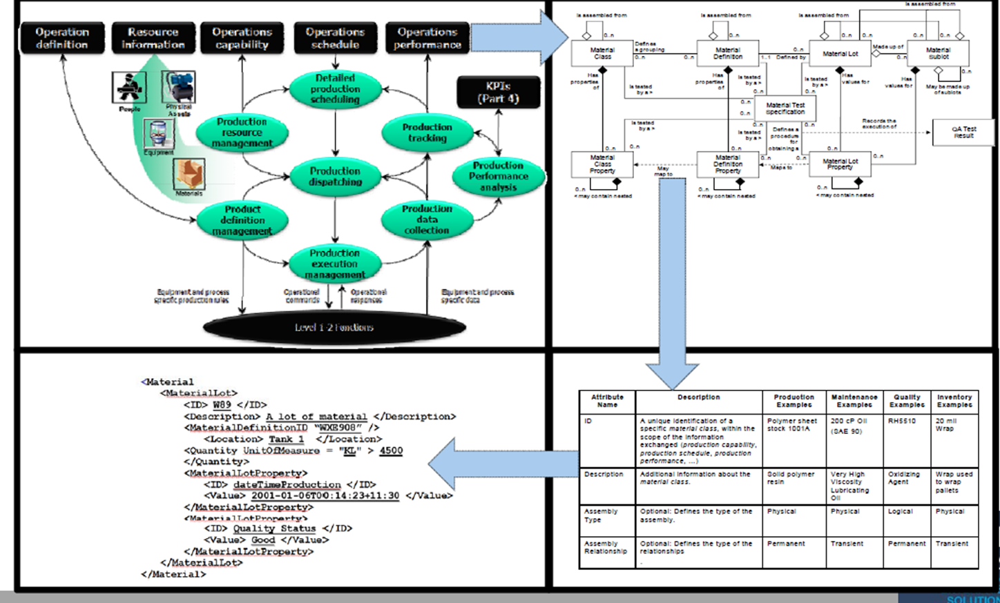

рис.2.14. Різні форми представлення моделей.

## Контрольні питання

1. Розкажіть про місце різних стандартів інтегрування у ієрархічній моделі керування промисловим підприємством. 
2. Розкажіть про розділення між типами виробничих процесів в стандартах інтегрування.
3. Розкажіть про основну ідею, яка лежить в стандартах інтегрування. Поясніть, що в термінах цих стандартів значить слово "модель".
4. Розкажіть про функціональну модель керування виробничим підприємством в стандартах ISA-95/IEC-62264.
5. Назвіть категорії операцій, які виділені в стандартах ISA-95/IEC-62264 та розкажіть про їх призначення.
6. Розкажіть про обмін між рівнями керування на прикладі категорії керування операціями основного виробництва.
7. Які виробничі ресурси представленні в стандартах ISA-95/IEC-62264? Для чого вони використовуються?
8. Розкажіть про моделі устатковання та активів. Чим вони відрізняються?
9. Розкажіть про ієрархію устатковання. 
10. Розкажіть про модель матеріалів.
11. Розкажіть про модель персоналу.
12. Розкажіть про призначення сегментів процесу.
13. Розкажіть про способи представлення моделей в стандартах на прикладі моделі сегменту процесу.
