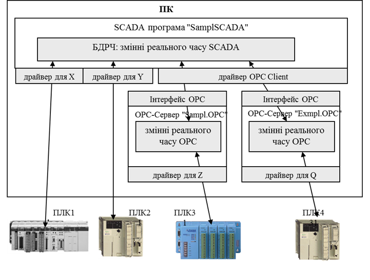

[2 <--](2.md)   [Зміст](README.md)    [--> 4](4.md)

# 3. Функціональна та технічна структура MOM

## 3.1. Функціональна структура MOM

У попередній лекції була наведена функціональна модель керування виробничим підприємством, де частина функцій відноситься до рівня MOM та групуються принаймні в чотири категорії операцій (див.рис.2.3):

- операції по виготовленню продукції (Production), основне виробництво;
- операції керування запасами (Inventory);
- операції по контролю якості (Quality);
- операції по технічному обслуговуванню (Maintenance);
- інші операції


Рис 2.3. Спрощена функціональна модель з об'єднаними функціями

Це розділення має кілька причин. По-перше, цими операціями як правило займаються різні служби на підприємстві, які мають свою внутрішню організацію, планування робіт, звітність і т.д. Тобто робота цих служб відбувається паралельно, але процеси звісно перетинаються, як це було показано в першій лекції.

По-друге, якщо процеси цих служб автоматизовані, то це нерідко відбувається через різні інформаційні системи, які традиційно зайняли певну нішу. Наприклад:

- основне виробництво (Production) - MES, 
- операції керування запасами (Inventory) - WMS
- операції по контролю якості (Quality) - LIMS, QMS
- операції по технічному обслуговуванню (Maintenance) - EAM, ТОіР (технологічне обслуговування і ремонт)

По-третє, як буде зазначено нижче, активності в межах цих категорій мають одну і ту саму природу. Наприклад операції в усіх категоріях передбачають планування, диспетчеризацію робіт та виконання робіт.

На конкретному виробничому підприємстві може бути по різному представлена реалізація кожної з категорій, наприклад:

- всі або кілька категорій операцій рівня L3 реалізовані в одній інформаційній системі
- кожна окрема категорія L3 представлена своєю інформаційною системою (як зазначено вище) або кількома 
- частина функцій L3 реалізовані інформаційними системами рівня L4, частина системами керування L2
- змішана система    

Стандарти ISA-95/IEC-62264 не ставить вимог щодо структури реалізації рівня L3 або інших рівнів керування. Навпаки, він призначений для спрощення інтегрування всіх інформаційних систем, але передбачає, що це інтегрування відбувається через моделі сутностей, які означені в стандарті. Таким чином усі ці системи будуть спілкуватися однією мовою в термінах цих моделей. Тому, навіть якщо певна інформаційна система виконує автоматизацію функцій з кількох категорій операцій, а автоматизація частини інших функцій реалізовані в іншій інформаційній системі, то стандарт полегшує їх взаємодію.          

Якщо інформаційна система може виконувати кілька функцій, нерідко вона будується за модульним принципом. Модульний принцип дає можливість вибирати для виконання конкретних завдань конкретний набір модулів. Тому для конкретного проекту може використовуватися тільки потрібний в даний момент функціонал, а впровадження системи стає простіше. Крім того модулі можуть виконуватися на різних обчислювальних ресурсах, таким чином надавати можливість оптимізувати використання ресурсів в залежності від потреб.  

Розглянемо це на прикладі MOM системи Momentum від BrightEye. У ній повністю реалізовані усі функції керування основним виробництвом і це є частиною базового набору модулів. Функції керування виробничими запасами реалізовуються через модуль окремий модуль WMS, керування операціями по контролю якості - модулем Quality Management. При цьому в Momentum наразі не реалізований модель керування операціями технічного обслуговування.           

## 3.2. Технічна структура MOM

Інформаційні системи рівня MOM можуть бути реалізовані за дуже різним принципом. У цьому розділі наводяться тільки приклади. У будь якому випадку варто виділити основні компоненти, які так чи інакше мають бути представлені в реалізації:

- Виконавчі служби інформаційної системи. Це певний набір програм, які виконують покладені на них функції. Саме вони реалізовують активності, які будуть наведені в наступних лекціях. Якщо ці служби потребують значних ресурсів або мають інтегруватися з зовнішніми службами, то вони можуть бути реалізовані як окремі процеси, що надають доступ до своїх функцій через API (Application Program Interface). У такому випадку служби можуть взаємодіяти між собою, з клієнтськими застосунками або з сторонніми службами навіть якщо вони запущені на іншому пристрої. 
- Клієнтські застосунки. Це певний набір програм, які забезпечують людино-машинний інтерфейс взаємодії з системою користувача. До користувачів системи можуть відноситися будь-який виробничий персонал, тому вимоги до клієнтських застосунків можуть бути дуже різними. Враховуючи це, може надаватися кілька варіантів застосунків а також Веб-інтерфейс до Веб-серверу.
- Веб-сервер. Для роботи з Веб-клієнтами (браузерами) може бути виділено окрему службу - веб-сервер, який у свою чергу взаємодіє з іншими службами для надання доступу користувачів до необхідних функцій.   
- База даних з конфігураційними даними. Тут зберігається інформація про конфігурацію системи. Якщо виконавчі служби є умовно незмінною частиною інформаційної системи, які розробляються програмістами постачальника цієї системи, то база даних наповнюється конфігурацією для конкретного об'єкта. Наприклад це означення ресурсів (устатковання, персоналу, сегментів процесу) або означення продукту. Внесення змін в конфігурацію відбувається тоді, коли змінюється означення певного ресурсу або активності.    
- База даних з операційними даними. На відміну від бази конфігураційних даних тут зберігається вся інформація, що стосується роботи служб, наприклад переміщення сировини, реєстрація плинних значень параметрів, повідомлення, тощо.
- Мережні служби для роботи з периферією. Це можуть бути окремо виділені служби для взаємодії із зовнішніми пристроями.  
- Служби скриптів. Це служби та файли для виконання користувацьких скриптів.      

Розглянемо технічну структуру на прикладі MOM системи Momentum від BrightEye. Вона базується на клієнт-серверній структурі, де є кілька служб-серверів, що відповідають за різні функції (рис.3.1):

- DataCenter - взаємодія з пристроями рівня АСКТП (ПЛК, SCADA, тощо)
- MES - реалізовує основні функції керування виробничими операціями;
- WMS - реалізовує функції модуля керування запасами;  
- LMS (Labeling Management Server) - реалізовує функції генерування та друкування етикеток; 
- DMS (Data Mining Server) - реалізовує функції збереження даних;         


рис.3.1. Технічна структура MOM на прикладі Momentum

Сервери взаємодіють з іншими підсистемами, наприклад  DataCenter обмінюється даними реального часу з ПЛК через різноманітні драйвери (як правило OPC та OPC UA), LMS з принтерами етикеток, DMS з системою керування базами даних (СКБД). Уся конфігураційна та плинна інформація зберігається в базах даних на MS SQL Server. 

Клієнтські застосунки взаємодіють з серверами для конфігурування та керування. Основним клієнтським застосунком є `Shell`, який надає можливість як конфігурувати систему так і проводити операційну діяльність. Також є можливість підключення через "тонкі" Веб-клієнти для виконання певних функцій. До серверів також можуть доступатися системи рівня ERP, наприклад SAP.       

## 3.3. Використання OPC для підключення даних    

### Про OPC

Нині OPC є найпоширенішими стандартами по інтегрування застосунків в області промислової автоматизації. Своє найбільше використання він знайшов в інтегруванні між собою SCADA/HMI-програм та засобів автоматизації рівня L1. Однак сьогодні нова версія OPC UA все частіше використовується для інтегрування будь яких засобів в промисловій автоматизації.   

Розглянемо OPC в історичному контексті його використання в SCADA. При інтеграції продуктів одного виробника наявність в SCADA-програмі драйверів зв’язку з необхідними контролерами є очевидною. Складнішим є випадок, коли необхідно інтегрувати засоби від декількох виробників, ряд з яких підтримують закриті протоколи. У цій ситуації важко підібрати таку SCADA-програму, яка підтримувала б усі необхідні протоколи промислових мереж. Для подолання цієї проблеми кілька великих компаній вирішила створити стандартний інтерфейс доступу до даних "драйвера" зі сторони програмного забезпечення верхнього рівня. Таким чином, будь-який драйвер зі стандартним інтерфейсом може бути використаний будь-якою SCADA-програмою, яка цей інтерфейс підтримує. Технологія отримала назву ***ОРС***. 

Першу версію стандарту OPC (OPC DA 1.0) розробила група компаній, які в 1996 р. організували некомерційну організацію ***OPC*** ***Foundation*** ([www.opcfoundation.org](http://www.opcfoundation.org/)), що займається розвитком та просуванням цієї технології на ринку.  Стандарти OPC Foundation існують у наборі декількох специфікацій. Серед них найбільшу популярність на сьогоднішній день мають OPC DA, які стандартизують доступ однієї програми до даних реального часу іншої програми, та OPC UA, які стандартизують доступ до даних і сервісів різного призначення. 

Специфікації ***OPC DA*** (OPC Data Access) ґрунтуються на технологіях, що можуть застосовуватися тільки на програмних платформах Windows і мають ряд суттєвих обмежень. Абревіатура OPC на момент створення стандартів розшифровувалася як "OLE for Process Control", що означало використання стандартів OLE (Object Linking and Embedding), яка, по суті, представляла COM (Component Object Model), для керування технологічними процесами. Тепер використання технологій COM не рекомендується, особливо для розподілених застосунків, тому технологія OPC DA, очевидно, з часом не буде використовуватися. Тим не менше, зараз вона досить популярна. 

Специфікації ***OPC UA*** (OPC Unified Architecture) є більш сучасними. Вони гуртуються на обміні різноманітними даними (реального часу, історичними, тривогами), використовуючи відкриті WEB-технології. Відхід від технологій COM відобразився і в абревіатурі, яка звучить як "Open Platform Communications". Технологія OPC UA є більш універсальною і може бути використана для взаємодії між програмними елементами, які виконуються на різних платформах. Крім того, специфікації OPC UA стандартизовані в IEC 62541. 

Слід сказати, що, крім OPC DA, старі специфікації OPC (що ґрунтуються на технології COM) включали ряд інших:

- OPC DA 1.0, 2.0, 3.0 (Data Access) – три версії специфікацій доступу до даних реального часу;

- OPC AE (Alarms & Events) – для реалізації завдань тривожної сигналізації та подій;

- OPC HDA (Historical Data Access) – для реалізації завдань ведення архіву та доступу до архівних даних;

- OPC DX (Data eXchange) – для безпосереднього обміну між ОРС-серверами;

- OPC XML – для обміну даними через пов’язані мережі за допомогою структур XML на базі WEB-сервісів та SOAP;

- OPC Batсh – для реалізації керування рецептурними завданнями.

### OPC DA

У загальному випадку, технологія ОРС забезпечує одній програмі (ОРС-клієнту) доступ до даних процесу іншої програми (ОРС-сервера) через стандартний набір інтерфейсів. Найбільш часто ОРС-технологія використовується як універсальний інтерфейс до драйверів контролерів та периферійних пристроїв. Тобто разом з контролером, або за окремим замовленням, може поставлятися спеціальна програма - ОРС-сервер, яка надає стандартизований доступ до змінних цього типу контролеру. Тобто ОРС-сервер, з одного боку, має драйвери для зв’язку з контролерами за конкретними протоколами промислових мереж, а з іншого – надає універсальний ОРС-інтерфейс для зв’язку із сервером SCADA-програми або іншим застосунком, у тому числі рівня MOM. У такій системі SCADA-програма (або MES/MOM система) буде ОРС-клієнтом. 

На рис.3.2 показано спрощену схему функціонування роботи ОРС-технології в контексті описаної системи.

       

рис.3.2. Функціонування ОРС з точки зору інтегратора

База даних реального часу SCADA-програми (з умовною назвою "SamplSCADA") збирає дані з чотирьох джерел: ПЛК1, ПЛК2, ПЛК3 та ПЛК4. Для перших двох контролерів для збирання даних використовуються драйвери зв’язку для цих ПЛК, вірніше – для протоколів промислових мереж, по яких вони з’єднуються. Дані зчитуються (або записуються) з ПЛК в БДРЧ. Зв’язок з ПЛК3 та ПЛК4 виконується через ОРС-сервери з умовними назвами відповідно "Sampl.OPC" та "Exmpl.OPC" з використанням драйвера ОРС-клієнт. Тобто ОРС-сервери через вбудовані драйвери зчитують дані з ПЛК та зберігають їх у своїй базі даних реального часу. SCADA-програма, в свою чергу, зчитує дані з ОРС-серверів. Запис даних відбувається аналогічно.

Таким чином, для реалізації такого зв’язку в SCADA-програмі користувач повинен: 

1) Налаштувати OPC-сервер за допомогою спеціалізованої програми-конфігуратора, що поставляється разом з ним: створити всі необхідні змінні серверу, тобто дати їм ім’я (ItemID) та вказати джерела даних в ПЛК, на які вони посилаються. 

2) У SCADA-програмі (або MOM) вказати:

- назву ОРС-сервера, з яким необхідно зв’язатися (ProgID); у наведеному прикладі це будуть два сервери – "Sampl.OPC" та "Exmpl.OPC"; інколи SCADA надає можливість вибору ProgID зі списку зареєстрованих ОРС-серверів; 

- для вибраної змінної в якості джерела даних вказати ім’я на ОРС-сервері, тобто ItemID, що був створений на 1-му кроці; як правило ItemID вибирається зі списку, який надає Browser на стороні ОРС-клієнта. 

Технологія ОРС DA ґрунтується на клієнт-серверній архітектурі. ОРС-клієнт користується послугами ОРС-сервера, використовуючи СОМ-інтерфейси його об’єктів. У наведеному на рис. 3.3 прикладі *ОРС-клієнтом* є SCADA-програма, завданням якої є відображення чотирьох змінних (%MW100-%MW103), які знаходяться на ПЛК. OPC-сервер отримує необхідні дані через драйвери зв’язку і зберігає їх у своїй базі даних реального часу. Для того щоб доступитися до даних ОРС-сервера, ОРС-клієнт створює для себе ОРС-Group (Group1, Group2), в яких створює ОРС Item (Item1, Item2), що посилаються на ці дані.
<a href="media/4_22.png" target="_blank"></a> 

*Рис. 3.3.* Модель сервера та адресний простір OPC DA

***ОРС-клієнт* (*OPC Client*)** – прикладна програма, яка вміє користуватися об’єктами OPC-сервера за допомогою ОРС-інтерфейсів (підмножина СОМ-інтерфейсів). ***ОРС-сервер* (*OPC Server*)** – прикладна програма, яка надає доступ до визначених у специфікації ОРС СОМ-об’єктів за допомогою ОРС-інтерфейсів.

З одним ОРС-сервером можуть з’єднатися декілька ОРС-клієнтів. З іншого боку, одна й та сама програма ОРС-клієнт може одночасно користуватися послугами декількох ОРС-серверів. Тобто технологія ОРС є мультиклієнтною і мультисерверною. 

Оскільки ОРС-сервер – це СОМ-сервер, він реєструється на комп’ютері унікальним числовим ідентифікатором (GUID) та має строковий програмний ідентифікатор (***ProgID***). Тобто для того щоб для ОРС-клієнта означити, з яким ОРС-сервером на тому самому ПК йому необхідно з’єднатися, достатньо вказати його ProgID. 

Об’єкт ***ОРС-Item*** надає доступ до джерела даних (надалі – ***тег***) в межах ОРС-сервера, яке ідентифікується унікальним у межах сервера ідентифікатором ***ItemID***. Тому при створенні ОРС-Item’а вказується ItemID необхідного тега. Правила ідентифікації даних залежать від реалізації ОРС-сервера, а механізм означення їх джерел (наприклад, адреса пристрою та змінної в ПЛК) найчастіше реалізується в конфігураторі цього сервера. 

Увесь список ItemID може мати плоску або деревовидну ієрархічну структуру, завдяки чому зручніше використовувати цей механізм у проектах з великою кількістю даних. Для навігації по списку/дереву ідентифікаторів ОРС-сервер, як правило, має об’єкт ***OPC*** ***Browser***. 

ОРС-Item належить клієнту, який його створив, і тому його не можуть використовувати декілька клієнтів. Тим не менше, є можливість посилатися на одні й ті самі дані. На рис.7.2 два клієнти одночасно використовують дані з %MW100 та %MW102, однак створюють для цього різні OPC-Item. Джерелом даних не обов’язково є змінна на зовнішньому пристрої, це можуть бути внутрішні дані самого сервера. 

З кожним ОРС-Item'ом асоціюється плинне значення (***Value***), відмітка часу (***Time Stamp***) та якість (***Quality***). Таким чином, OPC-сервер не тільки повідомляє про значення змінної, а й указує на їхню свіжість та достовірність. 

***OPC-Group*** – об’єкт ОРС-сервера, який призначений для виконання групових операцій над ОРС-Item’ами. Оскільки ОРС-Item не може існувати без цього об’єкта, спочатку ОРС-клієнт створює ОРС-Group, а потім у його межах створює ОРС-Item’и.  

В інтерфейсі OPC DA 2.0 кожний ОРС-Group, як і все його наповнення, належить окремому ОРС-клієнту. Механізм групування дає змогу розділяти дані за принципом читання/записування, періодичністю операцій та активувати/деактивувати відновлення змінних. 

### Робота з сервером ОРС DA в мережі

ОРС-клієнт та ОРС-сервер на одному й тому самому ПК запускаються як окремі процеси. Обмін даними між цими процесами відбувається за правилами СОМ-технології. У мережних архітектурах може виникати необхідність з’єднати ОРС-клієнта з віддаленим ОРС-сервером, який знаходиться в мережі на іншому ПК. Для такого з’єднання використовуються сервіси DCOM.

На рис. 3.4 наведено приклад, у якому ОРС-клієнт (MES/MOM) на ПК1 з’єднується з локальним ОРС-сервером (OPCServer1) та двома віддаленими (OPCServer2 на ПК2 та OPCServer3 на ПК3). Для реалізації такого з’єднання для ОРС-клієнта, окрім ProgID, необхідно вказати розміщення ПК з ОРС-сервером, а також правильно налаштувати DCOM-конфігуратор. Таким чином, необхідно виконати таку послідовність:

1) налаштувати DCOM Конфігуратор на вузлі сервера та клієнта;

2) вказати Server Node (Ім’я вузла з ОРС-сервером) або його IP;

3) вказати ProgID сервера. 


 

Рис. 3.4. Робота з віддаленим сервером ОРС 

Однак зв’язатися з віддаленим ОРС за допомогою ОРС DA можливо тільки у випадку, якщо вузли знаходяться в межах одного домену або робочої групи Windows та не розмежовуються брандмауерами. Останні можуть не пропустити пакети СОМ (порти RPC, як правило, закриті для доступу), тому для з’єднання через Інтернет необхідно вдаватися до певних прийомів. Щоб вирішити цю проблему, OPC Foundation пропонує технології OPC XML та OPC UA.

У прикладах, наведених вище, розглянуто технологію ОРС-DA в контексті вирішення проблеми доступу до даних ПЛК зі SCADA або системи MOM. Тобто ОРС-сервер розглядався як стандартний драйвер зв’язку.  На рис. 3.5 показано приклад використання інтерфейсів ОРС як „мосту” між двома прикладними програмами на різних ПК. При горизонтальній інтеграції може знадобитися об’єднання в єдиний інформаційний простір SCADA-програм. При вертикальній інтеграції існування в SCADA серверного інтерфейсу OPC дає можливість доступитись до її даних зі сторони прикладних програм рівня MES/MOM чи ERP. Офісні програми завдяки наявності VBA та ActiveX теж надають таку можливість. Наявність в SCADA OPC UA сервера збільшує можливості інтеграції.  У OPC UA розроблено шлях міграції для клієнтів і серверів OPC, що базуються на технології Microsoft COM (наприклад OPC DA). При розробленні OPC UA було зроблено певні кроки для того, щоб існуючі дані, які виставлялися на серверах OPC COM (DA, HDA та A&E), могли бути легко відображені та розкриті через OPC UA. Постачальники можуть вибирати міграцію своїх продуктів на OPC UA або використовувати обгортки для перетворення з OPC COM в OPC UA, і навпаки. Кожна з попередніх специфікацій OPC визначила власну модель адресного простору та власний набір послуг. OPC UA об'єднує попередні моделі в єдиний інтегрований адресний простір з єдиним набором сервісів.

 

Рис. 3.5. Приклад використання ОРС як „мосту”

###  OPC UA

***OPC UA (OPC Unified Architecture)*** - це незалежний від платформи стандарт, який дозволяє обмінюватися виробничими даними між різними типами застосунків та користуватися їх сервісами. Принциповою відмінністю в OPC UA від своїх попередників є використання іншого стеку протоколів, що дало можливість:

- відв’язатися від залежності MS Windows;
- реалізовувати застосунки на різних типах пристроїв, а не тільки ПК;
- реалізовувати зв'язок на різних типах мереж в т.ч. через Інтернет;
- будувати захищені з’єднання між застосунками;
- використовувати механізми обміну шляхом публікацій і підписки; 

OPC UA може функціонувати з використанням різних комунікаційних протоколів, при цьому дані можуть бути закодовані різними способами (рис.3.6). Означено кілька протоколів, які можна використовувати:

- OPC UA TCP
- HTTPS
- WebSockets

Визначено три способи кодування даних: XML/text, UA Binary, JSON

       

рис.3.6. Комунікаційна архітектура OPC UA

OPC UA так само як OPC DA має клієнт-серверну модель функціонування, в якій Сервери можуть надавати різні набори ***Сервісів (Services***). Під час підключення Сервер повідомляє клієнту, які з сервісів він підтримує. Обмін інформацією відбувається з використанням типів даних, означених як в стандартах OPC UA, так і постачальниками. 

### Об'єкти та вузли OPC UA

Всі дані і сервіси доступні через ***об’єкти***, які надаються клієнтському застосунку через взаємопов’язану об’єктну модель. Сервери означують об'єктні моделі, які Клієнти можуть динамічно переглянути. Через ці об’єкти Сервери можуть надати доступ як до даних реального часу, так і до історичних (Historical), Тривог(Alarms) і Подій(Events). 

Кожен об’єкт може надавати доступ до читання/запису його змінних, або до виклику методів (рис.3.7). Користувачам OPC UA не обов’язково використовувати об'єктно-орієнтовані підходи, що передбачають використання методів та подій. Як і у класичному OPC Data Access може бути побудована проста модель адресного простору, в якій використовуються об'єкти-папки та змінні. Тим не менше, наявність розширених об'єктно-орієнтованих функцій значно полегшує представлення об'єктно-орієнтованих систем за допомогою OPC UA 

 

рис.3.7.Об’єктна модель OPC UA

Об’єкти можуть посилатися на інші об’єкти через різний тип зав’язків. Взаємозв’язані об’єкти серверу доступні клієнтам через механізм організації у вигляді ***адресного простору OPC UA (Address Space***). Усі об’єкти в адресному просторі знаходяться у певній взаємозалежності, що представляється через об'єктну модель OPC UA.  Для визначення взаємозв'язків між об'єктами та їх складових може використовуватися Сервіс перегляду. Елементи об’єктної моделі (об’єкти та їх складові) представлені в адресному просторі як ***Вузли (Node***). Кожен вузол представляє певний клас вузлів (тип елементів об’єктної моделі), такий як об'єкт, змінна (Змінна Даних або Властивість) або Метод і т.п. (див. рис. 3.8).

 

рис.3.8. Приклад перегляду адресного простору серверу OPC UA  

***Класи вузлів (Node Classes)*** означують набір атрибутів та типів посилань для різних вузлів. OPC UA описує вісім класів вузлів (див. рис.3.9): 

- Object (Об’єкт) - використовується для представлення системних об’єктів, складових системи, об'єктів реального світу та програмних об'єктів (аналогія екземплярів в ООП);

- Variable (Змінна) - використовуються для представлення значень (вмісту) об’єкта 

- Method (Метод) - використовується для представлення методу в адресному просторі сервера;

- View (Представлення) - використовується для обмеження кількості видимих вузлів і посилань у великому адресному просторі; 

- ObjectType (Тип Об’єкту) - використовується для представлення у просторі типів об'єктів на які посилаються вузли-об’єкти (аналогія класів в ООП); 

- VariableType (Тип Змінної) – використовуються для означення Властивостей, доступних для екземпляра Змінної;

- ReferenceType (Тип Посилання) - використовується для представлення типу посилання, що використовуються сервером;

- DataType (Тип Даних)


Кожен вузол адресного простору є екземпляром одного з цих класів вузлів. Клієнтам і серверам не дозволяється означувати додаткові класи вузлів або розширювати означення цих класів (наприклад, список атрибутів для класу).

Вузли описуються атрибутами (attributes) і взаємопов'язані посиланнями (references) (див. рис.7.16).

 

рис.3.9. Вузли і Посилання 

***Атрибути (Attributes***) - це елементарні дані, що описують вузол. Клієнти можуть отримувати доступ до значень атрибутів за допомогою сервісів Читання(Read), Запису(Write), Запиту(Query) та Підписки/Контролю елементу (Subscription/Monitored Item). Атрибути є елементарними складовими класів вузлів, перелік і призначення яких описані в стандарті, тому заздалегідь відомі клієнтам і не є безпосередньо видимими в адресному просторі. Набір атрибутів, означених для кожного класу вузлів, не може бути розширений клієнтами або серверами. Кожне означення атрибуту складається з ідентифікатора атрибута (attribute id), імені(name), опису(description), типу даних (data type) і обов'язкового/необов'язкового індикатора (indicator). На рис.3.10 показаний набір атрибутів (Назва та значення) для вузла класу Variable

 

рис.3.10. Приклад набору атрибутів для вузла класу Variable 

***Посилання (References***) використовуються для зв'язку вузлів між собою. Їх можна отримати за допомогою сервісів перегляду (browsing) та запиту (querying). Подібно атрибутам, вони означуються як фундаментальні складові вузлів. На відміну від атрибутів, посилання означуються як екземпляри вузлів класу ReferenceType, які видимі в адресному просторі. Вузол, що містить посилання, називається ***вихідним вузлом (source node***), а вузол, на який посилається, називається ***цільовим вузлом (target node***). Для унікальної ідентифікації посилань в сервісах OPC UA використовується комбінація вихідного і цільового вузлів ReferenceType. Таким чином, кожен вузол може посилатися на інший вузол з тією самою ReferenceType тільки один раз. На рис.3.11 показаний приклад посилання. Цільовий вузол може знаходитися в тому ж адресному просторі або в адресному просторі іншого OPC UA сервера. Цільові вузли, розташовані на інших серверах, ідентифікуються в сервісах OPC UA з використанням комбінації імені віддаленого сервера та ідентифікатора Вузла.

 

рис.3.11. Посилання 

***Змінні (Variables***) використовуються для представлення змісту об’єктів (див.рис.3.12). Означено два типи вузлів-Змінних: Properties (Властивості) і DataVariables (Змінні Даних). Вони відрізняються різновидом даних, що представляють, та можливістю вміщувати інші змінні.

***Властивості (Properties***), подібно до атрибуту вузла, містять задані сервером метадані об'єктів, змінних даних та інших вузлів. Властивості відрізняються від атрибутів тим, що вони можуть бути означені і додані сервером і охарактеризувати те, що представляє вузол. Набір атрибутів і їх призначення є однаковим для всіх вузлів конкретного класу, тоді як властивості можуть бути означені сервером. Наприклад, властивість може використовуватися для вказівки інженерної одиниці змінних. Властивості як і інші вузли також вміщують атрибути (рис.3.12), але не можуть включати в себе інші властивості. Властивості безпосередньо видимі в адресному просторі як Вузол, тоді як атрибути не є Вузлами. Вузол (Змінна, Об’єкт) і його властивості завжди повинні знаходитися на одному сервері.

 

рис.3.12. Порівняння атрибутів і властивостей 

***Змінні Даних(Data Variables***) представляють зміст (дані) об'єкта. Нагадаємо, що об'єкт є контейнером для змінних і методів (див.рис.3.7). Оскільки вузли-об'єкти (object node) безпосередньо не надають числових значення даних, це роблять вузли-змінні. 

Змінні Даних можуть включати в себе (посилатися на) властивості або інші Змінні Даних. При включенні змінних даних формуються складені (структурні) Змінні Даних. Наприклад, об'єкт-файл використовує Змінну Даних для представлення вмісту файлу у вигляді масиву байтів. При цьому для розкриття часу створення і власника об’єкту-файлу можуть бути використані Властивості. 

Наведемо інший приклад. Функціональні блоки в системах керування можуть бути представлені як об'єкти. Параметри функціонального блоку, такі як його задані значення, можуть бути представлені у вигляді Змінних Даних. Об'єкт функціонального блоку може також мати Властивості, що описують його час виконання і тип.

### Ідентифікація вузлів в OPC UA

Класичний OPC DA Server використовує прості «символьні» ідентифікатори елементів "ItemID", який є унікальним на всьому OPC сервері. Тобто в класичному OPC існує тільки один "простір імен". Крім того, класичні сервери DA мають можливості лише простої ієрархії, тобто деревоподібної структури з гілками і листям. Таким чином, розробники для створення унікальних ItemID мають використовувати повну ієрархію папок (наприклад, `Folder1.Folder2.Folder3.MyTemperature`). Це призводить до великої кількості надлишкових рядків, втрати пам'яті та уповільнення продуктивності під час перегляду або пошуку окремих елементів. 

При розробці стандарту OPC UA ця концепція ідентифікації була відкинута. Тут кожен об'єкт в адресному просторі є вузлом. Щоб однозначно ідентифікувати Вузол, в нього є ***NodeId***, який завжди складається з трьох елементів: Namespace Index (індекс простору імен), Identifier Type (тип ідентифікатора) та Identifier (ідентифікатор).

***Namespace Index*** - Індекс, який сервер OPC UA використовує для ідентифікації URI простору імен (Уніфікований ідентифікатор ресурсів, Uniform Resource Identifier). Ідентифікатори в межах різних просторів імен можуть бути однаковими. ***URI простору імен*** ідентифікує того, хто(що) є автором імен в його межах (подібно до XML). Такими URI можуть бути наприклад «OPC Foundation», інші стандартні органи та консорціуми, або локальний сервер. Ці URI зберігаються в так званому масиві імен (також називається таблицею імен), індекси яких і використовуються для ідентифікації просторів імен. 

Таким чином унікальність імен досягається тим, що в них є свої простори, які також є унікальними і означуються ідентифікаторами URI. Щоб посилатися не на довгі і незручні URI, у кожному сервері є таблиця цих імен, індекси (NamespaceIndex) якої можна використовувати для посилання. На рис.3.13 показані URI на сервері та їх індекси .  

 

рис.3.13. Приклади URI просторів імен серверу UACppServer

***Identifier Type*** - формат і тип даних ідентифікатора. Це може бути числове значення, рядок, глобальний унікальний ідентифікатор (GUID) або непрозоре значення (специфічний формат простору імен у форматі ByteString). Простір імен OPC UA, як означено в OPC Foundation, використовує числові NodeIds. Загальносистемні та глобальні унікальні ідентифікатори дозволяють клієнтам відстежувати вузли, що переміщуються між серверами OPC UA, що буває у випадку, коли, наприклад, робочі замовлення просуваються по ланцюжку доданої вартості.

***Identifier*** - ідентифікатор вузла в адресному просторі сервера OPC UA.

Наступне зображення показує приклади для NodeIds, що мають різні типи ідентифікаторів.

 

рис.3.14.Приклади різних типів NodeIds

Існує XML-нотація, означена за допомогою схеми XML OPC UA, яка представляє повний кваліфікатор NodeId з використанням наведених вище елементів. Формат рядка:

```xml
ns=<namespaceIndex>;<identifiertype>=<identifier>
```

де `<namespace index> `- Індекс простору імен, відформатований в 10-ковій формі. Якщо індекс дорівнює 0, то "ns = 0;".

`<identifier type>`  - прапорець, який вказує на тип ідентифікатора:

`i` - NUMERIC (UInteger) 

`s` - STRING (String) 

`g` - GUID (Guid) 

`b` - OPAQUE (ByteString)

`<identifier>` - ідентифікатор, закодований як string. Ідентифікатор форматується за допомогою відображення типу даних XML для типу ідентифікатора. Зауважте, що ідентифікатор може містити будь-який ненульовий символ UTF8, включаючи пробіл. Посилатися таб. 3.1.

Таб.3.1. Приклади ідентифікаторів NodeID

| **NodeID**                                  | **Пояснення**                                    |
| ------------------------------------------- | ------------------------------------------------ |
| ns=2;s=MyTemperature                        | namespace index 2, string identifier             |
| i=2045                                      | namespace index 0, numeric  identifier           |
| ns=1;g=09087e75-8e5e-499b-954f-f2a9603db28a | namespace index 1, GUID  identifier              |
| ns=1;b=M/RbKBsRVkePCePcx24oRA==             | namespace index 1,  Opaque/ByteString identifier |

Частина ідентифікатора NodeId однозначно ідентифікує вузол у просторі імен, але можливо, що один і той самий ідентифікатор використовується в різних просторах імен для різних вузлів. 

Оскільки у сервісах OPC UA замість довгого URI використовується індекс простору імен, клієнт повинен подбати про правильне відображення URI у індекс. Поки існує активний сеанс, серверам не дозволяється змінювати індекс для конкретного URI або видаляти записи з таблиці просторів імен, щоб для активного сеансу клієнти могли кешувати таблицю простору імен. Але якщо клієнт не підключений до сервера він може змінювати індекси і видаляти записи з таблиці просторів імен. З цієї причини клієнт не повинен зберігати індекс без зберігання URI, оскільки протягом наступного сеансу він може отримати інший індекс. Таким чином, при встановленні сеансу з сервером, клієнт завжди повинен читати таблицю простору імен сервера та оновити індекси простору імен.

Розглянемо це на прикладі (див.рис.3.15). Клієнт бажає прочитати дані з Вузлу, представленого ідентифікатором `MyTemperature`, який належить до простору імен, означеним URI `urn:MyCompany:UaServer:Model2`. Клієнт зберігає власну таблицю просторів імен, що містить потрібні URI, щоб створити повністю кваліфікований NodeIds, але ще не знає відповідного індексу простору імен у таблиці імен сервера. 

 

рис.3.15. Читання і збереження таблиці простору імен

Для того, щоб мати доступ до правильного вузла, клієнт повинен спочатку прочитати таблицю простору імен сервера. URI простору імен `urn:MyCompany:UaServer:Model2` представлений індексом простору імен `3` на сервері. Тепер клієнт може оновлювати індекси простору імен у своїй таблиці простору імен, тобто індекс `2` індексом `3`, і для доступу до правильного node використати адресу у форматі XML `ns=3;s=MyTemperature`.

Якби клієнт не оновив індекси в таблиці простору імен, могла б виникнути наступна ситуація. Оскільки допускається, що простір імен, ідентифікований іншим URI, наприклад   `urn:MyCompany:UaServer:Model1`, також може містити вузол, що має ідентифікатор `MyTemperature`, клієнт може навіть не помітити, що він звернувся до неправильного вузла при читанні `ns=2;s=MyTemperature`.

Для оновлення даних на клієнті технологія OPC UA надає функціональність ***підписки*** (***Subscription***). Клієнт OPC UA може підписатися на вибрані вузли і казати серверу стежити за цими елементами. Таким чином сервер повідомлятиме клієнта тільки про якісь зміни значень або стану. Цей механізм значно зменшує обсяг переданих даних. Окрім зменшення завантаження на мережу, цей механізм надає додаткові переваги і є рекомендованим механізмом «зчитування» інформації з OPC UA серверу.

Існує три різні типи "змін", на які може підписатися Клієнт, додаючи Контрольовані Елементи до Підписки:

- підписатися на зміну значень змінних (атрибут Value змінної);

- підписатися на події об'єктів (атрибут EventNotifier об'єкта та набору фільтрів подій);

- підписатися на агреговані значення, які обчислюються у означених клієнтом часових інтервалах, на основі поточних змінних значень.


Налаштування, доступні для Контрольованих Елементів (Monitored Items) та Підписки (Subscription), наведені на рисунку 3.16.

 

рис.3.16. Налаштування Контрольованих Елементів (Monitored Items) та Підписки (Subscription)

***Інтервал вибірки (sampling interval***) означує часовий інтервал індивідуально для кожного Контрольованого Елементу в підписці. Це період, з якою сервер перевіряє джерело даних на зміни. Вибірка може проводитися набагато частіше, ніж Клієнту відправлятиметься повідомлення. У цьому випадку Сервер може записувати вимірюване значення протягом певного часу в чергу, а згодом публікувати повну чергу. У випадку ***Агрегованих Контрольованих Елементів (Aggregate Monitored Items)*** інтервал вибірки означує інтервал, для якого агрегуються дані.

***Фільтри*** (***filter***) містять декілька критеріїв, за якими можна вказати, які зміни даних або події слід повідомляти а які повинні бути заблоковані (не передаватися). У випадку Агрегованих Контрольованих Елементів він також містить інтервал дискретизації необроблених даних, який означує швидкість вибірки значень з джерела даних.

UA-сервер може підтримувати запис в чергу (буфер) вимірюваних даних або подій. Розмір черги, тобто максимальне число значень, які можна поставити в чергу, можна налаштувати для кожного Контрольованого Елемента. Коли дані надходять до клієнта (при публікації) черга очищається. Кожна черга має політику відкидання (наприклад, відхилення найстаріших) у разі виникнення переповнення. 

Встановивши режим моніторингу, вибірку даних та звітність можна увімкнути або вимкнути.

Існує два параметри, які впливають на саму підписку: Publishing Interval і Publish Enabled. Після кожного ***Publishing Interval*** (***Інтервалу Публікації***) сповіщення, зібрані в черзі, доставляються клієнту в повідомленні сповіщення (Publish Response). Клієнт повинен гарантувати, що сервер отримав достатню кількість маркерів публікації (Publish Tokens = Publish Requests), так що всякий раз, коли закінчиться інтервал публікації і повідомлення буде готово до відправки, сервер використовує такий маркер і надсилає дані в межах Publish Response. У випадку, якщо нічого не повідомляється (наприклад, ніяких значень не було змінено), сервер надішле повідомлення Клієнту KeepAlive, яке є пустим Publish-повідомленням, щоб вказати, що сервер ще працює, тільки йому нічого відправляти. Надсилання повідомлення сповіщення можна ввімкнути або вимкнути, змінивши параметр ***Publish Enabled*** (Опублікування ввімкнено).

### Підключення до OPC UA

Щоб підключитися до сервера, клієнту необхідно вказати мережну адресу, протокол і параметри безпеки. Для цього OPC UA означує набір функцій виявлення. Вся інформація, необхідна для встановлення підключення клієнту до серверу, зберігається в його ***кінцевій точці (endpoint)***. Сервер може надати кілька кінцевих точок, кожна з яких містить (див. рис.3.17)

- URL кінцевої точки (протокол і адреса мережі), для різних схем використовуються схеми: 
  - opc.tcp для OPC UA TCP
  - https - для HTTPS
  - wss - для WebSockets

- політика безпеки (Security Policy, назва для набору алгоритмів безпеки та довжина ключа)
- режим захисту повідомлень (Message Security Mode, рівень безпеки для обміну повідомленнями)
- тип маркера користувача (User Token Type, типи автентифікації користувача, що підтримуються сервером)

Якщо існує декілька серверів OPC UA, для надання інформації про доступні сервери можна використовувати ***Сервер Виявлення*** *(* ***Discovery Server***), на які попередньо реєструються OPC UA Сервери. Клієнти можуть запитувати список всіх доступних серверів з Сервера Виявлення, після чого можна використовувати службу «Get Endpoints» для отримання інформації про доступні з'єднання з сервера.

 

рис.3.17. Принципи роботи Серверу Виявлення та приклад переліку кінцевих точок 

Щоб ідентифікувати себе для комунікаційних партнерів, кожен встановлений застосунок або пристрій OPC UA потребує ***Application Instance Certificate*** (***Сертифікат екземпляру застосунку***) та пов'язану пару публічних/приватних ключів. Відкритий ключ розповсюджується разом із сертифікатом. Приватний ключ повинен залишатися таємним і використовується для підписування та/або розшифровки повідомлень. Партнер зв'язку може використовувати відкритий ключ для перевірки відношення довіри, перевірки підпису повідомлень і шифрування повідомлень. Сертифікат екземпляра застосунку, включаючи публічний і приватний ключ, може бути згенерований застосунком або наданий адміністратором. Детальніше про захищений зв'язок оисано в посібнику.  

Сервер повинен надати принаймні одну кінцеву точку, до якої можуть підключатися клієнти. Клієнт використовує ***Discovery URL*** (як правило, ідентичну URL кінцевої точки) для запиту з сервера списку кінцевих точок, включаючи конфігурацію безпеки. Цей запит через сервіс GetEndpoints завжди працює без перевірки безпеки. Адреса Discovery URL зазвичай надається серверами Discovery, але може бути надана користувачем вручну.

*URL* кінцевої точки (*Endpoint* *URL)* надає основну інформацію, яку клієнти потребують для підключення до сервера, включаючи: протокол, ім'я хоста або IP-адресу, а також номер порту. Наприклад, 

```http
opc.tcp://localhost:48020
```

Для встановлення безпечного з'єднання з сервером клієнт повинен довіряти сертифікату серверу, тобто сертифікат повинен бути доданий до списку довіри. Зазвичай відкривається діалогове вікно, яке спонукає користувача переглянути сертифікат і вирішити, чи слід довіряти йому. На рис.3.18 показане діалогове вікно в тестовому OPC UA Client “UaExpert” при спробі вперше підключитися до сервера “UAServerCpp”. Він відображає вміст сертифіката серверу і дозволяє користувачеві вирішувати, чи слід довіряти сертифікату чи ні. Якщо користувач вибирає "Trust Server Certificate", він зберігається в папці, *trusted/certs* в сховищі сертифікатів PKI UaExpert.

 

рис.3.18. Приклад користувацького вікна для перегляду, прийняття або відхилення сертифікату

Довірившись сертифікату, клієнт може перевірити підпис (сигнатуру) повідомлень з сервера і зашифрувати повідомлення, що надсилаються на сервер. Після збереження кінцевих точок у списку з'єднань сервера завершується конфігурація клієнта.

### Тестові утиліти для OPC UA 

Як і для класичного OPC, для OPC UA є достатньо багато доступних безкоштовних тестових клієнтів і серверів. Враховуючи, що технологія є мульти-платформовою ці утиліти доступні не тільки для Windows і не тільки для ПК. Наявність мобільних застосунків робить її ще більш привабливою. 

Серед безкоштовних «еталонних» серверів для Windows зупинимося на UaCPPServer (OPC UA C++ Demo Server) – тестовий OPC Unified Architecture Server для операційних систем Windows, в якому імітуються дані та інформаційна модель (Standard, DI та PLCopen). Після запуску ОРС-сервера створюється тільки одне консольне вікно, в якому виводиться URL кінцевої точки (рис.3.19). Для конфігурування використовується окрема програма (UA Server Administration), в якій також можна керувати сертифікатами. На рис.3.19 видно, що стоїть опція “Accept all certificates”, що дозволяє підключатися кому завгодно з будь яким сертифікатом, також дозволено підключатися без шифрування та автентифікації. Таке налаштування зручно при тестових підключеннях, але для реальних проектів **недопустимо з точки зору кібербезпеки**! 

У демо-сервері UaCPPServer прописані користувачі та паролі з різними ролями (див.таб.3.2)

Таб.3.2. Користувачі та їх паролі наперед визначені в UaCPPServer 

| **UserId** | **GroupIds** | **UserName** | **Password** |
| ---------- | ------------ | ------------ | ------------ |
| 0          | 0            | root         | secret       |
| 1          | 1            | joe          | god          |
| 2          | 0,1,2        | john         | master       |
| 3          | 1,2          | sue          | curly        |

 

рис.3.19. Вікно Сервера OPC UA C++ Demo (UaCPPServer) та утиліти його конфігурування. 

У якості клієнта під Windows зручною є безкоштовна утиліта UaExpert – це повнофункціональний клієнт OPC UA, який може працювати з декількома профілями та функціями OPC UA. Інтерфейс містить перелік серверів проекту з вказівкою їх стану, навігатор адресного простору, вікно вибраних об’єктів, вікно атрибутів і посилань (рис.3.20). Клієнт дає можливість змінювати значення Змінних.

    

рис.3.20. Вікно UaExpert .

### Приклад використання в MOM

Розглянемо використання OPC UA в якості інтерфейсу в системі MOM на прикладі Momentum від компанії BrightEye. Комунікацією з джерелами даних в Momentum займається DataCenter. В його конфігурації добавляються необхідні підключення (рис.3.21), для яких вказується тип, серед яких є як OPC DA так і OPC UA.


рис.3.21. Вікно добавлення нового підключення в Momentum 

Далі налаштовується URL та інші властивості підключення (рис.3.22)


рис.3.22. Налаштування підключення 

Після налаштування підключення, в межах системи йде ідентифікація змінної згідно означення схеми XML OPC UA, наприклад:  

```http
DataConnection://ns=1;s=P1_A1.PAST1.TT101
```


## Контрольні питання 

1. Розкажіть про категорії операції що означені в стандартах ISA-95/ IEC-62264. За яким принципом їх розділяють?
2. Які основні складові входять до інформаційних систем класу MOM з точки зору технічної реалізації?
3. Наведіть приклад технічної реалізації MOM.
4. Розкажіть про загальні принципи побудови обміну між SCADA/HMI та іншими засобами з використанням OPC DA.
5. Яка програма називається OPC Server?
6. Яка програма називається OPC Client?
7. Чим виступає SCADA/HMI або MES/MOM програма при з’єднанні з ПЛК: OPC Client чи Server?
8. Що необхідно налаштувати в OPC DA Server для забезпечення доступу до даних через його драйвер?
9. Що необхідно налаштувати в SCADA/HMI програмі або MES/MOM для забезпечення доступу до даних OPC DA Server, до якого він намагається підключитися?
10. Як у стандарті OPC DA означені правила ідентифікації тегів?
11. Як можна дізнатися про формування ідентифікатора OPC ItemID? Покажіть це на прикладі.
12. Які основні атрибути, окрім Value, є в OPC Item? 
13. Які процедури необхідно зробити, щоб налаштувати з’єднання з віддаленим OPC сервером? 
14. У якій сфері застосовують технології OPC DA в проектах зі SCADA/HMI та застосунками рівня MES/MOM?
15. Яка принципова відмінність OPC DA від OPC UA? Які в цьому переваги?
16. Розкажіть про принципи організації адресного простору OPC UA (Address Space).
17. Які класи вузлів Ви знаєте? Яке їх призначення?
18. Що таке атрибути вузла?
19. Як організовані зв’язки між вузлами? Що таке посилання?
20. Розкажіть про призначення вузлів класу Змінні (Variables). 
21. Чим відрізняються типи вузлів класу змінних: Properties (Властивості) і DataVariables (Змінні Даних)?
22. Розкажіть, як означується ідентифікатор NodeId для вузла.
23. Що таке Namespace Index? Як URI простору імен пов'язаний з індексом?
24. Як правильно звертатися до простору імен у різних сесіях? 
25. Які IdentifierType Ви можете назвати?
26. Як представляється повний кваліфікатор NodeId в XML-нотації?
27. Розкажіть про призначення сервера виявлення (Discovery Server).
28. Розкажіть про принципи автентифікації в OPC UA.

