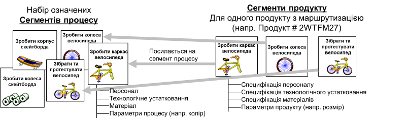
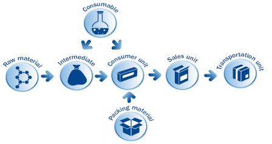

# 4. Модель керування операціями основного виробництва

## 4.1. Модель діяльності керування операціями основного виробництва

У попередніх лекціях було показано, що функції MOM згідно стандарту розділені між різними категоріями операцій. Також було сказано що кожна з категорій має певний набір діяльностей (activity), які мають однакове призначення в кожній категорії. В частинах 3 та 4 стандартів ISA-95/IEC 62264 ці діяльності розписані детально. Це дає можливість представити діяльності будь якої інформаційної системи класу MOM незалежно від її реалізації. При необхідності горизонтальної інтеграції систем класу MOM це також дає можливість забезпечити інформаційним обміном різні системи.   

На рис.4.1 показана модель керування операціями основного виробництва. Як зазначено вище, керування операціями основного виробництва – це категорія, що складається з видів діяльностей, безпосередньо пов'язаних з виготовленням продукції. Пояснимо керівні діяльності для цієї категорії операції. IEC 62264-3 означує вісім діяльностей в межах операцій основного виробництва:

- керування означенням продукту;

- керування виробничими ресурсами;

- детальне календарне планування основного виробництва;

- диспетчерування виробництва;

- керування виконанням операцій основного виробництва;

- збір даних основного виробництва;

- стеження за виробництвом;

- аналіз ефективності основного виробництва.

​                               

Рис.4.1. Модель діяльності керування операціями основного виробництва

Для прикладу, кожна із діяльностей у MOM системі Momentum означується через відповідні розділи проекту (рис.4.2). Основна частина (ядро, core) надає доступ до доступних ресурсів як для читання так і для використання. Взаємодія з рівнем АСКТП відбувається через Data Center. Модулі для реалізації усіх інших компонентів показаний на рисунку.     

Рис. 4.2. Діяльності керування в Momentum

Нижче коротко зупинимося на призначенні кожної функції в категорії керування операціями основного виробництва, а також наведемо приклади означення в MOM системі. Більш детальному опису цих функцій будуть присвячені окремі теми лекцій. 

## 4.2. Керування означенням продукту 

### Сегмент процесу та продукту

Як було зазначено, **сегмент процесу** - це об'єднання ресурсів, які показують які ресурси є на виробництві для проведення операції (-цій), наприклад виготовлення певного напівпродукту. Це устатковання, персонал які задіяні в процесі, і матеріали які зараз є в наявності а також параметри. Кожен сегмент процесу має свої власні характеристики, і для отримання прийнятних кінцевих продуктів необхідно виконувати різні операції в певному порядку. 

**Сегмент продукту** – це найбільш детальний вигляд процесу керування матеріальними ресурсами, трудовими ресурсами, використанням ресурсів, затратами та якістю з метою керування виробництвом з точки зору бізнес систем. Сегмент продукту ідентифікує, посилається або відповідає сегменту процесу. Цей взаємозв'язок проілюстрований на рисунку 4.3.

  

Рис 4.3. Відношення сегмента продукту до сегмента процесу

Сегмент продукту пов'язаний з конкретним продуктом, тоді як сегмент процесу не залежить від продукту. Сегмент процесу включає в себе певну сукупність взаємопов’язаних ресурсів (персонал, устатковання, матеріали). Сегменти продукту і процесу відображають виробничі процеси з точки зору бізнесу і не призначені для подання детального огляду, необхідного для керування виробничими операціями в межах Рівня 3.

Таким чином, сегменти продукту формують означення ланцюга послідовностей сегментів процесу для створення конкретного продукту. Ці сегменти процесу можуть, наприклад, включати в себе робочі центри, в яких буде вироблятися продукт, задіяний персонал та матеріали. 

У MOM системі Momentum є подібна до сегменту процесу сутність, яка зветься процесом. Вона означує технологічний процес, на який посилаються робочі центри та сегменти продукту. Таким чином через процес відбувається зв'язок між сегментами продуктів та робочими центрами, на яких вони можуть бути виготовлені. На рис.4.4 показаний приклад процесу `Pasteurization Milk 41` в якому зокрема налаштовуються параметри процесу, робочі центри на яких він виконується.

    

Рис 4.4. Приклад процесу в Momentum

У середовищі Momentum сегменти продуктів означуються через модуль Products (продукти). Кожен продукт означується:

- процесом, який використовується для його виготовлення
- рецептом, який означує з яких продуктів він виробляється
- енергетичні та інші витратні матеріали, які споживаються, але не входять в продукт
- пакувальні матеріали
- інші характеристики 

Враховуючи, що сегменти продуктів робляться з інших сегментів, для означення кінцевого продукту виходить ланцюжок взаємозв'язаних сегментів.  

 

Рис. 4.5 Типи та зв’язки сегментів продукту

Продукти в Momentum діляться на типи, в залежності від їх особливостей (див.рис.4.6). Так, сегмент типу Consumer Unit (споживча одиниця) потребує матеріали, що виробляються в сегменті типу Intermediate (напівпродукт) та матеріли з сегменту Packaging material. Сировина (Raw marterial) не потребує вхідного продукту.  

Рис. 4.6 Приклад продукту означений через сегмент продуктів

### Зв'язок технології виробництва і устатковання 

Для забезпечення сегмента процесу потрібні різні фізичні ресурси: персонал, устатковання та продукти. Наприклад, для забезпечення процесу змішування потрібні оператор (персонал), змішувач (устатковання) та сировина (продукти). Іншими словами, сегмент процесу складається з робочих центрів і устатковання, які реально виконують зазначену роботу. Робочі центри представляють собою віртуальну колекцію супутнього устатковання, наприклад, пакувальні лінії. Устаткування відноситься до окремих машин або пристроїв, які виконують певне завдання, таким як принтер етикеток або змішувач.

Momentum використовує робочі центри (Work Centers) та устатковання (Equipment) для означення фізичного устатковання, необхідного в певний момент в процесі виробництва, а також для означення параметрів, що контролюються і налаштувань устатковання.

При плануванні ERP замовлення (клієнтські замовлення, customer order) для продуктів включає кількість необхідного продукту, що по факту посилається на відповідний сегменту продукту, наприклад упакований в коробки кінцевий споживчий продукт який необхідно доставити в палетах (рис.4.7). Для вироблення кінцевого продукту необхідні матеріали що означені через інші сегменти продуктів, наприклад для створення споживчої одиниці, які у свою чергу посилаються на інші сегменти, наприклад напівпродукти і т.д. Тому Momentum при плануванні спочатку визначає всі необхідні сегменти починаючи з кінцевого. Кожен сегмент продукту (Product) в своєму означенні посилається на відповідний сегмент процесу (Process), за рахунок чого Momentum визначає послідовність необхідних замовлень на роботи (work orders). Для виконання цих робіт при плануванні замовлення на роботи (work orders) призначаються (allocated) робочим центрам, які можуть виконувати процеси вказані у означенні продукту. Призначені на замовлення на роботи в Momentum називаються операціями.

Рис. 4.7 зв'язок технології виробництва і устатковання в Momentum

Більш детально про керування означенням продукту буде в інших лекціях.

## 4.3. Керування ресурсами 

Керування виробничими ресурсами означено як сукупність дій, які керують інформацією про ресурси, необхідні для виробничих операцій, зв’язки між ресурсами та робочими календарями. Ресурси включають машини, інструменти, робочу силу (з певним набором навичок), матеріали та енергію та сегменти процесу як означено в моделях об’єктів, наведених у інших частинах стандартів ISA-95/IEC 62264. Безпосереднє керування цими ресурсами з метою задоволення виробничих вимог здійснюється в інших видах діяльності, таких як диспетчеризація виробництва та керування виконанням виробництва.

Інформація про ресурси та зв’язки між ресурсами, необхідними для сегмента виробництва, повинна підтримуватися та надаватися щодо доступної, закріпленої (за іншим ресурсом) та недосяжної потужності для конкретних періодів часу. Діяльність з керування виробничими ресурсами включає збір інформації про нові, змінені або видалені означення, класи та екземпляри ресурсів. 

До керування виробничими ресурсами відносяться наступні діяльності:

- Надання інформації про означення ресурсів (персоналу, матеріалів і устатковання).
- Надання інформації про можливості ресурсів у вказані моменти часу (доступність, закріпленість чи недосяжність). Інформація ґрунтується на поточному статусі, майбутніх резервуваннях і майбутніх потребах (як означено у виробничому плані, робочому календарі та розкладі роботи) і є конкретною для ресурсів у визначених проміжках часу та сегментів процесу. Вона може включати інформацію про поточний баланс і збитки для обліку витрат на продукт.
- Забезпечення ініціювання запитів на призначення ресурсів для забезпечення майбутніх операційних можливостей.
- Забезпечення перевірки наявності устатковання для виконання поставлених завдань, правильності назв посад і поточного навчання персоналу, призначеного для виконання завдань. Наприклад, перевірка правильності статусу стерилізації устатковання («чистого») перед тим, як його призначити виробничій операції.
- Надання інформації про розміщення ресурсів і віднесення ресурсів до областей виробництва. Наприклад надання місця для мобільної інспекційної машини, яку можна використовувати в багатьох місцях.
- Координація керування виробничими ресурсами з діяльностями керування ресурсами інших категорій операцій (обслуговування, якості, тощо).
- Збір інформації про поточний стан та майбутні потреби персоналу, устатковання та матеріальних ресурсів, а також про потужність і можливості ресурсів. 
- Ведення інформації про результати перевірки кваліфікації персоналу, тестування можливостей устатковання.
- Керування резервуванням майбутнього використання ресурсів.
- Ведення робочого календаря. 

Доступність ресурсу надає часові означення, необхідні для планування та звітування про ресурс. Наявність ресурсів зазвичай враховує елементи робочого календаря, такі як робочий час, правила праці, календар свят, перерви, зупинки заводу та графіки змін. Доступний час може бути фіксованим або гнучким. Наприклад, в керуванні кадровими ресурсами час для обіду може бути гнучким між 11:00 ранку та 14:00 дня, або машина може бути недоступною протягом 8 годин протягом 16-годинного періоду. Наявність персоналу може визначати робочі та вихідні дні; З понеділка по п'ятницю вільні для роботи, субота та неділя недоступні для роботи або доступні для 2 днів ранньої зміни, 2 днів пізньої зміни, 2 днів нічної зміни та 3 вихідних. 

На рис.4.8 показаний приклад означення календаря в Momentum для одного з цехів. Підтримується наслідування календарів. 

Рис. 4.8 Приклад означення календаря в Momentum

На рис.4.9 показаний приклад наданої інформації про виробничі потужності окремого ресурсу в означені періоди часу. Керування виробничими ресурсами інформує про наявність доступних ресурсів на основі робочого графіка та вимог до продукції. Призначений ресурс ідентифікується як закрпілений (committed) на певний період часу, визначений виробничим планом, або до завершення запланованого завдання. Після завершення вікна календарного плану що затребує ресурс, він зазвичай повертається до доступного стану, якщо він ще не був закріплений для наступного призначення.

рис.4.9. Приклад звіту про виробничі потужності

Розглянемо приклади про надану інформацію про різні типи ресурсів. 

Для кадрів інформація може включати рівні сертифікації, відстеження часу, витраченого на виконання конкретних завдань, і управління наявністю кадрових ресурсів. У деяких випадках ця інформація зберігається та обробляється в корпоративних системах керування персоналом, але має бути доступною для виробництва. Часто рівень деталізації, необхідний для виробництва, наприклад дати закінчення терміну дії сертифікації та профспілковий стаж, не підтримується в системах управління персоналом. У цих випадках управління працею можна розглядати як частину виробничої діяльності. Діяльність з керування виробничими ресурсами також має стосуватися рівня кваліфікації. Кожен член персоналу може мати визнані навички за результатами кваліфікаційних тестів. Це означує профіль навичок, який використовується керуванням виробничими ресурсами, щоб дозволити направлення кваліфікованого персоналу для кожного конкретного виробничого виду діяльності. 

Для прикладу, інформація може бути використана при плануванні. Якщо особа запланувала відпустку або, якщо відомо, що хворітиме протягом певного періоду часу, тоді служба управління персоналом бізнес-рівня може повідомити про цю ситуацію керівництву виробничих ресурсів. Це заважає виробництву призначити ресурс протягом цього періоду часу і відповідно може бути врахований в календарному плануванні.  

Що стосується устатковання, то воно може перебувати в недоступному стані із-за потреби в технічному обслуговуванні. Наприклад, якщо повідомляється, що частина устатковання є несправною, запит на технічне обслуговування може вимагати класифікувати устатковання як непридатне. устатковання також буде класифіковано як непридатне, якщо для цього устатковання планується профілактичне технічне обслуговування. Коли устатковання відремонтовано або завершено профілактичне технічне обслуговування  завдання з технічного обслуговування вимагає повернення устатковання до його доступного стану. Вибране устатковання може бути піддано тесту на здатність устатковання. Цей результат тесту означує, чи може конкретне устатковання бути призначене для конкретного завдання в конкретному сегменті процесу.

Частиною діяльності керування ресурсами є керування інформацією про матеріально-енергетичні ресурси та майбутню матеріально-енергетичну доступність. Керування виробничими ресурсами отримує інформацію про надходження матеріалу або надходження енергії. Для планування виробництва  також підтримується для надання інформації майбутня доступність. Це також включає керування інформацією про зміни умов матеріалу, наприклад, коли виявляється, що партія/підпартія матеріалу чи джерело енергії змінили свої специфікації. Зміни часто вказують на результати тестування якості. Наприклад, партія матеріалу може змінитися з «сухого» на «мокрий», pH може змінитися з 7,0 до 7,1, або доступна електрична потужність може змінитися з 300 кВт до 280 кВт.

## 4.4. Детальне календарне планування 

Бізнес-система (ERP) надає календарний план виробництва, але він має бути адаптований та конкретизований. Тому для виконання загального плану проводиться детальне календарне планування в системі MOM. Воно використовує конкретні ресурси місцевого рівня (наприклад виробничого майданчику, цеху), враховуючи місцеві потужності. Ця адаптація до місцевих умов необхідна на рівні 3, оскільки системи планування рівня 4 для всього підприємства не мають детальної інформації, необхідної для керування виробництвом на необхідному рівні точності. При детальному календарному плануванні також існує можливість порівняння планів з фактичними результатами, які рідко проводяться на рівні 4. Ця діяльність також може об'єднувати або розділяти замовлення, щоб краще відповідати місцевим потужностям.

Як зазначено вище, для керування основним виробництвом означення продуктів проводиться через сегменти продуктів, в яких вказані необхідні сегменти процесів. Тому при плануванні (рис.4.10) відбувається закріплення ресурсів на певний відрізок часу відповідно до необхідного об'єму робіт (Job), при якому на конкретний ресурс видається робоче завдання (Job Order). Поєднання таких завдань для виготовлення певного об'єму продукції називається робочим замовленням (Work Request).    

рис.4.10. Принцип зв'язку виробничого календарного плану та плану виконання робіт

Для прикладу у Momentum передбачене як ручне так і автоматичне планування. При ручному плануванні, система просто розділяє виробничі замовлення на частини відповідно до означених сегментів та процесів, які до них прив'язані, а планувальник вручну призначає (закріплює) їх до необхідних ресурсів (робочих центрів). У автоматичному режимі це робиться відповідною програмою. Заплановані операції (Job згідно стандарту) можна відобразити як у вигляді списку так і у вигляді діаграми Ганта (рис.4.11). 

рис.4.11. Приклад графічного відображення розподілу операцій по робочим центрам в часі.

Слід зауважити, що заплановані операції автоматично не запускаються в час назначення, ця функція по керуванню означена іншими діяльностями, зокрема керування виконанням.    

Детальніше про планування наводиться в наступних лекціях. 

## 4.5. Диспетчерування основного виробництва

Тут відбувається керування фактичними виробничими потоками, шляхом задіяння конкретного персоналу та устатковання. Це може включати видачу завдань і, залежно від способу виробництва, планування початку партій, виробничих циклів тощо, як зазначено у детальному календарному плані основного виробництва. Тут також можна враховувати умови та задіювати ресурси, які не були заплановані при детальному календарному плануванні основного виробництва. У цій діяльності також зберігаються статус завдань і можливі непередбачувані умови.

На рис.4.12 показано приклад, коли для виконання робіт потрібно узгодити кілька різних робочих центрів, тому що вони знаходяться в ланцюжку.  

рис.4.12. Приклад схеми узгодження виконання робіт на кількох робочих центрах.

У Momentum, наприклад, ця діяльність може виконуватися через інформаційні вікна операторських екранів, автоматичну відправку завдань на устатковання, відправка параметрів і т.п. Для автоматизації цих процесів будується діаграма маршрутів, яка поєднує робочі центри між собою. Ці маршрути враховуються за необхідності автоматичних операцій запуску та зупину.   

Детальніше про диспетчерування дається в наступних лекціях. 

## 4.6. Керування виконанням основного виробництва 

Ця діяльність спрямовує завдання на рівень 2 (АСКТП), керує та контролює його виконання шляхом відправлення команд та отримання стану. Також тут доступна інформація з попередніх запусків, яка може використовуватися для локальної оптимізації виробництва. Для збору даних з устатковання та керування ним можуть використовуватися різні способи, як ручні так і автоматичні. У стандартах ISA-95/IEC-61512 цей зв'язок не означений. 

У Momentum керування виконанням проводиться через зв'язок з АСКТП та використанням операторських екранів. Зв'язок з АСКТП проводиться через сервер DataCenetr та драйвери вводу/виводу (наприклад OPC UA), про які вже говорилося в попередній лекції. Для цього використовується нижній рівень устатковання  (Equipment) та їх параметри (рис.4.12). Тобто параметри устатковання є відображенням реального їх стану та команд керування.  

Рис.4.13. Приклад зв'язку з АСКТП через означення устатковання та параметри. 

Операторські екрани (рис. 4.14) надають можливість оператору контролювати та керувати операцією, дізнаватися різноманітну інформацію про саму операцію, та все що з нею пов'язане. 

рис. 4.14. Приклад керування виконанням через операторські екрани 

Детальніше про керування виконанням дається в наступних лекціях. 

## 4.7. Збір та накопичення даних основного виробництва 

Ця діяльність забезпечує збір та накопичуються даних про технологічні процеси та виробничі запити. Дані можуть включати показання датчиків, стан устатковання, дані про події, введені оператором значення, дані про транзакції, дії оператора, повідомлення, результати розрахунків за моделями та інші дані, важливі для виготовлення продукції.  Тобто дані, що дозволяють підприємству відстежувати як було виконано виробництво та отримувати відповідну статистику по виробництву у вигляді звітів.

У Momentum накопичення даних реалізовано через модуль та сервер DMS. Цей модуль дозволяє писати дані через означення користувачем схеми відповідно до реляційного формату (рис.4.15). Ці дані далі можна використовувати в різноманітних діяльностях через створення власних скриптів на WorkFlow, або виводити на дисплей оператору. Модуль також використовується іншими модулями для фіксації різноманітних операцій, що не передбачає явне означення схеми.  

рис. 4.15. Приклад налаштування та використання накопичення даних в Momentum

Детальніше про збір та накопичення даних дається в наступних лекціях. 

## 4.8. Аналіз ефективності основного виробництва 

Ця діяльність передбачає аналіз результатів інших діяльностей основного виробництва з використанням ключових показників ефективності (KPI). Ці показники можна використовувати для ефективного керування в реальному часі та після-виробничого аналізу.  

У Momentum, наприклад, один з популярних показників для робочих центрів OEE (Overall equipment effectiveness, загальна ефективність устатковання) реалізований на системному рівні. Тобто проектувальник для робочого центру означує необхідні поля для вимірювання якісної та неякісної продукції, уся інша інформація береться з налаштувань робочого центру та його стану. OEE та його складові видимі на дисплеї оператора в реальному часі, що дає змогу оператору робочого центру вчасно приймати рішення щодо покращення ефективності (рис.4.16).     

рис. 4.16. Приклад вікна з виробничими KPI.

Детальніше про аналіз ефективності основного виробництва дається в наступних лекціях. 

## 4.9. Стеження за основним виробництвом

Інформація про проходження виробничих операцій повинна бути передана на рівень 4, щоб бізнес-системи змогли оновити календарні плани для відповідності поточній ситуації. Підготовка цієї відповіді від основного виробництва проводиться в процесі стеження. Тут формується узагальнена інформація про фактичне використання персоналу, устатковання та матеріалів у виробництві, а також про фактично вироблений продукт. Ця інформація передається у формі, означеній першою та другою частинами стандарту. Дані, наведені тут, також використовуються для вдосконалення детального календарного плану основного виробництва. 

У Momentum стеження відбувається через "Track & Trace" із модуля WMS (рис.4.17). Цей модуль дозволяє простежити історію для виготовлення конкретної партії продукту або сировини. 

 

рис. 4.17. Приклад звіту простеження в Momentum в "Track & Trace" із модуля WMS. 

Детальніше про стеження за основним виробництвом дається в наступних лекціях.    

## Запитання для самоперевірки

1. Перерахуйте і коротко розкажіть про діяльності керування операціями основного виробництва. Наведіть приклад їх реалізації в інформаційній системі MOM.
2. Розкажіть про керування означенням продукту.
3. Чим сегмент процесу відрізняється від сегменту продукту?
4. Розкажіть як продукти означуються через сегменти продукту.
5. Розкажіть про зв'язок технології виробництва і устатковання.
6. Які діяльності відносяться до керування виробничими ресурсами?
7. Поясніть на прикладі яку інформацію надає звіт про виробничі потужності.
8. Розкажіть про основне призначення детального календарного планування.
9. Розкажіть про основне призначення диспетчерування основного виробництва.
10. Розкажіть про діяльності керування виконанням основного виробництва.
11. Розкажіть про діяльності щодо збору та накопичення даних основного виробництва.
12. Розкажіть про діяльності щодо аналізу ефективності основного виробництва.
13. Розкажіть про діяльності щодо стеження за основним виробництвом.   