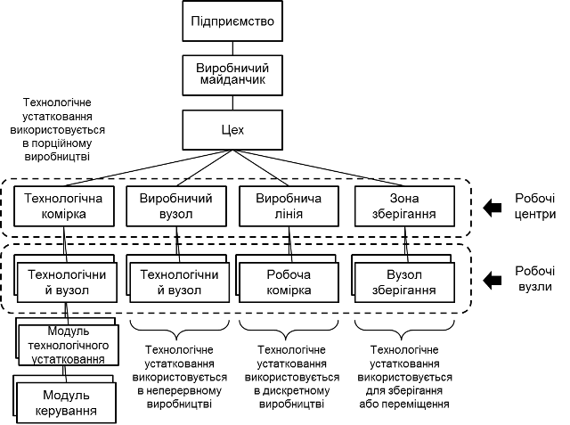
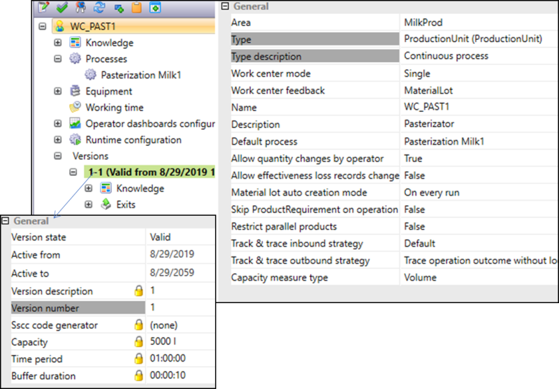
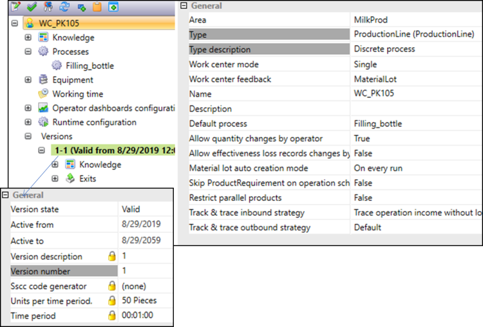
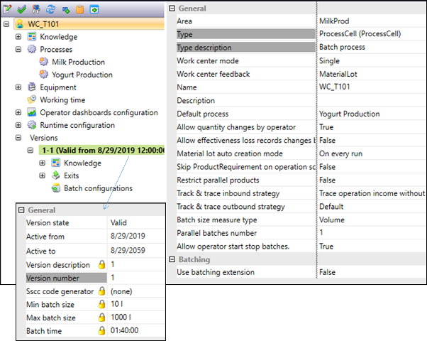
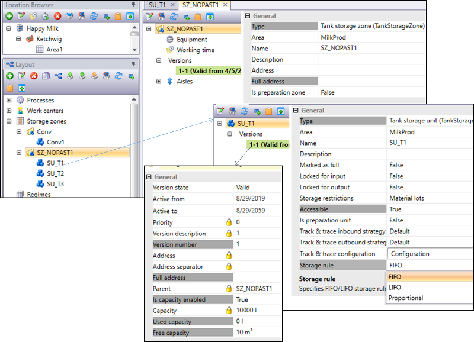
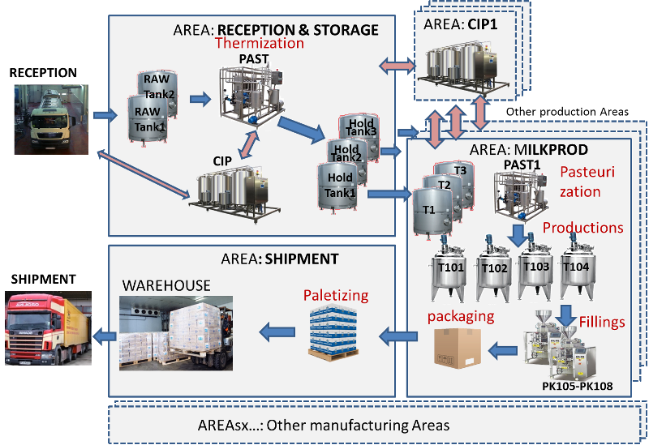
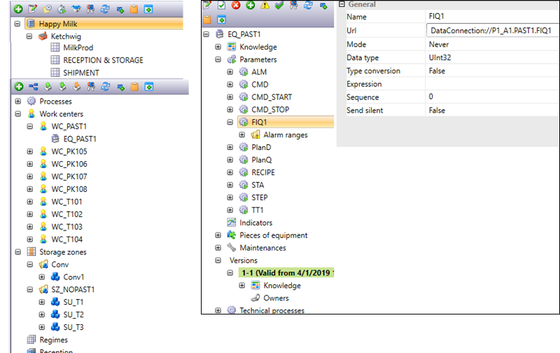

[4 <--](4.md)   [Зміст](README.md)    [--> 6](6.md)

# 5. Означення устатковання

## 5.1. Ієрархія устатковання 

Наведені в минулій лекції діяльності виконуються з прив’язкою до різних виробничих ресурсів. Для основного виробництва потрібні матеріали (з чого і що виготовляється), устатковання (на чому відбувається виробництво) та персонал. Для стандартів IEC 61512 та IEC 62264 спільним є представлення моделі рольової ієрархії устатковання (рис.5.1). Відповідно до цієї ієрархії кожне ***устатковання*** (***equipment, обладнання***) виконує певну роль у процесі виготовлення продукції. Ієрархія устатковання є однією із наскрізних моделей для інтегрування усіх рівнів керування. Вона дає можливість зробити декомпозицію (розбивку на менші елементи) усіх діяльностей, та зосереджуватися на них при реалізації. У цій лекції зосередимося на цьому типі ресурсів.  

                               

Рис 5.1. Рольова ієрархія устатковання підприємства

Термін «рольова» застосовується до моделі устатковання з метою позначення того, що ієрархія означена з точки зору функцій та діяльностей, які можуть виконувати ці об’єкти. Якщо на місце одного устатковання ставиться інший екземпляр, але при цьому воно виконує ту саму роль, то в цій моделі це вважатиметься тим самим устаткованням. Якщо ж це устатковання розглядається з точки зору конкретного активу з певним ідентифікаційним номером (з метою технічного обслуговування), то для нього використовується інша модель – ієрархія фізичних активів (Asset).

Принципи виділення устатковання для нижніх рівнів описано у роботі [Практичні рекомендації до реалізації елементів стандарту IEC 61512 в програмному забезпеченні систем керування](https://tk185.appau.org.ua/61512/case-study-iec-61512/61512guide1/). Функції рівня MOM оперують, як правило, на рівнях від робочих вузлів до цехів, або виробничих майданчиків. У той же час діяльність 4-го рівня керування (ERP) зосереджена навколо підприємства та виробничих майданчиків. ***Підприємство*** (Enterprise) займає найвищий рівень в ієрархії устатковання, функції якого зосереджені на організаційних та фінансових питаннях. Виробниче підприємство також відповідає за означення повного переліку того, які продукти, як і на яких виробничих майданчиках можуть і будуть виготовлятися. ***Виробничий майданчик*** (Site) – це фізичне, географічне або логічне об’єднання виробничих потужностей в межах одного підприємства. Підприємство може мати кілька виробничих майданчиків, які можуть знаходитися в різних локаціях, що об’єднані територіально і організаційно. Як правило, об’ємне ERP-планування проводиться для завантаження виробничих майданчиків, або цехів. Але на рівні 4 може відбуватися також оперативне календарне планування з використанням устатковання нижчого рівня. Тобто, як правило, календарний план виконання операцій (наприклад, виготовлення конкретної продукції) рівня ERP спускається на виконання для виробничого майданчика.        

***Цех*** (Area) – є частиною виробничого майданчику, який може виготовляти певний набір продуктів, напівпродуктів або сервісів. Цеха, як правило, мають чітко означені виробничі потужності, які використовуються для оперативно-календарного планування рівня 3 (MOM) та рівня 4 (ERP). Операції виробничого майданчика при детальному плануванні формують робочі замовлення, які виконуються в конкретних цехах.    

***Робочі центри*** (Work Centers) – це елементи ієрархії технологічного устатковання в межах цеху, які роблять або зберігають певний напівпродукт. Робочі центри мають чітко означені продуктивності та потужності, і вони використовуються для функцій рівня 3. Потужність та продуктивність робочих центрів також часто використовуються як вхід для бізнес-процесів рівня 4. Саме в робочих центрах проводяться необхідні заплановані завдання, для яких означуються роботи, які треба проводити. У свою чергу, робочі центри мають устатковання для виконання завдань, які називають ***робочими вузлами*** (Work Unit). Планування та виконання операцій повинно враховувати тип виробництва, яке використовується в конкретному робочому центрі. Стандарт передбачає використання конкретних термінів для робочих центрів та робочих вузлів, які застосовуються до порційного, неперервного чи дискретного виробництва, а також для зберігання та переміщення матеріалів. Загальні терміни «робочий центр» та «робочий вузол» використовуються в стандарті лише в тих випадках, коли його тип для цілі обговорення не має значення. 

## 5.2. Типи робочих центрів

У стандарті передбачені наступні типи робочих центрів і робочих вузлів (див.рис.3):

- ***Виробнича установка*** (Production Unit) і ***технологічний вузол*** (Unit) для неперервного виробництва;
- ***Виробнича лінія*** (Production Line) та ***робоча комірка*** (Work Cell) для операцій дискретного виробництва; 
- ***Технологічна комірка*** (Process Cell) та ***технологічний вузол*** (Unit) для операцій порційного виробництва;
- ***Зона зберігання*** (Storage Zone) та ***вузол зберігання*** (Storage Unit) для операцій збереження та переміщення матеріалів.

Виробнича установка (Production Unit) неперервного типу, як правило, включає все технологічне устатковання, що необхідне для сегменту неперервного виробництва, яке працює відносно автономно. Він, як правило, перетворює, відокремлює або реагує на один або кілька вхідних матеріалів для виготовлення проміжних або кінцевих продуктів. Виробнича установка часто виділяють за основним технологічним процесом або сімейством напівпродуктів, що виготовлюються на ньому.

Приклад налаштування робочого центру типу "виробнича установка" для MOM Momentum (BrightEye) показаний на рис.5.2. Для нього вказуються технологічні процеси, які можуть виконуватися, виробнича продуктивність (задається двома параметрами Capacity та Time period), buffer Duration, що вказує на додаткове ємнісне запізнення між подачею матеріалу на вхід та формування виходу. Ці параметри враховуються при детальному календарному плануванні. Зокрема технологічний процес дає можливість вибрати робочий центр, який забезпечує його проходження на певному етапі виготовлення конкретного продукту, а часові налаштування - максимальну продуктивність та затримки.   

Рис. 5.2. Приклад налаштування робочого центру типу Виробнича установка (Production unit) 

Виробничі лінії (Production Line) та робочі комірки (Work Cell) використовуються для дискретних виробничих процесів. Робочі комірки зазвичай виділяються лише тоді, коли є гнучкість у маршрутизації матеріальних потоків всередині виробничої лінії. Виробничу лінію часто виділяють за ознакою основного технологічного процесу. Виробнича лінія та робочі комірки мають чітко означені виробничі продуктивності та пропускну спроможність, і вони використовуються для функцій рівня 3. Приклад налаштувань виробничої лінії для дискретних процесів фасування показаний на рис.5.3.  

Рис. 5.3. Приклад налаштування робочого центру типу Виробнича лінія (Production line) 

Технологічні комірки (Process Cell) та технологічні вузли використовуються для проведення технологічних процесів порційного виробництва. Якщо існує достатня гнучкість для маршрутизації продукту в межах технологічної комірки, тоді для рівня MOM також означуються і технологічні вузли. Означення технологічних комірок та технологічних вузлів наводяться в МЕК-61512-1. Технологічну комірку часто виділяють за основним технологічним процесом або сімейством напівпродуктів, що виготовлюються на ньому. Технологічні комірки та технологічні вузли мають чітко означені виробничі продуктивності та потужності порційного виробництва, які використовуються функціями Рівня 3. На рис.5.4 показаний приклад налаштування технологічної комірки, для якої означуються мінімальні і максимальні розміри партій та тривалість партії (Batch Time). Ці налаштування використовуються при детальному календарному плануванні для розрахунку необхідного часу для виробництва партії, і кількості необхідних партій. 

  

Рис. 5.4 Приклад налаштування робочого центру типу Технологічна комірка (Process Cell)  

Зони зберігання та вузли зберігання належать до технологічного устаткування найнижчого рівня, що відповідає за зберігання та рух матеріалів. Зона зберігання зазвичай забезпечує отримання, зберігання, повернення, рух та відвантаження матеріалів. Функції зони зберігання можуть включати рух матеріалів від одного робочого центру до іншого в межах одного підприємства або між підприємствами. Вузли зберігання, як правило, знаходяться на більш низькому рівні ієрархії, ніж зона зберігання. Фізичне розташування вузла зберігання може змінюватися з часом; наприклад, у зв’язку з переміщенням продукції. Вузли зберігання можуть бути прив’язні до певного матеріалу, групи матеріалів або способу зберігання. 

Таб. 5.1 Приклади зони зберігання та вузла зберігання

| **Зона зберігання**          | **Вузол зберігання**                                |
| ---------------------------- | --------------------------------------------------- |
| Склад                        | Стійка/  стелаж /слот                               |
| Парк  причепів               | Причіп,  контейнер                                  |
| Група  танків                | Танк,  секція труби, колектор, буфер                |
| Група силосів                | Силос,  секція труби, колектор, буфер               |
| Причал,  пристань            | Корабель,  корабельний трюм, контейнер, бочка, танк |
| Грузова  станція, депо       | Залізничний  вагон                                  |
| Зона  тимчасового зберігання | Піддон,  бочка                                      |

На рис.5.5 наведений приклад налаштування зони та вузла зберігання. Для вузла зберігання вказується місткість а також правила зберігання (фіксації руху речовини): Storage Rule = FIFO/LIFO/Proportional. Це дасть змогу правильно проводити планування та фіксацію переміщення речовини.

 

Рис. 5.5 Приклад налаштування зони зберігання (Storage zone) та вузлу зберігання (Storage Unit) 

Стандарт передбачає можливість розширення, тобто наявності в ієрархії устатковання інших типів робочих центрів, наприклад лабораторія (використовується в операціях з контролю якості), парк мобільного технологічного устатковання, склад невикористаного технологічного устатковання (використовується в операціях з технічного обслуговування), транспортний центр. Коли додається новий тип, він повинен підтримувати ті ж зв’язки в ієрархії, що і означені типи робочих центрів (у межах цеху та містять робочі вузли).

## 5.3. Приклад моделі устатковання

Набір взаємопов’язаного устатковання в рольовій ієрархії покажемо на прикладі молочного підприємства «Happy Milk», який виготовляє різноманітну молочну продукцію. Виробнича частина підприємства складається з різних виробничих і обслуговуючих виробництво цехів (рис.5.6). Бордовим кольором виділені назви процесів, що проробляються з матеріалами, чорним - використовуване устатковання. 

Рис.5.6 Спрощена схема матеріальних потоків виробничих потужностей "Happy Milk".

Сировина (сире молоко з ферм) надходить на підприємство в молоковозах на RECEPTION. Перед відвантаженням сировина перевіряється в лабораторіях, після чого надходить на пост відвантаження в танки сирого молока RAW Tank1 і RAW Tank2, які є вузлами зберігання. Молоко як сировина використовується для різних типів молочної продукції. В цеху RECEPTION & STORAGE проводиться його попередня очистка, термізація (виробничий вузол PAST), нормалізація і обробка для тимчасового зберігання в танках. Оброблене молоко різної жирності зберігається в танках зберігання (holding tanks), які є вузлами зберігання, звідки подається в інші цехи заводу. Цех включає в себе станцію CIP (технологічна комірка) для очищення устатковання цеху а також молоковозів. Цех MILKPROD призначений для виробництва продуктів з незбираного молока: молока і йогуртів різної жирності. Продукція розфасовується в різні види упаковок (у робочих комірках – фасувальних автоматах), після чого укладається в коробки (у робочих комірках – палетайзери), які передаються на склад. Крім цього цеху на підприємстві є і інші виробничі цехи, наприклад з виробництва сиру, масла, сухого молока. У зоні зберігання SHIPMENT (склад) упакована продукція вантажиться на палети і зберігається до моменту відвантаження.

На рис.5.7 показаний фрагмент ієрархії устатковання з наведеного прикладу, реалізований у MOM-системі Momentum. Верхні три рівні (від підприємства до цеху) використовуються в основному для навігації, означення місцезнаходження, календарів та робочих годин. Інші рівні обмежуються в Momentum, як правило, робочими центрами та нижньорівневим устаткованням. Останні використовуються для зв'язку робочих центрів з рівнем АСКТП (на рис.5.7 «EQ_PAST1»). Параметри устатковання можуть мати за джерело даних змінні з Серверів OPC UA (на рис.5.7 FIQ1).   

  

Рис. 5.7 Приклад ієрархії устатковання "Happy Milk".

## Контрольні питання

1. Розкажіть про рольову ієрархію устатковання підприємства.
2. Яке призначення устатковання верхніх 4-рьох рівнів ієрархії?
3. Яке призначення робочих центрів?
4. Розкажіть які є типи робочих центрів відповідно до стандарту IEC 62264 та чим вони відрізняються?
5. Розкажіть про основні налаштування робочих центрів.
6. Покажіть на прикладі якогось виробництва означення устатковання. 
