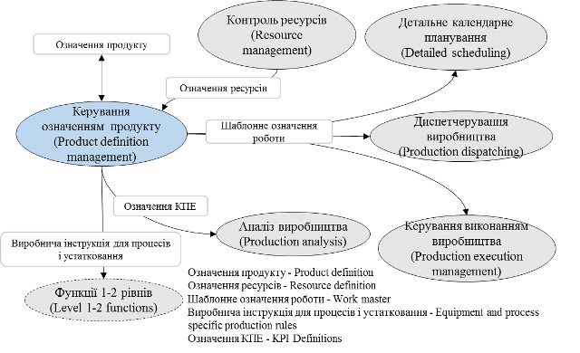
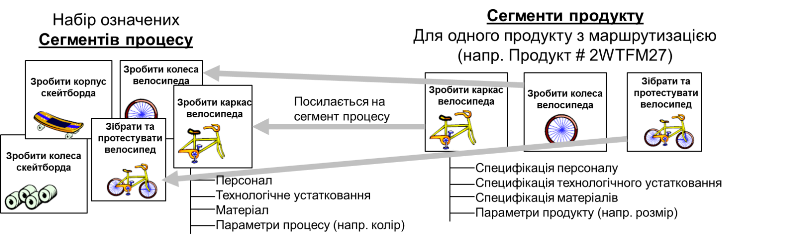
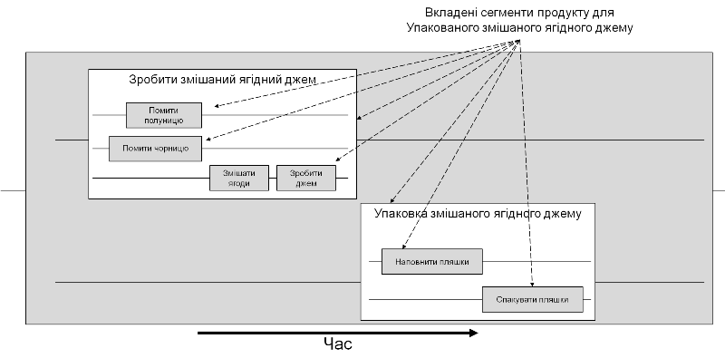
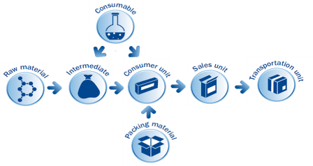
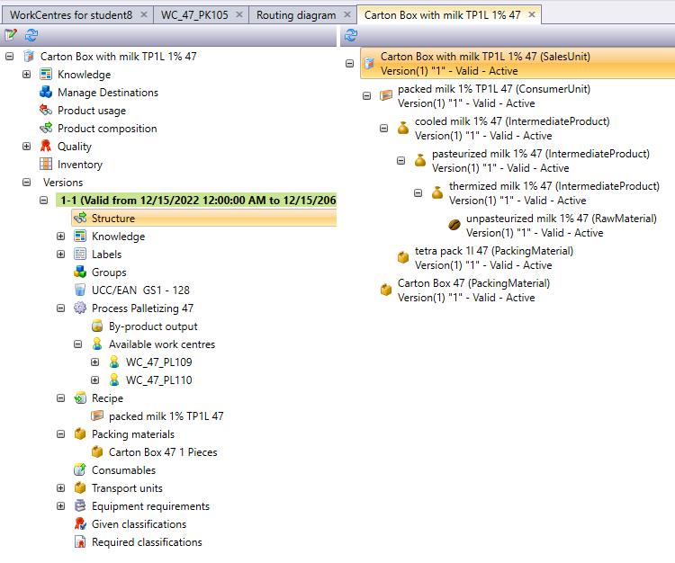

# 6. Означення продукту

*Керування означенням продукту* – це набір діяльностей, які керують інформацією рівня 3, що потребується для виготовлення продукту, включаючи виробничі інструкції. Вона повинна бути відомою як на рівні 4 для потреб планування так і на рівні 3 для детального календарного планування, диспетчерування та керування виконанням (рис.10). 

                               

Рисунок 10 - Інтерфейси моделі керування означенням продукту

Завдання керування означеннями продукту можуть включати:

- керування документами, такими як шаблонне означення роботи, виробнича інструкція, рецепт, структурні діаграми продукту та інших;

- керування новими означеннями продуктів;

- керування змінами у означеннях продукту;

- надання виробничої інструкції персоналу чи іншим видам діяльності;

- підтримання можливих детальних виробничих маршрутів для продукції;

- забезпечення маршруту до виробничих операцій на рівні деталізації, що вимагається
   виробничими операціями;
   
- керування обміном інформацією про означення продукту з функціями рівня 4;

- оптимізація правил виробництва продукції на основі аналізу технологічних процесів та результатів виробництва;

- створення та підтримання правил місцевого виробництва пов'язаних з продукцією, таких як очищення, пуск та відключення;

- керування означеннями ключових показників ефективності (KPI), пов'язаних з продукцією та виробництвом.

Існує три основні області інформації, необхідні для виробництва конкретного продукту, які мають кілька точок перетину (див. рис.11). *Виробнича інструкція для продукту* (Product production rules) – це інформація, яка містить вказівки на те, яким чином виготовити продукт. Прикладами виробничої інструкції є загальний, місцевий або майстер рецепт (означені в МЕК 61512-1), дані про продукт ПП (прикладний протокол), означений в ISO 10303-1, стандартна операційна процедура (SOP), стандартні умови експлуатації (SOC), маршрутизація або складання кроків на основі виробничої стратегії. *Відомість матеріалів* (Bill of material) – це список усіх матеріальних ресурсів, необхідних для виготовлення продукту із зазначенням кількості. До списку можуть входити сировина, проміжні матеріали, вузли, деталі та витратні матеріали. У відомості матеріалів не вказується місце та час використання матеріалів, проте цей документ може бути організований ієрархічно, що відображає деякі етапи виготовлення продукту. До складу відомості матеріалів часто входить матеріал, який не пов'язаний з виробництвом продукту, наприклад, допоміжні матеріали для відвантаження або включена документація. Відомість матеріалів – це частина відомості ресурсів. Виробнича відомість – це підмножина відомості матеріалів, яка пов'язана з виробництвом. *Відомість ресурсів* (Bill of resources) – це перелік усіх ресурсів, необхідних для виробництва продукту. До ресурсів можуть входити матеріальні ресурси, персонал, технологічне устатковання, енергетичні ресурси та витратні матеріали. Відомість ресурсів не містить конкретних етапів виробництва, проте цей документ також може бути організований ієрархічно, що відображає деякі етапи виробництва.

 

Рисунок 11 – Означення інформації про основне виробництво

*Сегмент продукту* (Product Segment) – це інформація, яка відображає точки перетину між виробничою інструкцією продукту та відомістю ресурсів. Сегмент продукту описує завдання та задачі, що складаються з одного або декількох робочих елементів, які зазвичай виконуються в одному місці. Сегмент продукту – це найбільш детальний вигляд процесу керування матеріальними ресурсами, трудовими ресурсами, використанням ресурсів, затратами та якістю з метою керування виробництвом з точки зору бізнес систем. Сегмент продукту ідентифікує, посилається або відповідає сегменту процесу. Цей взаємозв'язок проілюстрований на рисунку 12.

  

Рисунок 12 Відношення сегмента продукту до сегмента процесу

Сегмент продукту пов'язаний з конкретним продуктом, тоді як сегмент процесу не залежить від продукту. Сегмент процесу включає в себе певну сукупність взаємопов’язаних ресурсів (персонал, устатковання, матеріали). Сегменти продукту і процесу відображають виробничі процеси з точки зору бізнесу і не призначені для подання детального огляду, необхідного для керування виробничими операціями в межах Рівня 3.

Сегменти продукту можуть відповідати

- стадіям технологічного процесу МЕК 61512-1, технологічним операціям, процедурам апарата або операціям з виробництва партії;

- виробничим операціям для неперервного виробництва;

- етапам збірки та діям збірки для дискретного виробництва;

- іншим типам ідентифікованих часових інтервалів для інших видів виробництва.

Сегменти продукту можуть включати в себе інші сегменти, як це показано на рис.13. Кожен прямокутник відповідає окремому сегменту продукту.

 

Рисунок 13. Вкладеність сегментів продуктів.

Набір сегментів продукту складає упорядковану послідовність сегментів, необхідних для виготовлення продукту, достатньо детальну для можливості планування та календарного планування виробництва. Сегмент продукту може містити значення необхідних параметрів (наприклад уставок) для відповідного сегменту процесу. Сегмент продукту за необхідності більшої деталізації може також мати посилання на виробничу інструкцію, яка відповідає правилам, необхідним для його реалізації на нижніх рівнях керування. 

Таким чином, сегменти продукту формують означення ланцюга послідовностей сегментів процесу для створення конкретного продукту. Ці сегменти процесу можуть, наприклад, включати в себе робочі центри, в яких буде вироблятися продукт, задіяний персонал та матеріали. У свою чергу, сегменти продуктів посилаються на шаблони означення роботи (Work master) та, за необхідності, на виробничу інструкцію, необхідну для реалізації.  

 Для прикладу, у середовищі Momentum сегменти продуктів діляться на типи, в залежності від їх особливостей (див.рис.14). Так, сегмент типу Consumer Unit (споживча одиниця) потребує матеріали, що виробляються в сегменті типу Intermediate (напівпродукт) та матеріли з сегменту Packaging material. 

 

Рисунок 14 – Типи та зв’язки сегментів продукту

Кожен сегмент продукту має велику кількість параметрів, які вказують на правила та ресурси його створення (рис.15), зокрема:

- `Recipe` - сегменти продукту і відповідно матеріали, які необхідні для виробництва відповідного продукту, тобто інгредієнти.
- `Inventory` - зони зберігання, де зберігається продукт і всі партії матеріалу цього продукту для обраної зони зберігання.
- `Process Name` - крок процесу, з яким пов'язано означення продукту. Тут ви визначаєте, які робочі центри використовуються і які параметри застосовуються для визначення продукту.
- `Equipment requirements` – нижньорівневе устатковання, необхідне для виробництва цієї версії.

 

Рисунок 15 – Приклад сегмента продукту в Momentum

Для кожного сегменту продукту (див. рис. 10) отримуються шаблонні означення роботи (як майстер-рецепти для порційного виробництва), що стосується конкретного робочого центра. Вони використовуються для створення керівного означення роботи (керівного рецепту) в діяльності керування виконанням виробництва. 

Керування означенням продукту може також включати керування іншою інформацією про продукт спільно з виробничою інформацією:

- вимоги замовника, дизайн продукту та технічні характеристики;
- проектування та моделювання процесу;
- технічні публікації та сервісні матеріали;
- інформація про вимоги щодо подання заявок.

