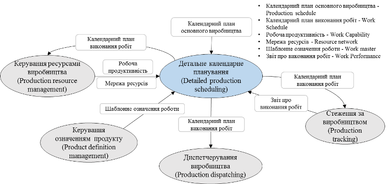

[6 <--](6.md)   [Зміст](README.md)    [--> 8](8.md)

# 7. Детальне календарне планування

## 7.1. Рівні планування та їх співвідношення

Слід розрізняти поняття *«Планування»* (Planning) яке також інколи називають об'ємним плануванням та *«Календарне планування»* (Scheduling). Планування означується як діяльність з уточнення дій або операцій для досягнення поставленої мети та резервування достатньої кількості ресурсних потужностей для досягнення мінімальних цілей. Календарне планування означується як діяльність з розподілу дій та операцій на конкретні ресурси в конкретний час з урахуванням різних фактичних обмежень та оптимізації декількох параметрів оцінки.

Рис.7.1 ілюструє, що з точки зору ієрархії, планування знаходиться вище за календарне планування, оскільки календарне планування складається на основі результатів планування. Планування означує цілі для календарного планування. Результати календарного планування показують, чи є результат планування досяжним та ефективним. Якщо ні, планування зазвичай дає інші цілі для календарного планування. Доцільність та ефективність календарного планування - це види обмежень для планування.

                                
 Рис. 7.1. Схематичне співвідношення планування та календарного планування

Відмінності між плануванням (об’ємним) та календарним плануванням у видах результатів, які пов'язані з різними аспектами концепцій часу. При плануванні (Planning) основними результатами будуть цільові кількості, які застосовуються протягом певного періоду часу. Результати планування представлені в дискретному масштабі часу як періоди. Прикладами результатів планування можуть бути "50 000 одиниць товару цього місяця", "продажі на $480 000 наступного місяця", "підсумок понаднормових годин на наступний тиждень" тощо. Результати календарного планування (Scheduling) представляють конкретні строки дій, наприклад, час початку та час завершення операції, час видачі запасів, час доставки тощо. Результати інформації про послідовність операцій представлені у безперервній шкалі відносного або абсолютного часу. Прикладами результатів календарного планування можуть бути "9:00 понеділка виконання робочого замовлення 2345", "9:00 в середу виконуйте профілактичне обслуговування на E887e".

## 7.2. Виробничі замовлення

У результаті календарного планування на 4-му рівні (ERP) формується *виробничий календарний план* (Operation Schedule) для конкретного виробничого майданчику (див.рис.7.2). Цей план складається з *виробничих замовлень* (Operation request) на певний продукт чи інші операції (може включати кілька операцій різної категорії, наприклад обслуговування). 

Виробничі замовлення можуть включати:

- запланований час початку операції, зазвичай використовується, якщо план керується системою календарного планування;

- запланований час завершення операції, зазвичай використовується, якщо MOM контролює дотримання термінів виконання;

- пріоритет замовлення, зазвичай використовується, якщо точна почерговість виробництва не запланована ззовні.

 

Рис. 7.2. Календарний план на виробничий майданчик

Виробничий календарний план може включати змішані типи операцій. Виробниче замовлення у виробничому календарному плані та вимога до сегменту можуть бути спеціалізованими або змішаними:

- "змішаний" виробничий календарний план може містити змішані або спеціалізовані виробничі замовлення,

- "змішане" виробниче замовлення може містити змішані або спеціалізовані вимоги до сегмента,

- "змішані" вимоги до сегмента можуть обробляти декілька специфікацій ресурсів, які зазвичай з'являються в спеціалізованому сегменті. 

  На рисунку 18 показані вимоги до сегмента:

- рухи матеріалу, необхідні для виконання відповідної операції (категорія операцій з виробничими запасами); 

- ресурси для основного виробництва; інформація про матеріал повинна містити відпущений матеріал та інші матеріали, перенесення яких не потрібно було б уточнювати (рідина, наявна у нерухомих трубах);

- ресурси, пов'язані з якістю, які залучаються під час або в кінці виробничої операції.

 

Рис.7.3. Приклад виробничих замовлень на змішані операції

У системі Momentum, виробничі замовлення (називаються Customer Order) можна отримати з системи ERP або добавляти вручну. При цьому вибирається кінцевий продукт, необхідна його кількість, очікуваний та максимальний час завершення виготовлення (рис.7.4).  

 

Рис. 7.4. Приклад виробничого замовлення в Momentum

## 7.3. Робочі замовлення, завдання та календарний план робіт

Згідно стандарту, кожне виробниче замовлення відправляються у вигляді набору *робочих замовлень* (*Work request*) на певний цех (див. рис.7.5). 

Робочі замовлення можуть включати:

- запланований час початку роботи, зазвичай використовується, якщо план керується системою календарного планування;

- запланований час завершення роботи, зазвичай використовується, якщо MOM контролює дотримання термінів виконання;

- пріоритет замовлення, зазвичай використовується, якщо точна почерговість виробництва не запланована ззовні.

Робочі замовлення складаються з *завдань* на виконання робіт (*job order*), кожне з яких реалізується на конкретному робочому центрі. Кожне завдання пов’язане шаблоном означення роботи, яке задається в означенні продукту, що розглянуто в попередній лекції. Календарний план робіт означує розподіл ресурсів під виробничі завдання більш детально, ніж сегменти процесу, які орієнтовані на бізнес-процеси.

За розподіл робочих замовлень і відповідно завдань у часі відповідає *календарний план виконання робіт* (*Work schedule*), що може означуватись для будь-якої діяльності або для їх комбінації.

 

Рис. 7.5. Приклад створення календарного плану виконання робіт на цех

Таким чином, календарний план робіт для основного виробництва означується як набір завдань на виробництво та їх послідовності, що беруть участь у виробництві одного чи декількох виробів (в об’ємах робочих замовлень), на рівні деталізації, необхідної для виготовлення. 

Завдання націлені на конкретний робочий центр. Якщо цей робочий центр є порційного типу (технологічна комірка), то завдання відповідає конкретній партії продукту (Batch), як це означено в IEC 61512.  

Календарний план робіт пов'язує фізичну та/або хімічну обробку (процеси) з конкретним виробничим устаткованням або класами виробничого устатковання, з конкретними стартами або початковими подіями. Зазвичай цей зв’язок виконується через завдання (job order). Календарний план робіт може посилатися на конкретний персонал або класи персоналу. Завдання має наступні атрибути: 

Таб.7.1.

| Атрибут                                              | Пояснення                                                    |
| ---------------------------------------------------- | ------------------------------------------------------------ |
| Ідентифікатор та версію шаблонного  означення роботи | Ідентифікує пов’язане шаблонне означення роботи для використання, якщо воно  застосовується. |
| Час запуску                                          | запланований час початку  роботи                             |
| Час завершення                                       | запланований час  завершення роботи                          |
| Пріоритетність                                       | Пріоритетність замовлення, якщо застосовується.              |
| Межі ієрархії                                        | Ідентифікує, де  застосовується обмінювана інформація в межах  ієрархії устатковання на основі ролей. |
| Команда                                              | Визначає які дії має виконати  діяльність керування виконанням над завданням, наприклад: Запустити, Утримувати, Скасувати, Перервати, Зупинити |
| Статус диспетчерування                               | Визначає статус запису з точки зору діяльності  диспетчерування. Цей статус схожий на те, що  планувальники писали б на своїх дошках для стеження за завданням. Наприклад: Відправлено  на виконання, Очікує на розгляд, Утримано, Скасовано, Відкладено, Завершено |
| Командна інструкція                                  | Інструкція для діяльності керування виконанням, що визначає умови для виконання команд. Наприклад: Устатковання  чисте, Після завершення замовлення WED89 |

## 7.4. Приклад календарного плану виконання робіт в системі MOM

Для прикладу, в системі Momentum, при плануванні, виробничі замовлення спочатку діляться на робочі замовлення (Work Order) відповідно до сегментів продуктів. Це процес відбувається автоматично. Далі робочі замовлення плануються на певні робочі центри, відповідно до процесів, які вони можуть виконувати (рис.7.6). Це може відбуватися як автоматично так і вручну. Примітка: у попередній версії стандарту IEC 62264 «Job Order» мало назву «Work Order». 

 

Рис.7.6. Приклад календарного плану виконання робіт

Кожне робоче замовлення має певний стан, розміщення на робочому центрі, заплановані часи початку, виконання та завершення (рис.7.7). У системі Momentum робочі замовлення, що вже заплановані на робочих центрах,  називаються операціями. 

 

Рис.7.7. Стани робочих замовлень 

## 7.5. Зв'язок означення детального календарного планування з іншими діяльностями

Детальне календарне планування виробництва - це сукупність видів діяльностей, що по отриманому календарному плану основного виробництва визначають оптимальне використання місцевих ресурсів для задоволення потреб. На рисунку 7.8 наведені інтерфейси моделі діяльності. Оптимальне використання місцевих ресурсів може включати в себе замовлення запитів на мінімальне число запусків чи очищення устатковання, об'єднання запитів на оптимальне використання устатковання та розбиття запитів, коли це потрібно через розміри партії або обмежені виробничі норми. 

Рис.7.8. Інтерфейси моделі діяльності детального календарного планування виробництва 

Системи планування на рівні підприємств часто не мають детальної інформації, необхідної для календарного планування конкретних робочих центрів, робочих підрозділів або персоналу. Детальне календарне планування виробництва враховує місцеві ситуації та наявність ресурсів. 

Задачі детального календарного планування виробництва можуть включати:

- створення та ведення календарного планування роботи;

- порівняння фактичного виробництва з плановим;

- визначення планової потужності кожного ресурсу для використання функцією керування виробничими ресурсами;

- отримання інформації з керування операціями технічного обслуговування, керування операціями контролю якості та контролю виробничих запасів; 

- моделювання виконання «що-якщо». Це завдання може включати в себе такі дії:

- обчислення часу виробництва або остаточного часу завершення для кожного запиту виробництва, передбаченого функціями рівня 4; 

- визначення ресурсів вузьких місць для кожного періоду; 

- забезпечення часу доступності майбутнього виробництва для конкретного продукту.

Календарний план виконання робіт ґрунтується на вимогах, означених у календарному плані рівня 4, означенні продукту та продуктивності ресурсу. Він враховує обмеження та доступність та використовує інформацію від діяльності стеження за виробництом для обліку фактичної незавершеної роботи. Він може надаватися або на вимогу, або за визначеним графіком. Також може перероблятись на основі непередбачених подій, таких як відключення устатковання, зміна робочої сили та / або зміна доступності сировини. Він може надаватися людям, додаткам або іншим видам діяльностей.

Детальне календарне планування виробництва може застосовувати стратегію планування, таку як вибір вперед (forward) або назад (backward), призначення пріоритету для кожного завдання, застосування конкретних обмежень для заводу, розподіл буфера часу на ресурсі вузького місця та інше.

Детальне календарне планування виробництва може мати форму планування виробничих потужностей. Планування виробничих потужностей - методологія планування, яка передбачає розроблення календарних планів роботи виробничого технологічного устатковання таким чином, щоб жодна з вимог до потужності виробничого технологічного устатковання не перевищувала його доступну потужність. Для цього планування необхідна інформація про поточні та майбутні продуктивності та потужність ресурсів, означені в частині 1 IEC 62264. Вона надається в рамках діяльності керування виробничими ресурсами. 

Підсистема календарного планування одна з найскладніших, оскільки може використовувати різні обчислювальні алгоритми та нерідко включають методи «ноу-хау». Сьогодні ряд компаній використовують методи APS-планування, які передбачають багаторівневе календарне планування на усіх рівнях керування з перерахунком. Така підсистема присутня також в вітчизняній ERP/MES [ITenterprise](https://www.it.ua/), яка успішно використовується на багатьох підприємствах.

## 7.6. Приклад календарного планування в системі MOM

У системі Momentum автоматичне планування створює робочі замовлення і розподіляє їх по робочих центрам (називаються операціями). Коли розрахунок замовлення йде автоматично  відкривається вікно Schedule automatically, де ви можете переглядати робочі завдання і маніпулювати критеріями планування (рис.7.9). Автоматичне планування дозволяє встановити критерії оптимізації і угруповування. Планувальник оптимізує рішення на основі обраних критеріїв і їх важливості. 

     

Рис. 7.9. Приклад вікна вибору критеріїв автоматичного планування

Процес планування виглядає наступним чином:

- вибирається один або кілька виробничих замовлень для планування, вибирається автоматичне планування;

- вказується за необхідності обмеження на робочі центри;

- встановлюються опції та налаштування планування, запускається алгоритм;

- через певний час знаходиться перше рішення, після чого можна вибрати «Запланувати зараз», або спочатку почекати додатковий час для пошуку найкращого рішення;

- після того, як користувач натисне кнопку «Запланувати зараз», почнеться процес створення операцій, який буде також включати дії: 
  - планування переміщення матеріалів (якщо вони повинні бути створені відповідно до конфігурації),
  - планування дій по обслуговуванню між операціями (якщо дії по обслуговуванню сконфігуровані в матриці),
  - планування операцій для розподілу рухомого устатковання (в разі, якщо рухоме устатковання налаштоване),
  - виконувати існуючий програмний скрипт (якщо є скрипти, які виконуються при оновленні стану дії операції),
  - розміщувати операції на діаграмі Ганта.

Поточний крок планування і всі інші кроки можна побачити в файлі журналу під час проведення  планування (рис.7.10). 

  

Рис.7.10. Приклад вікна відображення статусу розрахунку календарного плану для вибраного виробничого замовлення

## 7.7.Взаємозв'язок календарних планів

Календарний план виробництва може бути поділений або об'єднаний для відправлення на диспетчерування. Ліва частина рис. 7.11 ілюструє, як один календарний план поділяється на декілька, а права – як кілька календарних планів виробництва з різних джерел можуть бути об'єднані в один. Як приклад, декілька денних календарних планів робіт можна отримати з календарного плану на тиждень. Так само можливе об’єднання декількох календарних планів для зменшення кількості запусків чи очищення устатковання.

 

Рис.7.11. Поділ та об'єднання календарних планів виробництва до календарних планів робіт

Слід чітко означити взаємозв'язки між детальним календарним плануванням виробництва, виробничих запасів, технічного обслуговування та керування якістю. Для взаємодії з виробництвом слід визначити наступні три взаємодії, як показано на рисунку 7.12.

 

Рис.7.12. Взаємодія детального календарного планування

Взаємодія між детальним календарним плануванням виробництва та детальним календарним плануванням виробничих запасів означується як узгодження інформації про початок або завершення виробництва, кількість матеріалів та їх переміщення. Однак планування переміщення може бути означено або в детальному плануванні виробництва, або в детальному плануванні виробничих запасів. Наприклад, планування початку виробництва не відбувається до планування передачі відповідних матеріалів. Іншим прикладом може бути ситуація, коли завершення запланованого виробництва запускає заплановану операцію з керування виробничими запасами.

Взаємодія між детальним календарним плануванням виробництва та детальним календарним плануванням технічного обслуговування означується як узгодження інформації про устатковання, яке забезпечує виробництво та потребує резервування для обслуговування. Таким чином не можна одночасно планувати ремонт та виробництво на одному і тому ж устаткованні. Планування технічного обслуговування відбувається на основі планового використання устатковання для виробництва.

Взаємодія між детальним календарним плануванням виробництва та детальним календарним плануванням керування якістю означується як узгодження інформації про якість виготовлених та споживаних матеріалів, які необхідно перевірити залежно від вимог до якості та останніх показників виробництва.

З точки зору діяльності детального календарного планування, ресурси, такі як персонал, устатковання та/або матеріал, можна розділити на дві різні групи: 

- витратні ресурси, що зазвичай відповідають відпрацьованим годинам персоналу, матеріалам (включаючи енергію);

- невитратні ресурси, що зазвичай відповідають навичкам персоналу та використанню устатковання. 

Витратні ресурси та невитратні ресурси, як правило, по-різному обробляються в діяльності календарного планування. Витратний ресурс виробляється або споживається виробничими процесами. Цей тип ресурсів зазвичай включає сировину (включно з енергію), кінцеву продукцію інвентаризації WIP, а також може включати відпрацьовані години персоналу або час напрацювання устатковання. Кількість ресурсу вимірюється до або після виробництва і зазвичай змінюється в процесі. Кількість використаного ресурсу - це пряма витрата на процеси виробництва продукції. Невитратний ресурс не вичерпується виробничими процесами, а планується на основі продуктивності. Кількість ресурсу зазвичай не змінюється до чи після виробництва.

## 7.8. Врахування зав'язків устатковання при плануванні

При плануванні та диспетчеруванні в системі MOM враховуються взаємозв’язки між устаткованням. Тому окрім самої ієрархії устатковання, даного в розділі 3, в системі вказуються також зв’язки. Наприклад, у  Momentum для цього є налаштування діаграми маршрутизації. Вона не тільки означує між яким робочими центрами може передаватись продукт, а й їх взаємодію між собою. Наприклад, на рисунку 7.13 показаний приклад потокової діаграми для молочного виробництва, що наводилося в попередніх лекціях. Взаємодії між робочими центрами означуються параметрами ліній зв’язку. Зокрема параметр Lag time вказує на час затримки запуску однієї операції відносно іншої, а Cost  - на пріоритетність шляхів. Використовуючи Dependancy type можна вказати на поведінку завдань (одночасний запуск чи зупинка, запуск однієї після закінчення іншої і т.д.)

 

Рис. 7.13. Приклад діаграми маршрутизації та параметрів з’єднання

## Контрольні питання

1. Розкажіть у чому відмінність об'ємного планування та календарного планування. Як вони співідностяться?
2. Що таке виробничий календарний план(Operation Schedule) та виробничі замовлення (Operation reques)? Наведіть приклад виробничих замовлень в системі MOM.
3. Що таке робочі замовлення (Work request) та завдання на роботу (job order)?
4. Що таке календарний план виконання робіт (Work schedule)? Поясніть як пов'язані робочі замовлення (Work request), завдання на роботу (job order) та робочі центри в календарному плані робіт.
5. Які атрибути має завдання на виконання роботи?
6. Наведіть приклад вигляду календарного плану виконання робіт в системі MOM.
7. Як звзяано детальне календарне планування з іншими діяльностями?
8. Які задачі детального календарного планування виробництва?
9. Наведіть приклад календарного планування в системі MOM
10. Наведіть приклади зв'язків календарних планів.
