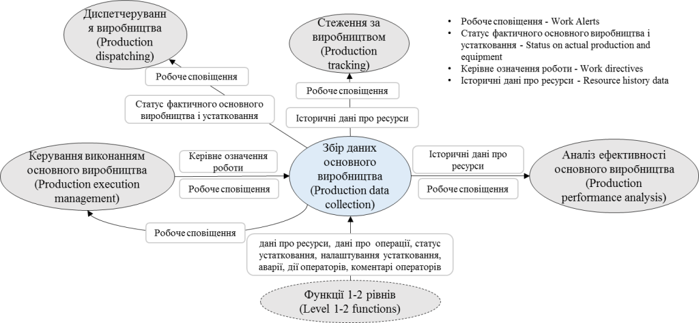
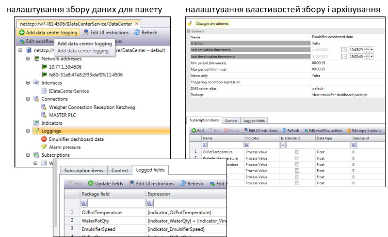
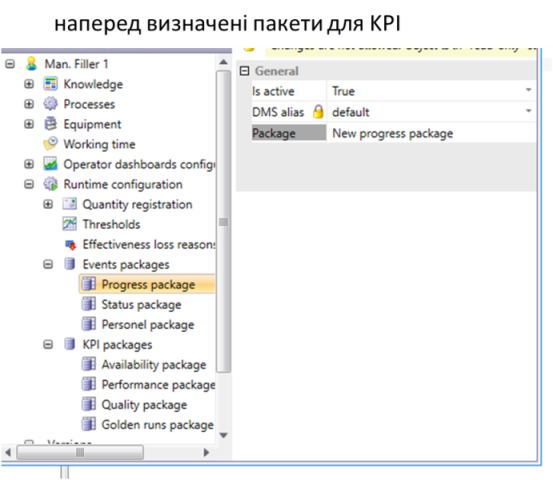

Автор і лектор: Олександр Пупена, Лабораторні: Олександр Пупена, Роман Міркевич

| [<- до лекцій](README.md) | [на основну сторінку курсу](../README.md) |
| ------------------------- | ----------------------------------------- |
|                           |                                           |

## 7. Збір даних

Попередня діяльність передбачає обмін даними в реальному часі з устаткованням з метою керування та контролю виконання на них завдання. Окрім цього, для задач аналізу в стандарті передбачається також *збір даних основного виробництва* (*Production* *Data* *Collection*) – набір діяльностей, що займаються збором, архівуванням, упорядкуванням та керуванням виробничими даними для конкретних робочих процесів або конкретних виробничих запитів. Виробничі системи керування, як правило, оперують:

- даними про процес, таким як кількість (вага, штуки тощо), властивість (швидкість, температура тощо);

- інформацією про устатковання, такими як стан контролера, датчика, пускача, тощо. 

Дані можуть включати показання датчиків, стан устатковання, дані про події, введені оператором значення, дані про транзакції, дії оператора, повідомлення, результати розрахунків за моделями та інші дані, важливі для виготовлення продукції. 

Збір даних може відбуватися за часом або за подією. При цьому до даних додаються відмітку про час або подію, щоб надати контексту зібраній інформації. Подієво-орієнтовані дані між підсистемами MOM можуть передаватися через *робочі сповіщення* (Work alert) – повідомлення про подію рівня MOM, яке не потребує підтвердження. 

На рисунку 35 показані деякі інтерфейси між збором даних основного виробництва та іншими діяльностями рівня MOM.

                               

Рисунок 35 - Інтерфейси моделі збору даних основного виробництва

Завдання збору даних основного виробництва можуть включати:

·     збір, вилучення та архівування інформації, що стосується виконання виробничих запитів (робочі сповіщення, означення роботи), використання устатковання, включаючи інформацію, що вводиться виробничим персоналом; наприклад: дані процесу, дані статусу устатковання; набір даних про розміщення та кількість партії матеріалу; записи журналу операторів; 

- надання інтерфейсів до: 

- систем керування технологічним процесом або виробничої лінії; 

- систем керування лабораторною інформацією (LIMS);

- систем керування основним виробництвом;

- надання звітів за даними основного виробництва;

- забезпечення інформацією для локального аналізу процесів та виробництва та для звітування перед логістичними системами вищого рівня;

- забезпечення інформацією для стеження за продукцією для подальшої можливості простежування; наприклад, простежування продуктів для конкретних партій матеріалів, устатковання та/або операторів;

- забезпечення моніторингу відповідності (якості) та функцій тривожної сигналізації (реєстрація ведення журналу подій);

- надання зібраної інформації про якість продукції для порівняння зі специфікаціями.

Збір даних може бути реалізований через формування таблиць в реляційних базах даних. У Momentum, наприклад, за цю діяльність відповідає окремий сервер DMS (Data Mining Server). При конфігуруванні означуються пакети (Package), які будуть відповідати однойменним таблицям в базі даних (рис.36). Для кожного пакету конфігуруються поля, які відповідають полям записів в таблиці бази даних.   

 

Рисунок 36 – Приклад налаштування пакетів даних

​      Далі в сервері даних (див.рис.37) конфігурується параметри збирання для вказаних пакетів (Loggins). Тут налаштовується періодичність або події, при яких відбувається запис. Потім для кожного поля пакети означується джерело даних, звідки будуть братися значення.  

 

Рисунок 37 – Приклад налаштування збору даних для пакетів

​      Інформація про роботу робочих центрів також фіксується в DMS. Ця діяльність конфігурується безпосередньо в налаштуваннях робочих центрів (див. рис.38). Тут достатньо активувати та налаштувати наперед визначені пакети для даних прогресу (кількість якісної і бракованої продукції), стани робочого центру (працює, зупинений), дії персоналу. Також там активуються пакети для автоматичного розрахунку KPI.  

 

Рисунок 38 – Приклад налаштування збору даних для робочих центрів

| [<- до лекцій](README.md) | [на основну сторінку курсу](../README.md) |
| ------------------------- | ----------------------------------------- |
|                           |                                           |

 