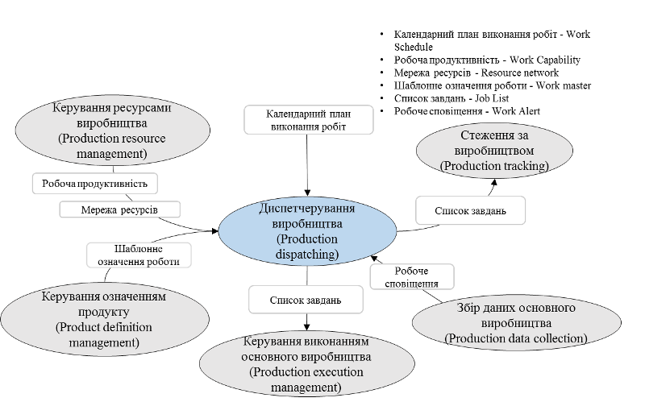
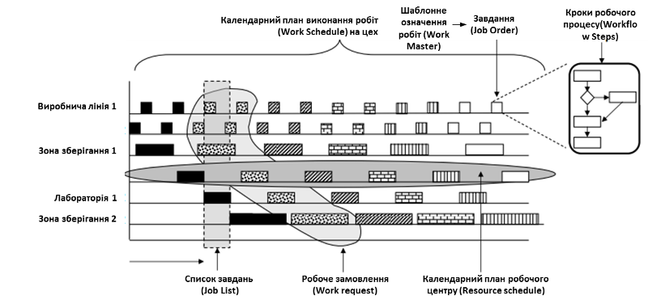
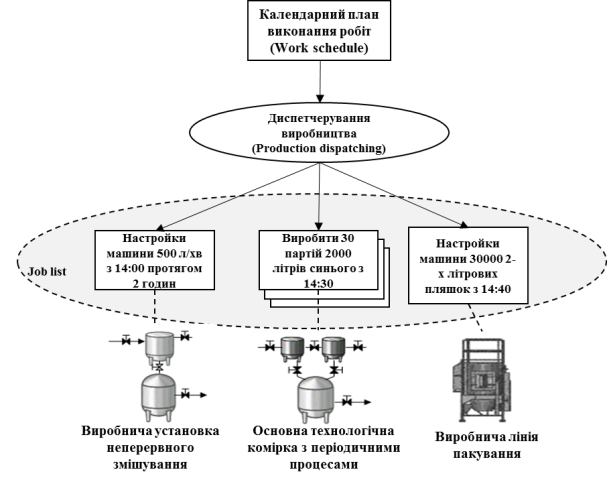
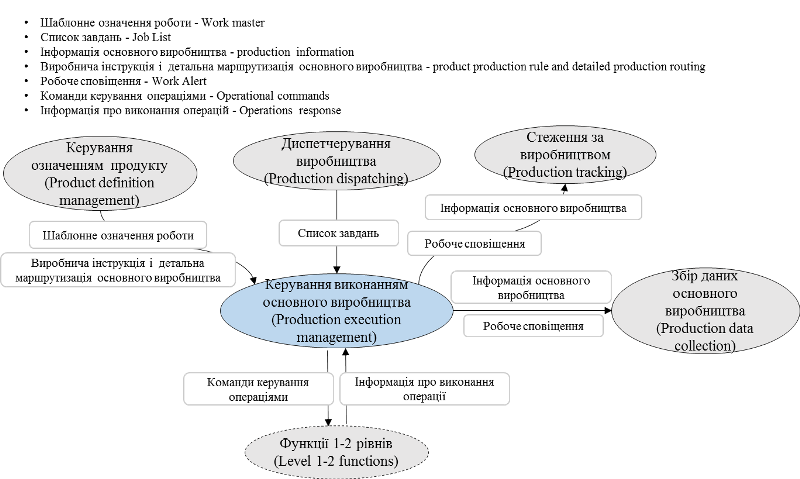
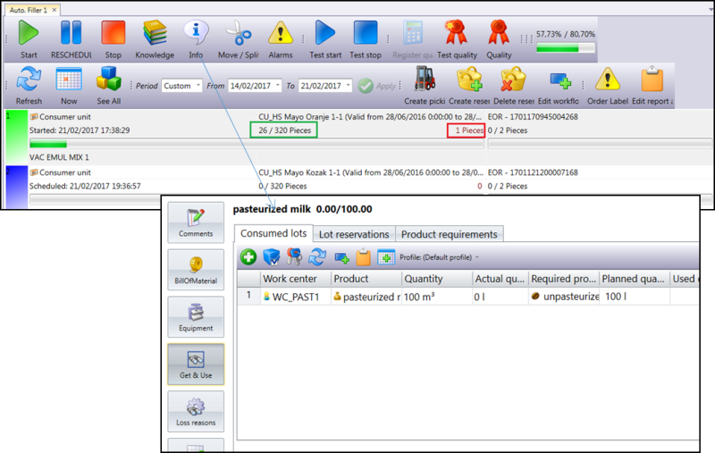

[7 <--](7.md)   [Зміст](README.md)    [--> 9](9.md)

# 8. Збір даних, диспетчерування та керування виконанням

## 8.1. Диспетчерування

Діяльності календарного детального планування не включають в себе роботи по керуванню ресурсами, вони тільки передбачають їх використання в певні моменти часу. Для виконання запланованих завдань необхідно їх направити на робочі центри, в яких виділити необхідні ресурси та забезпечити запуск та завершення усіх робіт, передбачених і не передбачених в означенні роботи. Згідно стандарту IEC 62264-3 це включає дві взаємопов’язані діяльності: диспетчерування та керування виконанням.   

*Диспетчерування виробництва* (*координація*, *Production dispatching*) означується як сукупність видів діяльностей, що керують виробничим потоком шляхом координування устатковання та персоналу для виробництва. Така координація конкретно означує хто, що і коли робить, з ким і як взаємодіє і в якому порядку. 

Ця діяльність як правило включає відправлення завдань до робочих центрів або/та видачу завдань на виконання ручних операцій (наприклад налаштування машини, ручна мийка, переключення). Хоч диспетчерування не запускає і не забезпечує виконання завдань, вона передбачає контроль їх статусу (наприклад, схвалено, виправлено, обробляється або скасовується). Крім того, після детального календарного планування ще до його виконання необхідно передбачити контроль дотримання технологічних обмежень, які можуть бути не означені в плані.

Слід зазначити, що деякі системи керування робочими центрами можуть мати власні системи календарного планування. Тому диспетчерування також може включати наступні діяльності:   

- календарне планування запуску партій в системі керування порційним виробництвом (робочий центр порційного типу виробництва);

- календарне планування запусків виготовлення у виробничій лінії (робочий центр дискретного типу виробництва);

- відправка завдання стандартних умов функціонування для виробничого вузлу (робочий центр неперервного типу);

Завдання диспетчерування основного виробництва можуть включати назначення необхідних місцевих ресурсів, якщо вони не були передбачені в календарному плані. Наприклад, може бути задіяння додаткового устаткування чи персоналу при певній нештатній ситуації. 

При необхідності переключення виконання одного завдання на інше на певному ресурсі (наприклад робочому центрі) необхідне його звільнення. Наприклад, надання устатковання, що було на мийці, для виконання іншого завдання, та відповідна зміна завдання для персоналу.

## 8.2. Зв'язок диспетчерування з іншими діяльностями 

Диспетчерування виробництва передбачає інформування діяльності детального календарного планування виробництва про неможливості виконати вимоги плану, коли до цього призводять непередбачені події. Це у свою чергу повинно запустити процес перепланування. З іншого боку, диспетчерування може враховувати непередбачені умови щодо якості матеріалів, майбутню відсутність матеріалів, отримавши інформацію від відповідних підсистем. Воно також включає координування з операціями по технічному обслуговуванню, керування якістю, керування запасами та/або операції з керування виробничими ресурсами.

Диспетчерування виробництвом взаємодіє з іншими діяльностями через різні інтерфейси (див.рис.30).

                               

Рис.8.1. Інтерфейси моделі діяльності диспетчерування виробництва

Як видно з рис.8.1 диспетчерування передбачає відправлення виробництву на виконання *списку завдань* (*Job List*). Завдання визначають конкретні елементи роботи, які слід виконувати в робочих центрах та робочих вузлах. Кожен пункт списку завдань повинен включати час або подію для початку діяльності.  Список завдань може приймати різні форми, зокрема списки партій (Batch List, для порційного виробництва), настанови експлуатації (для неперервного виробництва), календарні плани для ліній (для дискретного виробництва), часи налаштування (для обслуговування) або специфікації технологічного процесу (для керування якістю). Список завдань співвідносить устатковання з детальними виробничими елементами та робить цю інформацію доступною для діяльностей збору виробничих даних та стеження за виробництвом. На рис. 8.2 показаний приклад календарного плану робіт та списку завдань, представлених у форматі діаграми Ганта. Список завдань тут показаний у вигляді набору завдань для цеху у певний відрізок часу. У той же час список завдань може бути означений для певної групи ресурсів на певний відрізок часу, наприклад на рис.8.2 показаний у вигляді детального календарного плану робочого центру.

 

 

Рис.8.2. Зразок списку завдань

Диспетчерування може налаштовувати роботу в змішаному об'єкті з безперервним, порційним та дискретним виробничими сегментами. На рис.8.3 показаний приклад, у якому списки завдань специфікують налаштування для неперервної операції попереднього змішування, послідовність виробництва партій для порційного виробництва, та настройка системи пакування (дискретне виробництво).

 

Рис.8.3 Диспетчерування роботи засобів виробництва змішаного типу

## 8.3. Керування виконанням

У той час як диспетчерування передбачає тільки формування в конкретний момент часу списку завдань для робочих центрів та виділення необхідних ресурсів для цього, керування їх виконанням відповідно до IEC 62264 виконують інші діяльності. *Керування виконанням виробництва* (Production execution management) означується як сукупність видів діяльностей, що спрямовують на виконання роботи, що вказані в списку завдань. Це включає вибір, запуск цих робіт та переміщення (наприклад, партій матеріалу, підпартій матеріалу або партій) за допомогою відповідної послідовності дій з метою фізичного виготовлення продукту. Фактичне виконання роботи (ручне або автоматичне) є частиною функцій рівня 2. 

Виконання виробництва - це транзакція окремих одиниць роботи від однієї операції або етапу до другого, збирання та облік таких речей, як фактично витрачені матеріали, витрачені години праці та брак на кожному етапі чи операції. Це забезпечує видимість стану та місця розташування кожної партії чи одиниці роботи чи виробничого замовлення в будь-який момент на заводі та пропонує спосіб для забезпечення зовнішнім клієнтам видимості стану замовлення на заводі.

На рис.8.4 показані як керування виконанням виробництва взаємодіє з іншими підсистемами.

 

Рис.8.4 Інтерфейси моделі керування виконанням виробництва

Діяльності з керування виробництвом включає координацію ручних та автоматизованих процесів на виробничому майданчику, цеху або робочому центрі. Тому для цього  потрібно означити зв'язок з системою АСКТП. Це може відбуватися в різні способи, зокрема через стандартизовані інтерфейси типу OPC, OPC UA, або інші. 

Завдання керування виробництвом включають в себе керування та контроль виконанням робіт та ініціювання діяльності рівня 2 (АСКТП) відповідно до означеного завдання. Зокрема це передбачає створення настанов для роботи на основі шаблонів означення робіт, що є частиною завдання, та координування виконання. 

Для прикладу, у системі Momentum для кожного робочого центру передбачене вікно керування (рис. 8.5). Воно дає змогу запускати, зупиняти і завершувати операції на конкретному робочому центрі, переглядати прогрес та проводити контроль якості. 

Оператор робочого центру отримує список завдань у послідовності, відповідно до їх часу виконання. Він запускає одну з них на виконання і контролює кількість виробленого матеріалу. За необхідності можна зробити ручну реєстрацію продукту. Отримуючи завдання, оператор через вікно інформації може отримати усі необхідні деталі його виконання, необхідне устатковання та ресурси. У випадку порційного виробництва, оператор запускає керівний рецепт на виготовлення партії продукту, що у свою чергу вміщує усю послідовність етапів, яка також контролюється через вікно даного робочого центру.     

 

Рис.8.5. Вікно керування робочими центрами

## 8.4. Збір даних

Для задач аналізу в стандарті передбачається також *збір даних основного виробництва* (*Production* *Data* *Collection*) – набір діяльностей, що займаються збором, архівуванням, упорядкуванням та керуванням виробничими даними для конкретних робочих процесів або конкретних виробничих запитів. Виробничі системи керування, як правило, оперують:

- даними про процес, таким як кількість (вага, штуки тощо), властивість (швидкість, температура тощо);

- інформацією про устатковання, такими як стан контролера, датчика, пускача, тощо. 

Дані можуть включати показання датчиків, стан устатковання, дані про події, введені оператором значення, дані про транзакції, дії оператора, повідомлення, результати розрахунків за моделями та інші дані, важливі для виготовлення продукції. 

Збір даних може відбуватися за часом або за подією. При цьому до даних додаються відмітку про час або подію, щоб надати контексту зібраній інформації. Подієво-орієнтовані дані між підсистемами MOM можуть передаватися через *робочі сповіщення* (Work alert) – повідомлення про подію рівня MOM, яке не потребує підтвердження. 

На рис.8.6 показані деякі інтерфейси між збором даних основного виробництва та іншими діяльностями рівня MOM.

                               

Рис. 8.6. Інтерфейси моделі збору даних основного виробництва

Завдання збору даних основного виробництва можуть включати:

- збір, вилучення та архівування інформації, що стосується виконання виробничих запитів (робочі сповіщення, означення роботи), використання устатковання, включаючи інформацію, що вводиться виробничим персоналом; наприклад: дані процесу, дані статусу устатковання; набір даних про розміщення та кількість партії матеріалу; записи журналу операторів; 

- надання інтерфейсів до: 

- систем керування технологічним процесом або виробничої лінії; 

- систем керування лабораторною інформацією (LIMS);

- систем керування основним виробництвом;

- надання звітів за даними основного виробництва;

- забезпечення інформацією для локального аналізу процесів та виробництва та для звітування перед логістичними системами вищого рівня;

- забезпечення інформацією для стеження за продукцією для подальшої можливості простежування; наприклад, простежування продуктів для конкретних партій матеріалів, устатковання та/або операторів;

- забезпечення моніторингу відповідності (якості) та функцій тривожної сигналізації (реєстрація ведення журналу подій);

- надання зібраної інформації про якість продукції для порівняння зі специфікаціями.

## 8.5. Приклад реалізації збору даних в MOM

Збір даних може бути реалізований через формування таблиць в реляційних базах даних. У Momentum, наприклад, за цю діяльність відповідає окремий сервер DMS (Data Mining Server). При конфігуруванні означуються пакети (Package), які будуть відповідати однойменним таблицям в базі даних (рис.8.7). Для кожного пакету конфігуруються поля, які відповідають полям записів в таблиці бази даних.   

 

Рис.8.7. Приклад налаштування пакетів даних

Далі в сервері даних (рис.8.8) конфігурується параметри збирання для вказаних пакетів (Loggins). Тут налаштовується періодичність або події, при яких відбувається запис. Потім для кожного поля пакети означується джерело даних, звідки будуть братися значення.  

 

Рис.8.8. Приклад налаштування збору даних для пакетів

Інформація про роботу робочих центрів також фіксується в DMS. Ця діяльність конфігурується безпосередньо в налаштуваннях робочих центрів (див. рис.8.9). Тут достатньо активувати та налаштувати наперед визначені пакети для даних прогресу (кількість якісної і бракованої продукції), стани робочого центру (працює, зупинений), дії персоналу. Також там активуються пакети для автоматичного розрахунку KPI.  

 

Рис. 8.9. Приклад налаштування збору даних для робочих центрів

## Контрольні питання

1. Які діяльності відносяться до диспетчерування виробництва?
2. Як диспетчерування пов'язано з іншими діяльностями керування виробничими операціями?
3. Яке призначення діяльності керування виконанням та як вона пов'язана з іншими діяльностями?
4. Які діяльності відносяться до збору даних? 
5. Як збір даних пов'язаний з іншими діяльностями?
6. Наведіть приклад реалізації збору даних в системі MOM. 
