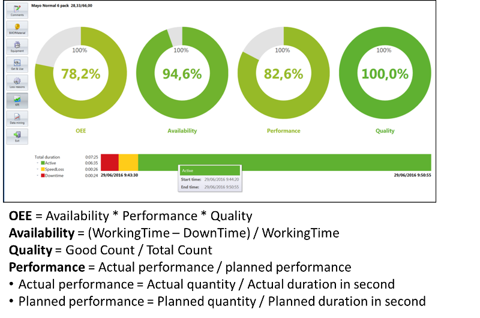

# 9. Аналіз ефективності

Аналіз ефективності основного виробництва повинен означуватися як набір діяльностей, які проводять аналіз виробничих процесів та передачі показників ефективності бізнес-системам з метою покращення. Це включає аналіз інформації про час циклу виробництва партій продукції, використання ресурсів, використання устатковання, ефективність устатковання, ефективність процедури та змін основного виробництва. 

Взаємозв'язки між різними аналітичними показниками можуть бути використані для формування KPI-звітів. Ця інформація може бути задіяна для оптимізації виробництва та використання ресурсів. Звіти можуть надаватись за розкладом, наприкінці виробничих циклів або партій, а також на вимогу.

Процес аналізу ефективності основного виробництва має неперервний характер. Тобто після визначення та усунення вузьких місць можуть виникнути інші системні обмеження. Крім того, зміна кон'юнктури ринку та рецептів може змінити критерії оптимізації та системні обмеження. В умовах постійних змін проведення аналізу ефективності основного виробництва також регулярно переглядаються.

На рис. 39 показана взаємодія з іншими діяльностями керування основним виробництвом.

                               

Рисунок 39 - Інтерфейси моделі діяльності аналізу ефективності основного виробництва

Аналіз ефективності основного виробництва може включати кілька етапів:

- підготовку звітів про результати діяльності та вартість;

- оцінку обмежень на потужність та якість;

- проведення випробувань на працездатність, де це необхідно для визначення потужності;

- порівняння різних виробничих ліній та створення середніх або цільових показників виробничих циклів;

- порівняння та протиставлення показників виробничих циклів;

- порівняння виробничих циклів для виявлення "золотих";

- визначення того, чому "золоті" виробничі цикли є винятковими;

- порівняння виробничих циклів із визначеними «золотими»;

- надання змін до процесу та процедур на основі результатів аналізу для подальшого вдосконалення процесу;

- прогнозування результатів виробничого циклу на основі поточних та минулих показників; це може включати генерацію виробничих показників;

- співвіднесення вимог в сегментах продукту з дійсними умовами проходження процесу на момент виробництва.

Як видно з наведеного вище переліку діяльності по аналізу ефективності можуть передбачати як прості так і складні алгоритми та розрахунки, різноманітні практики, методи та засоби, які не обмежуються стандартом. 

KPI. Типовими і найпростішими способами аналізу є формування показників ефективності, відображення їх на консолях керування з ціллю оцінки оператором. На додаток до формально означеної моделі даних про ефективність, означеної в IEC 62264-2, є додаткова інформація про операції, що надає підсумки ефективності в минулому, вказівки на майбутнє виконання або показники можливих майбутніх проблем. У сукупності ця інформація визначається як KPI (КПЕ, ключові показники ефективності). Для формування таких показників необхідна інформація про виробничі цикли, статуси устаткування, дані про використання ресурсів, які надаються з функції збору даних (див.рис.39). Крім того, для розрахунку KPI потребуються їх означення, які можуть бути закладені як в ресурсах так і в означенні продукту. Нагадаємо, що перелік рекомендованих KPI затверджено в стандартах ISO 22400, який також прийнято в Україні методом підтвердження. З деякими деталями ви можете ознайомитися на сайті [www.tk185.appau.org.ua](http://www.tk185.appau.org.ua)      

Одним із напрямів діяльності в рамках аналізу продуктивності виробництва є створення KPI. Ця інформація може використовуватися всередині виробничих операцій для вдосконалення та оптимізації і може бути відправлена в бізнес-процеси вищого рівня для подальшого аналізу та прийняття рішень. 

Керування ефективністю повинно означуватись як набір діяльностей, які систематично фіксують, керують та представляють інформацію про результати діяльності в послідовних рамках. Сюди входить використання коригуючих дій для впливу на поліпшення операцій. Є цінність бізнесу для приведення у відповідність виробничих показників нижчого рівня до основних цілей бізнесу. Деякі типові функції рішень для керування ефективністю є наступними:

- моніторинг для забезпечення видимості KPI;

- вміння використовувати інформацію KPI у моделі;

- аналіз причин;

- прогнозування майбутніх значень KPI; 

- можливість приймати контроль на основі значень KPI.

Одним з основних напрямків діяльності щодо керування ефективністю є перетворення великого обсягу необроблених даних у діючу інформацію. Для аналізу даних про ефективність у виробництві зазвичай використовується ієрархічна модель, яка може узгоджуватися з моделлю устатковання. Показники ефективності, яких не видно, значно знижують значення керування ефективністю. Це можна порівняти зі звітами, які мають тисячі значень на одній сторінці. Можливо, необхідна класифікація KPI, коли ті, що мають більший вплив на підприємство, мають більшу видимість.

Керування продуктивністю має аспекти, які пронизуються протягом всієї моделі діяльності. Керування основним виробництвом, технічним обслуговуванням, якістю та керування запасами має критичні показники, які важливі не тільки для цієї функції, але й використовуються в інших функціях.

На прикладі Momentum розглянемо, як може проводитися процес формування та виведення показників ефективності для робочого центру. Перш за все, в сервері DMS для конкретного робочого центру створюються пакети, що використовуються для KPI, зокрема (див.рис.38):

- Availability Package;

- Performance Package;

- Quality Package;

- Golden Runs Package

Ці пакети забезпечують розрахунок та збереження даних за відповідними показниками. Ця інформація доступна як за запитом з іншої підсистеми Momentum, так і з панелі оператору, на якому OEE доступні з вбудованих Dashboard і містять наступну інформацію (рис. 40): 

- Availability (Доступність), продуктивність (Performance), якість (Quality) і OEE

- Total operation duration (Загальна тривалість операції)

- Active period (Активний період)

- Speedloss (Втрата швидкості)

- Downtime (Простої)

- Час початку і закінчення періоду

- Loss reasons (причини втрати)

Дивлячись на ці показники в реальному часі, або після завершення виконання виробничої операції, можна оцінити її ефективність.

 

Рисунок 40 - Приклад відображення OEE в Momentum 

Для аналізу причин поганої ефективності можна використати інше вікно робочого центру – Performance (рис.41). На таких графіках можна побачити як в часі змінювалася продуктивність операції. Ця діаграма складається з 2 ліній:

- миттєве значення продуктивності (Instant performance) показує значення, розраховане з моменту останньої реєстрації (поточне значення, поділене на час, що минув з попередньої реєстрації);

- середнього значення продуктивності (Average performance) показує продуктивність, розраховану для кількох реєстрацій; розмір буферу впливає на те, наскільки гладкою буде ця лінія в порівнянні з лінією миттєвої продуктивності. 

  Ця діаграма може мати кілька горизонтальних прямих ліній:

- Max rate – представляє максимальну продуктивність робочого центру;

- Scheduled rate – показує заплановані (очікувані) показники; він розраховується як кількість операцій, поділена на планову кількість;

- Speed loss – коли середня продуктивність падає нижче цього рівня, цей період вважається періодом втрати швидкості;

- Downtime – коли середня продуктивність падає нижче цього рівня, цей період вважається періодом простою; 

 

Рисунок 41 - Приклад аналізу ефективності в Momentum 

 

Окрім аналізу наведених вище ключових показників ефективності основного виробництва, можуть проводитися і інші аналізи, деякі з них наведені нижче.  

Аналіз простежуваності ресурсів означується як сукупність діяльностей, що відслідковують історію всіх ресурсів (матеріалів, устатковання та персоналу) з точки зору дії процесу та подій, які стосуються ресурсів на виробництві. Він може включати аналіз:

- матеріалів, що виробляються, споживаються, зберігаються та переміщуються;

- устатковання, яке використовується у виробництві, перевірці та зберіганні;

- персонал, який бере участь у виробництві, зберіганні матеріалу та експлуатації устатковання.

Простежуваність ресурсів має два компоненти - стеження та простежування.

1. Стеження – це процес відстеження та запису руху, а також зміни ресурсів
    і запис усіх входів на ресурс через усі етапи та агенти.
2. Простежування - це процес, який визначає історію використання ресурсу з будь-якої точки, вперед або назад, використовуючи інформацію стеження.

Тестування якості продукції - одна з видів виробничих операцій. Тестування може бути лінійним, он-лайн або офлайн. Аналіз продукту також включає офлайн-аналіз, який зазвичай проводять у лабораторіях, та керування процедурами контролю якості. 

Діяльність щодо аналізу продукції (забезпечення якості) включає відображення інформації в процесі роботи, наприклад статистичного контролю процесів (SPC) або статистичного контролю якості (SQC). Керування якістю обробляє процедури тестування якості та часто підтримує результати тестування якості.

Аналіз процесів забезпечує зворотній зв'язок щодо конкретних виробничих процесів у кількох виробничих циклах або партіях. Ця інформація використовується для оптимізації або модифікації конкретних виробничих процесів. Діяльність включає аналіз поганих виробничих циклів для визначення першопричини та аналіз виробничих циклів виняткової якості для визначення оптимальних умов експлуатації. Аналіз процесів часто включає SPC/SQC аналіз та моделювання процесів і використовує інформацію, зібрану з декількох видів діяльності, які вимірюють робочі параметри.

Імітаційне моделювання часто використовується для моделювання того, як матеріал протікає через завод і для оцінки того, як процес реагує на зміни. Можна моделювати зміни в процесі, зміни в маршрутизації виробництва або зміни в процедурах виготовлення. Він також може бути використаний для прогнозування властивостей матеріалу на основі поточних умов експлуатаційного процесу. Імітаційне моделювання може використовуватися протягом життєвого циклу установки для відстеження ефективності, відстеження наслідків змін та для навчання операторів.
