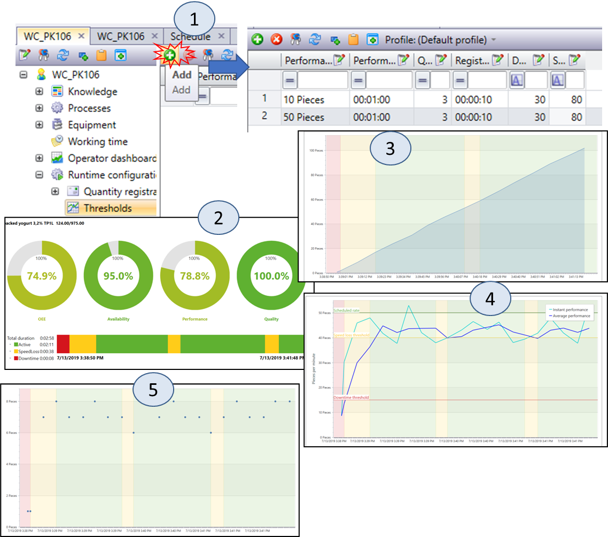

[8 <--](8.md)   [Зміст](README.md) 

# 9. Аналіз ефективності

## 9.1. Діяльності аналізу ефективності в системі MOM

Аналіз ефективності основного виробництва повинен означуватися як набір діяльностей, які проводять аналіз виробничих процесів та передачі показників ефективності бізнес-системам з метою покращення. Це включає аналіз інформації про час циклу виробництва партій продукції, використання ресурсів, використання устатковання, ефективність устатковання, ефективність процедури та змін основного виробництва. 

Взаємозв'язки між різними аналітичними показниками можуть бути використані для формування KPI-звітів. Ця інформація може бути задіяна для оптимізації виробництва та використання ресурсів. Звіти можуть надаватись за розкладом, наприкінці виробничих циклів або партій, а також на вимогу.

Процес аналізу ефективності основного виробництва має неперервний характер. Тобто після визначення та усунення вузьких місць можуть виникнути інші системні обмеження. Крім того, зміна кон'юнктури ринку та рецептів може змінити критерії оптимізації та системні обмеження. В умовах постійних змін проведення аналізу ефективності основного виробництва також регулярно переглядаються.

На рис.9.1 показана взаємодія з іншими діяльностями керування основним виробництвом.

                               

Рис.9.1. Інтерфейси моделі діяльності аналізу ефективності основного виробництва

Аналіз ефективності основного виробництва може включати кілька етапів:

- підготовку звітів про результати діяльності та вартість;

- оцінку обмежень на потужність та якість;

- проведення випробувань на працездатність, де це необхідно для визначення потужності;

- порівняння різних виробничих ліній та створення середніх або цільових показників виробничих циклів;

- порівняння та протиставлення показників виробничих циклів;

- порівняння виробничих циклів для виявлення "золотих";

- визначення того, чому "золоті" виробничі цикли є винятковими;

- порівняння виробничих циклів із визначеними «золотими»;

- надання змін до процесу та процедур на основі результатів аналізу для подальшого вдосконалення процесу;

- прогнозування результатів виробничого циклу на основі поточних та минулих показників; це може включати генерацію виробничих показників;

- співвіднесення вимог в сегментах продукту з дійсними умовами проходження процесу на момент виробництва.

Як видно з наведеного вище переліку діяльності по аналізу ефективності можуть передбачати як прості так і складні алгоритми та розрахунки, різноманітні практики, методи та засоби, які не обмежуються стандартом. 

Одним із напрямів діяльності в рамках аналізу продуктивності виробництва є створення ключових показників ефективності (KPI), які описані нижче. Ця інформація може використовуватися всередині виробничих операцій для вдосконалення та оптимізації і може бути відправлена в бізнес-процеси вищого рівня для подальшого аналізу та прийняття рішень. 

Керування ефективністю повинно означуватись як набір діяльностей, які систематично фіксують, керують та представляють інформацію про результати діяльності в послідовних рамках. Сюди входить використання коригуючих дій для впливу на поліпшення операцій. Є цінність бізнесу для приведення у відповідність виробничих показників нижчого рівня до основних цілей бізнесу. Деякі типові функції рішень для керування ефективністю є наступними:

- моніторинг для забезпечення видимості KPI;

- вміння використовувати інформацію KPI у моделі;

- аналіз причин;

- прогнозування майбутніх значень KPI; 

- можливість приймати контроль на основі значень KPI.


Одним з основних напрямків діяльності щодо керування ефективністю є перетворення великого обсягу необроблених даних у діючу інформацію. Для аналізу даних про ефективність у виробництві зазвичай використовується ієрархічна модель, яка може узгоджуватися з моделлю устатковання. Показники ефективності, яких не видно, значно знижують значення керування ефективністю. Це можна порівняти зі звітами, які мають тисячі значень на одній сторінці. Можливо, необхідна класифікація KPI, коли ті, що мають більший вплив на підприємство, мають більшу видимість.

Керування продуктивністю має аспекти, які пронизуються протягом всієї моделі діяльності. Керування основним виробництвом, технічним обслуговуванням, якістю та керування запасами має критичні показники, які важливі не тільки для цієї функції, але й використовуються в інших функціях.

## 9.2. Ключові показники ефективності 

### Взаємозв’язок і залежності KPI

Типовими і найпростішими способами аналізу є формування показників ефективності, відображення їх на консолях керування з ціллю оцінки оператором. На додаток до формально означеної моделі даних про ефективність, означеної в IEC 62264-2, є додаткова інформація про операції, що надає підсумки ефективності в минулому, вказівки на майбутнє виконання або показники можливих майбутніх проблем. У сукупності ця інформація визначається як **KPI** (**КПЕ**, ключові показники ефективності). Для формування таких показників необхідна інформація про виробничі цикли, статуси устаткування, дані про використання ресурсів, які надаються з функції збору даних (див попередню лекцію). Крім того, для розрахунку KPI потребуються їх означення, які можуть бути закладені як в ресурсах так і в означенні продукту. Нагадаємо, що перелік рекомендованих KPI затверджено в стандартах ISO 22400, який також прийнято в Україні методом підтвердження. З деякими деталями ви можете ознайомитися на сайті [www.tk185.appau.org.ua](http://www.tk185.appau.org.ua)      

При виконанні виробничих операцій проводиться оцінка результатів і порівняння їх з цілями бізнесу можуть бути виражені в технічних або економічних термінах. Ці оцінки базуються на оцінках продуктів, процесів, послуг і ресурсів, оскільки вони пов’язані з продуктивністю операцій. Порівняння з бізнес-цілями залежить від вибраних заходів і показників, узгоджених із цілями, і від тих показників, які використовуються для визначення дій у домені MOM для досягнення бізнес-цілей. До певної міри узгодження показників і показників із домену MOM із бізнес-цілями відображає якість інтеграції підприємства.

- відносини є результатом зміни одного KPI, що впливає на інші KPI.
- залежності є результатом KPI, який використовується для обчислення інших KPI.

На рис.9.3 показані залежності KPI від процесів та між собою.


рис. 9.2. Модель, що представляє взаємозв’язок і залежності KPI

### Загальний вигляд OEE 

Детальніше про KPI можна почитати за [цим посиланням](https://tk185.appau.org.ua/guide/aCampus-users-guides-ISO22400+++.pdf). Тут розглянемо тільки найбільш популярний виробничий KPI - **OEE** (Overall equipment effectiveness, **ЗЕО** загальна ефективність обладнання). Цей показник надає у відсотковій шкалі значення ефективності устатковання, яке вимірюється як добуток трьох складових:

- Availability (Доступність)
- Performance (продуктивність) або Effectiveness (ефективність)
- Якість (Quality)


```
OEE =  Availability x Performance(Effectiveness) x Quality 
```

OEE можна вираховувати для устатковання різних рівнів ієрархії, яке передбачає планування, як правило це Робочий центр (Work Center) та Робочий вузол (Work Unit). Чи ближче OEE наближається до 100% тим краще працює устатковання з точки зору ефективності. На діаграмі впливу (рис.9.3) показаний загальний принцип розрахунку OEE для робочого вузлу.     


рис. 9.3. Діаграма впливу для OEE (ЗЕО)

Як видно з рисунку в розрахунку кожного із множників впливають:

- Запланований час зайнятості робочого вузла
- Запланований час виконання на одиницю продукції
- Фактичний час виготовлення продукції
- Обсяг доброякісної продукції
- Обсяг виробленої продукції

Методики розрахунку OEE можуть відрізнятися. У 2-й частині стандарту ISO 22400 наводяться кілька з них. 

### Часові величини

OEE пов'язані з часовими (time) величинами (див. рис.9.2), в стандарті даються їх означення. 

Для устатковання вони матимуть наступний вигляд (рис.9.4):

- POT - Плановий час роботи (Planned operation time ) 
- PBT - Плановий час зайнятості устатковання (Planned busy time ) = POT - planned down time (плановий час простою) 
- ADOT - Фактичний час простою устатковання (Actual unit down time ) 
- AUBT - Фактичний час зайнятості устатковання (Actual unit busy time ) = PBT - ADOT 
- ADET - Фактичний час затримки устатковання (Actual unit delay time ) 
- AUPT - Фактичний час роботи устатковання(Actual unit processing time ) = AUBT - ADET 
- ASUT - Фактичний час підготовки (Actual setup time )
- APT - Фактичний виробничий час (Actual production time ) = AUPT - ASUT


 рис. 9.4. Часові величини для одиниці устатковання (Unit)

 Для оброблення замовлення на устаткованні часові величини матимуть наступний вигляд (рис.9.5):

- POET - Плановий час виконання замовлення (Planned order time ) 
- AOET - Фактичний час виконання замовлення (Actual order execution time ) 
- ATT - Фактичний час транспортування (Actual transport time ) 
- AQT - Фактичний час перебування матеріалу в черзі (Actual queuing time ) 


рис. 9.5. Часові величини для оброблення замовлення

### Показник доступності

Показує повноту використання доступного часу робочого устатковання. Розраховується у % за формулою:

```
Availability = APT / PBT
```

- APT - Фактичний виробничий час (Actual production time ) 
- PBT - Плановий час зайнятості даного устатковання (Planned busy time)

Чим більше цей показник - тим краще. Як видно з формули, фактичний виробничий (чистий) час роботи устатковання має бути максимально наближений до його запланованої зайнятості, що передбачає зменшення часу простою, затримок на запуск та переналаштування.


рис. 9.6. Діаграма впливу для Availability 

Даний показник входить до OEE але може використовуватися окремо. 

### Ефективність, продуктивність, ККД

```
Effectiveness = PRI * PQ / APT
```

- PRI - Плановий час роботи на одиницю продукції (Planned run time per item) 
- PQ – Кількість Продукту (Product Quantity) 
- APT - Фактичний виробничий час (Actual production time), протягом якого виробляється продукція

Ефективність може бути розрахована за короткі періоди і вказує на те, наскільки ефективним буде устатковання протягом часу виробництва. У розрахунку використовується запланований час виконання для одиниці продукції (PRI), також відомий як час циклу. Це означує, скільки часу потрібно для виробництва фіксованої кількості виробленого матеріалу. Методології серійного та безперервного виробництва зазвичай виражають очікуваний обсяг виробництва за певний час як кількість, яку можна виробити за певний період часу (наприклад, шт/годину). Це значення є зворотним елементом PRI і може бути перетворено в PRI шляхом визначення фіксованої кількості виробленого матеріалу.


рис. 9.7. Діаграма впливу для Effectiveness

Як і в попередньому випадку, цей показник вимірюється в діапазоні 0-100% і повинен бути якомога вище. Він показує на скільки продуктивно працює устатковання. Даний показник входить до OEE але може використовуватися окремо. 

### Коефіцієнт якості 

Коефіцієнт якості показує співвідношення кількості якісної продукції до загальної кількості:

```
Quality ratio = GQ / PQ
```

- GQ - Кількість якісної продукції (Good quantity) 
- PQ - Виготовлена кількість (Produced quantity)

Чим ближче показник до 100%, тим краще. Даний показник входить до OEE але може використовуватися окремо. 


рис. 9.8. Діаграма впливу для Quality ratio

## 9.3. Приклад OEE у системі MOM

На прикладі Momentum розглянемо, як може проводитися процес формування та виведення показників ефективності для робочого центру. 

### Реєстрація якісного і неякісного продукту

Для визначення кількості продукції за одиницю часу для робочого центру налаштовуються відповідні параметри в Runtime Configuration (рис.9.9). При цьому можна вказувати як пару загальну та неякісну продукцію так і якісну та неякісну.  


рис.9.9. Вимірювання кількості якісної і неякісної продукції. 

### Реєстрація статусу і прогресу в DMS

Для визначення часу втрати швидкості та нештатної зупинки необхідно архівувати кількісні показники в DMS. Для цього передбачені спеціалізовані формати пакетів та відповідні діяльності:

- Progress package - для реєстрації кількості продукту
- Status Package - для реєстрації стану, коли робочий центр працює (1) або зупинений (0) 

Порівняння записаних в базу даних показників з плановими дає можливість визначити час зниження продуктивності, нештатну зупинку робочого центра, та вказати причини. Для розрахунку KPI також використовуються спеціалізовані пакети. У Momentum є наперед визначена функціональність розрахунку OEE. У Momentum для розрахунку OEE використовується формула: 

`OEE` = `Availability` * `Performance` * `Quality`

***Performance*** = *Actual performance* / *planned performance*

Де *Performance*  - продуктивність, *Actual performance* - дійсна продуктивність, *Planned performance* - планова продуктивність. Дійсна продуктивність розраховується на основі дійсного приросту кількості  (Actual quantity) за період часу (Actual duration):   

*Actual performance = Actual quantity / Actual duration*

За цей же час рахується планова продуктивність (пояснення дано в наступному пункті):

*Planned performance* = *Planned quantity* / *Planned duration*

Ці дані заносяться в пакет `Performance package`. 

Доступність (Availability) розраховується як співвідношення дійсного робочого часу до запанованого робочого:   

***Availability*** = (WorkingTime – DownTime) / WorkingTime

WorkingTime - робочий час, DownTime - час простою. WorkingTime  рахується як час коли операція знаходилася в стані роботи, тоді як DownTime, коли на виході не було продукції. Цей показник зберігається в `Availability package`

Показник якості розраховується як співвідношення хорошої кількості до загальної. 

***Quality*** = Good Count / Total Count

Для цього показника також означується окремий пакет DMS.

У цьому прикладі показано як для `WC_XX_PK106` конфігурувати реєстрацію в DMS (Package):

- кількість виробленого продукту
- статуси для робочого центру 
- пакетів для KPI 


рис.9.10. Реєстрація статусу та прогресу в DMS

Спочатку створюється і прив'язується `Progress Package` (рис.9.10(1)) з назвою `Progress WC_XX_PK106` з вікна робочого центру `WC_XX_PK106`. Відповідно пакет буде використовуватися для реєстрації кількості продукту. Аналогічним чином створюється `Status Package` з ім\'ям `Status WC_XX_PK106`. Цей пакет буде використовуватися для реєстрації початку і кінця запуску і зупинки операцій продукту. Аналогічним чином створюється 3-ри KPI пакета (рис.9.10 (1а)):

- `Operations Period Package`
- `Operations Agreagated Period Package`
- `Golden runs`

Після таких налаштувань в розділ `KPI` на вкладці `Registration` (рис.9.4(2)) в інформаційній панелі робочого центру можна побачити інформацію про кількість продукції з кожним відрізком часу.

### Аналіз OEE

Для розрахунку деяких KPI у тому числі OEE, необхідно визначати моменти втрати швидкості  (продуктивності) і зупинки. Для цього використовується прогнозування очікуваної кількості при певній плановій продуктивності. Враховуючи можливі відмінності прогнозованих характеристик в залежності від продуктивності різного типу продукту, у Momentum використовується Thresholds для різних продуктивностей. Алгоритм прогнозування базується на очікуванні того, що виконується реєстрація прогресу з деяким ритмом. Якщо протягом певного періоду не виконується реєстрація з очікуваним ритмом або прогресом на кожну реєстрацію, меншу ніж очікувалося, цей період буде відмічено як час простоювання (**down-time**) або втрата швидкості (**speed-loss**).

Прогноз втрати швидкості (Speed loss prediction) або прогноз простоювання (downtime prediction) базуються на реєстрації необроблених даних і налаштуваннях порогів (thresholds). Планова продуктивність розраховується як планова кількість поділена на планову тривалість:

```
 Operation planned performance = Planned quantity / Planned duration
```

Ці планові величини розраховуються при плануванні і залежать від версії робочого центру, в якій задаються кількість та час, а також від налаштувань зв'язків між робочими центрами в маршрутній діаграмі. Так, наприклад при налаштуваннях зв'язків `Dependency type` рівним `End-End`, планова продуктивність може бути меншою ніж означена в версії робочого центру, так як буде підлаштовуватися під менш продуктивний робочий центр в матеріальному ланцюжку.  

Кожен запис в налаштуваннях `Thresholds` має параметри `Performance number` та `Performance period`. Ці параметри означують заплановану продуктивність, для якої даний запис використовується в розрахунку в алгоритмі прогнозування. 

 `Planned performance` = `Performance quantity` / `performance period`.

Кожен запис має декілька параметрів:

- **Performance quantity** (значення для продуктивності) і **performance period** (період для продуктивності) означують, для яких планових показників роботи параметри цього запису повинні бути вибрані для розрахунку; при виборі запису буде враховуватися найбільш відповідне значення продуктивності

- **Downtime** (порогові значення часу простоювання) и **speed-loss** (втрати швидкості) означають рівень від запланованої швидкості, коли повинен реєструватися час простоювання або втрати швидкості. 

- **Registration period** (Період реєстрації) означує, як часто очікується запис в прогрес реєстрації (залежить від означення підписки параметра устатковання). 

- **Queue size** (Розмір черги) - це параметр, який означує, як розраховується середня продуктивність (average performance). Коли це значення велике, не видно коротких втрат швидкості і простоювання, якщо маленьке - значення дуже чутливе до всплесків.  

На рис.9.11(1) показаний приклад налаштування Thresholds для робочого центру `WC_XX_PK106` для визначення середнього значення, втрати швидкості і визначення зупинки, а також відображення їх на вбудованих в моделі Operator графіках.

На рис.9.11(2) показаний приклад відображення OEE, на  рис.9.11(3)  `Progress`, на рис.9.11(4) `Performance` , на рис.9.11(5)  `Registration` . Зверніть увагу на уставки і діапазони втрати швидкості (`speed loss`) і простою (`Down Time`). 



рис.9.11. Вікна відображення KPI.

### Аналіз ефективності (втрат швидкості та простою)

Для аналізу причин поганої ефективності можна використати інше вікно робочого центру – Performance (рис.9.12). На таких графіках можна побачити як в часі змінювалася продуктивність операції. Ця діаграма складається з 2 ліній:

- миттєве значення продуктивності (Instant performance) показує значення, розраховане з моменту останньої реєстрації (поточне значення, поділене на час, що минув з попередньої реєстрації);

- середнього значення продуктивності (Average performance) показує продуктивність, розраховану для кількох реєстрацій; розмір буферу впливає на те, наскільки гладкою буде ця лінія в порівнянні з лінією миттєвої продуктивності. 

  Ця діаграма може мати кілька горизонтальних прямих ліній:

- Max rate – представляє максимальну продуктивність робочого центру;

- Scheduled rate – показує заплановані (очікувані) показники; він розраховується як кількість операцій, поділена на планову кількість;

- Speed loss – коли середня продуктивність падає нижче цього рівня, цей період вважається періодом втрати швидкості;

- Downtime – коли середня продуктивність падає нижче цього рівня, цей період вважається періодом простою; 


 

Рис.9.12 Приклад аналізу ефективності в Momentum 

## 9.4. Простежуваність 

Окрім аналізу наведених вище ключових показників ефективності основного виробництва, можуть проводитися і інші аналізи, деякі з них наведені нижче.  

Аналіз простежуваності ресурсів означується як сукупність діяльностей, що відслідковують історію всіх ресурсів (матеріалів, устатковання та персоналу) з точки зору дії процесу та подій, які стосуються ресурсів на виробництві. Він може включати аналіз:

- матеріалів, що виробляються, споживаються, зберігаються та переміщуються;

- устатковання, яке використовується у виробництві, перевірці та зберіганні;

- персонал, який бере участь у виробництві, зберіганні матеріалу та експлуатації устатковання.


Простежуваність ресурсів має два компоненти - стеження та простежування.

1. Стеження – це процес відстеження та запису руху, а також зміни ресурсів
    і запис усіх входів на ресурс через усі етапи та агенти.
2. Простежування - це процес, який визначає історію використання ресурсу з будь-якої точки, вперед або назад, використовуючи інформацію стеження.


Тестування якості продукції - одна з видів виробничих операцій. Тестування може бути лінійним, он-лайн або офлайн. Аналіз продукту також включає офлайн-аналіз, який зазвичай проводять у лабораторіях, та керування процедурами контролю якості. 

Діяльність щодо аналізу продукції (забезпечення якості) включає відображення інформації в процесі роботи, наприклад статистичного контролю процесів (SPC) або статистичного контролю якості (SQC). Керування якістю обробляє процедури тестування якості та часто підтримує результати тестування якості.

Аналіз процесів забезпечує зворотній зв'язок щодо конкретних виробничих процесів у кількох виробничих циклах або партіях. Ця інформація використовується для оптимізації або модифікації конкретних виробничих процесів. Діяльність включає аналіз поганих виробничих циклів для визначення першопричини та аналіз виробничих циклів виняткової якості для визначення оптимальних умов експлуатації. Аналіз процесів часто включає SPC/SQC аналіз та моделювання процесів і використовує інформацію, зібрану з декількох видів діяльності, які вимірюють робочі параметри.

Імітаційне моделювання часто використовується для моделювання того, як матеріал протікає через завод і для оцінки того, як процес реагує на зміни. Можна моделювати зміни в процесі, зміни в маршрутизації виробництва або зміни в процедурах виготовлення. Він також може бути використаний для прогнозування властивостей матеріалу на основі поточних умов експлуатаційного процесу. Імітаційне моделювання може використовуватися протягом життєвого циклу установки для відстеження ефективності, відстеження наслідків змін та для навчання операторів.

Приклад простежуваності в Momentum показаний на рис.9.13. На ньому з вибраного замовлення рис.9.13(1,2) виводиться маршрут для простежуваності виготовлення продукту (рис.9.13(3)). Натискаючи на робочі центри, зони зберігання, можна подивитися інформацію про виготовлення лоту.


Рис.9.13. Приклад простеження продукту у Momentum.

## Контрольні питання

1. Розкажіть яке призначення аналізу ефективності.
2. З якими іншими діяльностями MOM взаємодія функція аналізу ефективності?
3. Які діяльності входять до керування ефективністю?
4. Яке призначення виробничих показників ефективності?
5. Розкажіть про призначення OEE. На основі яких показників розраховуєтся OEE?
6. Розкажіть про часові величини які враховуються при розрахунку показників ефективності.
7. Яке призначення показника доступності і як він розраховується?
8. Яке призначення показника ефективності і як він розраховується?
9. Яке призначення  коефіцієнт якості і як він розраховується?
10. Покажіть на прикладі як відбувається реєстрація якісного і неякісного продукту.
11. Покажіть на прикладі як відбувається реєстрація статусу і прогресу в DMS.
12. Покажіть на прикладі як відбувається аналіз OEE.
13. Покажіть на прикладі як відбувається визначення втрат аналізу ефективності.
