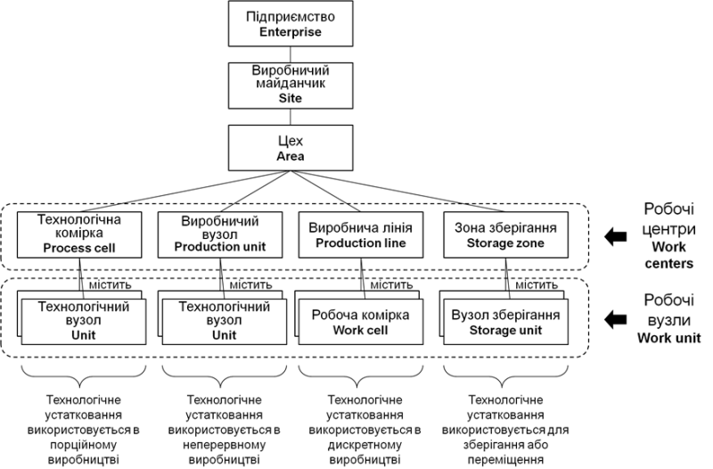
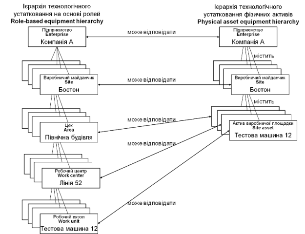
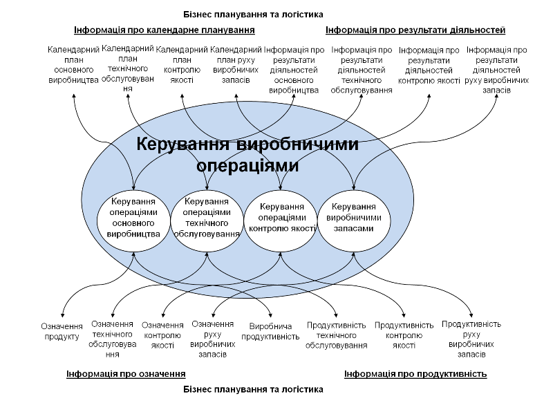
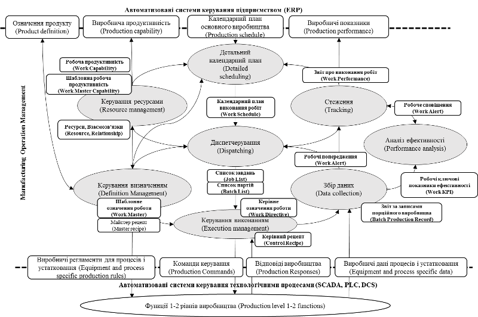

Автор і лектор: Олександр Пупена, Лабораторні: Олександр Пупена, Роман Міркевич

| [<- до лекцій](README.md) | [на основну сторінку курсу](../README.md) |
| ------------------------- | ----------------------------------------- |
|                           |                                           |

# Основні положення стандарту IEC 62264

Багато з необізнаних про стандарт людей вважають, що стандарт покликаний забезпечити прозорість інформаційного обміну між застосунками на протокольному рівні, як це наприклад зроблено в OPC для інтегрування технічних та програмних засобів. Такого роду задачі вирішуються іншими стандартами та специфікаціями, і це не є сьогодні проблемою. Стандарт IEC 62264 розроблений для інтегрування систем керування підприємством та виробництвом на функціональному рівні. 

Тобто задача стандарту не в забезпеченні передачі даних, а у означенні сутностей (що саме) і набору їх атрибутів (як саме). Для виділення цих сутностей (об’єктів) та їх опису в стандарті проводять послідовну процедуру розбивання (декомпозиції) системи керування підприємством на частини (див.рис.2). 

                               

**Рис 2. Структура моделей у стандарті**

Перш за все необхідно визначитися з тим, а взагалі, яку саме необхідно надавати інформацію і кому вона потрібна. Для цього стандарт IEC 62264 виділяє дві області керування: домен підприємства та домен керування виробничими операціями та технологічними процесами (MO&C Manufacturing Operations and Control).  Принципи за якими відбувається це розділення наведені в п.5 першої частини стандарту. Умовно, все що стосується зовнішньоекономічної діяльності підприємства, стратегічного та довгострокового планування ресурсами, тощо відносяться до домену підприємства, а виробничі операції – до MO&C. Далі, в межах кожного домену виділяються взаємопов’язані функції, частина з яких представляють інтерес в іншому домені. Так, наприклад, функція керування та керування ресурсами основного виробництва MO&C може бути використана в функції прогнозування випуску продукції на рівні ERP. Ці функції взаємопов’язані інформаційними потоками, які і є складовою тих даних, якими обмінюються рівні. Цю інформацію категоризують і описують у вигляді об’єктних моделей.   

Таким чином, IEC 62264 надає моделі та інформацію на різних рівнях деталізації та абстрагування. Кожна модель та схема збільшують рівень деталізації, представлений у попередній моделі. 

## Функціональна ієрархія виробничого підприємства

Згідно IEC 62264 усе підприємство з точки зору функціонування включає кілька рівнів (рис. 3): L4 (Рівень 4, далі по тексту використовується позначка «L») - бізнес-планування та логістики, керування виробничими операціями (L3) та керування порційним, неперервним або дискретним виробництвом (L2-L1), а також безпосередньо саме виробництво. Рівні забезпечують різні функції та працюють у різних часових рамках. 

 

**Рис 3. Функціональна ієрархія виробничого підприємства** 

Перша частина IEC 62264 зосереджена саме на обміні інформацією між рівнем 4 та рівнем 3 функціональної ієрархічної моделі. Наприклад, з рівня 4 може надходити замовлення на рівень 3, а рівень 3 може надсилати інформацію про фактичну кількість виробленої продукції назад на рівень 4. Частина 1 стандарту IEC 62264 означує зміст таких та багатьох інших інформаційних потоків між діяльностями рівня керування виробничими операціями та підприємства; іншими словами, між рівнем 3 і рівнем 4. Стандартом означенні діяльності, що відповідають Рівню 4 та Рівню 3 функціональної ієрархії. 

Перші дві частини стандарту IEC 62264 означують обмін між L4 та L3, частини 3 та 4 описують внутрішню архітектуру MOM та призначені для обміну підсистем рівня L3 між собою. 5-та частина показує один із способів реалізації таких обмінів. Слід відмітити що між L2 та L3 також є потреба в функціональній інтеграції, але стандартом IEC 62264 ця взаємодія не описується. Тим не менше є ряд стандартів, в область яких входить питання інтеграції MOM та АСКТП, зокрема в області порційного виробництва ([ISA-88/IEC 61512](https://tk185.appau.org.ua/61512/mek-61512/)), дискретного ([PackML](https://tk185.appau.org.ua/61512/presentations-iec-61512/packml-tda16-2/)) та неперервного ([ISA-106](https://www.slideshare.net/pupenasan/106-61724166)). Наведені стандарти є «генетично» сумісні, так як мають спільні витоки та призначені для інтегрування усіх рівнів керування. 

## Функціональна модель

У загальному, усю діяльність підприємства можна звести до кількох груп функцій (рис.4). Частина функцій цих груп, що виділені на рисунку сірим в жовтому контурі, відносяться до домена виробництва. «Виробництво» (Manufacturing) - це не тільки операції по виготовленню продукції (Production), які в українських стандартах відносяться до «основного виробництва». До виробничих операцій входять операції керування запасами (Inventory), контролю якості (Quality) та технічного обслуговування (Maintenance). Цими діяльностями традиційно займаються різні виробничі підрозділи і часто автоматизовані з використанням різних типів програмних засобів (EAM/ТОіР, LIMS, MES і т.п.). Стандарт об’єднав ці діяльності під один спільний знаменник «виробничі операції», які використовують спільні моделі ресурсів, що дає змогу розглядати одні і ті самі сутності підприємства з різних точок зору. Тому він на концептуальному рівні легко поєднує скажімо устатковання з точки зору виробничників і обслуговуючого персоналу. Це дає змогу інтегрувати системи не тільки на різних рівнях ієрархії, але і на одному і тому ж рівні MOM. Стандарт дозволяє розширювати ці типи діяльностей.          

 

**Рис 4 – Функціональна модель** **[7]**

## Моделі ресурсів

Не дивлячись на такі абстрактні на перший погляд описи, стандарт містить дуже конкретні моделі. Під словом «модель» треба розуміти опис об’єктів та їх взаємозв’язки. По суті інформація, яка слугує інтегруванню, включає в себе опис конкретних сутностей. Найпростішими для розуміння сутностями є виробничі ресурси. По суті підприємство з точки зору ресурсів представляє собою взаємопов’язану сукупність (систему):

- устатковання (equipment), яке виконує певну роль у виготовленні продукції;
- матеріали (materials) з яких виготовляється продукт і який представляє готовий продукт;
- персонал (personnel), який також приймає участь у виробництві;
- активи (asset) – устатковання з точки зору балансу підприємства.  

**Рис 4а – Моделі ресурсів** 

Правильне означення усіх моделей є дуже важливим при керуванні. При необхідності надати інформацію про ресурси рівню керування підприємством, вони поєднуються в сегменти процесу. Таке логічне об'єднання проводиться з точки зору їх призначення.  

## Ієрархія устатковання 

На рис.5 показаний приклад ієрархії устатковання. Цеха включать в себе робочі центри, що виконують роль виготовлення напівпродукту за вказаними операціями, які він може виконувати з вказаної сировини у вказаний період часу. 

Саме робочі центри, як правило, є одиницями оперативного планування. При плануванні проявляється особливість типу виробництва (неперервне, дискретне і порційне). Робочі вузли є «робочими конячками» процесу виконання операцій. Ці три рівні устатковання складають основу виробництва і описуються в термінах продуктивності і потреб в ресурсах. Устатковання, що знаходяться вище них, задіяні в процесах керування рівня L4, що нижче – рівня L2. Для стандартів ISA-88/IEC 61512, PackML та  ISA-106 – модель устатковання є єдиною, що робить її застосовною для інтеграції між цими рівнями.

 

**Рис 5. Модель устатковання** 

  Слід відмітити, що з точки зору виробничників на підприємстві використовується устатковання (рольова ієрархія), а з точки зору обслуговуючого персоналу (електрики, механіки, КВПіА) – це є активами, які на певний час знаходяться в ролі певного устатковання (рис.6). 

Наприклад, двигун з певним серійним номером, який знаходиться на балансі є активом. Але в певний момент часу він знаходиться в ролі двигуна для насосу - це устатковання. На місці цього устатковання можуть знаходитися різні активи. Один і той самий актив може бути різним устаткованням, а може бути матеріалом, при його виготовленні.    

 

**Рис 6. Приклад ієрархії фізичних активів, пов'язаної з ієрархією технологічного устатковання на основі ролей** 

Для операцій рівня L4 більш цікавими є не моделі ресурсів, а їх об’єднання з точки зору виконання певної операції. Тому окрім базових ресурсів в стандарті є «сегменти», які по суті об’єднують об’єкти різного типу для означення можливостей (сегмент процесу) або потреб для виготовлення продукту (сегмент продукту) (рис.7). 

***Сегмент процесу*** - це об'єднання ресурсів, які показують які ресурси є на виробництві для проведення операції (-цій), наприклад виготовлення певного напівпродукту. Це устатковання, персонал які задіяні в поцесі, і матеріали які зараз є в наявності. ***Сегмент продукту*** - це ресурси, якы необхідні для проведення конкретної операції (-цій).    

 

 **Рис 7.** **Відношення сегмента продукту до сегмента процесу** **[7]**

## Обмін інформацією між рівнями L3 та L4

Усі наведені вище ресурси формують інформаційний обмін між виробничими операціями та бізнес-рівнем. Існує чотири категорії інформації про виробничі операції, які відносяться до чотирьох категорій діяльностей керування виробничими операціями (див. рис. 8):

- інформація про календарне планування – інформація про запити на виконання робіт у межах однієї або декількох категорій діяльностей;
- інформація про результати діяльностей (показники виробництва) – інформація про роботу, виконану в межах однієї або декількох категорій діяльностей;
- інформація про продуктивність – інформація про можливості виконувати роботу в межах однієї або декількох категорій діяльностей;
- інформація про означення – інформація про означення роботи, яка може бути виконана в межах однієї або декількох категорій діяльностей.

 

**Рис 8. Інформація про виробничі операції** **[7]**

## Модель діяльностей MOM 

Друга частина стандарту описує усі об’єкти у вигляді моделей UML (уніфікована мова моделювання у вигляді схем) та таблиць, що робить цей стандарт достатньо конкретним, щоб програмні засоби, що повністю відповідають йому могли інтегруватися без додаткових витрат на реалізацію додаткових інтерфейсів.  

Третя та четверта частини стандарту зосереджені на взаємодії між функціями керування на рівні MOM (рис.9). Кожний потік описано у вигляді моделей UML та таблиць, що дає змогу інтегрувати функції програмних засобів рівня MOM. 

  

**Рис 9. Модель діяльностей** **MOM [7]**

Ці функції по суті описують діяльність на рівні MOM. Саме вони будуть детально описані і розяглнуті в наступних лекціях цього курсу. 

Детально з перекладом стандарту українською мовою, ви можете ознайомитися, перейшовши [за посиланням](https://tk185.appau.org.ua/62264/standard-iec-62264/mek62264/). 

| [<- до лекцій](README.md) | [на основну сторінку курсу](../README.md) |
| ------------------------- | ----------------------------------------- |
|                           |                                           |