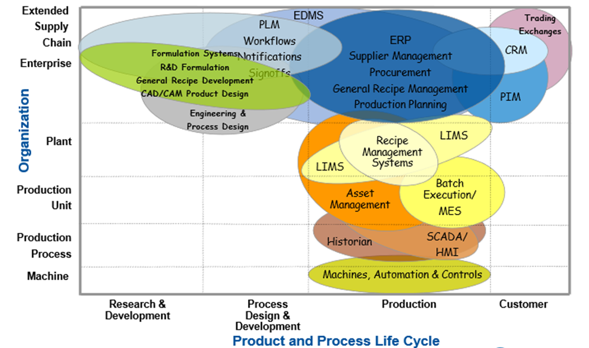

Автор і лектор: Олександр Пупена, Лабораторні: Олександр Пупена, Роман Міркевич

| [<- до лекцій](README.md) | [на основну сторінку курсу](../README.md) |
| ------------------------- | ----------------------------------------- |
|                           |                                           |

# Вступ до стандарту IEC 62264

Для успішного функціонування і розвитку будь-якого підприємства, всі його системи мають функціонувати як єдине ціле, всі функції мають бути узгоджені та скоординовані. Проте, історично склалось, що рівень керування бізнес-процесами та рівень керування виробництвом знаходяться в сфері відповідальності різних осіб, розробляються та розвиваються незалежно один від одного. Рівень керування бізнес-процесами, зазвичай, розробляється спеціалістами з ІТ сектора, які мало, або і взагалі нічого не розуміють в керуванні виробничими процесами. У свою чергу рівень керування виробництвом розробляється спеціалістами АСКТП, що не замислюються про процеси верхнього рівня. Навіть при одночасній розробці всіх рівнів підприємства, спеціалісти ІТ і АСКТП спілкуються «різними мовами» і не розуміють потреб одне одного. 

Ця проблема стає очевидною при інтеграції різноманітних бізнес-застосунків. Адже вони відповідають за різні аспекти виробництва, як показано на рисунку 1, і відносяться до різних рівнів функціональної ієрархії. Незважаючи на це, всі бізнес-додатки повинні бути пов’язані між собою і обмінюватись інформацією у зручній та зрозумілій формі. Для узгодження зв’язку між функціями рівня керування підприємства та виробництва ще в 2000-у році вийшла перша версія стандарту ANSI/ISA-95 (ANSI-національні стандарти США, ISA – галузеві стандарти по автоматизації для рядку країн), який сьогодні налічує вже 5 частин та кілька редакцій. Організація ISA заохочує використання та застосування своїх галузевих стандартів на глобальній основі, що відповідно сприяло прийняттю стандарту на міжнародному рівні - IEC 62264. 

 

​                               

**Рис 1. Різні системи керування на підприємстві** **[6]**

> MES = Manufacturing Execution System, EBRS = Electronic Batch Record System, LIMS = Laboratory Information Management System, ELN = Electronic Laboratory Notebook, CDS = Chromatography Data System (or Network Data System), SCADA = Supervisory Control And Data Acquisition, DCS = Distributed Control System, EAM = Enterprise Asset Management, CMS = Calibration Management System, FMS = Facilities Management System, ECMS = Electronic Content Management System, EDMS = Electronic Document Management System, EQMS = Electronic Quality Management System, HCM = Human Capital Management (System), LMS = Learning Management System; L&D = Learning & Development (System), PPS = Production Planning System, Talent Mgt = Talent Management (System), WMS = Warehouse Management System, MRP = Material Requirements Planning, ERP = Enterprise Resource Planning, Bench = lab bench-top equipment proprietary software & firmware  

До появи стандарту рішення з інтеграції систем керування бізнес-процесами та систем керування виробничими операціями були індивідуальними для кожного виробництва, з власною термінологією, підходами та реалізацією. Крім того, що такі рішення були досить дорогими, виникала складність розширення таких систем при необхідності. Також ускладнювалась оцінка ефективності систем через відсутність спільних означень, а отже й можливості їх порівняння. Відсутність стандартної термінології, різнорідна організаційна культура та інші фактори спричиняли низький відсоток успішних проектів з інтеграції, а їх розробка тривала протягом багатьох років.

Для рішення цих проблем IEC 62264 пропонує стандартну термінологію та узгоджений набір концепцій та моделей для інтеграції систем керування із системами підприємства, що покращить комунікацію між усіма зацікавленими сторонами, і зможе надати наступні переваги:

- скоротити час на створення нової системи;
- надавати можливість постачальникам надавати відповідні інструменти для впровадження інтеграції систем керування із системами підприємства;
- дозволяти користувачам краще означувати свої потреби;
- скоротити витрати на автоматизацію виробничих процесів;
- оптимізувати ланцюги постачань;
- зменшити трудовитрати на виконання інженерних робіт протягом життєвого циклу систем.

Стандарт дозволяє замінити специфічну термінологію постачальників на чіткі означення інформації для обміну між функціями організаційно-економічного рівня підприємства та керування виробничими операціями, дає чітке означення кожному елементу інформації за рахунок об'єктних моделей UML та таблиць атрибутів, дозволяє відокремити бізнес-процеси від виробничих. 

В Україні з 1-го вересня 2019-го року стандарт ДСТУ EN 62264-1:2019 діє на ряду з [іншими стандартами](http://online.budstandart.com/ua/catalog/doc-page?id_doc=84240&fbclid=IwAR07xUmganKTUUne1xPRWRSSbtNP4kbbMLenvvWHi1yJdGEFC_IgHfa1XXY), що просуваються в рамках Технічного Комітету 185 «Промислова автоматизація» (далі – ТК 185). Наразі він прийнятий методом підтвердження (в англомовному варіанті). Основний зміст першої частини перекладений українською і доступний за [посиланням](https://tk185.appau.org.ua/62264/standard-iec-62264/mek62264/). 

У світі стандарт IEC 62264 займає міцні позиції. За оцінками провідного американського експерта Dennis Brandl з BR&L Consulting його використання може привести до:

- зменшення затрат та зусиль для інтеграції ERP-MES/MOM на 90%;
- кількість вдалих реалізацій з менше 50% зростає до понад 90%;
- скорочення часу на ранніх етапах розробки MES/MOM на 75%;
- підвищення продуктивності виробництва;
- збільшення ринку MES/MOM та конкуренцію на ньому.

Як і будь-який стандарт, IEC 62264 має свою цільову аудиторію. В першу чергу він призначений для тих, хто:

- бере участь у проектуванні, будівництві чи експлуатації засобів виробництва (засобів і предметів праці, що їх використовують у процесі виготовлення продукції);
- відповідає за означення інтерфейсів між системами керування виробництвом та іншими бізнес-системами підприємства; 
- бере участь у проектуванні, створенні, збуті та інтеграції продуктів автоматизації, що використовуються для забезпечення інтерфейсу між системою керування виробничими операціями та бізнес-системою;
- бере участь у проектуванні або керуванні створенням, переміщенням та зберіганням продуктів на виробничих підприємствах.

Також стандарт IEC 62264 може застосовуватись в якості навчального матеріалу.  Стандарт є основою німецької моделі Industrie 4.0, що є основою цифровізації сучасного виробництва.  

| [<- до лекцій](README.md) | [на основну сторінку курсу](../README.md) |
| ------------------------- | ----------------------------------------- |
|                           |                                           |